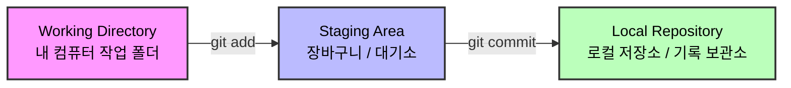

# 🚀 쉽게 설명하는 Git 기초 1. add, commit

## 1. Git이란?
작업한 코드들을 기록하고 보관할 수 있는 **버전 관리 시스템**입니다.

- **과거로의 회귀:** 언제든지 이전 작업 시점으로 되돌릴 수 있습니다.
- **작업 이력 관리:** 과거 작업 내용을 상세히 열람할 수 있어 관리가 용이합니다.
- **안정적인 개발:** 코드를 안전하게 보관하여 실수로부터 개발 환경을 보호합니다.

---

## 2. Git 설치 및 설정
### 1) 설치 방법
1. 구글에 **"git windows"** 검색 후 공식 사이트에서 설치 파일을 다운로드하여 실행합니다.
2. 설치 시 아래 두 가지 옵션을 반드시 확인하세요:
    - **Use Visual Studio Code as Git's default editor**
    - **Override the default branch names for new repositories -> main** 선택

### 2) 사용자 정보 등록 (최초 1회)
작업한 기록에 이름을 남기기 위해 사용자 정보를 설정합니다.
1. 작업 폴더에서 **Git Bash**를 실행합니다.
2. 아래 명령어를 입력합니다 (본인 정보로 수정):
    ```bash
    git config --global user.name "본인이름"
    git config --global user.email "본인이메일@email.com"
    ```

---

## 3. Git 시작 및 기록 (Workflow)

### 1) 저장소 초기화 (`init`)
Git이 현재 폴더의 변화를 감시하도록 설정합니다.
```bash
git init # 폴더 내에 숨겨진 .git 폴더가 생성되며 감시를 시작합니다.
```

### 2) 기록할 파일 선택 (`add`)
기록에 남기고 싶은 파일을 '장바구니(Staging Area)'에 담는 과정입니다.
```bash
git add text.txt # 특정 파일만 선택해서 담기
git add .        # 변경된 모든 파일을 한꺼번에 담기
```

### 3) 기록 확정 (`commit`)
장바구니에 담긴 파일들을 실제로 기록 보관소에 저장합니다.
```bash
git commit -m "작업 내용 설명" # 나중에 기록을 찾기 쉽도록 구체적으로 작성합니다.
```

---

## 4. Git 동작 원리 다이어그램

파일이 실제로 저장되기까지의 과정을 도식화하면 다음과 같습니다.




- **Working Directory:** 실제로 코딩을 하고 파일을 수정하는 내 PC의 실제 공간입니다.
- **Staging Area:** 커밋하기 전, "이 파일들을 저장할 거야"라고 선택된 파일들이 대기하는 곳입니다.
- **Local Repository:** 커밋된 기록들이 안전하게 보관되는 내 컴퓨터 안의 저장소입니다.

---

## 📚 향후 학습 로드맵

Git과 GitHub를 완전히 정복하기 위한 다음 단계입니다.

### Step 2. 과거로의 시간 여행 (`log`, `reset`)
- 지금까지 쌓인 기록을 확인하고, 실수를 만회하기 위해 과거 시점으로 되돌아가는 법을 배웁니다.

### Step 3. 깃허브 연동하기 (`remote`, `push`, `pull`)
- 내 컴퓨터의 기록을 온라인 저장소(GitHub)에 올리고 내려받는 법을 익힙니다.

### Step 4. 평행우주 개발 (`branch`, `merge`)
- 원본 코드를 보존하면서 새로운 기능을 따로 개발하고 합치는 기술을 배웁니다.

### Step 5. 실무 협업 기술 (`PR`, `Conflict`)
- 팀원과 코드를 합칠 때 검토받는 **Pull Request**와 충돌 해결법을 마스터합니다.