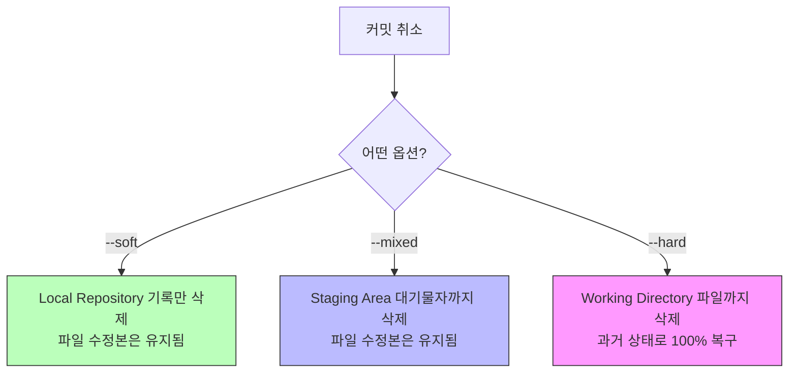

# 🚀 쉽게 설명하는 Git 기초 2. log, reset

## 1. 과거 기록 확인하기 (`git log`)
지금까지 내가 어떤 커밋(기록)을 남겼는지 타임라인을 확인하는 방법입니다.

```bash
git log             # 전체 상세 기록 확인
git log --oneline   # 한 줄로 요약된 기록 확인 (가장 많이 사용)
```
- 각 기록 옆에 있는 영문+숫자 조합(예: `a1b2c3d`)은 **커밋 아이디(Hash)**입니다. 과거로 돌아갈 때 주소 역할을 합니다.

---

## 2. 과거로 되돌리기 (`git reset`)
실수를 했거나 예전 코드가 필요할 때, 시간을 되돌리는 마법의 명령어입니다. 
**"해당 커밋을 했던 시점으로 내 컴퓨터를 리셋한다"**고 이해하면 쉽습니다.

```bash
git reset --옵션 커밋아이디
```

### 💡 리셋의 3가지 모드 (중요!)
상황에 따라 얼마나 강력하게 되돌릴지 선택할 수 있습니다.

1. **`--soft` (가장 안전)**
   - **상태:** 커밋만 취소하고, 내가 수정한 코드 내용은 그대로 유지합니다.
   - **용도:** 방금 커밋 메시지를 잘못 적었거나, 여러 번의 커밋을 하나로 합치고 싶을 때 사용합니다.

2. **`--mixed` (기본값)**
   - **상태:** 커밋도 취소하고 `add` 했던 상태도 취소하지만, 코드 수정본은 남아있습니다.
   - **용도:** 기록을 취소하고 아예 처음부터 다시 `add` 하고 싶을 때 사용합니다.

3. **`--hard` (주의!)**
   - **상태:** 커밋, `add`, 그리고 **내가 수정한 코드까지 싹 다 지우고** 과거로 완벽히 돌아갑니다.
   - **용도:** 작업 내용이 완전히 망가져서 깨끗했던 예전 상태로 100% 복구하고 싶을 때 사용합니다.

---

## 3. 리셋 동작 원리 다이어그램

`reset` 옵션에 따라 어느 단계까지 영향이 가는지 시각적으로 확인해 보세요.



---

## ⚠️ 주의사항: 복구가 힘들 수 있습니다!
- `git reset --hard`는 내 컴퓨터에서 수정한 코드를 직접 삭제하기 때문에, 커밋하지 않은 작업 내용이 있다면 영구적으로 잃어버릴 수 있습니다. 신중하게 사용하세요!
- 이미 깃허브(GitHub)에 올린(push) 커밋을 리셋할 때는 `reset` 대신 `revert`라는 명령어를 권장하지만, 이는 나중에 다시 배울 예정입니다.

---

## 📚 향후 학습 로드맵

### Step 3. 깃허브 연동하기 (`remote`, `push`, `pull`)
- 드디어 내 컴퓨터의 기록을 온라인 저장소인 GitHub에 올리는 방법을 배웁니다.

### Step 4. 평행우주 개발 (`branch`, `merge`)
- 원본을 보존하면서 새로운 기능을 안전하게 테스트하는 방법을 익힙니다.

### Step 5. 실무 협업 기술 (`PR`, `Conflict`)
- 실제 개발 현장에서 팀원들과 코드를 합치는 실전 기술을 정복합니다.