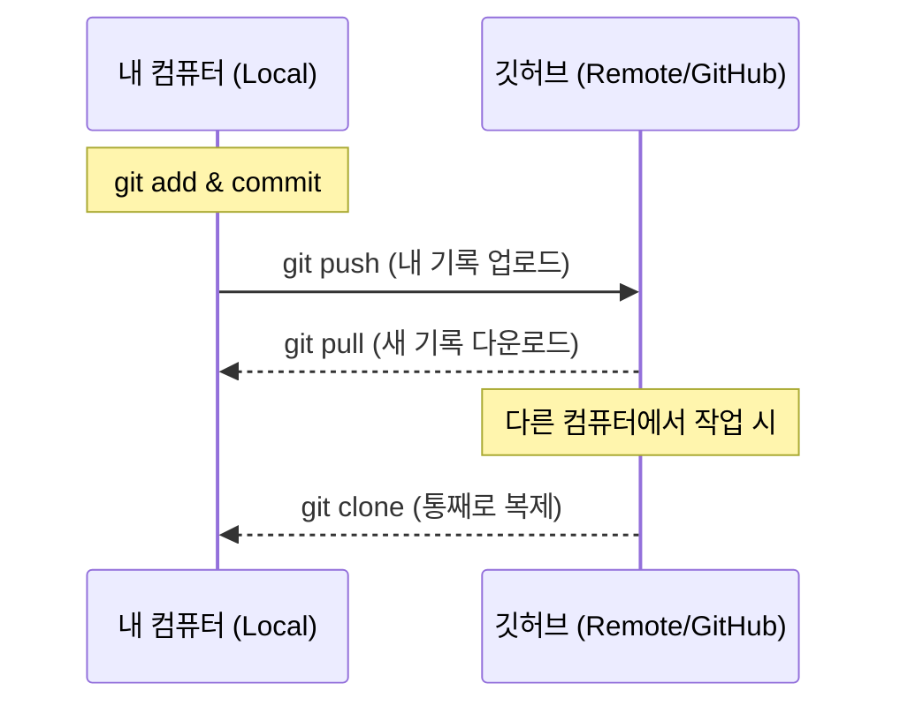

# 🚀 쉽게 설명하는 Git 기초 3. 깃허브 연동 (Remote, Push, Pull)

## 1. 내 컴퓨터와 깃허브 연결하기 (`git remote`)
로컬 저장소에 깃허브 저장소 주소를 알려주는 과정입니다. 한 번만 설정하면 계속 사용할 수 있습니다.

```bash
# 'origin'이라는 이름으로 깃허브 주소를 등록합니다.
git remote add origin [https://github.com/본인ID/리포지토리명.git](https://github.com/본인ID/리포지토리명.git)

# 연결된 원격 저장소 확인
git remote -v
```

---

## 2. 내 기록 올리기 (`git push`)
로컬 저장소(`commit` 완료된 상태)의 기록을 깃허브로 전송합니다.

```bash
# main 브랜치의 내용을 깃허브(origin)에 올립니다.
git push origin main
```
- `-u` 옵션을 한 번 사용하면(예: `git push -u origin main`), 그다음부터는 `git push`만 입력해도 자동으로 연결됩니다.

---

## 3. 다른 곳의 기록 가져오기 (`clone`, `pull`)

### 1) 통째로 복제하기 (`git clone`)
깃허브에 있는 프로젝트를 내 컴퓨터로 처음 가져올 때 사용합니다.
```bash
git clone [https://github.com/주소.git](https://github.com/주소.git)
```

### 2) 업데이트된 내용만 가져오기 (`git pull`)
이미 내 컴퓨터에 있는 프로젝트인데, 깃허브에 새로운 커밋이 올라왔을 때 동기화하는 명령어입니다.
```bash
git pull origin main
```

---

## 4. 로컬 vs 원격 동작 원리 다이어그램

내 컴퓨터와 온라인 저장소 사이에서 데이터가 어떻게 오가는지 확인해 보세요.




- **Push:** 내 컴퓨터의 결과물을 깃허브로 보냅니다. (업로드)
- **Pull:** 깃허브의 최신 결과물을 내 컴퓨터로 가져옵니다. (다운로드 + 합치기)
- **Clone:** 아무것도 없는 상태에서 깃허브 저장소를 그대로 복사해옵니다.

---

## 5. 자주 발생하는 상황 (Tip)
- **Push가 안 돼요!** 깃허브에 내가 없는 새로운 커밋이 이미 있을 때 발생합니다. 먼저 `git pull`을 해서 최신 상태를 만든 뒤 다시 `push` 하세요.
- **주소가 바뀌었어요!** `git remote set-url origin 신규주소` 명령어로 수정할 수 있습니다.

---

## 📚 향후 학습 로드맵

### Step 4. 평행우주 개발 (`branch`, `merge`)
- 이제 혼자서 올리고 내리는 것을 넘어, 원본을 건드리지 않고 새로운 기능을 개발하는 '브랜치' 기법을 배웁니다.

### Step 5. 실무 협업 기술 (`PR`, `Conflict`)
- 실제 팀 프로젝트에서 가장 많이 쓰이는 Pull Request 과정과 충돌 해결법을 정복합니다.