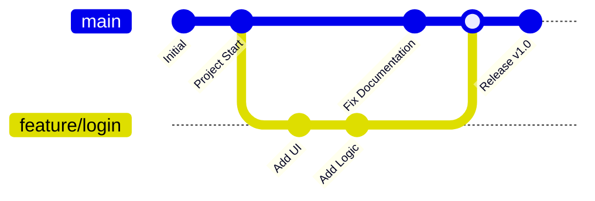

# 🚀 쉽게 설명하는 Git 기초 4. 평행우주 개발 (Branch, Merge)

## 1. 브랜치(Branch)란?
기존 코드의 복사본을 만들어 독립적으로 작업할 수 있는 **'가지'**를 의미합니다.
- **안정성:** 메인 코드(`main`)를 건드리지 않고 새로운 기능을 실험할 수 있습니다.
- **병렬 개발:** 여러 명의 팀원이 각자 맡은 기능을 동시에 개발할 수 있습니다.

---

## 2. 브랜치 다루기 (생성 및 이동)

### 1) 브랜치 만들기 및 목록 확인
```bash
git branch feature/motor    # 'feature/motor'라는 이름의 브랜치 생성
git branch                  # 현재 존재하는 모든 브랜치 목록 확인
```

### 2) 브랜치 이동하기 (`switch`)
```bash
git switch feature/motor    # 'feature/motor' 브랜치로 이동
# 과거에는 git checkout 명령어를 사용했으나, 현재는 switch를 권장합니다.
```

### 3) 생성과 동시에 이동하기
```bash
git switch -c feature/sensor # 브랜치를 만들고 바로 이동까지 완료
```

---

## 3. 코드 합치기 (`merge`)
다른 브랜치에서 완료한 작업을 메인 브랜치에 반영하는 과정입니다.

```bash
# 1. 먼저 기준이 되는 브랜치(보통 main)로 이동합니다.
git switch main

# 2. 가져오고 싶은 브랜치를 합칩니다.
git merge feature/motor
```

---

## 4. 브랜치 워크플로우 다이어그램

메인 줄기에서 가지가 뻗어 나오고 다시 합쳐지는 과정을 시각적으로 확인해 보세요.




1. **main:** 언제든 배포 가능한 깨끗한 상태를 유지하는 중심 줄기입니다.
2. **feature/**: 새로운 기능을 개발할 때 뻗어 나오는 가지입니다. 개발이 끝나면 `main`으로 합쳐집니다.

---

## 5. 브랜치 삭제하기
작업이 끝나고 합쳐진 브랜치는 깔끔하게 삭제해 주는 것이 좋습니다.
```bash
git branch -d feature/motor  # 사용이 끝난 브랜치 삭제
```

---

## 📚 향후 학습 로드맵

### Step 5. 실무 협업 기술 (`PR`, `Conflict`)
- 실제 현업에서 가장 많이 쓰이는 **Pull Request** 방식과, 두 코드가 충돌했을 때 해결하는 **Conflict** 대처법을 배웁니다. 이것까지 마스터하면 Git 기초 과정이 완성됩니다!