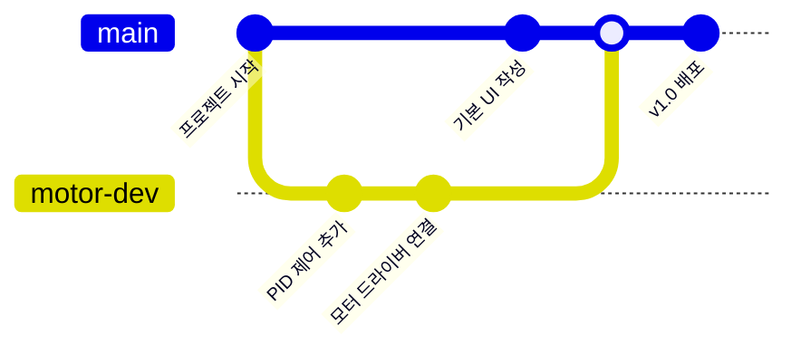

# 🚀 [TIL] 쉽게 정리하는 Git 기초 04. 평행우주 만들기! 브랜치와 머지

## 1. 브랜치(Branch)란?
메인 코드(`main`)를 그대로 복사해서 나만의 독립적인 작업 공간을 만드는 것이다. 
일종의 **'평행우주'** 를 만든다고 생각하면 쉽다.

- **안전한 실험:** 로봇의 모터 제어 알고리즘을 새로 짤 때, 메인 코드를 건드리지 않고 브랜치에서 마음껏 테스트할 수 있다.
- **동시 작업:** 나는 센서 코드를 짜고, 팀원은 길 찾기 알고리즘을 짤 때 각자의 브랜치에서 작업하면 코드가 꼬이지 않는다.

---

## 2. 브랜치 자유자재로 다루기

### 1) 새로운 가지 만들기 (`branch`)
"앞으로 'motor-test'라는 우주에서 작업할래!"라고 선언하는 것이다.
```bash
git branch feature/motor-control  # 브랜치 생성
git branch                        # 지금 어떤 브랜치들이 있는지 확인
```

### 2) 우주 이동하기 (`switch`)
내가 작업할 공간으로 순간이동 하는 명령어다.
```bash
git switch feature/motor-control  # 내가 만든 브랜치로 이동
# 꿀팁: 생성과 이동을 한 번에 하려면?
git switch -c feature/sensor-data
```

---

## 3. 작업 결과 합치기 (`merge`)
다른 우주(브랜치)에서 개발이 성공적으로 끝났다면, 이제 원본(`main`)과 합칠 시간이다.

```bash
# 1. 일단 메인 우주(main)로 돌아온다.
git switch main

# 2. 작업이 끝난 브랜치를 가져와서 합친다.
git merge feature/motor-control
```

---

## 4. 브랜치 흐름 한눈에 보기

로봇 프로젝트 코드가 어떻게 뻗어 나가고 합쳐지는지 시각화해봤다.

[Image of Git branching and merging model for robotics projects]



- **main:** 항상 돌아가야 하는 '진짜' 코드 줄기다.
- **motor-dev:** 모터 기능을 실험하던 가지다. 성공하면 `main`으로 합쳐진다.

---

## 💡 오늘 깨달은 꿀팁
- **브랜치 이름 짓기:** 보통 `feature/기능명` 식으로 이름을 지으면 나중에 협업할 때 팀원들이 알아보기 편하다.
- **수시로 확인:** 내가 지금 어느 우주(브랜치)에 있는지 헷갈릴 때가 많다. `git status`나 VS Code 하단 바를 수시로 확인하는 습관을 들여야겠다.

---

## 📚 다음 공부 계획

### Step 5. 팀 프로젝트의 꽃 (`PR & Conflict`)
- 실제 팀원들과 코드를 합칠 때 검토받는 **Pull Request**와, 서로 같은 곳을 고쳤을 때 발생하는 **충돌(Conflict)** 해결법을 배우면 Git 기초 정복 완료!