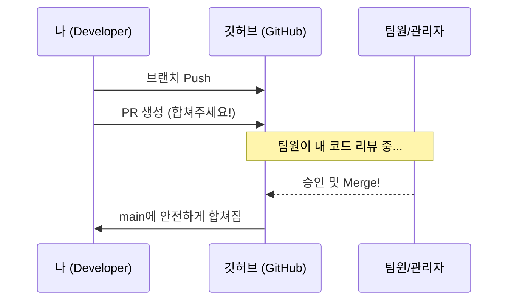

# 🚀 [TIL] 쉽게 정리하는 Git 기초 05. 협업의 정석! PR과 충돌 해결하기

## 1. Pull Request (PR)란?
직역하면 **"내가 작업한 내용을 가져가서 합쳐달라고 요청(Request)하는 것"**이다. 
깃허브 웹사이트에서 버튼을 눌러 진행하며, 팀 프로젝트의 핵심이다.

- **코드 리뷰:** 내가 짠 코드를 팀원이 합치기 전에 미리 보고 의견을 줄 수 있다.
- **안정성:** 검증된 코드만 메인(`main`)에 합쳐지니까 프로젝트가 망가지는 걸 막아준다.

---

## 2. 실무 협업 워크플로우 (PR 순서)

보통 SSAFY 팀 프로젝트에서는 이런 순서로 일한다.

1. **브랜치 생성:** `git switch -c feature/login` (나만의 작업 공간 만들기)
2. **열공 및 커밋:** 기능 구현 후 `git commit`으로 기록
3. **원격 전송:** `git push origin feature/login` (내 브랜치를 깃허브에 올리기)
4. **PR 생성:** 깃허브 페이지에 접속해 **[Compare & pull request]** 버튼 클릭!
5. **검토 및 합치기:** 팀원이 "오, 코드 괜찮네!" 하고 승인해주면 **[Merge]** 버튼을 눌러 최종 합체.

---

## 3. 으악! 충돌(Conflict)이 났다?
나랑 팀원이 **같은 파일의 같은 줄**을 동시에 고치고 합치려 할 때 발생한다. Git이 "누구 코드가 맞는 거야? 니가 골라줘!"라고 항의하는 상태다.

### 1) 충돌 난 곳 확인하기
충돌이 발생하면 파일 안에 이런 이상한 기호들이 생긴다.
```text
<<<<<<< HEAD
내가 지금 작업 중인 코드 (Current Change)
=======
합치려고 가져온 팀원의 코드 (Incoming Change)
>>>>>>> feature/new-sensor
```

### 2) 해결 방법 (당황하지 말자!)
1. **코드 선택:** 기호들을 다 지우고, 최종적으로 남길 내용만 예쁘게 정리한다. (VS Code에서 제공하는 Accept 버튼을 누르면 편하다.)
2. **수정 완료 보고:** 해결이 끝났다면 다시 장바구니에 담는다.
   ```bash
   git add .
   ```
3. **마무리 커밋:** 충돌 해결을 기념하며 기록을 남긴다.
   ```bash
   git commit -m "fix: 충돌 해결 완료"
   ```

---

## 4. 협업 프로세스 한눈에 보기

팀원과 소통하며 코드를 합치는 과정을 그려봤다.



---

## 💡 오늘 깨달은 협업 꿀팁
- **소통이 답이다:** 충돌이 나면 팀원에게 "이 부분 내가 이렇게 고쳤는데 니 코드랑 합쳐도 돼?"라고 물어보는 게 가장 빠르다.
- **자주 Pull 하기:** 작업 시작 전에 `git pull origin main`을 하는 습관을 들이면 충돌 확률을 확 낮출 수 있다.
- **커밋 메시지는 예의:** `feat: 거리 센서 데이터 처리 로직 추가` 처럼 팀원이 한눈에 알 수 있게 적자.

---

## 🎉 드디어 Git 기초 대장정 끝!
이제 나는 **기록(add/commit)**하고, **시간을 되돌리고(reset)**, **클라우드에 올리고(push/pull)**, **평행우주를 만들고(branch)**, **협업(PR/Conflict)**까지 할 줄 아는 당당한 로봇 개발자가 되었다! 앞으로 있을 프로젝트들이 기대된다. 🤖🔥