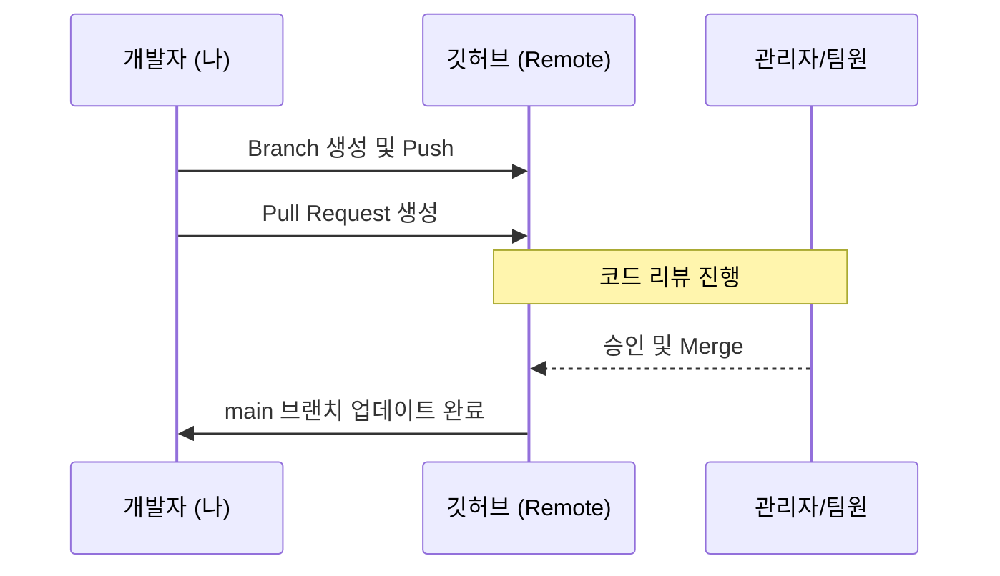

# 🚀 쉽게 설명하는 Git 기초 5. 실무 협업 (PR, Conflict)

## 1. Pull Request (PR)란?
직역하면 **"내가 작업한 내용을 가져가서 합쳐달라고 요청(Request)하는 것"**입니다.
- **코드 리뷰:** 팀원이 내 코드를 확인하고 피드백을 줄 수 있습니다.
- **안정성 확보:** 검증된 코드만 메인 줄기(`main`)에 합쳐지므로 프로젝트가 망가지는 것을 방지합니다.

---

## 2. 실무 협업 워크플로우 (PR 프로세스)

보통 실무에서는 아래와 같은 순서로 협업이 진행됩니다.

1. **브랜치 생성:** `git switch -c feature/login` (새 기능 전용 공간 만들기)
2. **작업 및 커밋:** 기능 구현 후 `git commit`
3. **원격 전송:** `git push origin feature/login` (내 브랜치를 깃허브에 올리기)
4. **PR 생성:** 깃허브 웹사이트에서 **[Compare & pull request]** 클릭하여 요청 보내기
5. **검토 및 합치기:** 팀원의 승인을 받은 후 **[Merge pull request]** 클릭

---

## 3. 충돌(Conflict) 발생 및 해결
두 명 이상의 개발자가 **같은 파일의 같은 줄**을 동시에 수정하고 합치려 할 때 발생합니다.

### 1) 충돌 상황 파악
충돌이 발생하면 파일 안에 아래와 같은 기호가 생깁니다.
```text
<<<<<<< HEAD
현재 내 브랜치(main 등)에 있는 코드
=======
합치려고 가져온 브랜치(feature 등)에 있는 코드
>>>>>>> feature/login
```

### 2) 충돌 해결 방법
1. **파일 수정:** 기호들을 모두 지우고, 최종적으로 남길 코드만 남깁니다.
2. **상태 알리기:** 수정이 완료되었다면 다시 `add` 합니다.
   ```bash
   git add .
   ```
3. **완료:** 마지막으로 커밋을 하여 충돌 해결을 기록합니다.
   ```bash
   git commit -m "fix: 충돌 해결"
   ```

---

## 4. 협업 프로세스 다이어그램

팀원과 소통하며 코드를 합치는 과정을 시각화했습니다.




---

## 5. 협업을 위한 황금률 (Best Practice)
- **자주 Pull 하기:** 작업 시작 전에는 항상 `git pull origin main`을 하여 최신 상태를 유지하세요. 충돌을 미리 방지할 수 있습니다.
- **작은 단위로 PR 하기:** 한 번에 너무 많은 코드를 고치면 팀원이 리뷰하기 힘들고 충돌 해결도 복잡해집니다.
- **커밋 메시지는 정성껏:** `feat: 로그인 버튼 추가` 처럼 누가 봐도 알 수 있게 적으세요.

---