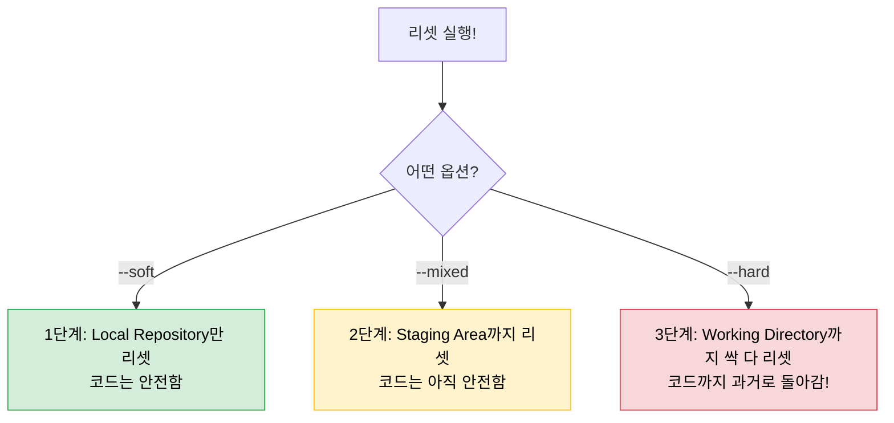

# 🚀 [TIL] 쉽게 정리하는 Git 기초 02. 과거로 시간 여행하기 (log, reset)

## 1. 내가 한 일 살펴보기 (`git log`)
지금까지 내가 어떤 커밋들을 남겼는지 한눈에 훑어보는 방법이다. 

```bash
git log             # 상세한 기록이 다 나온다 (좀 길다)
git log --oneline   # 한 줄로 깔끔하게 요약해서 보여준다 (강추!)
```
- 기록을 보면 맨 앞에 `a1b2c3d` 같은 외계어(?)가 써있는데, 이게 바로 **커밋 아이디(Hash)** 다.
- 과거의 특정 시점으로 돌아가고 싶을 때 사용하는 '주소' 같은 녀석이라 잘 봐둬야 한다.

---

## 2. 시간을 되돌리는 마법 (`git reset`)
코드를 짜다 보면 "아, 아까 커밋하지 말걸" 하거나 "완전 처음부터 다시 하고 싶다"는 생각이 들 때가 있다. 그때 사용하는 게 바로 `reset`이다. 

```bash
git reset --옵션 커밋아이디
```

### 💡 리셋의 3가지 맛 (강도 조절)
얼마나 세게 되돌릴지에 따라 옵션을 골라 쓰면 된다. 내가 이해한 대로 정리해봤다.

1. **`--soft` (순한 맛)**
   - **상태:** "커밋한 기록만" 삭제한다.
   - **특징:** 내가 수정한 코드들은 그대로 살아있다. 
   - **언제 쓸까?** 커밋 메시지를 오타 냈거나, 방금 한 커밋을 취소하고 다시 수정해서 올리고 싶을 때 딱이다.

2. **`--mixed` (중간 맛 / 기본값)**
   - **상태:** 커밋도 취소하고 `add` 했던 장바구니도 비운다.
   - **특징:** 그래도 수정한 코드는 남아있어서 다시 `add`부터 시작할 수 있다.
   - **언제 쓸까?** 아예 장바구니 구성부터 다시 하고 싶을 때 쓴다.

3. **`--hard` (매운 맛 ⚠️)**
   - **상태:** 커밋, 장바구니, 그리고 **내가 수정한 코드까지 싹 다** 과거로 되돌린다.
   - **특징:** 현재 작업 중인 게 다 날아가니까 정말 신중해야 한다.
   - **언제 쓸까?** 작업이 너무 꼬여서 "에라 모르겠다, 아까 잘 되던 때로 완벽히 돌아갈래!" 할 때 사용한다.

---

## 3. 리셋 단계별 범위 이해하기

어디까지 영향이 가는지 그림으로 그려보니 한결 이해가 쉽다.




---

## ⚠️ 오늘 배운 주의사항
- `git reset --hard`는 정말 강력하다. 커밋 안 한 작업물은 **영원히 복구 불가능**할 수도 있으니 항상 조심해서 써야겠다.
- 아직은 혼자 연습하고 있지만, 나중에 깃허브에 이미 올린 걸 리셋할 때는 `reset`보다 더 안전한 `revert`라는 것도 있다는데 그건 나중에 더 공부해봐야지!

---

## 📚 다음 공부 계획

### Step 3. 내 작업물 업로드하기 (`Remote & Push`)
- 이제 내 컴퓨터를 넘어 깃허브라는 더 넓은 세상에 내 코드를 올리는 법을 배울 차례다.