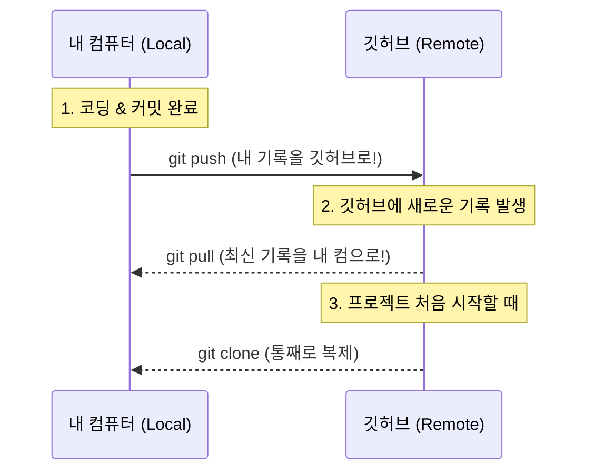

# 🚀 [TIL] 쉽게 정리하는 Git 기초 03. 내 코드를 클라우드에! 깃허브 연동하기

## 1. 깃허브랑 친구 맺기 (`git remote`)
내 컴퓨터에 있는 로컬 저장소한테 "야, 너 앞으로 이 깃허브 주소랑 연락해!"라고 알려주는 단계다. 한 번만 연결해두면 계속 쓸 수 있다.

```bash
# 내 깃허브 저장소 주소를 'origin'이라는 이름으로 등록한다.
git remote add origin [https://github.com/pr0ved99/TIL.git](https://github.com/pr0ved99/TIL.git)

# 연결이 잘 됐는지 확인해보자
git remote -v
```
- **origin**은 깃허브 주소의 별명 같은 거다. 주소가 너무 길어서 짧게 부르는 용도라고 이해했다.

---

## 2. 내 코드 깃허브로 쏘기 (`git push`)
드디어 내 컴퓨터의 커밋(기록)들을 온라인 깃허브 저장소로 업로드하는 단계다. 

```bash
# main 브랜치의 기록들을 origin(깃허브)으로 보낸다!
git push origin main
```
- 처음에 `-u origin main`이라고 한 번만 해주면, 그다음부터는 귀찮게 뒤에 안 붙이고 `git push`만 쳐도 된다. 진짜 편하다.

---

## 3. 남의 코드(혹은 내 코드) 가져오기 (`clone`, `pull`)

깃허브에서 코드를 가져오는 상황은 크게 두 가지다.

### 1) 통째로 다 가져올 때 (`clone`)
새로운 컴퓨터에서 작업을 시작하거나, SSAFY 친구의 멋진 프로젝트를 내 컴퓨터로 복사해오고 싶을 때 쓴다.
```bash
git clone [https://github.com/주소.git](https://github.com/주소.git)
```

### 2) 바뀐 내용만 업데이트할 때 (`pull`)
깃허브에 새로운 커밋이 올라왔을 때(예: 웹사이트에서 수정했거나 팀원이 올렸을 때), 내 컴퓨터에도 반영하는 명령어다.
```bash
git pull origin main
```

---

## 4. 로컬과 원격의 주고받기 다이어그램

내 컴퓨터와 깃허브가 어떻게 소통하는지 그림으로 정리해봤다.




---

## 💡 오늘 깨달은 꿀팁
- **Push가 안 될 때:** 아까 겪었던 것처럼 깃허브에 내가 모르는 기록이 있으면 Push가 거부된다. 당황하지 말고 `git pull`을 먼저 해서 싱크를 맞춘 뒤에 다시 `push` 하면 해결된다!
- **클라우드 저장소:** 이제 내 노트북이 고장 나도 깃허브에 코드가 다 있으니 안심이다. 임베디드 로봇 실습실 컴퓨터랑 내 노트북 사이를 옮겨 다니며 작업할 때도 이 `push/pull`만 잘하면 될 것 같다.

---

## 📚 다음 공부 계획

### Step 4. 평행우주 개발 (`branch`)
- 원본 코드를 망치지 않고 새로운 기능을 테스트해볼 수 있는 '가지 치기' 기술을 배울 거다. 로봇 제어 코드 짤 때 진짜 유용할 듯!