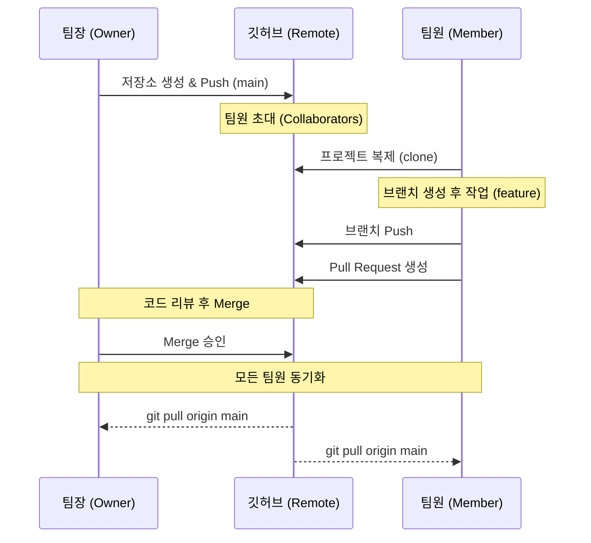

# 🚀 [TIL] 깃허브 협업의 정석: 프로젝트 시작부터 병합까지 로드맵

혼자 하는 Git을 넘어, 팀원들과 발을 맞추는 **협업 사이클**을 정리했다. 이 흐름만 익히면 실무나 SSAFY 프로젝트에서 "누가 뭐 해야 돼?"라고 당황할 일이 없을 것 같다.

---

## 🏗️ Step 1. 프로젝트 생성자 (Owner)가 할 일
프로젝트의 뼈대를 잡고 팀원들을 초대하는 단계다.

1. **로컬 저장소 초기화 및 첫 커밋**
   - 작업 폴더를 만들고 `README.md`, `.gitignore` 파일을 생성한 뒤 첫 커밋을 남긴다.
2. **GitHub 리포지토리 생성 및 연결**
   - GitHub에 새 저장소를 만들고 `git remote add origin [주소]`로 연결한다.
   - `git push origin main`으로 코드를 올린다.
3. **팀원 초대 (중요!)**
   - GitHub 리포지토리 -> **Settings** -> **Collaborators** -> **Add people**에서 팀원들의 ID를 추가한다.
   - 팀원들이 이메일 초대를 수락해야 Push 권한이 생긴다.

---

## 👥 Step 2. 팀원 (Contributor)이 할 일
초대를 수락한 팀원들이 각자의 컴퓨터에서 작업을 시작하는 단계다.

1. **프로젝트 복제 (`clone`)**
   - `git clone [리포지토리 주소]`를 통해 프로젝트 전체를 내 컴퓨터로 가져온다.
2. **나만의 작업 공간 생성 (`branch`)**
   - **절대 `main`에서 바로 작업하지 않는다!** - `git switch -c feature/sensor-logic` 처럼 기능별 브랜치를 만든다.
3. **작업 및 커밋**
   - 코드를 짜고 `git add` -> `git commit -m "feat: 센서 로직 구현"`으로 기록을 남긴다.
4. **원격 저장소에 Push**
   - `git push origin feature/sensor-logic`으로 내 브랜치를 깃허브에 올린다.

---

## 🤝 Step 3. 병합 및 동기화 (Merge & Sync)
각자의 작업물을 하나로 합치고 다시 새로운 작업을 준비하는 핵심 단계다.

1. **Pull Request (PR) 생성**
   - GitHub 웹사이트에서 `Compare & pull request` 버튼을 눌러 "제가 만든 기능을 메인에 합쳐주세요"라고 요청을 보낸다.
2. **코드 리뷰 및 머지 (Merge)**
   - 팀장이나 동료가 코드를 확인하고 `Merge pull request`를 눌러 `main`에 합친다.
3. **로컬 `main` 동기화 (다음 작업을 위한 준비)**
   - 합치기가 끝났다면, 모든 팀원은 다시 자신의 컴퓨터에서 최신 상태를 받아와야 한다.
   ```powershell
   git switch main
   git pull origin main
   ```
4. **다시 새로운 브랜치 만들기**
   - 최신이 된 `main`에서 다시 `Step 2-2`로 돌아가 새 기능을 만든다.

---

## 📊 한눈에 보는 협업 다이어그램




---

## 💡 영현's 실전 협업 꿀팁
- **`main`은 금지 구역:** `main` 브랜치는 언제든 바로 실행 가능한 '완성본'이어야 한다. 모든 실험과 개발은 브랜치에서!
- **작업 전엔 무조건 `pull`:** 오늘 코딩 시작하기 전에 `git pull origin main`을 먼저 해서 팀원들이 밤새 올린 코드가 있는지 확인하자. 
- **충돌(Conflict)을 두려워 말자:** 충돌은 팀원과 내가 같은 고민을 했다는 증거다. 대화로 풀어나가면 된다.

---

## 🎉 로드맵 정리 끝!
이제 프로젝트 생성부터 협업까지의 큰 그림이 그려진다. SSAFY 임베디드 로봇 관통 프로젝트 때 이 로드맵을 팀원들에게 공유하고 시작하면 정말 효율적으로 일할 수 있을 것 같다. 🔥