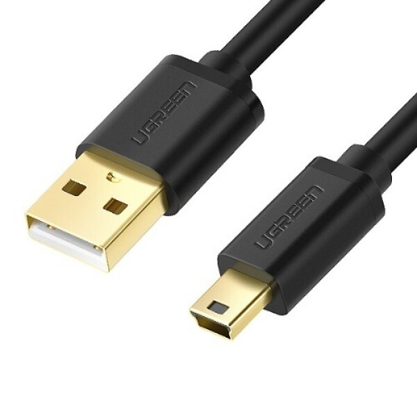

# NUCLEO-F446RE 보드 기본 구성 요소 및 동작 상태 이해

## 📌 1. PC와 보드 연결 (케이블)

* NUCLEO-F446RE 보드를 PC와 연결하려면 일반적인 케이블이 아닌 **Mini-B 타입의 USB 케이블**이 필요하다.
* 이 케이블을 통해 보드에 전원 공급과 동시에 프로그램 디버깅이 가능하다.

## 📌 2. 보드의 주요 구성 요소 (6가지)

보드는 크게 6가지 핵심 구역으로 나눌 수 있다.

| 번호 | 구성 요소 | 역할 및 특징 |
| :---: | :--- | :--- |
| **1** | **Flexible board power supply** | USB 또는 외부 전원(아답터/배터리)으로 보드에 전원을 공급 다양한 방식의 전원 입력을 지원 |
| **2** | **Integrated ST-Link/V2-1 (내장 디버거)** | 외부 장비 없이 USB만으로 코드 업로드 및 디버깅 가능 ST-LINK/V2-1 프로토콜 내장 |
| **3** | **2 Push buttons & 2 Color LEDs** | 사용자 제어용 버튼과 리셋(Reset) 버튼 장착 통신 상태 및 사용자 제어용 컬러 LED 장착 |
| **4** | **Arduino extension connectors** | 아두이노(Arduino) Uno R3 호환 핀 헤더 탑재 기존 아두이노 장치 및 실드를 쉽게 확장 가능 |
| **5** | **STM32 MCU** | 보드 중앙의 핵심 두뇌 (64핀 패키지) 실제 프로그램을 실행하는 마이크로컨트롤러 |
| **6** | **Morpho extension headers** | 보드 양쪽 끝단에 위치한 ST 전용 확장 헤더 STM32 MCU의 거의 모든 IO 핀에 직접 접근 가능 |

## 📌 3. LED 상태로 연결 및 동작 확인하기

보드에는 작동 상태를 시각적으로 알려주는 주요 LED들이 존재한다.

### ① LD1 (COM): 통신 상태 표시용 3색 LED
PC와 내장 ST-LINK 간의 통신 상태를 표시한다.

| 깜빡임 / 색상 | 의미 (상태) |
| :--- | :--- |
| **🔴 빨간색 느리게 (꺼짐 반복)** | PC에서 ST-LINK를 아직 인식하지 못한 초기 상태 |
| **🔴 빨간색 빠르게 (꺼짐 반복)** | PC와 ST-LINK 간 최초 통신 성공 상태 |
| **🔴 빨간색 켜짐 유지** | PC에서 ST-LINK 인식을 완료하고 준비된 상태 |
| **🟢 초록색 켜짐 유지** | ST-LINK가 STM32 MCU와 성공적으로 통신한 상태 |
| **🔴/🟢 빨강·초록 교차 깜빡임** | ST-LINK와 STM32가 데이터를 주고받으며 통신 중인 상태 |
| **🟠 주황색 켜짐 유지** | 통신 실패 혹은 장치 인식 오류 발생 |

### ② LD2 (USER): 사용자 제어용 초록색 LED
사용자가 코드로 직접 켜고 끌 수 있는 LED이다.

| 핀 번호 | 제어 방법 |
| :---: | :--- |
| **PA5** | GPIO 출력 값을 `HIGH (1)`로 주면 켜지고(ON), `LOW (0)`로 주면 꺼진다(OFF). |

### ③ LD3 (PWR): 전원 상태 표시 빨간색 LED
보드에 전원이 정상적으로 인가되고 있는지 보여준다.

| 상태 | 의미 |
| :---: | :--- |
| **켜짐 (ON)** | USB 또는 보조 외부 전원이 보드에 정상적으로 공급 중 |
| **꺼짐 (OFF)** | 전원이 꺼져 있거나 물리적인 연결/공급 오류 발생 |
