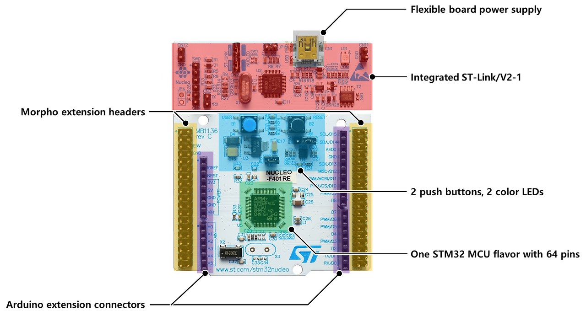
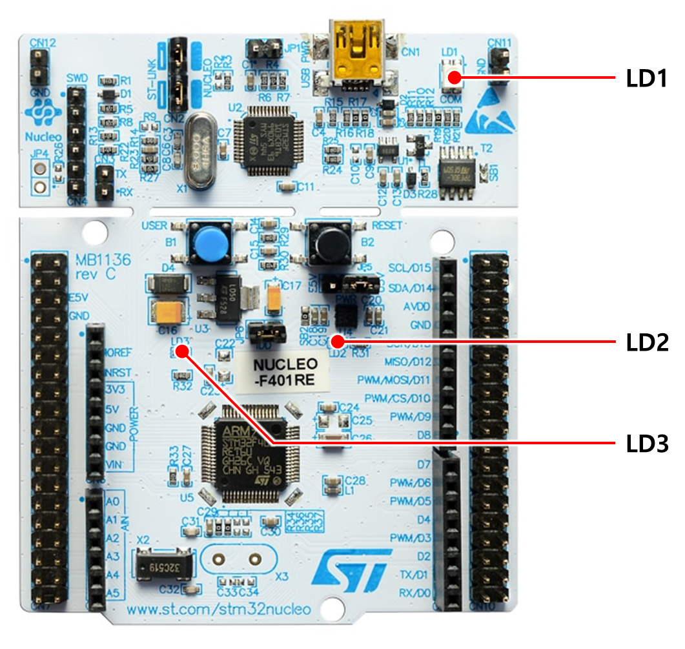

# NUCLEO-F446RE 보드 기본 구성 요소 및 동작 상태 이해

## 📌 1. PC와 보드 연결 (케이블)

* NUCLEO-F446RE 보드를 PC와 연결하려면 일반적인 케이블이 아닌 **Mini-B 타입의 USB 케이블**이 필요하다.
* 이 케이블을 통해 보드에 전원 공급과 동시에 프로그램 디버깅이 가능하다.

## 📌 2. 보드의 주요 구성 요소 (6가지)

보드는 크게 6가지 핵심 구역으로 나눌 수 있다.

1. **Flexible board power supply (전원 공급부)**
   * USB 또는 외부 전원(아답터/배터리)으로 보드에 전원을 공급할 수 있다.
   * 전원 입력을 다양하게 받을 수 있어 편리하게 사용할 수 있다.

2. **Integrated ST-Link/V2-1 (내장 디버거)**
   * USB를 통해 프로그램을 다운로드하거나 디버깅할 수 있는 ST-LINK/V2-1 기능이 내장되어 있다.
   * 별도의 외부 디버거 없이 바로 코드 업로드 및 디버깅이 가능하다.

3. **2 push buttons, 2 color LEDs (입출력 장치)**
   * 두 개의 버튼(사용자 버튼, 리셋 버튼)과 2개의 컬러 LED가 장착되어 있다.
   * 여러 실습을 쉽게 시작할 수 있게 해주는 기본 입출력 장치이다.

4. **Arduino extension connectors (아두이노 호환 헤더)**
   * 아두이노와 호환되는 확장 커넥터가 있다.
   * 아두이노용 센서나 액추에이터 모듈 등을 쉽게 확장할 수 있다.

5. **STM32 MCU (마이크로컨트롤러)**
   * 보드 중앙에 64핀 STM32 마이크로컨트롤러(MCU)가 장착되어 있다.
   * 이 칩이 실제로 프로그램을 실행하는 두뇌 역할을 한다.

6. **Morpho extension headers (ST Morpho 헤더)**
   * 보드 각 끝단에 위치한 확장 헤더이다.
   * STM32의 거의 모든 입출력 핀에 직접 접근이 가능하다.

## 📌 3. LED 상태로 연결 및 동작 확인하기

보드에는 작동 상태를 시각적으로 알려주는 주요 LED들이 존재한다.

### ① LD1 (COM): 통신 상태 표시용 3색 LED

PC와 ST-LINK 간 통신 상태를 표시한다.

* **빨간색/꺼짐 느리게 깜빡임:** 아직 PC에서 ST-LINK를 인식하지 않은 초기 상태이다.
* **빨간색/꺼짐 빠르게 깜빡임:** PC와 ST-LINK 간 최초 통신이 성공한 상태이다.
* **빨간색 켜짐:** PC에서 ST-LINK를 인식하고 준비가 완료된 상태이다.
* **초록색 켜짐:** ST-LINK가 STM32와 성공적으로 통신한 상태이다.
* **빨강/초록 교차 깜빡임:** ST-LINK와 STM32 간 데이터를 주고받는 통신 중이다.
* **주황색 켜짐:** 통신 실패 혹은 장치 인식 오류가 발생했음을 의미한다.

### ② LD2 (USER): 사용자 제어용 초록색 LED

사용자가 직접 제어할 수 있는 초록색 LED이다.

* 기본적으로 **PA5** 핀에 연결되어 있다.
* GPIO 출력 값을 `HIGH (1)`로 주면 켜지고(ON), `LOW (0)`로 주면 꺼진다(OFF).

### ③ LD3 (PWR): 전원 상태 표시 빨간색 LED

보드에 전원이 공급되고 있는지를 표시하는 빨간색 LED이다.

* **켜짐:** USB 또는 외부 전원이 정상적으로 연결되었음을 의미한다.
* **꺼짐:** 전원 연결이 안 되었거나 공급 오류가 발생한 상태이다.
