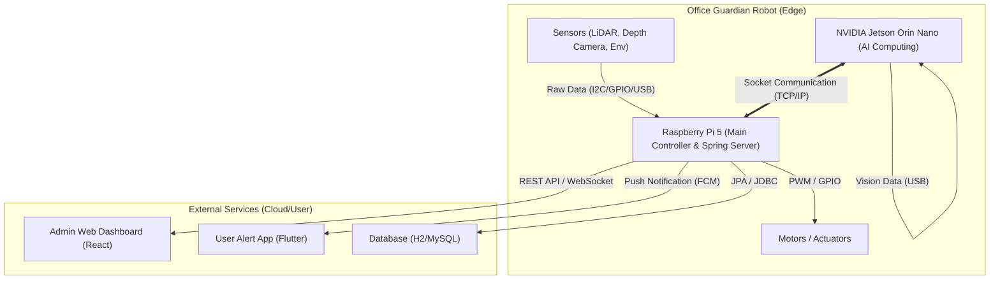

# 🤖 최종 프로젝트 제안서: Office Guardian
> **"환경 관리부터 보안, 다중 센서 기반 자율 주행까지 수행하는 지능형 오피스 올인원 케어 로봇"**

## 1. 프로젝트 개요
* **주제:** AIoT 기반 자율주행 오피스 패트롤 및 환경 케어 시스템
* **목표:** 
    * 주/야간 상시 순찰을 통한 환경(온습도/가스) 관리 및 안전(낙상/화재/보안) 모니터링.
    * 배터리 상태에 따른 자율 복귀 및 **ArUco 마커 기반 정밀 도킹 충전** 수행.
    * **LiDAR와 Depth Camera**를 활용한 고도화된 슬램(SLAM) 및 정밀 장애물 회피 구현.
* **개발 기간:** 6주 (Sub-PJT 1, 2, 3 단계별 진행).
* **참여 인원:** 6명 (임베디드/AI 4명 + 서비스 개발 2명).

---

## 2. 핵심 시나리오 (All-Day Care Cycle)
1. **주간(09-18시):** 환경 패트롤(실시간 온습도 측정) 및 비전 AI 기반 안전 모니터링(낙상 사고 감지).
2. **야간(18시-):** 보안 순찰(미퇴실자 확인) 및 환경 정리(소지품 방치 확인 및 화재 징후 감지).
3. **상시:** 배터리 잔량 모니터링 및 저전력 시 **서보-비전 협응 기반 정밀 도킹(자기 부착식 충전)** 수행.

---

## 3. 단계별 개발 목표 (Sub-PJT 연계)

### 🟢 Sub-PJT 1: 시스템 기초 구축 (1주차)
* **IoT 인프라:** Raspberry Pi 5 환경 설정 및 기초적인 센서(온습도, 가스) 데이터 수집.
* **백엔드 기초:** **Spring Boot** 기반의 서버 환경 구축 및 REST API 설계 (명세서의 Flask를 현업 표준인 Spring으로 고도화).

### 🟡 Sub-PJT 2: 지능형 Perception 구현 (2주차)
* **Vision AI:** Jetson Orin Nano를 활용한 YOLOv8 모델 탑재 (사람, 사물, 연기 인식).
* **마커 인식:** ArUco 마커를 활용한 거리 및 각도 산출 로직 구현 (정밀 도킹용).

### 🔴 Sub-PJT 3: 통합 제어 및 자율주행 (3~6주차)
* **Sensor Fusion:** LiDAR와 Depth Camera 데이터를 결합한 고도화된 Nav2 자율주행 (교육지원금 활용).
* **통합 제어:** Spring Boot 서버와 로봇 간 **소켓 통신**을 통한 실시간 데이터 시각화 및 원격 제어.

---

## 4. 시스템 아키텍처 및 통신 맵

### 🌐 시스템 통신 맵 (Communication Map)

### 🦾 하드웨어 및 소프트웨어 구성
* **Main Computing (AI):** **NVIDIA Jetson Orin Nano**.
    * 역할: 고성능 비전 AI 연산(YOLOv8), ArUco 마커 트래킹.
* **Main Controller (System/Hub):** **Raspberry Pi 5**.
    * 역할: Spring Boot 서버 구동, 하드웨어 제어(GPIO), 소켓 통신 관리.
* **Backend Framework:** **Spring Boot**.
    * 선정 이유: Flask 대비 높은 확장성과 안정성을 제공하며, 현업 표준 스택 활용을 통해 프로젝트의 전문성 및 포트폴리오 가치 극대화.

---

## 5. 역할 분담 (R&R)

| 역할 | 담당 업무 상세 | 비고 |
| :--- | :--- | :--- |
| **시스템 통합** | ROS 2 아키텍처 설계, Jetson-RPi5 소켓 통신 프로토콜 정의 | PM |
| **제어/임베디드** | **Raspberry Pi 5 GPIO 제어**, 모터 PID 제어, 충전 회로 설계 | **이영현** |
| **자율주행/Perception** | LiDAR & Depth Camera 기반 SLAM, Nav2 튜닝, ArUco 도킹 로직 | |
| **비전 AI** | YOLOv8 모델 학습, 낙상 및 화재 감지 알고리즘 최적화 | |
| **웹/서비스 개발** | **Spring Boot 기반 백엔드 구축**, 실시간 관제 UI 및 푸시 알림 | |

---

## 6. 리스크 관리 및 자원 계획
* **기술적 난제:** 물리적 자기 부착 도킹 실패 시, 스테이션 앞 정지 후 수동 충전 요청 알림으로 전환.
* **성능 저하:** 젯슨 리소스 부족 시 TensorRT를 통한 모델 최적화 및 탐지 주기 조절.
* **자원 확보:** LiDAR 및 Depth Camera는 교육 지원금을 활용해 조기에 구입하여 성능 테스트 진행.
* **기본 제공 기자재:** NVIDIA Jetson Orin Nano, Raspberry Pi 5, 오린카 킷.