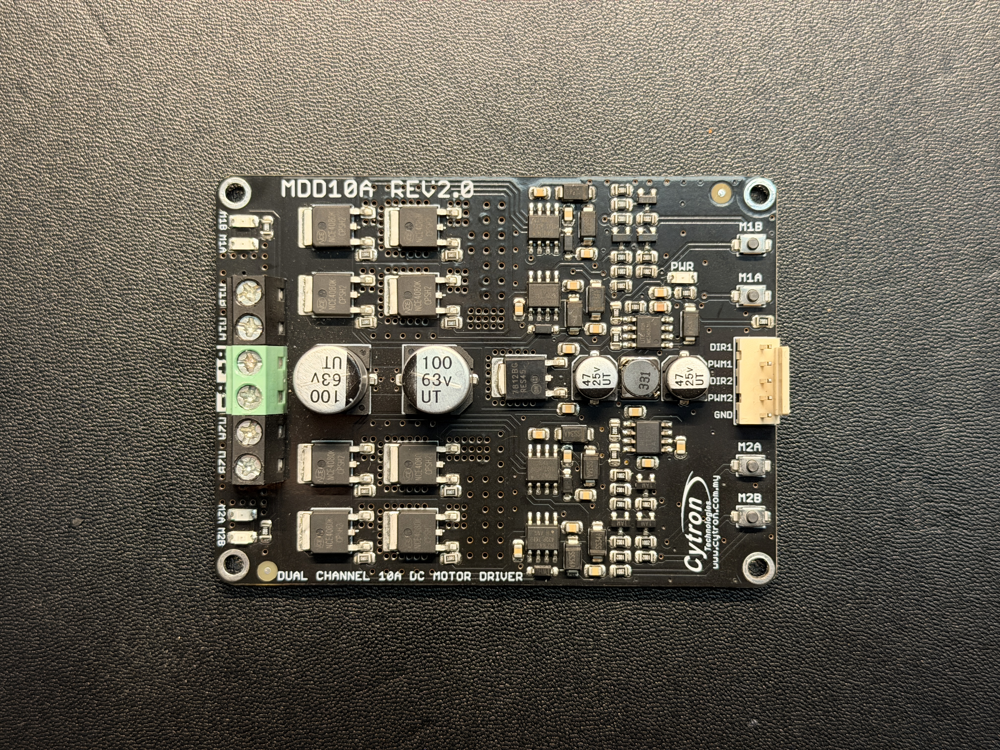

# MDD10A Visual And Multimeter Inspection

## 목적

이 문서는 MDD10A에 battery power를 넣기 전에 visual inspection과 multimeter만으로 obvious defect risk를 줄이는 절차를 정의한다.

이 검사는 MDD10A가 정상 동작한다는 최종 proof가 아니다. 하드 쇼트, 단자 손상, 납땜 불량, 극성 혼동 같은 초기 위험을 먼저 거르는 단계다.

## Test Scope

이 단계에서 허용되는 것:

- Board visual inspection
- Terminal label identification
- Unpowered continuity check
- Unpowered resistance comparison between channels
- Logic pin short check

이 단계에서 금지되는 것:

- Battery connection
- Motor connection
- STM32 signal connection
- MDD10A test button press with motor power
- Powered no-motor check

## Reference Terminal Map

Cytron MDD10A는 brushed DC motor 2개를 구동하는 dual-channel motor driver이며, control input은 `PWM`과 `DIR` 조합을 사용한다.

| Area | Terminal or pin | Role |
| --- | --- | --- |
| Motor power | `POWER+` | Battery positive input |
| Motor power | `POWER-` | Battery negative input |
| Motor 1 output | `M1A`, `M1B` | Motor 1 output pair |
| Motor 2 output | `M2A`, `M2B` | Motor 2 output pair |
| Logic input | `PWM1`, `DIR1` | Motor 1 speed and direction input |
| Logic input | `PWM2`, `DIR2` | Motor 2 speed and direction input |
| Logic reference | `GND` | Common ground reference for control signals |

## Required Equipment

| Item | Purpose |
| --- | --- |
| Multimeter | Continuity, resistance, diode mode if available |
| Camera | Evidence photo |
| Non-conductive bench surface | Prevent accidental shorts |
| MDD10A board | Device under inspection |

## Visual Inspection

Evidence photo:



| Check | Expected | Observed | Result |
| --- | --- | --- | --- |
| PCB surface | No crack, burn mark, lifted trace | No obvious crack, burn mark, or lifted trace visible in overview photo | PASS |
| Screw terminals | Not broken, screws hold wire when tightened | No visible terminal breakage; wire-hold test not performed yet | PASS for visual check |
| Logic header | Pins not bent into each other | No obvious bent or shorted logic header pins visible | PASS |
| Components | No loose, missing, or visibly burnt component | No loose, missing, or visibly burnt component visible in overview photo | PASS |
| Terminal labels | Readable and matched to board silkscreen | `POWER+`, `POWER-`, `M1A`, `M1B`, `M2A`, `M2B`, `DIR/PWM/GND` labels readable | PASS |
| Metal debris | No loose solder blob or wire strand | No loose solder blob or wire strand visible in overview photo | PASS |

## Multimeter Setup

Use unpowered board only.

```text
Battery disconnected
Motor disconnected
STM32 disconnected
No USB or external power connected
```

Continuity mode can beep briefly while capacitors charge through the meter. Treat a persistent near-zero reading as the failure condition.

## Test 1: Power Input Hard-Short Check

| Measurement | Expected | Observed | Result |
| --- | --- | --- | --- |
| `POWER+` to `POWER-` continuity | No persistent hard short | No beep | PASS |
| `POWER+` to logic `GND` continuity | No persistent hard short; same risk as `POWER+` to `POWER-` if grounds are common | No beep | PASS |
| `POWER-` to logic `GND` continuity | Common ground expected or very low resistance if tied | Beep; interpreted as motor power ground and logic ground being common | PASS |

Pass condition:

```text
POWER+ and POWER- must not look like a direct short before power is applied.
```

## Test 2: Motor Output Hard-Short Check

| Measurement | Expected | Observed | Result |
| --- | --- | --- | --- |
| `M1A` to `M1B` | No persistent hard short | No beep | PASS |
| `M2A` to `M2B` | No persistent hard short | No beep | PASS |
| `M1A` to `POWER+` | No persistent hard short | No beep | PASS |
| `M1B` to `POWER+` | No persistent hard short | No beep | PASS |
| `M2A` to `POWER+` | No persistent hard short | No beep | PASS |
| `M2B` to `POWER+` | No persistent hard short | No beep | PASS |
| `M1A` to `POWER-` | No persistent hard short | No beep | PASS |
| `M1B` to `POWER-` | No persistent hard short | No beep | PASS |
| `M2A` to `POWER-` | No persistent hard short | No beep | PASS |
| `M2B` to `POWER-` | No persistent hard short | No beep | PASS |

Pass condition:

```text
No motor output terminal should be permanently shorted to a power rail on an unpowered board.
```

## Test 3: Logic Pin Short Check

| Measurement | Expected | Observed | Result |
| --- | --- | --- | --- |
| `PWM1` to `GND` | No hard short | No beep | PASS |
| `DIR1` to `GND` | No hard short | No beep | PASS |
| `PWM2` to `GND` | No hard short | No beep | PASS |
| `DIR2` to `GND` | No hard short | No beep | PASS |
| `PWM1` to `PWM2` | No hard short | No beep | PASS |
| `DIR1` to `DIR2` | No hard short | No beep | PASS |

Pass condition:

```text
Logic input pins must not be shorted together or shorted to GND before wiring.
```

## Test 4: Channel Comparison

Measure both channels in the same meter mode and compare them.

| Pair | Channel 1 observed | Channel 2 observed | Result |
| --- | --- | --- | --- |
| Output A/B pair | `M1A` to `M1B`: no beep | `M2A` to `M2B`: no beep | PASS |
| Output A to `POWER+` | `M1A` to `POWER+`: no beep | `M2A` to `POWER+`: no beep | PASS |
| Output B to `POWER+` | `M1B` to `POWER+`: no beep | `M2B` to `POWER+`: no beep | PASS |
| Output A to `POWER-` | `M1A` to `POWER-`: no beep | `M2A` to `POWER-`: no beep | PASS |
| Output B to `POWER-` | `M1B` to `POWER-`: no beep | `M2B` to `POWER-`: no beep | PASS |

Pass condition:

```text
The two channels do not need identical values, but one channel should not show an obvious hard short while the other does not.
```

## Stop Conditions

Stop and do not power the board if:

- `POWER+` to `POWER-` shows a persistent hard short.
- Any motor output is permanently shorted to a power rail.
- Logic pins are shorted together.
- Terminal labels cannot be identified confidently.
- There is visible burn, crack, broken terminal, or loose metal debris.

## Result Summary

| Item | Pass/Fail | Notes |
| --- | --- | --- |
| Visual inspection | PASS | No obvious visual damage from overview photo; terminal wire-hold not mechanically tested yet |
| Power input hard-short check | PASS | `POWER+` did not beep to `POWER-` or logic `GND`; `POWER-` to logic `GND` beep treated as expected common ground |
| Motor output hard-short check | PASS | All checked motor output pairs and output-to-rail pairs showed no beep |
| Logic pin short check | PASS | PWM/DIR pins showed no beep to GND or each other |
| Channel comparison | PASS | Channel 1 and Channel 2 showed matching no-hard-short behavior |

Inspection decision:

```text
MDD10A unpowered visual and continuity inspection passed.
Do not connect a motor yet.
Proceed to power path and buck converter checks before powered driver tests.
```

## Next Step

If this inspection passes, do not connect a motor yet.

Proceed in this order:

```text
01_Power_Bringup_Checklist.md
02_Buck_Converter_Calibration_Log.md
03_MDD10A_Logic_Input_Test.md
05_First_Motor_No_Load_Test.md
```

## References

- Cytron tutorial, MDD10A with Maker UNO: https://www.cytron.io/tutorial/mdd10a-maker-uno-dc-motor-control
- Cytron MDD10A user manual mirror: https://cdn.robotshop.com/media/c/cyt/rb-cyt-153/pdf/rb-cyt-153_-_mdd10a_users_manual_v2.0_-_2017-06.pdf
