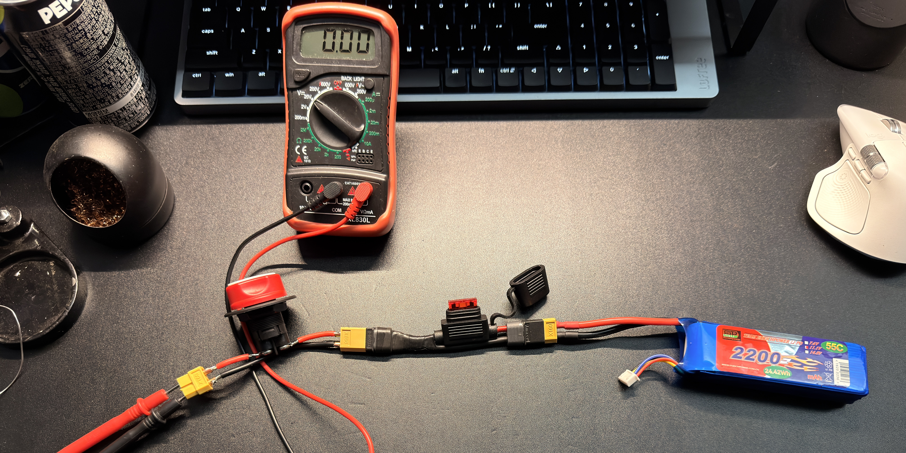
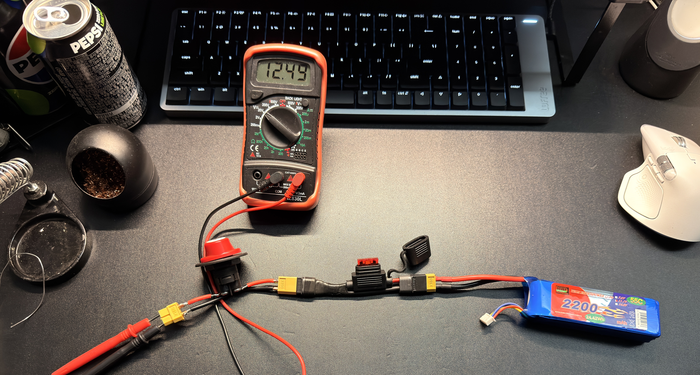

# Power Bring-up Checklist

## 목적

이 문서는 3S LiPo battery를 로봇 전원계에 처음 연결하기 전후의 안전 확인 절차를 정의한다.

목표는 firmware를 믿기 전에 battery, fuse, switch, wiring, polarity, ground path가 안전한지 확인하는 것이다.

## Test Scope

이 단계에서 허용되는 것:

- Battery polarity 확인
- XT60 polarity 확인
- Fuse holder continuity 확인
- Main switch ON/OFF 동작 확인
- Switched battery rail 전압 확인
- Buck converter input 전압 확인
- MDD10A motor power input 전압 확인

이 단계에서 금지되는 것:

- Motor를 실제로 구동
- STM32/ESP32를 buck converter에 연결
- Unknown voltage를 MCU pin에 연결
- Fuse 없이 battery positive path 구성
- Switch 없이 test 진행

## Required Equipment

| Item | Purpose |
| --- | --- |
| Multimeter | Voltage, continuity, polarity check |
| 3S LiPo battery | Main power source |
| XT60 connector/cable | Main battery connector |
| Blade fuse holder | Main positive path protection |
| 10 A blade fuse | First low-energy validation fuse |
| DC-rated main switch | Manual power isolation |
| AWG14 red/black wire | Preferred minimum for main battery path |
| LiPo low-voltage alarm | Independent battery warning |
| Heat shrink / insulation | Exposed conductor protection |

Note:

```text
AWG16 can be used only as a short early bench harness with a 10 A or 15 A fuse.
Do not treat AWG16 as the final drivetrain main power harness.
Use at least AWG14, preferably AWG12, before real driving load tests.
```

## Pre-Power Checklist

Evidence photos:





### Battery and Connector

| Check | Expected | Result |
| --- | --- | --- |
| Battery pack voltage measured | 3S safe range, below 12.6 V full charge | 12.49 V, PASS |
| XT60 polarity checked | Red = positive, black = negative | Red positive path and black negative path confirmed by positive voltage reading, PASS |
| Connector solder joints inspected | No cold joint, no exposed strand | No exposed conductor visible in photos; detailed connector disassembly not performed, PASS for visible inspection |
| Balance connector not damaged | No bent or loose pins | No obvious visible damage in photo, PASS for visual inspection |
| LiPo pack condition inspected | No swelling, puncture, heat, smell | No obvious swelling or puncture visible; no heat/smell reported, PASS |

Measured battery voltage:

```text
Date: 2026-07-10
Battery: 3S LiPo 2200 mAh 55C pack
Pack voltage: 12.49 V
Cell voltages if measured: Not measured
Operator: eyh12
```

추가 측정 이력:

```text
Date: 2026-07-26
Battery pack voltage: 12.36 V
Test context: MDD10A power-input and powered/no-motor validation
Operator: eyh12
```

### Fuse and Switch Path

| Check | Expected | Result |
| --- | --- | --- |
| Fuse holder placed near battery positive | Yes | Fuse holder placed in positive path before switch, PASS |
| Initial fuse rating | 10 A | Red blade fuse, interpreted as 10 A, PASS |
| Wire gauge matches fuse/test stage | Yes | Short early bench harness with 10 A fuse and no load, PASS for no-load validation |
| Switch placed after fuse | Yes | Switch placed after fuse in positive path, PASS |
| Switch OFF continuity | Open circuit | Output rail measured 0.00 V with switch OFF, PASS |
| Switch ON continuity | Closed circuit | Output rail measured 12.49 V with switch ON, PASS |
| Positive path insulation | No exposed conductor | No obvious exposed positive conductor visible in photos, PASS for visual inspection |

Power path:

```text
3S LiPo +
    -> XT60
    -> fuse holder
    -> blade fuse
    -> main switch
    -> switched battery rail
```

### Ground Path

| Check | Expected | Result |
| --- | --- | --- |
| Battery negative path identified | Clear black wire path | Black negative path visible and used as measurement reference, PASS |
| Motor driver ground path planned | Heavy return path, not signal wire | Bench test에서 공통 GND 연결 확인; 최종 대전류 return 배선 굵기와 경로는 TBD |
| Buck converter negative tied to battery negative | Yes | Not connected in this no-load test |
| Logic ground reference planned | Common GND where signals cross domains | Not connected in this no-load test; common GND required later |

## First Power-On: No Load

Condition:

```text
No STM32 connected
No ESP32 connected
No sensor connected
No motor connected
Buck converter outputs not connected to boards
```

Procedure:

1. Install 10 A fuse.
2. Keep switch OFF.
3. Connect LiPo through XT60.
4. Measure voltage before switch.
5. Turn switch ON briefly.
6. Measure switched battery rail.
7. Turn switch OFF.
8. Confirm switched rail drops or is disconnected as expected.

Measurements:

| Measurement | Expected | Actual |
| --- | --- | --- |
| Battery + to battery - | Pack voltage | 12.49 V observed |
| Before switch + to GND | Pack voltage | Not separately photographed |
| Switch OFF rail + to GND | 0 V or disconnected | 0.00 V |
| Switch ON rail + to GND | Pack voltage | 12.49 V |
| Fuse voltage drop | Near 0 V under no load | Not measured |

No-load power path decision:

```text
PASS.
The switched positive rail measured 0.00 V when OFF and 12.49 V when ON.
No heat, smell, spark, or fuse issue was reported during the no-load check.
```

## First Power-On: Buck Inputs Only

Condition:

```text
Buck converter input connected
Buck converter output disconnected from electronics
Motor drivers may be disconnected or motor output open
```

Procedure:

1. Switch OFF.
2. Connect buck converter inputs to switched battery rail.
3. Switch ON.
4. Measure buck input voltage.
5. Measure buck output voltage before calibration.
6. Switch OFF.

Measurements:

| Converter | Input voltage | Output voltage before calibration | Notes |
| --- | --- | --- | --- |
| XL4015 #1 | TBD | TBD | TBD |
| XL4015 #2 | TBD | TBD | TBD |

Important:

```text
If buck output is not already known safe, do not connect it to STM32, ESP32, sensors, or encoders.
```

## First Power-On: Motor Driver Power Input Only

Condition:

```text
MDD10A motor output disconnected
Motor disconnected
Initial standalone power check: MDD10A logic input may remain disconnected
Powered-no-motor follow-up: only the previously validated STM32 signal harness may be connected
```

Procedure:

1. Verify MDD10A POWER+ and POWER- polarity.
2. Switch ON briefly.
3. Measure MDD10A POWER+ to POWER- voltage.
4. Check for heat, smell, smoke, abnormal sound.
5. Switch OFF immediately after measurement.

Measurements:

| Driver | POWER+ to POWER- voltage | Heat/smell/noise | Result |
| --- | --- | --- | --- |
| MDD10A | 12.35 V (battery 12.36 V) | Heat, smell, smoke, abnormal noise 없음 | PASS |

2026-07-26 test record:

```text
Battery pack: 12.36 V
MDD10A POWER+ to POWER-: 12.35 V
Observed path difference: 0.01 V
Motor: disconnected
Powered-no-motor logic check: performed after the standalone input check
Abnormal heat/smell/noise/fuse behavior: none observed
Decision: PASS for MDD10A power-input and powered/no-motor input check
```

주의:

- `0.01 V`는 이 시험 상태에서 battery와 MDD10A 입력 사이의 전체 경로 차이다. 별도의 fuse voltage-drop 측정값으로 해석하지 않는다.
- Switch OFF 직후 MDD10A 측에서 `-0.24 V`가 관측됐고 `-0.14 V`를 거쳐 천천히 0 V 방향으로 감소했다. 극성과 ON 전압은 정상이었다. 저장 커패시터 또는 부유 측정점의 영향으로 추정하지만 원인을 확정하지 않았으며, 이 관측만으로 역전원 여부를 판정하지 않는다.
- 최종 대전류 motor return 배선과 실제 motor 부하에서의 전압 강하는 별도 시험 대상이다.

## Stop Conditions

Stop the test immediately if:

- Fuse blows
- Wire heats
- Connector heats
- Buck converter output is unexpectedly high
- Battery voltage sags abnormally under no load
- Smoke, smell, spark, or sound appears
- Polarity is uncertain

Recovery rule:

```text
원인을 찾기 전에는 fuse를 더 큰 값으로 교체하지 않는다.
```

## Result Summary

| Item | Pass/Fail | Notes |
| --- | --- | --- |
| Battery polarity | PASS | 12.49 V positive reading confirmed the red/black polarity path |
| Fuse path | PASS | Red 10 A blade fuse installed in positive path before switch |
| Main switch | PASS | OFF rail measured 0.00 V; ON rail measured 12.49 V |
| Switched battery rail | PASS | No-load switched rail behaves as expected |
| Buck input path | TBD | Not connected yet |
| MDD10A motor power input | PASS | 2026-07-26: battery 12.36 V, driver input 12.35 V, motor disconnected, abnormal symptom 없음 |

## Next Step

Power path가 통과하면 다음 문서로 진행한다.

```text
02_Buck_Converter_Calibration_Log.md
```
