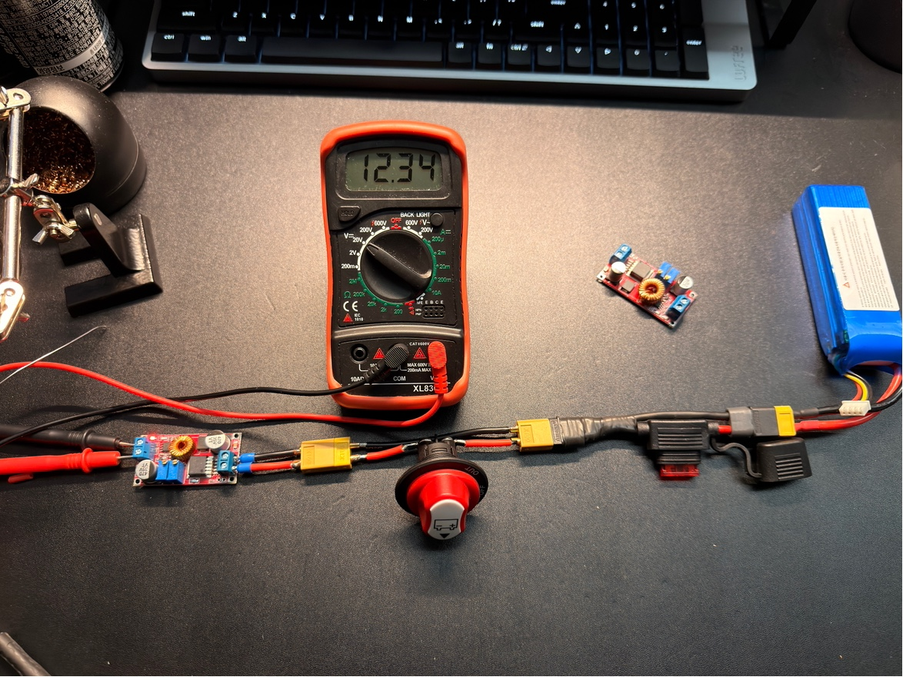
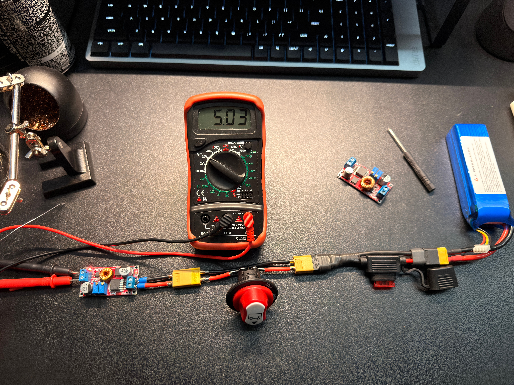
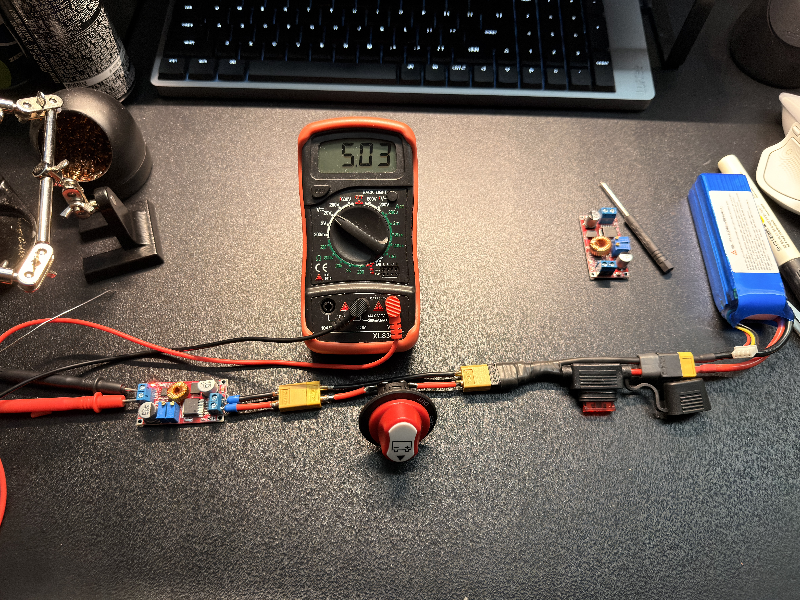
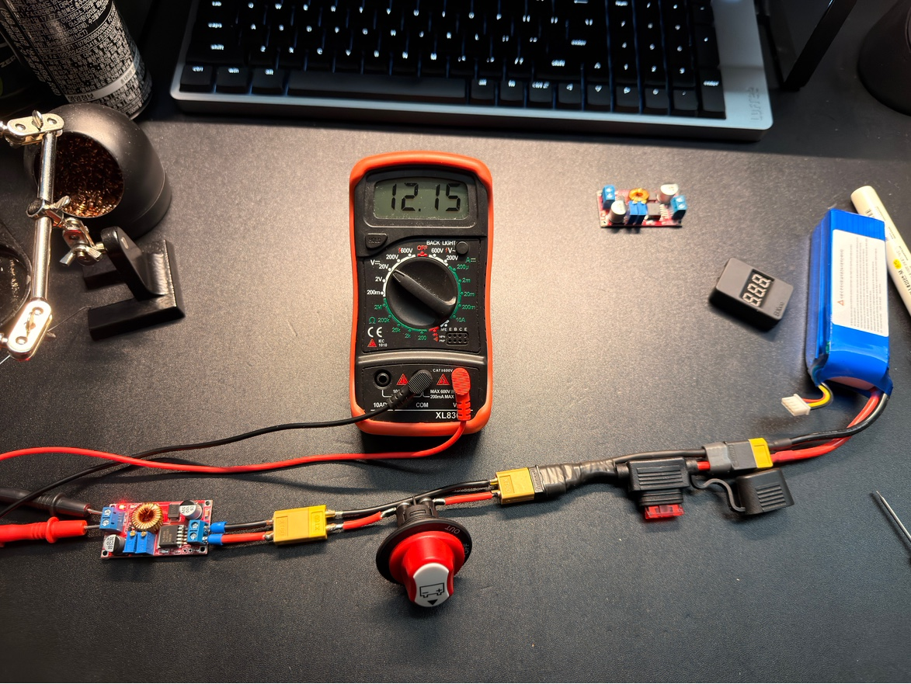
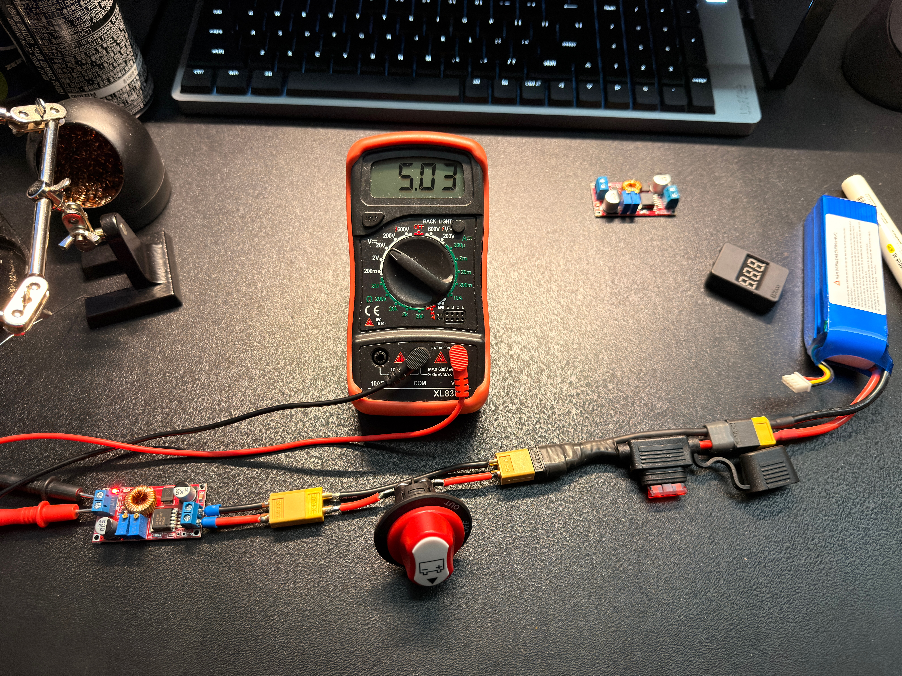
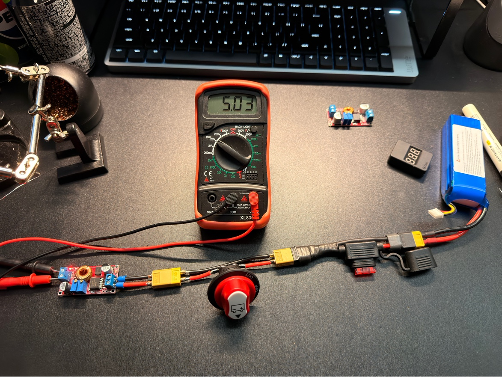

# Buck Converter Calibration Log

## 목적

이 문서는 XL4015 buck converter의 출력 전압을 실제 board 연결 전에 조정하고 검증하는 기록이다.

Buck converter는 3S LiPo 전압을 STM32, ESP32, sensor, motor driver logic이 사용할 수 있는 낮은 전압으로 낮춘다. 잘못 조정된 buck converter는 MCU와 sensor를 즉시 손상시킬 수 있으므로 반드시 무부하와 부하 상태에서 측정한다.

## Target Rails

초기 전원 rail 후보:

| Converter | Target role | Target voltage | Status |
| --- | --- | --- | --- |
| XL4015 #1 | STM32/ESP32 logic 5 V candidate | 5.00 V | Calibrated no-load to 5.03 V |
| XL4015 #2 | Sensor/auxiliary 5 V candidate | 5.00 V | Calibrated no-load to 5.03 V |

Inventory note:

```text
XL4016은 현재 보유 부품이 아니므로 이 검증 범위에서 제외한다.
```

주의:

- STM32/ESP32를 어떤 핀으로 5 V 입력할지는 board manual에 따라 확인해야 한다.
- USB 전원과 buck 5 V를 동시에 연결하면 back-powering 위험이 있을 수 있다.
- 초기 firmware 개발은 USB power가 더 안전하다.

## Required Equipment

| Item | Purpose |
| --- | --- |
| Multimeter | Output voltage calibration |
| 3S LiPo or bench supply | Buck input source |
| Main fuse and switch path | Safe input switching |
| Dummy load | Optional load check |
| Screwdriver | Trimmer adjustment |
| Heat shrink / insulation | Short prevention |

## Calibration Rule

핵심 규칙:

```text
Buck output은 board 연결 전에 multimeter로 먼저 맞춘다.
```

금지:

- 새 buck converter를 조정 없이 MCU에 연결
- Trimmer 위치만 보고 안전하다고 판단
- 출력 전압을 측정하지 않은 상태에서 ESP32/STM32 연결
- Buck output과 USB 5 V를 무계획으로 병렬 연결

## Input Check

Evidence photos:













| Converter | Input source | Input voltage | Polarity checked | Result |
| --- | --- | --- | --- | --- |
| XL4015 #1 | 3S LiPo through 10 A fuse and main switch | 12.34 V | IN+/IN- connected to switched rail/GND; output measured only with multimeter | PASS |
| XL4015 #2 | 3S LiPo through 10 A fuse and main switch | 12.15 V | IN+/IN- connected to switched rail/GND; output measured only with multimeter | PASS |

## No-Load Output Calibration

Procedure:

1. Output에 board를 연결하지 않는다.
2. Input polarity를 확인한다.
3. Switch ON.
4. Output voltage를 측정한다.
5. Trimmer를 천천히 조정한다.
6. Target voltage 근처에서 30초 이상 안정성을 확인한다.
7. Switch OFF.
8. 다시 ON 후 voltage가 유지되는지 확인한다.

| Converter | Target | Initial output | Adjusted output | Re-power output | Result |
| --- | --- | --- | --- | --- | --- |
| XL4015 #1 | 5.00 V | Not photographed before adjustment | 5.03 V | 5.03 V | PASS for no-load calibration |
| XL4015 #2 | 5.00 V | Not photographed before adjustment | 5.03 V | 5.03 V | PASS for no-load calibration |

XL4015 #1 notes:

```text
Observed capacitor marking: 470 uF 35 V candidate
Input voltage: 12.34 V
Adjusted output: 5.03 V
Re-power output after switch OFF/ON: 5.03 V
Load: no load
Connected electronics: none
Heat/smell/noise: none reported
Decision: PASS for no-load 5 V calibration, but not yet approved for board connection until board power path and back-powering policy are confirmed.
```

XL4015 #2 notes:

```text
Observed capacitor marking: CS10050V candidate
Input voltage: 12.15 V
Adjusted output: 5.03 V
Re-power output after switch OFF/ON: 5.03 V
Load: no load
Connected electronics: none
Heat/smell/noise: none reported
Decision: PASS for no-load 5 V calibration, but not yet approved for board connection until board power path and back-powering policy are confirmed.
```

## Light-Load Check

Procedure:

1. Safe dummy load를 연결한다.
2. Output voltage를 측정한다.
3. Converter heat를 관찰한다.
4. Voltage가 크게 sag하거나 oscillate하지 않는지 확인한다.

| Converter | Load | No-load output | Loaded output | Heat | Result |
| --- | --- | --- | --- | --- | --- |
| XL4015 #1 | TBD | TBD | TBD | TBD | TBD |
| XL4015 #2 | TBD | TBD | TBD | TBD | TBD |

## Logic Board Connection Plan

STM32/ESP32 연결 전 확인:

| Check | Expected | Result |
| --- | --- | --- |
| Board allowed 5 V input path checked | Yes | TBD |
| USB and buck simultaneous power policy written | Yes | TBD |
| Buck output voltage measured just before connection | 5.00 V target | TBD |
| Ground reference planned | Common GND, no motor current through signal GND | TBD |
| Connector polarity labeled | Yes | TBD |

Power method per test:

```text
Test name:
STM32 power source:
ESP32 power source:
Sensor power source:
USB connected?:
Buck connected?:
Back-powering risk checked?:
```

## Stop Conditions

Stop immediately if:

- Output voltage exceeds target by unsafe margin
- Output jumps while adjusting trimmer
- Converter heats without load
- Converter makes abnormal sound
- Input/output polarity is uncertain
- Output voltage changes when switch is cycled

## Result Summary

| Converter | Approved role | Approved output | Approved for board connection? | Notes |
| --- | --- | --- | --- | --- |
| XL4015 #1 | STM32/ESP32 logic 5 V candidate | 5.03 V no-load | Not yet | Need board 5 V input path and USB/buck simultaneous power policy before connection |
| XL4015 #2 | Sensor/auxiliary 5 V candidate | 5.03 V no-load | Not yet | Need target load assignment and board/sensor power path policy before connection |

## Next Step

Buck converter가 안전하게 조정되면 다음 문서로 진행한다.

```text
03_MDD10A_Logic_Input_Test.md
```
