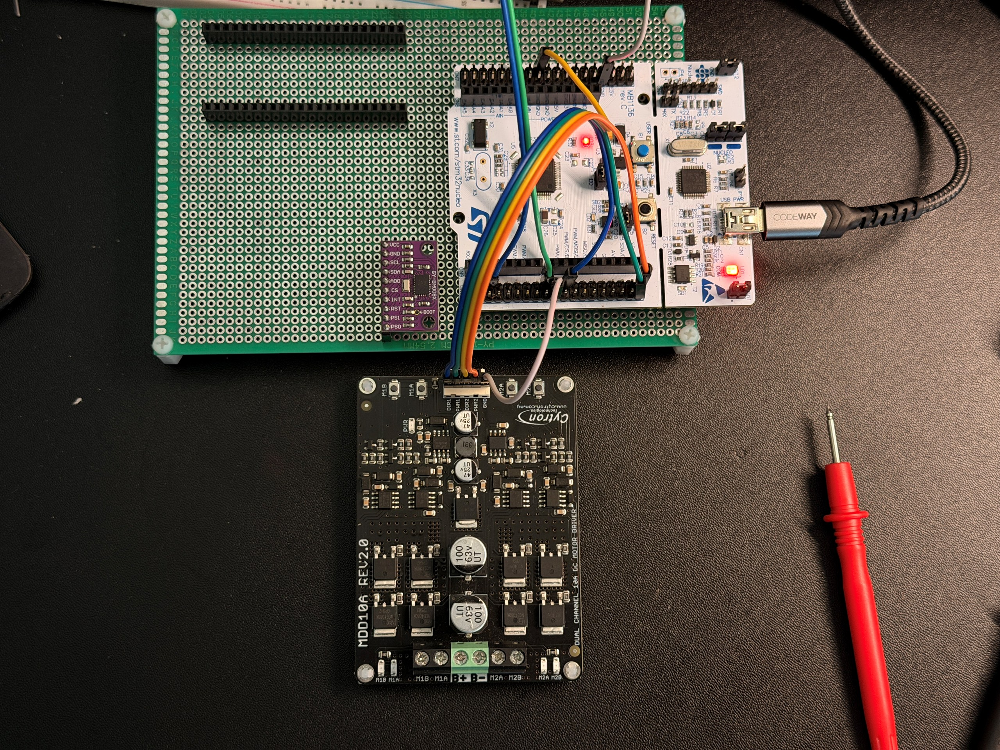
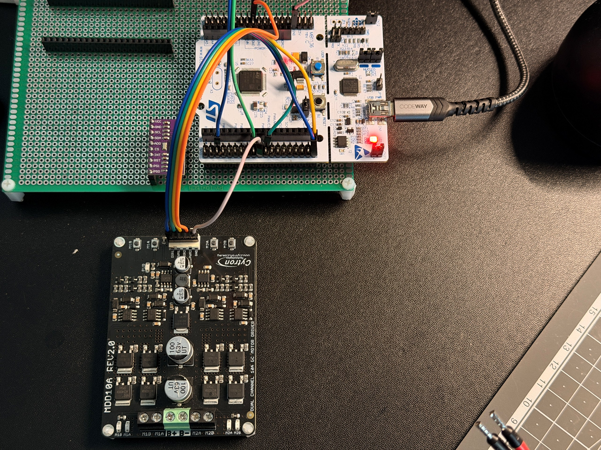

# MDD10A Logic Input Test

## 목적

이 문서는 STM32 motor-output 핀과 MDD10A logic input을 실제 motor 없이 단계적으로 검증한 기록이다.

목표는 다음 세 가지다.

- STM32가 `PWM1`, `DIR1`, `PWM2`, `DIR2`를 결정적으로 제어하는지 확인한다.
- Boot, idle, test-disabled 상태에서 PWM 출력이 0인지 확인한다.
- MDD10A에 전원을 공급하되 motor를 분리한 상태에서 양 채널의 A/B 출력 선택이 입력과 일치하는지 확인한다.

최초 시험일: `2026-07-26`
Direction-sequence source correction 및 powered/no-motor 재시험: `2026-07-29`
Active timeout/DISARM functional shutdown 및 final hook-off 재시험: `2026-07-29`
Software fault-injection output-zero/latch 및 default-off 회귀시험: `2026-07-30`
Logic analyzer PWM/direction timing 시험: `2026-08-03`

## Test Scope

이번 시험에 포함한 것:

- STM32 핀 단독 DMM 확인
- MDD10A power disconnected 상태의 signal-only 확인
- MDD10A POWER connected, motor disconnected 상태의 powered/no-motor LED 확인
- 임시 10% duty test sequence
- PWM/DIR 배선 오류 재현, 원인 분리와 교정 후 재시험
- 임시 시험 매크로를 끈 뒤 safe-state 재확인
- Direction-change source에 pre-zero와 post-DIR settle을 적용한 뒤 동일 6-step LED sequence 재시험
- 임시 10%-limited UART-to-output hook으로 active timeout과 `DISARM` LED shutdown 확인
- UART-to-output hook을 `0U`로 복구한 뒤 default scripted sequence all-off 확인
- 임시 dual-channel 10% button hook으로 software fault를 주입하고 output-zero/latch 확인
- Fault latch에서 `PB6`, `PB7`, `PC8`, `PC9` DMM 0 V 확인
- 두 임시 button-test macro를 `0U`로 복구한 뒤 B1 무출력 확인

이번 시험에 포함하지 않은 것:

- 실제 motor 연결과 회전
- Oscilloscope/DMM를 이용한 active timeout/DISARM 시점의 실제 PWM 핀 zero 계측
- Physical E-stop shutdown 시험
- 차량 기준 forward/reverse와 left/right motor mapping 확정

금지 조건:

- Fuse와 DC-rated main switch를 우회해 battery를 MDD10A에 직접 연결
- Motor output terminal에 실제 motor를 연결한 채 이 절차를 수행
- 10%를 초과하는 임시 raw test duty 사용
- 원인을 모르는 출력 LED나 전압이 관측된 상태에서 다음 단계 진행

## Signal Contract

2026-07-26 교정 후 확정한 bench mapping:

| STM32 | Function | MDD10A |
| --- | --- | --- |
| `PB6 / TIM4_CH1` | Firmware left PWM candidate | `PWM1` |
| `PC8` | Firmware left DIR candidate | `DIR1` |
| `PB7 / TIM4_CH2` | Firmware right PWM candidate | `PWM2` |
| `PC9` | Firmware right DIR candidate | `DIR2` |
| `GND` | Common reference | `GND` |

```text
PB6 / TIM4_CH1 -> PWM1
PC8            -> DIR1
PB7 / TIM4_CH2 -> PWM2
PC9            -> DIR2
STM32 GND      -> MDD10A GND
```

`left`와 `right`는 현재 firmware channel 이름이다. 실제 차량 좌우 motor mapping은 motor 장착 후 별도로 확정한다.

MDD10A에는 BTS7960식 별도 logic VCC pin이 없다. Signal-only 단계에서는 MDD10A POWER를 분리하고, powered/no-motor 단계에서만 검증된 fuse/switch 경로로 POWER를 공급했다.

## Firmware Test Baseline

| Item | Configured value | Physical verification |
| --- | --- | --- |
| Timer/channel | TIM4 CH1 / CH2 | Routing response confirmed |
| Timer period | `4420` | Source/CubeMX setting confirmed |
| Intended PWM frequency | nominal 19 kHz | 2026-08-18 final perfboard: CH1 19.049 kHz, CH2 19.058 kHz PASS |
| Temporary duty limit | `100 / 1000 = 10%` | CH1 10.0138%, CH2 10.0030% PASS |
| Pre-DIR PWM-zero settle | `1 ms` minimum | CH1 2.017 ms, CH2 2.006 ms PASS |
| Post-DIR settle | `1 ms` minimum | CH1 2.020 ms, CH2 2.029 ms PASS |
| Direction-change trigger | Any requested DIR-level change | Source confirmed; covers stopped-to-opposite-direction start |
| Final test macro | `MOTOR_OUTPUT_PIN_TEST_ENABLED 0U` | Rebuilt/flashed after retest; final build `0 errors / 0 warnings` |
| Final fault-injection macro | `MOTOR_FAULT_INJECTION_TEST_ENABLED 0U` | Source and B1 no-output regression confirmed |

관련 구현:

- [`../03_Firmware/stm32_uart_mvp/Core/Src/motor_output.c`](../03_Firmware/stm32_uart_mvp/Core/Src/motor_output.c)
- [`../03_Firmware/stm32_uart_mvp/Core/Src/main.c`](../03_Firmware/stm32_uart_mvp/Core/Src/main.c)
- [`../03_Firmware/stm32_uart_mvp/stm32_uart_mvp.ioc`](../03_Firmware/stm32_uart_mvp/stm32_uart_mvp.ioc)

## Required Preconditions

| Precondition | Required | Result |
| --- | --- | --- |
| STM32 firmware can force both PWM compares to zero | Yes | PASS |
| STM32 firmware can set both DIR GPIOs | Yes | PASS |
| MDD10A signal header labels identified | Yes | PASS after wiring correction |
| STM32 GND and MDD10A GND common | Yes | PASS |
| Signal-only phase keeps MDD10A POWER disconnected | Yes | PASS |
| Powered phase uses fused/switched battery path | Yes | PASS |
| Motor remains disconnected | Yes | PASS |
| Temporary raw duty is capped at 10% | Yes | PASS |

## Test 1: Boot, Idle and Test-Disabled State

Procedure:

1. Keep motor and MDD10A main power disconnected.
2. Boot/reset STM32 and measure `PB6`, `PB7`, `PC8`, `PC9` with a DMM.
3. After all staged tests, set `MOTOR_OUTPUT_PIN_TEST_ENABLED` to `0U`, rebuild/flash, and repeat the safe-state observation with the powered driver and no motor.

| Signal/state | Expected | Observed | Result |
| --- | --- | --- | --- |
| `PB6 / PWM1` boot/idle | 0 V average | 0 V | PASS |
| `PB7 / PWM2` boot/idle | 0 V average | 0 V | PASS |
| `PC8 / DIR1` boot/idle | 0 V | 0 V | PASS |
| `PC9 / DIR2` boot/idle | 0 V | 0 V | PASS |
| Test macro `0U`, MDD powered/no motor | All output LEDs off | All output LEDs off | PASS |

DIR이 단독으로 바뀌더라도 PWM이 0이면 motor output을 만들지 않아야 한다. 이번 시험에서는 boot/idle과 최종 test-disabled 상태에서 네 신호가 safe state로 돌아오는 것을 확인했다.

## Test 2: Low-Duty PWM Routing

임시 button sequence는 각 PWM 채널을 10% 설정으로 한 번씩 활성화하고 다시 0으로 복귀하도록 구성했다.

| Channel | Configured duty | Observed | Result |
| --- | --- | --- | --- |
| `PB6 / PWM1` | 10% | DMM 평균값과 MDD channel 1 LED 반응이 단계 변화와 일치 | PASS for routing |
| `PB7 / PWM2` | 10% | DMM 평균값과 MDD channel 2 LED 반응이 단계 변화와 일치 | PASS for routing |
| Historical frequency/duty | 당시 20 kHz nominal / 9.5~10.5% | CH1/CH2 모두 20.1005 kHz, high 5.00 us, 약 10.05% | PASS — superseded by final 19 kHz setting |

정확한 파형 판정은 2026-08-03 4 MHz logic-analyzer 캡처에 귀속한다. High-time 화면의 약 200 kHz 표시는 `1 / 5 us`일 뿐 PWM 반복 주파수가 아니며, 주파수는 rising-to-rising 49.75 us로 판정했다.

## Test 3: PWM/DIR Wiring Diagnosis and Powered-No-Motor Result

### Initial wiring fault

첫 powered/no-motor 시험에서는 MDD10A header의 양 채널 모두에서 PWM과 DIR를 서로 바꿔 연결했다.

| Step | Initial observation |
| --- | --- |
| 1 | LED 동작 없음 |
| 2 | M1A 밝게, M1B 약하게 점등 |
| 3 | LED 동작 없음 |
| 4 | LED 동작 없음 |
| 5 | M2A 밝게, M2B 약하게 점등 |

증상은 실제 PWM 입력을 DIR GPIO가 0/1로 고정하고, 실제 DIR 입력으로 10% PWM이 들어간 경우와 일치했다. 시험을 중단하고 양 채널의 PWM/DIR를 MDD10A 실크 인쇄에 맞게 교정했다.



### Corrected result

교정 후 동일한 6-step sequence를 다시 실행했다.

| Step | STM32 test state | Powered/no-motor observation | Result |
| --- | --- | --- | --- |
| 1 | CH1 10%, DIR low | M1A LED active | PASS |
| 2 | CH1 10%, DIR high | M1B LED active | PASS |
| 3 | Both channels stopped | All related LEDs off | PASS |
| 4 | CH2 10%, DIR low | M2A LED active | PASS |
| 5 | CH2 10%, DIR high | M2B LED active | PASS |
| 6 | Both channels stopped | All output LEDs off | PASS |



이 사진은 교정된 logic wiring과 시험 종료 후 motor output 및 battery terminal이 분리된 상태를 보여준다.

차량 기준 forward/reverse는 motor를 연결하지 않았으므로 아직 확정하지 않는다. 현재 확인된 것은 DIR level에 따라 각 MDD channel의 A/B 선택이 결정적으로 바뀐다는 점이다.

## Test 4: MDD10A Power Input and Powered-No-Motor Safety

| Measurement/check | Observed | Result |
| --- | --- | --- |
| Battery pack | 12.36 V | Recorded |
| MDD10A POWER+ to POWER- | 12.35 V | PASS |
| Motor connection | Disconnected | PASS |
| Heat, smell, smoke, abnormal noise | None | PASS |
| Final output state after disabling test macro | All LEDs off | PASS |

Switch OFF 직후 `-0.24 V`가 관측됐고 `-0.14 V`를 거쳐 0 V 방향으로 천천히 감쇠했다. ON 극성과 전압은 정상이었다. 저장 커패시터 또는 부유 기준점의 영향으로 추정하지만 원인을 별도 계측으로 확정하지 않았으며, 이 관측만으로 역전원 여부를 판정하지 않는다.

전원 경로 세부 기록은 [`01_Power_Bringup_Checklist.md`](01_Power_Bringup_Checklist.md)를 참조한다.

## Test 5: Direction-Change Safety Sequence

2026-07-29 수정 후 `motor_output_set_raw()`는 cached DIR와 요청 DIR가 다르면 현재 duty와 관계없이 다음 순서로 동작한다.

```text
PWM1/PWM2 compare = 0
-> HAL_Delay(1 ms) for PWM-zero settle
-> DIR GPIO update
-> HAL_Delay(1 ms) for post-DIR settle
-> requested PWM compare apply
```

Motor output terminals를 분리하고 MDD10A B+/B-와 logic/common GND만 연결한 상태에서 button test macro를 잠시 `1U`로 켰다. Step 1에서 Step 2, Step 4에서 Step 5로 전환했을 때 최종 A/B LED 선택은 정상적으로 바뀌었다. 2026-08-03에는 MDD10A와 motor power를 분리한 STM32 pin-only 상태에서 동일 6-step을 4 MHz로 캡처해 실제 zero interval을 계측했다.

| Requirement | Observed | Result |
| --- | --- | --- |
| Functional direction selection after source correction | `M1A -> M1B -> OFF -> M2A -> M2B -> OFF` | PASS |
| PWM compare zero before DIR transition | 양 채널 캡처에서 확인 | PASS |
| 1 ms pre-DIR PWM-zero interval | CH1 1.994 ms / CH2 1.54725 ms | PASS |
| 1 ms post-DIR settle before PWM resume | CH1 2.03875 ms / CH2 raw edge 약 2.040 ms | PASS |
| Final test-disabled source/build state | Macro `0U`, STM32 Debug 0 errors / 0 warnings | PARTIAL — safe image board flash/post-flash capture pending |

Direction-change sequence의 source correction, functional LED retest와 actual pin timing 계측까지 완료했다. 따라서 direction sequencing requirement 자체는 `PASS`다. 다만 active DISARM/timeout/fault shutdown latency, physical E-stop과 실제 motor stop을 포함하는 motor-output 전체 gate는 계속 `PARTIAL`이다.

## Test 6: Timeout and DISARM Output Zero

Motor terminal을 분리하고 MDD10A power와 common GND만 연결한 powered/no-motor bench에서 임시 10%-limited UART-to-output hook을 사용했다. Valid `CMD`에서 M1A/M2A LED가 약하게 켜지는 상태를 만든 뒤 command timeout과 별도 active `DISARM` run에서 output LED가 모두 꺼지는 것을 확인했다.

| Event | Expected | Observed | Result |
| --- | --- | --- | --- |
| Command timeout during active PWM | M1/M2 output all-off | `timeout_ms=300`; active M1A/M2A LED가 timeout 뒤 all-off | PASS — powered/no-motor LED scope |
| DISARM during active PWM | M1/M2 output all-off | 별도 `timeout_ms=500`, 400 ms step run에서 `DISARM` 시 all-off | PASS — powered/no-motor LED scope |
| Final hook-disabled default | 전체 scripted sequence all-off | `UART_MVP_OUTPUT_TEST_ENABLED 0U`, M1A/M1B/M2A/M2B 모두 off | PASS |
| Firmware fault/error path | `PWM1=0`, `PWM2=0`, reset 전 재활성화 차단 | 2026-07-30 motor-disconnected fault-injection test에서 별도 확인 | PASS — functional DMM/LED scope |
| E-stop | `PWM1=0`, `PWM2=0` | Not implemented | NOT TESTED |

Timeout run의 raw log는 valid CMD ACK 뒤 세 번의 `vx=50` telemetry와 첫 `vx=0` telemetry를 보여준다. 100 ms telemetry 양자화 때문에 첫 zero telemetry 시각을 실제 shutdown latency 계측값으로 사용하지 않는다. Active `DISARM` PASS는 timeout보다 먼저 `DISARM`이 도착하도록 구성한 별도 run의 LED 관찰에 귀속한다.

이 결과는 timeout/DISARM에 대한 MDD10A LED 수준의 기능적 shutdown 최소 증거다. PB6/PB7의 전압·zero-duty 파형, 정확한 shutdown latency, 실제 motor 정지, physical E-stop 및 production velocity-to-PWM mapping을 검증한 결과는 아니다. Software fault path의 정적 output-zero/latch는 아래 Test 7에서 별도로 확인했다.

Evidence:

- [`../assets/logs/esp32_uart_bridge/2026-07-29_active_motor_output_safety_verification.md`](../assets/logs/esp32_uart_bridge/2026-07-29_active_motor_output_safety_verification.md)
- [`../assets/logs/esp32_uart_bridge/2026-07-29_active_timeout_output_zero_pass.txt`](../assets/logs/esp32_uart_bridge/2026-07-29_active_timeout_output_zero_pass.txt)
- [`../assets/logs/esp32_uart_bridge/2026-07-29_default_output_hook_disabled_all_off_pass.txt`](../assets/logs/esp32_uart_bridge/2026-07-29_default_output_hook_disabled_all_off_pass.txt)

## Test 7: Software Fault Output-Zero and Latch

2026-07-30에는 motor output terminal을 계속 분리한 상태에서 button test를 임시로 사용해 양 channel을 10%로 활성화한 뒤 두 번째 B1 입력에서 `Error_Handler()`를 호출했다.

```text
B1 #1 -> PWM1/PWM2 10%, DIR1/DIR2 low
B1 #2 -> Error_Handler()
          -> motor_output_stop_all()
          -> PWM1/PWM2 compare 0
          -> DIR1/DIR2 low
          -> IRQ disabled, infinite latch
```

| Check | Expected | Observed | Result |
| --- | --- | --- | --- |
| Initial active indication | M1A/M2A on at limited output | M1A and M2A on | PASS |
| Fault indication | All MDD motor LEDs off | All off | PASS |
| PWM pins while latched | `PB6=0 V`, `PB7=0 V` | Both 0 V to STM32 GND | PASS — DMM scope |
| DIR pins while latched | `PC8=0 V`, `PC9=0 V` | Both 0 V to STM32 GND | PASS — DMM scope |
| Further B1 input before reset | No reactivation | No response | PASS |
| Final restored firmware | Button test and fault injection disabled | Both macros `0U`; B1 produced no output | PASS |

이 시험은 software fault에서 공통 stop 함수와 latch가 기능적으로 동작함을 확인한다. DMM은 fault 전환 순간의 정확한 shutdown latency나 PWM edge를 보여주지 않으며, `Error_Handler()` 외의 watchdog/전원 fault와 physical E-stop을 대표하지 않는다.

Evidence:

- [`../assets/logs/motor_output/2026-07-30_fault_injection_output_zero_latch_verification.md`](../assets/logs/motor_output/2026-07-30_fault_injection_output_zero_latch_verification.md)

## Test 8: Permanent Perfboard Active 6-Step and Safe Restore

2026-08-18에는 motor를 계속 분리하고 permanent R9~R12/J5 5-Net을 통과한 MDD10A
input-side에서 6-step을 다시 계측했다. WHEELTEC 회신의 PWM 허용범위 `5~20 kHz`를
반영해 기존 20 kHz nominal을 19 kHz로 변경했다. TIM4 period는 `4420`이다.

| Check | Observed | Result |
| --- | --- | --- |
| CH1 PWM | 19.049003 kHz, 10.0138% | PASS |
| CH2 PWM | 19.057518 kHz, 10.0030% | PASS |
| CH1 pre/post DIR zero | 2.017/2.020 ms | PASS |
| CH2 pre/post DIR zero | 2.006/2.029 ms | PASS |
| Inactive channel | all LOW | PASS |
| Initial/final state | all LOW | PASS |
| MDD10A LED sequence | M1A -> M1B -> OFF -> M2A -> M2B -> OFF | PASS |
| Safe source restore | 세 controlled hook 모두 `0U`, contract 15/15 | PASS |
| Final B1/runtime capture | B1 no output, D0~D3 5 s HIGH/transition 0 | PASS |

이 시험으로 permanent perfboard logic path는
`PASS — motor-disconnected MDD10A-input scope`로 닫는다. 상세 raw capture hash와 증거
경계는
[`../docs/verification/17_Final_Perfboard_Active_DIR_PWM_and_Safe_Restore_Test_Report_2026-08-18_ko.md`](../docs/verification/17_Final_Perfboard_Active_DIR_PWM_and_Safe_Restore_Test_Report_2026-08-18_ko.md)를 따른다.

## Stop Conditions

다음 중 하나라도 발생하면 즉시 시험을 중단한다.

- Boot/reset에서 PWM output이 활성화됨
- PWM이 stop command 후 0으로 돌아오지 않음
- 배선, MDD10A 또는 connector가 뜨거워짐
- Smoke, smell, spark 또는 abnormal noise 발생
- MDD10A header label과 신호 역할이 불명확함
- Motor가 의도하지 않게 연결되거나 움직임

## Result Summary

| Item | Result | Notes |
| --- | --- | --- |
| STM32 pin-only boot/idle zero | PASS | PB6, PB7, PC8, PC9 모두 0 V |
| PWM1/PWM2 routing | PASS | DMM/LED minimum verification |
| Historical 20 kHz / 10% waveform | PASS — superseded | 20.1005 kHz baseline; vendor upper-limit margin 때문에 final nominal 19 kHz로 변경 |
| Final perfboard 19 kHz / 10% waveform | PASS | CH1/CH2 19.049/19.058 kHz, 약 10%; MDD10A-input scope |
| DIR1/DIR2 behavior | PASS | 교정 후 M1A/M1B, M2A/M2B 선택 정상 |
| PWM/DIR wiring fault | RESOLVED | 양 채널 swap 교정 후 전체 sequence 재시험 |
| Powered/no-motor driver check | PASS | 12.35 V, motor disconnected, 이상 증상 없음 |
| Direction-change timing | PASS | CH1 pre/post 1.994/2.03875 ms, CH2 pre/post 1.54725/~2.040 ms; 모두 최소 1 ms 이상 |
| Active timeout/DISARM output zero | PASS — functional LED scope | Motor disconnected, temporary 10% hook; actual pin waveform/timing 미계측 |
| Software fault output zero/latch | PASS — functional DMM/LED scope | Motor disconnected; all four STM32 output pins 0 V while latched |
| Physical E-stop output zero | NOT TESTED | E-stop 미구현/미시험 |
| Final test-disabled safe state | PASS | 모든 controlled hook `0U`, B1 no output, final D0~D3 5 s all-LOW |

Overall result: `PARTIAL`

이번 단계로 정적 신호 routing, MDD10A channel selection, final 19 kHz PWM frequency/duty,
direction pre/post zero timing, powered/no-motor timeout/DISARM functional shutdown, software
fault output-zero/latch와 permanent perfboard active/safe-restore를 확인했다. Physical E-stop,
MDD10A power-stage와 motor-connected shutdown이 남아 있으므로 전체 drivetrain verification을
`PASS`로 종료하지 않는다.

## Next Step

1. 완료된 encoder production UART `TEL` -> ESP32 CPS evidence와 logical mapping을 회귀 기준으로 보존한다.
2. 현재 logic-analyzer 파형 PASS를 기준선으로 보존하고 active DISARM/timeout/software-fault event와 PWM zero edge를 동시에 캡처해 shutdown latency를 계측한다.
3. Software fault 기능시험 결과를 회귀 기준으로 보존하고 physical E-stop 요구사항과 구현 방식을 확정한다.
4. Production velocity command를 제한된 motor-output interface에 연결하기 전에 현재 default-off hook 상태를 유지한다.
5. 위 정밀 motor safety gate를 통과한 뒤에만 [`05_First_Motor_No_Load_Test.md`](05_First_Motor_No_Load_Test.md)로 진행하며 active PWM/motor-current encoder noise를 함께 관찰한다.
