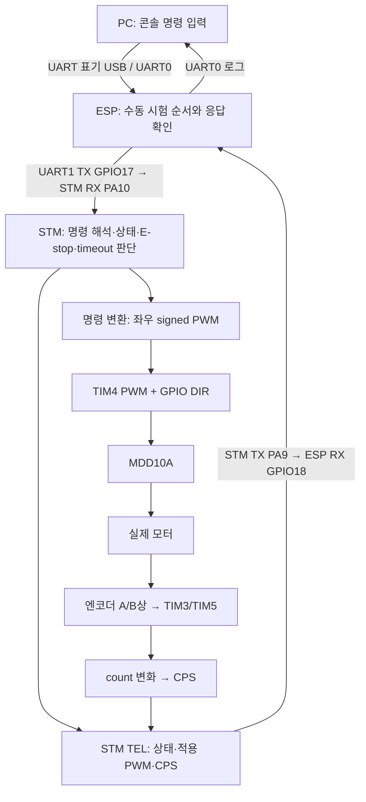

# 단일 모터 시험으로 이해하는 명령·출력·피드백

작성 기준: 2026-09-29의 저장 소스와 9/28~29 시험 기록.
노트북만 있는 날, 최근 작업을 설명할 수 있도록 정리한 학습 노트다.
새 구동 절차가 아니며, 현재 상태의 원본은 [현재 인수인계](../../docs/handoff/CURRENT_SESSION_CONTEXT.md)와
[단일 모터 시험 보고서](../../docs/verification/31_Single_Motor_Pulse_Cross_Test_and_Right_DIR_Correction_2026-09-29_ko.md)다.

## 읽는 순서

파일별 역할과 함수 호출 관계가 먼저 필요하면 [STM·ESP 코드 구조와 함수 지도](09_STM32_ESP32_Source_Structure_and_Function_Map_ko.md)를 선행한다.

한 번에 소스 전체를 이해하려고 하지 않아도 된다. 다음 세 묶음으로 읽는다.

| 순서 | 읽을 부분 | 읽고 나서 설명할 내용 |
| --- | --- | --- |
| 1 | 1~3절: 진행 상황과 신호 경로 | PC에서 입력한 명령이 어떤 보드를 거쳐 모터에 도달하는가 |
| 2 | 4~6절: 상태·시간 제한·출력 계산 | 왜 ARM만으로 회전하지 않고, 명령 갱신이 없으면 정지하는가 |
| 3 | 7~10절: 로그·디버깅·자기 점검 | 무엇을 확인했고 무엇은 아직 확인하지 못했는가 |

권장 분량은 설명을 먼저 읽는 데 약 20~30분, 소스와 문제까지 따라가면 약 45~60분이다.
개인별로 달라지는 학습 시간이며 작업 마감 시한은 아니다.

## 1. 지금 프로젝트는 어디까지 왔나

최근 작업의 목적은 **명령 처리, 실제 배선, 모터 출력, 엔코더 관측을 하나의 경로로 연결해 확인하는 것**이었다.
각 부분이 따로 동작하더라도 연결한 시스템에서 채널이나 방향이 뒤바뀔 수 있기 때문이다.

| 쌓아 온 부분 | 최근 작업에서의 의미 |
| --- | --- |
| UART 명령과 상태 관리 | 수신한 문자열을 바로 출력하지 않고 명령 형식·상태·E-stop 조건을 확인한다 |
| 만능기판 배선과 디버그 커넥터 | 보드·드라이버·엔코더를 실제 배선으로 연결하고 필요한 지점에서 신호를 확인한다 |
| 엔코더 입력 조정부와 손회전 검사 | 입력 경로와 전진 기준의 CPS 부호를 구동 전에 확인한다 |
| 단일 모터의 짧은 전동 구동 | 출력 명령이 실제 회전으로 이어지고, 명령 제한 시간 후 출력이 해제되는지 함께 본다 |

현재 결과는 다음처럼 구분한다.

- **B/M2:** 오른쪽 DIR 정의를 보정한 뒤 실제 전진·역회전, 해당 CPS 부호, 정지 복귀를 확인했다. 두 시험 모두 A는 움직이지 않았다.
- **A/M1:** 양수·음수 10% 명령에서 회전과 CPS 변화를 확인했다. 양수 시험에서 실제 전진 방향을 보지 못했으므로 그 관찰은 남아 있다.
- **남은 범위:** 구동 중 물리 S0 차단, 전력단 잔여 기준, 부하·전류·노이즈·기구 통합·주행 검증. 전체 T005A는 PARTIAL이다.

두 모터는 섀시에서 분리한 상태였다. 따라서 이번 결과는 차량이 정해진 속도로 주행한다는 증거까지 포함하지 않는다.
현재 ESP는 **M2 역방향 10%/300ms 단발 시험 설정**이며, 다음 A 시험용 설정으로 아직 바꾸지 않았다.

## 2. A/B, M1/M2, left/right는 왜 구분하나

이 이름들은 서로 다른 대상을 가리킨다.

| 구분 | 왼쪽의 현재 연결 | 오른쪽의 현재 연결 |
| --- | --- | --- |
| 실제 모터의 이름 | A | B |
| 차량에서의 역할 | 왼쪽 궤도 구동 | 오른쪽 궤도 구동 |
| MDD10A 출력 채널 | M1 | M2 |
| STM PWM / DIR | PB6 / PC8 | PB7 / PC9 |
| 엔코더 커넥터 | JENC_1 | JENC_2 |
| STM 엔코더 입력 | TIM3: PB4(A상), PB5(B상) | TIM5: PA0(A상), PA1(B상) |
| 로그의 출력·피드백 필드 | left_pwm, left_cps | right_pwm, right_cps |

평소에는 같은 열끼리 대응한다. 그러나 **교차시험에서는 실제 모터를 다른 출력·엔코더 입력 경로로 옮겼다.**
B를 M1/JENC_1 경로에 연결했을 때 B의 회전이 `left_cps`에 나타난 이유가 이것이다.
필드 이름이 모터의 정체를 자동으로 알아낸 것은 아니다. 어느 입력 채널에서 읽었는지를 표현한다.

지금은 원래 연결로 복원했다. 손회전 검사에서 정한 전진 양수 기준에 따라 TIM3의 raw 부호는 반전하고 TIM5는 유지한다.
현재 환산 기준은 출력축 **1560 counts/rev**다. 자세한 근거는
[좌우 배치·손회전 검사](../../docs/verification/29_Vehicle_Side_Mapping_Correction_and_Hand_Rotation_Check_2026-09-26_ko.md)에 있다.

## 3. 명령이 모터에 도달하고 결과가 돌아오는 경로



ESP의 `coordinator` 역할은 **여러 단계가 정해진 조건과 순서로 이어지게 하는 것**이다.
예를 들어 ARM을 보낸 뒤 ARMED 상태가 확인되기 전에 CMD를 보내지 않는다.
STM은 명령을 받아 실제 출력을 허용할지 판단하고, 자체 제한 시간이 지나면 출력을 해제한다.

현재 ESP는 만능기판 밖에 있고 GPIO17·GPIO18·GND만 대응 헤더로 연장했다.
PC 콘솔용 UART0와 STM 통신용 UART1은 서로 다른 경로다. 현재 콘솔 포트는 COM5였지만 COM 번호는 PC 연결 환경에 따라 달라질 수 있다.

엔코더 피드백이 존재한다고 곧바로 속도 폐루프 제어가 되는 것은 아니다.
현재 이 경로에서는 CPS를 관측하고, `vx/w`를 PWM으로 변환한다. 목표 속도와 CPS의 오차를 계산해 PWM을 조절하는 속도 제어기는 이 변환에 들어 있지 않다.

## 4. 서로 다른 세 가지 상태를 나눠서 보기

| 상태를 가진 부분 | 무엇을 관리하나 | 대표 상태나 동작 |
| --- | --- | --- |
| 물리 전력 회로 | 드라이버에 모터 전원을 공급할 수 있는가 | S0 차단, 해제 후 S2로 K1 전력 경로 복원 |
| STM 펌웨어 | 출력 명령을 받아도 되는가 | DISARMED, ARMED, FAULT와 reason |
| ESP 시험 코드 | 지금 시험 순서의 어느 단계인가 | IDLE, WAIT_RESET, WAIT_ARM, WAIT_STOP, FINISHED |

**STM이 DISARMED라는 사실과 K1 전력 경로가 열려 있다는 사실은 같지 않다.**
드라이버 전원이 있어도 PWM을 0으로 유지할 수 있다. 반대로 펌웨어 상태만으로 S2 조작과 실제 전원 복원을 확인했다고 볼 수도 없다.

S0를 누르면 PC7 감지로 `FAULT / ESTOP_ACTIVE`가 되고, S0를 해제해도 펌웨어는 `FAULT / ESTOP_LATCHED`를 유지한다.
콘솔의 `RESET_ESTOP`은 UART의 `ESTOP_RESET`을 보내 소프트웨어 latch 해제를 요청한다.
성공하면 `DISARMED / ESTOP_RESET`이다. S2를 통한 물리 전력 복원은 별도 단계다.

ESP의 정상 단발 흐름은 다음과 같다.

```text
IDLE
 ├─ RESET_ESTOP → WAIT_RESET → 일치하는 reset TEL 확인 → IDLE
 └─ M2_PULSE    → WAIT_ARM   → 일치하는 ARMED TEL 확인
                             → CMD 한 번 전송 → WAIT_STOP
                             → CMD_TIMEOUT / PWM 0 확인
                             → FINISHED + DISARM 전송
```

시험 중 오류나 STOP도 `FINISHED`로 이어진다. 이 상태에서는 새 pulse와 RESET_ESTOP을 거부한다.
`BENCH: busy or finished; no command sent`는 이 **ESP의 시험 잠금**에서 나온다.
현재 구현에서는 새 시험을 위해 ESP 재부팅이 필요하다. STM의 E-stop latch와 별개이며 HELP는 잠긴 뒤에도 볼 수 있다.

## 5. ARM, ACK, TEL과 시간 제한은 각자 무엇을 확인하나

`ARM`은 출력 명령을 받아들일 준비를 요청한다. 실제 좌우 출력값은 이어지는 `CMD`가 지정한다.
현재 ESP 코드는 ARMED가 확인된 시점에도 PWM이 0/0인지 확인한 뒤 CMD를 보낸다.

| 관측 | 알 수 있는 것 | 이것만으로 알 수 없는 것 |
| --- | --- | --- |
| TX 로그 | ESP가 해당 명령을 전송하려고 처리했다 | STM 수신·수락, 실제 회전 |
| 같은 seq의 ACK | STM이 해당 명령을 수락했다고 응답했다 | 모터에 전력이 전달돼 원하는 방향으로 회전했는가 |
| 새 TEL의 last_seq·state·PWM | 해당 요청 이후 STM이 보고한 상태와 소프트웨어 적용 출력 | 드라이버 출력의 실제 전압·파형 |
| CPS와 육안 관찰 | 입력 카운트 변화와 실제 움직임·방향을 함께 대조할 수 있다 | 반복 신뢰성, 부하 주행 성능 |

`seq`는 요청을 구분하는 번호다. `s_bench_expected_seq`와 TEL의 `last_seq`를 비교해 다른 요청의 상태를 잘못 받아들이지 않게 한다.
TEL 개수가 늘었는지와 최근 수신 여부도 확인한다. 오래전에 받은 정상 상태가 지금도 유효하다고 가정하지 않기 위해서다.
현재 bench 상태 전이는 ACK 자체보다 **새롭고 seq가 일치하는 TEL의 상태·출력 조건**으로 확인한다.

| 시간 | 담당과 역할 |
| --- | --- |
| 200ms | ESP: reset/ARM 상태 확인을 기다리는 제한 |
| 250ms | ESP: 마지막 TEL을 여전히 최신으로 볼 수 있는 한계 |
| 300ms | STM: 이번 CMD가 갱신되지 않을 때 출력 해제로 전환하는 명령 제한 시간 |
| 600ms | ESP: CMD 전송 단계 이후 timeout 상태를 확인하기 위해 기다리는 최대 시간 |

이번 시험은 CMD를 한 번만 보내고 갱신하지 않는다. STM의 `command_timeout_enforce()`가 마지막 CMD 처리 시각을 기준으로
제한 시간 도달을 검사해 PWM을 0으로 만들고 `DISARMED / CMD_TIMEOUT`으로 바꾼다.
ESP는 그 TEL을 확인하고 추가 DISARM을 보낸다. **ESP가 정확히 300ms 뒤 STOP을 보내서 멈추는 구조는 아니다.**
이는 STM 루프에서 수행하는 소프트웨어 검사이므로 실제 차단 지연의 정밀 측정은 별도 증거가 필요하다.

## 6. 왜 CMD(-50, -250, 300)가 오른쪽만 -100인가

[drive_command_map()](../../03_Firmware/stm32_uart_mvp/Core/Src/drive_command_mapper.c)의 현재 계산을 따라가면 된다.
마지막 인자 300은 timeout이며 아래 출력 혼합 계산에 사용되지 않는다.

```text
linear    = vx × 1000 / 100
yaw       = w  × 1000 / 500
raw_left  = linear - yaw
raw_right = linear + yaw
peak      = max(1000, |raw_left|, |raw_right|)
left_pwm  = raw_left  × duty_cap / peak
right_pwm = raw_right × duty_cap / peak
```

현재 duty_cap은 100 permille다. 1000분율이므로 **100=10%, 50=5%**다. 음수는 반대 방향을 뜻한다.
이번 입력에서는 linear=-500, yaw=-500이므로 raw_left=0, raw_right=-1000이고 결과는 0/-100이다.

| vx, w | 계산 결과 left/right | 현재 시험에서 사용한 의미 |
| --- | --- | --- |
| 25, -125 | 50 / 0 | M1 양수 5% |
| 50, -250 | 100 / 0 | M1 양수 10% |
| -50, 250 | -100 / 0 | M1 음수 10% |
| 50, 250 | 0 / 100 | M2 양수 10% |
| -50, -250 | 0 / -100 | M2 음수 10% |

필드 이름에 mm/s와 mrad/s가 있어도 이번 실험에서 실제 차량 속도·회전 속도를 그 값으로 제어했다고 말할 수는 없다.
현재는 이 입력을 제한된 좌우 PWM으로 변환하는 open-loop 단계다.

### 오른쪽 DIR만 바꾼 이유

보정 전 B/M2 양수 명령에서는 `right_pwm=100`인데 실제로 역회전했고 `right_cps`도 음수였다.
앞선 손회전 검사에서 잡은 전진 기준과 엔코더 관측이 일치했으므로, 수정 대상은 **양수 출력 명령을 물리 방향으로 바꾸는 DIR 정의**였다.

현재 [motor_output.c](../../03_Firmware/stm32_uart_mvp/Core/Src/motor_output.c)는 오른쪽 양수=HIGH, 음수=LOW다.
왼쪽은 기존 양수=LOW, 음수=HIGH를 유지한다. 이 값은 현재 배선과 장착 기준에 맞춘 대응이며 모든 모터의 보편적인 전진 정의가 아니다.
엔코더 부호를 뒤집어 화면의 숫자만 양수로 만들면 실제 역회전 문제는 남는다.

## 7. 마지막 역방향 로그를 직접 읽어 보기

[원본 12](../../assets/logs/motor_output/2026-09-29_single_motor_bench/12_m2_b_reverse_after_dir_fix.txt)에서 필요한 필드만 옮긴 표다.
CMD의 seq는 994996305이고 왼쪽 PWM/CPS는 아래 구간에서 모두 0이다.

| command_age_ms | state / reason | right_pwm | right_cps |
| --- | --- | ---: | ---: |
| 72 | ARMED / NONE | -100 | 0 |
| 172 | ARMED / NONE | -100 | -80 |
| 272 | ARMED / NONE | -100 | -330 |
| 372 | DISARMED / CMD_TIMEOUT | 0 | -410 |
| 472 | DISARMED / DISARM | 0 | -240 |
| 572 | DISARMED / DISARM | 0 | 30 |
| 672 | DISARMED / DISARM | 0 | 0 |

이 표에서 다음을 읽을 수 있다.

1. CMD 뒤 오른쪽 소프트웨어 적용 출력이 음수가 됐고, 이어서 음수 CPS가 관측됐다.
2. timeout 상태의 첫 TEL에서 PWM은 0이었다. 뒤이어 ESP가 보낸 DISARM 때문에 reason이 DISARM으로 바뀌었다.
3. PWM 0과 CPS 0은 같은 순간에 나타나지 않았다. 사용자는 실제 역회전과 A 무동작을 보고했다.
4. 마지막 CPS 0 이후 첨부 끝까지 0 유지 구간은 4.1초다. 전체 첨부는 4.8초이며 이를 5초 이상 관찰했다고 늘리지 않는다.

`CPS`는 counts per second다. 현재 코드는 약 100ms 간격으로 카운트 차이를 읽어 `delta_count × 1000 / elapsed_ms`로 계산한다.
따라서 TEL 한 줄의 CPS는 그 순간만의 속도가 아니라 최근 측정 구간의 평균이다.
출력이 꺼진 뒤에도 남은 회전과 측정 구간의 영향이 있을 수 있다. 위 -410만으로 차단 뒤 모터가 더 가속됐다고 단정할 수 없다.
짧은 +30 샘플도 실제 반동인지 입력 노이즈인지 현재 로그만으로 원인을 정하지 않는다.

첫 timeout TEL의 372ms는 정확한 PWM 차단 시각이 아니다. TEL은 약 100ms 간격이며, 출력 차단 사건과 로그 관측 시점은 다르다.
또한 `right_pwm`은 소프트웨어가 보관한 적용값이다. 핀 파형이나 MDD 전압을 직접 측정한 값으로 읽지 않는다.

## 8. 교차시험과 err에서 섣불리 결론 내리지 않기

처음 B/M2는 소리만 나고 회전하지 않았다. 이후 A를 M2 경로로, B를 M1 경로로 옮겼을 때 각각 회전했고,
원래 연결로 복원한 B/M2도 회전했다.
이 과정은 모터와 출력 경로를 나누어 살펴보는 데 도움이 됐지만, **최초 미회전의 원인은 확정하지 못했다.**
접촉 불량·기동 마찰 등은 가설이며 확인된 원인으로 기록하지 않는다.

반면 DIR 불일치는 원래 B/M2 연결에서 실제 역회전과 음수 CPS를 함께 관찰했고,
오른쪽 DIR 정의를 수정한 뒤 양수·음수 명령 각각의 물리 방향을 확인했다. 이 부분은 수정과 재검증의 근거가 있다.

오류 숫자도 이름과 발생 위치를 확인해야 한다.

| 값 | 실제 의미 |
| --- | --- |
| STM TEL의 err | STM의 누적 오류 카운터. 명령 거부, RX 버퍼 문제, HAL UART 오류, 긴 입력 행 처리 등 여러 경로에서 증가 |
| ESP의 s_err_count | ESP가 수신한 ERR 행의 수 |
| ESP의 s_parse_error_count | ESP 수신 데이터 해석·형식 처리에서 기록하는 오류 수 |

현재 ESP bench는 시험 시작 시 두 ESP 카운터를 저장하고 진행 중 증가하면 중단한다.
이 검사는 STM TEL의 누적 err 필드를 직접 비교하는 것과 다르다. 서로 다른 카운터이므로 값도 같을 필요가 없다.

마지막 정방향 로그의 STM err는 0, 역방향 로그는 1439였고 각 첨부 안에서는 일정했다.
두 첨부 사이 어느 시점에 어떤 경로로 증가했는지는 남아 있지 않다.
따라서 해당 구동 구간에서 err 증가가 관측되지 않았다고 말할 수 있지만, 전체 세션이 통신 무오류였다고 말할 수는 없다.
하드웨어 재개 시 부팅부터 READY까지 로그를 남기는 이유가 이 공백을 줄이기 위해서다.

추가로 `command_age_ms=4294967295`는 CMD를 아직 수락하지 않았을 때 사용하는 유효하지 않은 값 표시다.
이후의 command_age는 마지막 수락 CMD부터 지난 시간이므로, 단독 ARM 직후에도 이전 CMD 기준의 큰 값이 보일 수 있다.
이 숫자를 모터가 계속 회전한 시간으로 해석하지 않는다.

## 9. 노트북에서 실제 소스를 읽는 순서

VS Code에서 아래 함수 이름을 검색한다. 전체 파일을 위에서부터 외우기보다, 한 명령의 이동을 따라 읽는다.

| 순서 | 파일과 함수 | 확인할 질문 |
| --- | --- | --- |
| 1 | [ESP main](../../03_Firmware/esp32_uart_bridge/main/uart_bridge_main.c): bridge_bench_command | M2_PULSE를 거절하는 조건은 무엇인가? |
| 2 | 같은 파일: bridge_bench_wait, bridge_bench_advance | ARM 이후 어떤 TEL을 보고 CMD를 보내는가? |
| 3 | [STM protocol](../../03_Firmware/stm32_uart_mvp/Core/Src/uart_mvp_protocol.c): handle_cmd | 출력 전 상태·범위·E-stop을 어디서 검사하는가? |
| 4 | [command mapper](../../03_Firmware/stm32_uart_mvp/Core/Src/drive_command_mapper.c): drive_command_map | 이번 입력으로 왜 오른쪽만 음수가 되는가? |
| 5 | [motor output](../../03_Firmware/stm32_uart_mvp/Core/Src/motor_output.c): motor_output_set_signed, motor_output_set_raw | 부호는 DIR로, 크기는 타이머 compare 값으로 어떻게 바뀌는가? |
| 6 | [encoder speed](../../03_Firmware/stm32_uart_mvp/Core/Src/encoder_speed.c): encoder_speed_update 및 [STM main](../../03_Firmware/stm32_uart_mvp/Core/Src/main.c): encoder_speed_log_process | 카운트 차이를 CPS로 바꾸고 좌우 부호를 적용하는 곳은 어디인가? |
| 7 | STM protocol: command_timeout_enforce, send_tel | 갱신 없는 CMD를 누가 정지시키고, 그 사실을 어떤 필드로 보내는가? |
| 8 | ESP main: bridge_bench_finish | 시험 후 잠금과 추가 DISARM은 어떻게 처리되는가? |

오늘 할 만한 노트북 작업은 위 흐름을 자기 말로 5~10문장 적고, 원본 로그에서 그 문장에 대응하는 행을 찾는 것이다.
저장된 로그의 재분석과 계산은 가능하지만, 새로운 방향·배선·물리 정지 결과는 장비 없이 확정할 수 없다.
지금의 이해를 위해 CAN·FreeRTOS·IMU·ROS 2 구현을 앞당길 필요는 없다. 각 기능은 기존 단계별 계획에서 다룬다.

## 10. 읽은 뒤 스스로 확인하기

답을 보기 전에 말로 설명해 본다. 이 문서를 작성한 것만으로 사용자의 이해나 실습을 완료 처리하지 않는다.

### 1) right_pwm=100인데 모터가 움직이지 않았다. STM 코드가 실패한 것인가?

<details>
<summary>해설</summary>

그 값만으로 원인을 정할 수 없다. 소프트웨어 적용 출력은 확인되지만 전력 공급, 실제 신호 전달, 배선, 기동 조건은 별도다.
이번 A/M1 5% 시험도 적용 PWM은 있었으나 소리·떨림만 관찰됐다. ACK·TEL·CPS·육안·전기 계측을 역할에 맞게 대조한다.

</details>

### 2) B를 M1과 JENC_1에 교차 연결하면 어느 CPS를 읽어야 하나?

<details>
<summary>해설</summary>

left_cps다. 실제 모터 이름 B와 펌웨어 입력 채널 이름 right는 교차시험 중 일치하지 않을 수 있다.
시험 기록에는 동력선과 엔코더 경로를 함께 남겨야 한다.

</details>

### 3) 양수 명령에 실제 역회전·음수 CPS가 나오면 CPS에 -1을 곱하면 되는가?

<details>
<summary>해설</summary>

이미 손회전으로 전진 양수 기준을 확인했다면, 관측 부호부터 바꾸면 실제 방향 불일치를 가리게 된다.
현재 배선과 실제 방향을 대조해 명령 부호→DIR 대응을 확인한다. 이번에는 오른쪽 DIR 정의를 수정하고 양방향으로 검증했다.

</details>

### 4) timeout TEL이 372ms에 나왔다. 모터가 372ms 뒤 정확히 멈췄는가?

<details>
<summary>해설</summary>

그 시점에 timeout과 PWM 0을 관측한 것이다. 실제 출력 차단 시각과 물리 정지 시각은 다르며,
해당 행의 CPS도 -410이다. 100ms 단위 TEL만으로 정밀 차단 지연을 주장할 수 없다.

</details>

### 5) STM이 DISARMED인데 RESET_ESTOP에 busy or finished가 나온 이유는?

<details>
<summary>해설</summary>

STM 상태와 ESP의 시험 상태가 별개이기 때문이다. ESP가 FINISHED면 RESET_ESTOP도 전송 전에 거부한다.
현재 구현에서 새 시험은 ESP 재부팅이 필요하다. 이 동작을 실제 전력 회로가 복원됐다는 뜻으로 읽지 않는다.

</details>

### 6) err=1439로 일정한 로그는 무엇을 증명하는가?

<details>
<summary>해설</summary>

그 첨부 구간에서 STM 누적 오류 증가가 관측되지 않았다는 뜻이다. 과거 오류의 종류·발생 시점이나
이전 정방향 로그의 0에서 증가한 이유는 증명하지 못한다. 증거가 없는 구간은 미확정으로 남긴다.

</details>

다음 하드웨어 작업은 [A/M1 전진 방향 확인 계획](../../docs/plans/2026-09-29_Next_Session_M1_Direction_and_Bench_Closeout_ko.md)에 그대로 남아 있다.
오늘 읽기를 마칠 기준은 “다음 버튼이 무엇인지”를 외우는 것보다, **그 조작으로 무엇을 확인하려는지 설명할 수 있는가**다.
