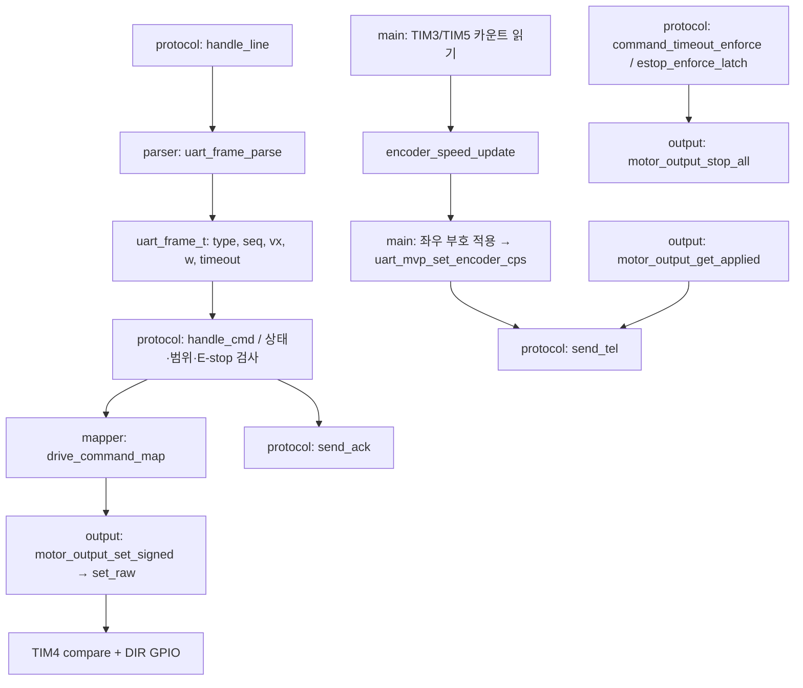

# STM32·ESP32 코드 구조와 함수 지도

기준: 2026-09-29에 저장된 소스. 보드 없이 파일을 열고 따라 읽는 안내서다.
**10/11 연결 안내:** 이 함수 지도는 당시 `esp32_uart_bridge` 기준이다. 마지막 실행 ESP 앱은 이후 `esp32_wifi_link`로 바뀌어 W4/W5 비구동 범위를 완료했다.
현재 앱·parser/ticket/owner 모듈과 아직 미연결인 제어 실행 경로는 [펌웨어 목차](../../03_Firmware/README.md)를 따른다. 아래 과거 ‘현재 역할/다음’ 문구를 새 앱의 설명이나 재개 지시로 사용하지 않는다.
먼저 **어느 파일이 무엇을 맡는지**, 다음으로 **누가 그 함수를 언제 호출하는지**를 이해한다.
이 문서 뒤에 [단일 모터 시험 해설](08_Single_Motor_Bench_Dataflow_and_Evidence_Review_ko.md)을 읽으면 실제 로그와 연결하기 쉽다.

처음에는 1~4절의 STM 구조를 읽고 `main()`의 반복문을 찾아본다.
이후 5~6절의 ESP 구조와 두 보드의 연결을 읽는다. 부록은 함수 이름을 만났을 때 찾아보는 사전이다.
읽기용 설명이며 소스를 수정하거나 시험 설정을 켜는 절차가 아니다.

## 1. 두 보드에는 서로 다른 프로그램이 실행된다

| 구분 | STM32 | ESP32 |
| --- | --- | --- |
| 프로젝트 폴더 | `03_Firmware/stm32_uart_mvp` | `03_Firmware/esp32_uart_bridge` |
| 사용자 코드 진입점 | `main()` | `app_main()` |
| 현재 역할 | 명령 수락 판단, PWM/DIR 출력, 엔코더 관측, E-stop·timeout 처리 | PC 콘솔 입력, STM 명령 전송, 응답 해석, 시험 순서 관리 |
| 코드 배치 | 역할별 `.c/.h`로 분리 | 주요 로직이 `main/uart_bridge_main.c` 한 파일에 모임 |
| 현재 실행 구조 | 초기화 후 `while (1)` 반복 + UART 인터럽트 | ESP-IDF의 main task에서 `app_main()`과 그 안의 반복문 실행 |

두 프로그램은 따로 빌드·플래시한다. ESP의 함수가 STM의 C 함수를 직접 호출하는 관계가 아니다.
ESP가 UART로 문자열을 보내면 STM이 자기 코드로 해석하고 실행한다.

ESP에는 이미 ESP-IDF의 FreeRTOS 기반 실행 환경이 있다. 현재 사용자 코드가 별도 task 여러 개로 분리된 것은 아니다.
프로젝트의 “나중에 FreeRTOS 도입” 계획은 **STM의 현재 bare-metal 구조를 확장하는 단계**와 구분해서 읽는다.
STM의 `while (1)`도 운영체제 task가 아니라 `main()` 안의 반복문이다.

## 2. 파일과 함수 이름을 읽는 기본 규칙

| 형태 | 이 프로젝트에서 읽는 방법 |
| --- | --- |
| `.c` | 함수가 실제로 어떻게 동작하는지 구현한 파일 |
| `.h` | 다른 파일에서 사용할 함수 선언, 구조체, 상수 등을 공개하는 파일 |
| `#include "motor_output.h"` | 이 파일에 선언된 인터페이스를 사용한다는 뜻. 해당 모듈의 함수가 자동 실행되는 것은 아님 |
| `static` 함수 | 같은 `.c` 안에서 사용하는 내부 함수. 다른 `.c`에서 이름으로 직접 호출하는 공개 함수와 구분 |
| 파일 범위의 `static` 변수 | 호출 사이에도 상태를 보관하면서 다른 파일에 직접 노출하지 않는 변수 |
| `s_` 접두어 | 이 코드에서 상태 변수에 붙인 이름 관례. 접두어 자체가 C 문법이나 실행 조건은 아님 |
| `MX_..._Init()` | CubeMX가 생성한 주변장치 초기화 함수 |
| `HAL_...()` | HAL 드라이버 함수 또는 HAL이 부르는 사용자 callback. 이름이 같아 보여도 역할을 확인해야 함 |
| `process`, `poll`, `step` | 반복 호출하면서 현재 조건에 맞는 일을 조금씩 진행하는 함수 이름. 독립 task라는 뜻은 아님 |
| `#define ..._ENABLED 0U` | 해당 코드의 시험 경로를 비활성화한 설정. 함수가 파일에 있어도 현재 실행되지 않을 수 있음 |

VS Code에서는 함수 이름 검색과 파일의 **Outline(개요)**을 함께 쓴다.
“정의로 이동”은 구현 위치를, “참조 찾기”는 호출 위치를 찾는 데 사용한다. 정의 이동이 안 되면 전체 검색으로 확인하면 된다.

## 3. STM: 먼저 알아둘 파일 7개

아래 파일들은 모두 `stm32_uart_mvp/Core/Src`에 있다.
`main.c`는 CubeMX 생성 틀에 사용자 코드가 함께 들어 있고, 나머지 여섯 개는 프로젝트 기능을 나눈 모듈이다.

| 파일 | 담당하는 일 | 먼저 볼 함수 |
| --- | --- | --- |
| [main.c](../../03_Firmware/stm32_uart_mvp/Core/Src/main.c) | 시작 순서, 반복 호출, 엔코더와 protocol 연결, HAL callback 연결 | `main`, `encoder_speed_log_process` |
| [uart_mvp_protocol.c](../../03_Firmware/stm32_uart_mvp/Core/Src/uart_mvp_protocol.c) | UART 행 조립, 명령별 처리, 상태·E-stop·timeout, ACK/ERR/TEL 생성 | `uart_mvp_process`, `handle_line`, `handle_cmd` |
| [uart_frame_parser.c](../../03_Firmware/stm32_uart_mvp/Core/Src/uart_frame_parser.c) | 문자열을 명령 구조체로 변환하고 형식·숫자 표현 검사 | `uart_frame_parse` |
| [ring_buffer.c](../../03_Firmware/stm32_uart_mvp/Core/Src/ring_buffer.c) | 인터럽트가 받은 바이트를 반복문이 처리할 때까지 보관 | `ring_buffer_push`, `ring_buffer_pop` |
| [drive_command_mapper.c](../../03_Firmware/stm32_uart_mvp/Core/Src/drive_command_mapper.c) | vx/w 입력을 좌우 signed PWM 요청으로 계산 | `drive_command_map` |
| [motor_output.c](../../03_Firmware/stm32_uart_mvp/Core/Src/motor_output.c) | signed PWM을 타이머 compare와 DIR 핀으로 적용하고 출력 해제 | `motor_output_set_signed`, `motor_output_stop_all` |
| [encoder_speed.c](../../03_Firmware/stm32_uart_mvp/Core/Src/encoder_speed.c) | 타이머 카운트 차이, CPS, millirpm 계산 | `encoder_speed_update` |

**parser와 protocol을 구분하는 것이 첫 번째 핵심이다.**
parser는 `CMD,seq=...,vx_mmps=...`를 숫자와 명령 종류로 바꾼다.
protocol은 현재 ARMED인지, E-stop이 걸렸는지 등을 보고 그 명령을 실행할지 결정한다.
parser가 성공했다고 곧바로 모터 출력이 허용되지는 않는다.

mapper와 motor output도 구분한다. mapper는 숫자를 계산하고, motor output은 그 결과를 MCU 출력에 적용한다.
encoder speed는 계산 모듈이고, 실제 TIM3/TIM5 카운터를 읽어 넘기는 곳은 `main.c`다.

### 함께 보이는 설정·기반 파일

아래 파일은 없어도 되는 파일이 아니라, 첫 학습에서 세부 구현보다 **역할부터 파악할 파일**이다.

| 파일·위치 | 역할과 주요 함수 |
| --- | --- |
| [gpio.c](../../03_Firmware/stm32_uart_mvp/Core/Src/gpio.c) | `MX_GPIO_Init`: DIR, E-stop 입력 등 GPIO 초기 설정 |
| [usart.c](../../03_Firmware/stm32_uart_mvp/Core/Src/usart.c) | `MX_USART1_UART_Init`, `MX_USART2_UART_Init`: UART 설정. `HAL_UART_MspInit`/`HAL_UART_MspDeInit`: 관련 핀·클록·IRQ 설정/해제 |
| [tim.c](../../03_Firmware/stm32_uart_mvp/Core/Src/tim.c) | `MX_TIM3_Init`, `MX_TIM5_Init`: 엔코더 타이머. `MX_TIM4_Init`: PWM 타이머. 관련 MSP 함수는 아래 부록 참고 |
| [stm32f4xx_it.c](../../03_Firmware/stm32_uart_mvp/Core/Src/stm32f4xx_it.c) | `USART1_IRQHandler`, `USART2_IRQHandler`: IRQ 진입점. `SysTick_Handler`: HAL 시간 갱신. CPU 예외 handler도 포함 |
| [stm32f4xx_hal_msp.c](../../03_Firmware/stm32_uart_mvp/Core/Src/stm32f4xx_hal_msp.c) | `HAL_MspInit`: 공통 저수준 초기화. UART와 TIM별 MSP 함수는 각각 usart.c/tim.c에 있음 |
| [system_stm32f4xx.c](../../03_Firmware/stm32_uart_mvp/Core/Src/system_stm32f4xx.c) | `SystemInit`, `SystemCoreClockUpdate`: MCU 시스템 초기 설정과 클록 값 갱신 |
| [syscalls.c](../../03_Firmware/stm32_uart_mvp/Core/Src/syscalls.c), [sysmem.c](../../03_Firmware/stm32_uart_mvp/Core/Src/sysmem.c) | `_read`, `_write`, `_sbrk` 등 C 런타임 연결·메모리 지원. 현재 UART 명령 처리는 protocol의 경로를 따름 |
| [startup_stm32f446retx.s](../../03_Firmware/stm32_uart_mvp/Core/Startup/startup_stm32f446retx.s) | Reset_Handler와 인터럽트 벡터. 시작 준비 후 main으로 진입 |
| [stm32_uart_mvp.ioc](../../03_Firmware/stm32_uart_mvp/stm32_uart_mvp.ioc) | CubeMX의 핀·주변장치 설정 원본. 실행되는 C 함수 파일이 아님 |
| `Drivers/`, `*.ld`, IDE 설정·빌드 결과 | HAL/CMSIS 제공 코드, 메모리 배치, 빌드 설정·산출물. 프로젝트 동작의 첫 읽기 대상은 위 7개 파일 |

`Core/Inc`에는 각 모듈과 같은 이름의 헤더가 있다. 예를 들어 `uart_mvp_protocol.h`는 공개 함수들을,
`uart_frame_parser.h`는 `uart_frame_t`와 명령·파싱 결과 enum을 정의한다.
`main.h`에는 핀 이름 등이 있고, `stm32f4xx_hal_conf.h`에는 HAL 구성 설정이 있다.
생성 코드와 사용자 코드 경계는 [기존 CubeMX 학습 노트](07_CubeMX_Generated_Code_and_User_Code_Boundary_ko.md)를 참고한다.

## 4. STM에서 함수는 언제 실행되는가

### 4-1. 부팅 때 한 번 진행하는 초기화

`main()`은 먼저 다음 준비를 한다. 오류 분기는 생략한 읽기용 순서다.

```text
HAL_Init → SystemClock_Config
→ GPIO, USART2, USART1, TIM4, TIM3, TIM5 초기화
→ motor_output_init: PWM을 0으로 준비하고 TIM4 PWM 시작
→ TIM3/TIM5 카운터 초기값 설정 및 encoder mode 시작
→ encoder_speed_init: 이전 카운트·시간·샘플 주기 준비
→ 엔코더 계산 self-test
→ uart_mvp_init(&huart1): 명령 상태와 수신 버퍼 초기화
→ uart_mvp_start_rx(): 첫 1바이트 인터럽트 수신 예약
→ while (1)
```

`MX_TIM3_Init()`은 설정을 준비하고, `HAL_TIM_Encoder_Start()`는 카운터 동작을 시작한다.
“초기화 함수가 있다”와 “실제 기능을 시작했다”를 나누어 읽어야 하는 예다.
계산 self-test PASS는 계산 검사를 뜻하며 실제 엔코더 배선까지 검사했다는 뜻은 아니다.

### 4-2. 반복문에서 계속 호출하는 세 함수

현재 `main()`의 반복문 핵심은 실제로 다음 세 줄이다.

```c
encoder_speed_log_process();
motor_output_pin_test_process();
uart_mvp_process();
```

| 함수 | 한 번 호출되면 하는 일 |
| --- | --- |
| `encoder_speed_log_process()` | TIM3/TIM5 카운터를 읽고 샘플 주기가 됐으면 CPS 계산·좌우 부호 적용·protocol에 전달. USART2로 ENC3/ENC5 로그도 전송 |
| `motor_output_pin_test_process()` | B1 버튼 기반 출력 시험. 현재 ENABLED=0이므로 바로 반환 |
| `uart_mvp_process()` | E-stop·timeout 검사, 수신 버퍼 처리와 행 조립, 완성된 명령 처리, 주기 TEL 전송 |

세 함수가 매 반복마다 호출된다고 모든 일이 매번 수행되지는 않는다.
예를 들어 CPS 계산과 TEL 전송은 각각 시간 조건을 확인한다. 현재 E-stop 감지와 CMD timeout도 protocol 처리 안에서 반복 검사한다.
TIM3/TIM5의 A/B상 카운팅은 타이머 하드웨어가 수행한다. 사용자 코드가 모든 엔코더 펄스마다 함수를 호출해 세는 방식은 아니다.

### 4-3. UART 수신 인터럽트는 별도 경로로 들어온다

```text
USART1에 바이트 도착
→ stm32f4xx_it.c: USART1_IRQHandler()
→ HAL 라이브러리: HAL_UART_IRQHandler(&huart1)
→ main.c: HAL_UART_RxCpltCallback(huart)
→ uart_mvp_protocol.c: uart_mvp_on_rx_complete(huart)
→ ring_buffer_push(): 받은 바이트 보관
→ HAL_UART_Receive_IT(): 다음 1바이트 수신 예약
→ 중단했던 실행 흐름으로 복귀

이후 main 반복문의 uart_mvp_process()
→ ring_buffer_pop(): 보관된 바이트 꺼내기
→ 개행까지 한 행 조립
→ handle_line() → uart_frame_parse()
→ 명령 종류에 따라 처리, CMD이면 handle_cmd()
```

여기서 callback은 **HAL이 수신 완료 시 불러주는 사용자 함수**다.
`main()`에서 `HAL_UART_RxCpltCallback()`을 직접 부르는 코드를 찾지 못해도 정상이다.
인터럽트에서는 바이트를 보관하고 다음 수신을 준비한다. 상태 판단과 문자열 처리는 반복문의 protocol 함수가 맡는다.
UART 오류는 `HAL_UART_ErrorCallback()` → `uart_mvp_on_uart_error()` 경로로 전달된다.

### 4-4. 하나의 CMD가 출력과 TEL로 이어지는 관계



그림은 파일 간 책임과 주요 흐름을 나타낸다. 시간 순서가 다른 주기 처리까지 하나의 동시 호출로 해석하지 않는다.
`send_tel()`은 protocol의 상태, 전달받은 CPS, output 모듈의 적용 PWM을 모아 문자열로 전송한다.

## 5. ESP: 한 파일을 기능 묶음으로 나누어 읽기

[uart_bridge_main.c](../../03_Firmware/esp32_uart_bridge/main/uart_bridge_main.c)는 UART bridge와 시험 코드를 담는다.
2026-09-29에 예제 이름 `hello_world_main.c`에서 역할을 드러내는 이름으로 변경했다. 실행 진입 함수는 `app_main()` 그대로다.
[main/CMakeLists.txt](../../03_Firmware/esp32_uart_bridge/main/CMakeLists.txt)도 이 파일을 빌드 대상으로 등록한다.
현재 프로젝트 사용자 로직을 아래 기능 묶음으로 나누어 보면 된다. 별도 `.c` 파일로 나뉘어 있다는 뜻은 아니다.

| 기능 묶음 | 대표 함수·데이터 | 맡은 일 |
| --- | --- | --- |
| UART 송신 | `bridge_uart_init`, `bridge_uart_send_frame`, `bridge_uart_send_cmd` 등 | STM 통신 UART1 준비, 명령 문자열 작성·전송 |
| UART 수신 | `bridge_uart_handle_rx_byte`, `bridge_uart_handle_rx_line`, `parse_*_field` | 바이트→행→필드 변환, ACK/PONG/TEL/ERR 구분 |
| 부팅 통신 확인 | `bridge_uart_startup_step`, `s_startup_state` | line sync→DISARM ACK→PING/PONG→READY |
| 수동 콘솔 시험 | `bridge_bench_console_poll`, `bridge_bench_command`, `bridge_bench_advance` | PC 명령 입력, 시험 조건·응답 확인, 단발 CMD와 종료 잠금 |
| 기존 자동 시험 | `bridge_uart_run_test_step`, `bridge_uart_run_p04b_estop_reset_test_step` 등 | 이전 통신·E-stop 시험 시나리오. 현재 관련 자동 설정 4개는 모두 0 |
| 전체 실행 연결 | `app_main` | 위 기능을 초기화하고 반복 호출 |

현재는 수동 M2 시험 설정만 1이다. `P04B`, `T004`, `coordinator` 이름이 보인다고 그 시험이 현재 함께 실행되는 것은 아니다.
T004 coordinator는 enum·상태 변수와 기존 시험 함수 호출을 조합하는 구조이며 별도의 RTOS task 이름이 아니다.

### app_main의 실제 반복 흐름

```text
처음 한 번:
  bridge_uart_init()             : STM용 UART1
  bridge_bench_console_init()    : PC 입력용 UART0
  부팅별 seq와 startup/test 상태 준비

while (1):
  uart_read_bytes(UART1, ...)
    → 수신했다면 bridge_uart_handle_rx_byte()
       → 행이 완성되면 bridge_uart_handle_rx_line()
  bridge_uart_startup_step(now)
  bridge_bench_console_poll(now, &test_seq)
    → UART0 입력 행이 완성되면 bridge_bench_command()
    → bridge_bench_advance(): 현재 시험 단계 판단
  기존 자동 시험 조건 검사: 현재 설정에서는 실행하지 않음
```

UART1 read에는 최대 20ms 대기가 설정되어 있고, 수동 UART0 poll은 입력을 기다리며 멈추지 않도록 읽는다.
STM의 사용자 UART ISR/ring buffer와 달리 ESP 쪽 하위 수신 처리는 ESP-IDF UART 드라이버를 사용한다.
우리 소스에서는 driver API로 데이터를 꺼낸 뒤 행을 조립하는 부분부터 읽으면 된다.

### 수신 데이터는 어디에 보관되나

`bridge_uart_handle_rx_line()`은 TEL의 필드를 임시 구조체에 해석하고 성공하면 `s_telemetry`에 저장한다.
`bridge_bench_command()`와 `bridge_bench_advance()`는 이 **최근 수신 상태**를 읽어 진행 여부를 판단한다.
수신 함수가 모터를 직접 구동하는 것이 아니다. 시험 함수가 조건을 확인한 뒤 송신 함수를 통해 STM에 요청한다.

`s_telemetry.state`는 STM이 알려준 상태이고 `s_bench_state`는 ESP 내부 시험 단계다.
`s_telemetry.t_ms`는 STM 시간이며, ESP의 `xTaskGetTickCount()` 기준 시간과 출발점이 같다고 가정하지 않는다.

## 6. 두 프로그램을 연결해서 읽는 방법

한 번에 양쪽 전체 코드를 외우는 대신, 아래처럼 전송되는 한 종류의 메시지를 따라간다.

| 확인할 흐름 | ESP에서 찾을 곳 | STM에서 찾을 곳 |
| --- | --- | --- |
| CMD 보내기와 적용 | `bridge_bench_advance` → `bridge_uart_send_cmd` → `bridge_uart_send_frame` | 수신 ISR·ring buffer → `handle_line` → parser → `handle_cmd` → mapper → output |
| ARM 수락 확인 | `bridge_uart_send_arm`, 수신 TEL 저장, bench 상태 검사 | `handle_line`의 ARM 분기, `send_ack`, 이후 `send_tel` |
| 엔코더 값 보기 | `bridge_uart_handle_rx_line`의 TEL 분기 | `encoder_speed_log_process` → `uart_mvp_set_encoder_cps` → `send_tel` |
| 갱신 없는 CMD의 정지 | `bridge_bench_advance`가 timeout TEL 확인 | `command_timeout_enforce` → `motor_output_stop_all` |
| E-stop 상태와 해제 | `bridge_uart_send_estop_reset`, 수신 TEL 검사 | `estop_*` 함수들, `handle_line`의 ESTOP_RESET 분기 |

실제로 찾아볼 첫 질문은 다음과 같다.

- `main()`의 반복문에는 모터 명령 처리 함수가 직접 보이지 않는데, 어느 함수를 거치면 `handle_cmd()`에 도달하는가?
- 숫자 형식이 잘못된 CMD와, 형식은 맞지만 DISARMED에서 받은 CMD는 각각 어디서 거절되는가?
- STM USART2의 `ENC3` CPS와 ESP TEL의 `left_cps`는 왜 부호가 다를 수 있는가?
- UART 수신이 전혀 없는 반복에서도 timeout 검사는 실행되는가?
- ESP의 startup READY와 STM의 ARMED는 각각 누가 관리하며 무엇을 뜻하는가?

세 번째 질문의 단서는 `encoder_speed_log_process()`에 있다.
USART2의 ENC3/ENC5 진단 로그는 raw 타이머 방향 기준이고, protocol로 넘길 때 TIM3의 부호를 반전한다.
따라서 어느 로그를 읽고 있는지부터 구분해야 한다.

## 7. 현재 코드에 있는 것과 아직 없는 것

이 표는 2026-09-29 저장 소스의 읽기 기준이다. 기능 시험 PASS를 뜻하지 않는다.

| 항목 | 현재 위치·상태 |
| --- | --- |
| UART 명령·상태·E-stop·timeout | STM protocol에 구현 |
| PWM/DIR 출력 | STM motor output에 구현 |
| 엔코더 카운트·CPS | STM encoder speed와 main에 구현 |
| PC 수동 시험과 STM 응답 확인 | ESP main 파일에 구현, M2 역방향 시험 설정 |
| B1 버튼 출력 시험과 오류 주입 | STM에 코드가 있지만 현재 비활성화 |
| P-03/P-04B/T004·비정상 프레임 자동 시험 | ESP에 코드가 있지만 현재 자동 설정 4개는 0 |
| 엔코더 속도 폐루프 제어 | 현재 mapper는 vx/w→PWM 계산. 속도 오차를 이용한 PWM 보정은 아직 이 경로에 없음 |
| 배터리 실측값 TEL | 현재 `send_tel()`의 batt_mv는 0 고정값. 측정 결과로 읽지 않음 |
| CAN·IMU·STM RTOS 확장 | 현재 핵심 실행 경로를 읽기 위한 선행 조건이 아님. 배선·계획과 동작 코드 구현을 구분 |
| `03_Firmware/tests` | PC에서 소스의 계약을 검사하는 Python 코드. MCU에서 실행하는 함수가 아님 |

ESP 폴더의 `pytest_hello_world.py`는 `Hello world!` 출력을 기대하는 예제 시험이 남아 있는 파일이다.
현재 bridge 시험 결과나 합격 근거로 읽지 않는다. 빌드 설정, `sdkconfig`, `build/`도 각각 설정·산출물로 구분한다.

## 부록 A. STM 핵심 7개 파일의 함수 사전

현재 핵심 파일에 정의된 함수들을 역할별로 묶었다. 공개 함수는 해당 `.h`에도 선언되어 있다.
아래 표를 전부 암기하기보다, 처음 만난 이름의 목적과 호출 위치를 찾는 데 사용한다.

### main.c — 실행 연결과 엔코더 관측

| 함수 | 역할·호출 관계 |
| --- | --- |
| `main` | 초기화 후 세 처리 함수를 반복 호출 |
| `SystemClock_Config` | main에서 부르는 시스템 클록 설정 |
| `encoder_speed_log_process` | 카운터 읽기→계산→protocol CPS 갱신→USART2 진단 로그 |
| `encoder_cps_to_i32` | 계산값을 TEL용 int32 범위로 변환 |
| `encoder_delta_direction` | 진단 로그의 카운트 변화 방향 문자열 작성 |
| `encoder_speed_wrap_self_test`, `encoder_speed_self_test_case` | 부팅 중 타이머 카운트 wrap 계산 검사와 개별 사례 실행 |
| `encoder_millirpm_self_test`, `encoder_millirpm_self_test_case` | 부팅 중 CPS→millirpm 환산 검사와 개별 사례 실행 |
| `motor_output_pin_test_process` | 비활성화된 B1 버튼 기반 출력 시험 |
| `HAL_UART_RxCpltCallback`, `HAL_UART_ErrorCallback` | HAL 수신 완료·오류를 protocol의 공개 함수로 전달 |
| `Error_Handler` | 출력 해제 후 인터럽트를 끄고 무한 루프에 머묾 |
| `assert_failed` | USE_FULL_ASSERT 조건부 진단 틀. 현재 사용자 처리 내용은 비어 있음 |

### uart_mvp_protocol.c — 명령·상태·안전 조건

| 함수 | 역할·호출 관계 |
| --- | --- |
| `uart_mvp_init` | UART handle, ring buffer, 상태·카운터 초기화 |
| `uart_mvp_start_rx` | 첫 1바이트 인터럽트 수신 시작 |
| `uart_mvp_on_rx_complete` | 수신 바이트 push, overflow 표시, 다음 수신 예약 |
| `uart_mvp_on_uart_error` | UART 오류 누적, 재동기화 필요 표시, 수신 재예약 |
| `uart_mvp_set_encoder_cps` | main이 계산한 좌우 CPS를 TEL용 상태에 저장 |
| `uart_mvp_process` | E-stop·timeout 검사, pop·행 조립·명령 처리, 주기 TEL 전송 |
| `begin_rx_resynchronization` | 수신 큐·행 상태 정리 후 다음 개행까지 버려 경계 복구 |
| `handle_line` | parser 호출 후 PING/ARM/DISARM/CMD/ESTOP_RESET별 분기 |
| `handle_cmd` | 운용 범위·ARMED·E-stop 검사, mapper·output 호출, 수락 시각·seq 갱신 |
| `estop_input_active` | 실제 E-stop 감지 핀의 활성 상태 읽기 |
| `estop_latch_and_force_safe` | 출력 해제, latch 설정, FAULT와 reason 설정 |
| `estop_enforce_latch` | 입력 활성 또는 기존 latch가 있으면 차단 상태 적용 |
| `command_timeout_enforce` | ARMED의 명령 제한 시간이 지나면 출력 해제와 CMD_TIMEOUT 전환 |
| `send_ack`, `send_err` | ACK/ERR 작성·송신. send_err는 STM 오류 카운터도 증가 |
| `send_tel` | 현재 상태·출력 적용값·CPS·오류 수를 모아 TEL 작성 |
| `uart_sendf` | 송신 문자열 포맷 후 설정된 UART handle로 전송 |
| `state_name`, `reason_name`, `parse_error_code` | enum·파싱 결과를 로그에 쓰는 문자열로 변환 |
| `command_age_ms` | 마지막 수락 CMD 이후 시간 또는 미수락 표시값 반환 |

### uart_frame_parser.c — 문자열을 구조체로

| 함수 | 역할 |
| --- | --- |
| `uart_frame_parse` | 전체 행을 검사하고 uart_frame_t를 채우는 공개 진입점 |
| `uart_frame_type_name` | 명령 종류 enum→이름 |
| `parse_type`, `token_equals` | 명령 이름을 길이와 내용으로 구분 |
| `consume_literal` | 현재 위치에서 기대하는 필드 이름·구분자 확인 후 전진 |
| `parse_u32_value`, `parse_i32_value`, `is_decimal_digit` | 부호·자릿수·정수 표현 범위를 검사하며 숫자로 변환 |

여기서 정수 표현 범위와 protocol의 운용 범위는 다르다.
예를 들어 int32로 표현 가능한 vx라도 프로젝트의 허용 vx 범위를 넘으면 `handle_cmd()`에서 거부된다.

### ring_buffer.c — 바이트 보관

| 함수 | 역할 |
| --- | --- |
| `ring_buffer_init` | head/tail/drop 초기화 |
| `ring_buffer_push`, `ring_buffer_pop` | ISR에서 넣고 반복문에서 꺼내는 바이트 처리 |
| `ring_buffer_next` | 다음 인덱스 계산·끝에서 처음으로 순환 |
| `ring_buffer_discard_all` | 현재 대기 바이트를 비움. protocol은 ISR과 겹치지 않도록 호출 |
| `ring_buffer_dropped` | 누적 유실 수를 TEL에 제공 |
| `ring_buffer_available` | 대기 바이트 수 조회. 공개되어 있지만 현재 Core 코드에 호출 지점은 없음 |

### drive_command_mapper.c — 출력 요청 계산

`drive_command_map` 한 함수다. `vx_mmps`, `w_mradps`, duty cap을 받아 범위를 검사하고,
`drive_command_request_t`의 좌우 signed permille을 채운다. GPIO나 타이머를 직접 조작하지 않는다.

### motor_output.c — MCU 출력 적용

| 함수 | 역할 |
| --- | --- |
| `motor_output_init` | TIM4 handle 확인, 초기 출력 해제, 두 PWM 채널 시작 |
| `motor_output_set_signed` | 부호→DIR, 절댓값→duty로 나누고 set_raw 호출 |
| `motor_output_set_raw` | duty·DIR 검사, 방향 변경 시 PWM 0 구간, DIR·compare 적용 |
| `motor_output_permille_to_compare` | permille을 ARR 기반 타이머 compare 값으로 환산 |
| `motor_output_stop_all` | 두 PWM compare와 보관 duty를 0으로 만들고 DIR도 LOW로 설정 |
| `motor_output_get_applied` | 보관한 duty·DIR로 signed 적용값 반환. 전압·파형 실측 함수가 아님 |

### encoder_speed.c — 카운트와 속도 계산

| 함수 | 역할 |
| --- | --- |
| `encoder_speed_init` | counter 폭, 초기 카운트·시간, 샘플 주기를 상태 구조체에 저장 |
| `encoder_speed_update` | 주기가 됐으면 카운트 차이·누적값·CPS 갱신 |
| `encoder_speed_cps_to_millirpm` | CPS와 counts/rev로 millirpm 환산 |
| `encoder_counter_width_is_valid`, `encoder_normalize_raw` | 16/32비트 설정 검사와 raw 값 정리 |
| `encoder_calculate_delta` | counter 폭에 따라 차이 계산 함수 선택 |
| `encoder_calculate_delta_16`, `encoder_calculate_delta_32` | 타이머 wrap을 고려한 signed 카운트 차이 계산 |

TIM 설정 파일의 추가 함수는 `HAL_TIM_Encoder_MspInit`, `HAL_TIM_Base_MspInit`, `HAL_TIM_MspPostInit`,
`HAL_TIM_Encoder_MspDeInit`, `HAL_TIM_Base_MspDeInit`다. 핀·클록 등의 저수준 준비·해제를 맡는다.
HAL/CMSIS 전체 함수와 C 런타임 함수 목록은 이 부록의 범위 밖이다.

## 부록 B. ESP main 파일의 함수 사전

현재 사용자 파일의 함수 전체를 기능별로 묶었다. 잘못된 프레임 전송 함수 둘은 조건부 컴파일 영역에 있다.

| 함수 | 역할 |
| --- | --- |
| `app_main` | ESP 사용자 코드 시작과 전체 반복 호출 |
| `bridge_uart_init` | STM 통신 UART1 드라이버·속도·핀 준비 |
| `bridge_uart_send_frame` | 문자열 길이 확인, 개행 추가, UART1 송신 |
| `bridge_uart_send_ping`, `bridge_uart_send_arm`, `bridge_uart_send_disarm` | 각 명령 문자열을 만들고 send_frame 호출 |
| `bridge_uart_send_estop_reset`, `bridge_uart_send_cmd` | reset 또는 vx/w/timeout CMD 문자열 작성·전송 |
| `bridge_uart_handle_rx_byte` | 수신 바이트 조립, 개행·제어문자·행 길이 처리 |
| `bridge_uart_handle_rx_line` | PONG/ACK/TEL/ERR 구분, 응답 상태·최근 TEL·카운터 갱신 |
| `find_field_value` | 응답 행에서 필드 위치 탐색·중복 등 검사 |
| `parse_u32_field`, `parse_i32_field`, `parse_string_field` | 필드 값을 숫자·문자열로 읽고 형식·범위 검사 |
| `bridge_uart_startup_step` | 부팅 handshake의 단계·일치 응답·재시도 한계 관리 |
| `bridge_bench_console_init` | PC 명령 입력용 UART0 준비 |
| `bridge_bench_console_poll` | 최근 TEL 수신 시각 반영, 콘솔 행 입력 처리, bench_advance 호출 |
| `bridge_bench_command` | HELP/STOP/RESET_ESTOP/M2_PULSE 구분, 시작 조건 검사, 최초 명령 전송 |
| `bridge_bench_wait` | 기다릴 단계·seq·시각·카운터 기준 저장 |
| `bridge_bench_fresh`, `bridge_bench_pwm_zero` | 최근 TEL 유효성·시간 조건, 좌우 PWM 0 확인 |
| `bridge_bench_advance` | reset/ARM/timeout TEL을 보고 다음 단계 진행 또는 종료 |
| `bridge_bench_finish` | FINISHED 잠금과 추가 DISARM 전송 |
| `bridge_uart_run_test_step` | 기존 P-03/T004 구동·timeout 시험 단계 처리. 현재 실행 설정 꺼짐 |
| `bridge_uart_run_p04b_estop_reset_test_step` | 기존 P-04B 또는 T004 reset 단계 처리. 현재 실행 설정 꺼짐 |
| `bridge_uart_send_labeled_raw_frame` | 비정상 시험용 raw frame 전송. 현재 컴파일 조건 꺼짐 |
| `bridge_uart_run_malformed_command_test_step` | 비정상 명령 시험 벡터 진행. 현재 컴파일 조건 꺼짐 |

### 상태를 찾을 때 보는 변수·타입

| 위치 | 주요 변수·타입 | 저장하는 의미 |
| --- | --- | --- |
| STM protocol | `s_state`, `s_reason`, `s_estop_latched` | 명령 실행 가능 상태와 사유, E-stop latch |
| STM protocol | `s_rx_rb`, `s_line`, `s_last_cmd_ms`, `s_cmd_timeout_ms` | 수신 처리 상태와 출력 제한 시간 기준 |
| STM main / encoder | `s_encoder_tim3`, `s_encoder_tim5`, `encoder_speed_t` | 채널별 이전 카운트·샘플 시간·CPS |
| STM parser / mapper | `uart_frame_t`, `drive_command_request_t` | 해석한 명령과 계산한 좌우 출력 요청 |
| ESP 수신 | `s_telemetry`, `bridge_telemetry_t` | 마지막으로 정상 해석한 STM TEL |
| ESP startup | `s_startup_state`, ACK/PONG seq·valid 변수 | 부팅 통신 확인의 진행 상태 |
| ESP 수동 시험 | `s_bench_state`, `s_bench_expected_seq`, 각 mark·tick | 현재 단계, 확인할 요청, 새 TEL·오류·시간 판단 기준 |
| ESP 기존 시험 | `test_step`, `p04b_reset_test_state`, `s_t004_coordinator_state` | 비활성화된 자동 시험의 단계 정보 |

오늘의 첫 실습은 `main()`의 세 호출을 직접 찾고 각 함수의 정의로 이동해 보는 것이다.
그다음 ESP의 `app_main()`에서 수신 처리·startup·console 호출을 찾는다.
두 진입점을 찾은 뒤에는 궁금한 현상을 해당 파일과 함수에 연결해서 질문할 수 있다.
