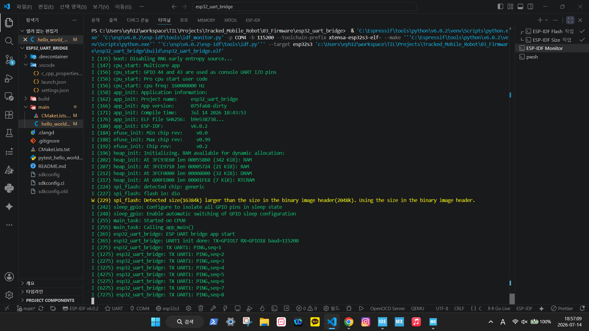
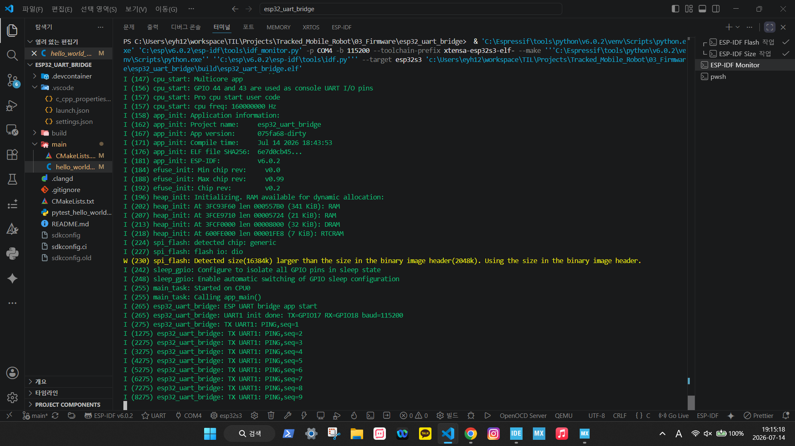
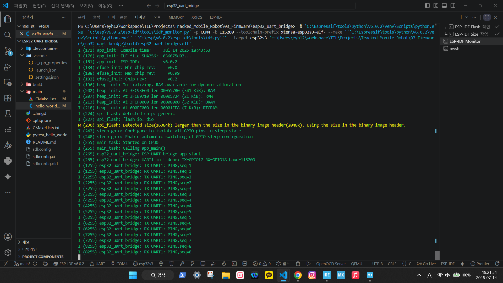
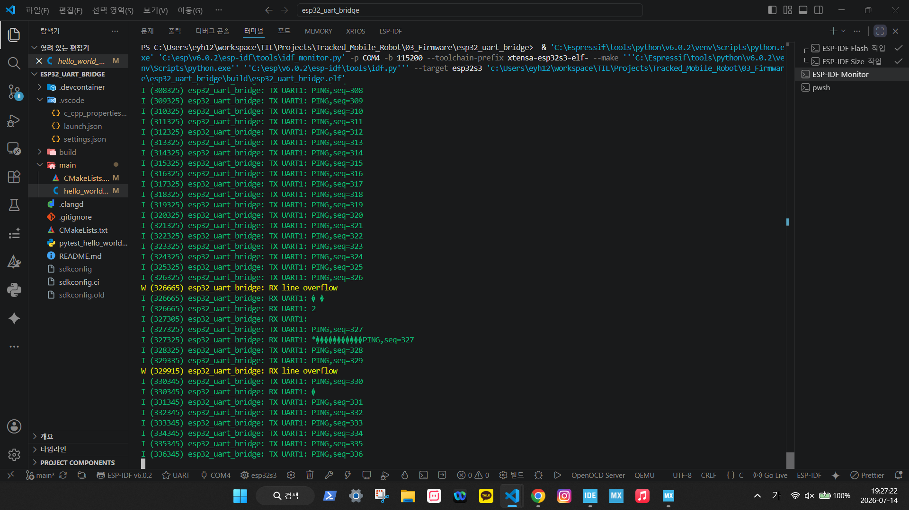
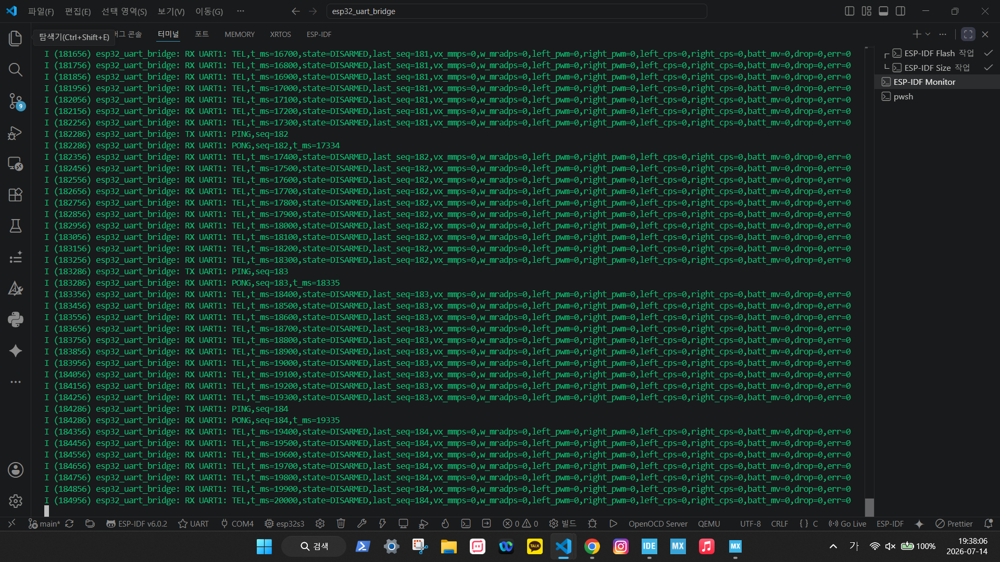
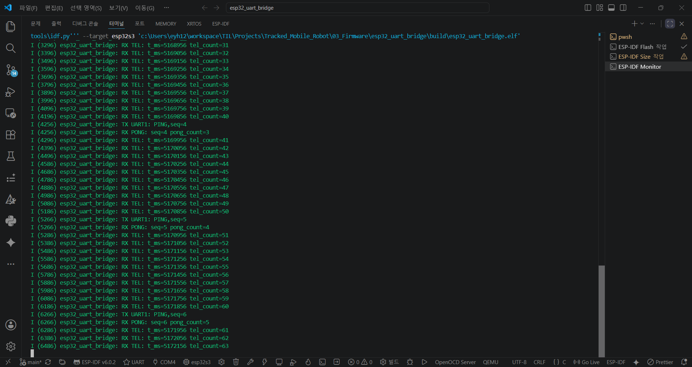
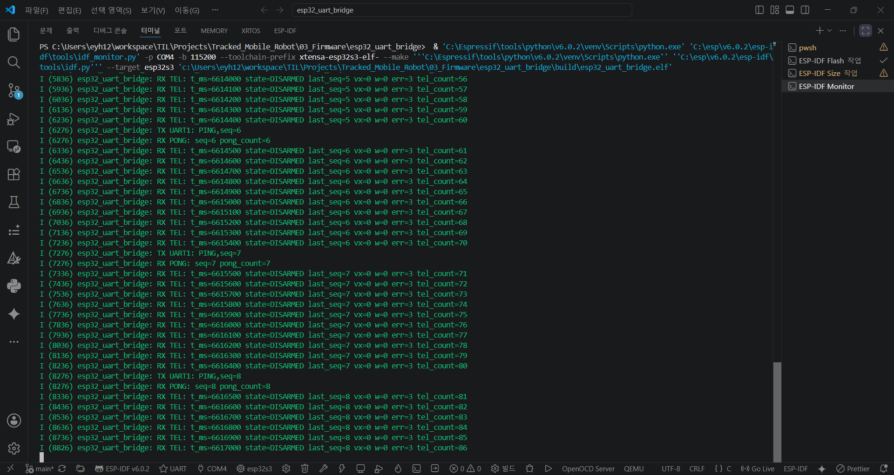
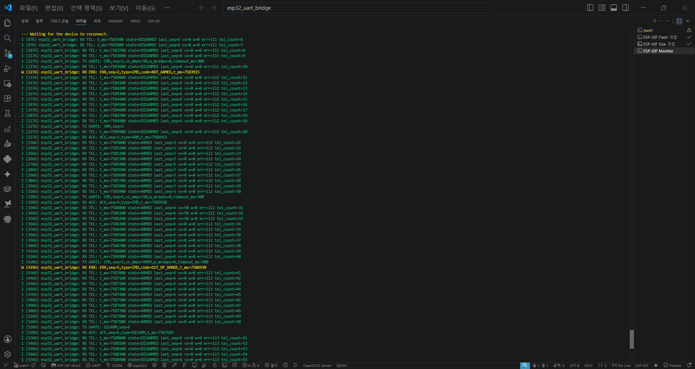

# ESP32 UART Command Bridge Practice

## 목적

이 실습은 ESP32-S3 DevKitC를 STM32 하위 제어기의 command source / telemetry relay로 사용하는 첫 단계다.

이미 PC Web Serial dashboard로 STM32 UART MVP는 검증했다. 다음 목표는 PC가 직접 STM32에 붙는 구조에서 한 단계 나아가, ESP32가 상위 제어기 역할을 맡는 구조를 만드는 것이다.

```text
Before:
PC Web Serial Dashboard
<-> STM32 USART2

After:
PC Serial Monitor
<-> ESP32 USB Serial
<-> ESP32 UART
<-> STM32 USART1
```

## 학습 포인트

이 실습에서 얻고 싶은 임베디드 관점의 포인트:

- ESP32 hardware UART 설정
- USB Serial log와 외부 UART link 분리
- line-based UART frame 송수신
- command source와 safety authority의 역할 분리
- STM32 telemetry relay
- command/response timeout 처리
- board-to-board common GND와 3.3 V logic 주의

## 역할 분리

| 역할 | ESP32 | STM32 |
| --- | --- | --- |
| Command source | 담당 | 수신 |
| UART frame 생성 | 담당 | 응답 생성 |
| Wi-Fi / future dashboard | 담당 예정 | 담당하지 않음 |
| Parser / safety gate | 담당하지 않음 | 담당 |
| Command timeout output zero | 담당하지 않음 | 담당 |
| Motor PWM/DIR authority | 담당하지 않음 | 담당 |
| Telemetry origin | relay만 수행 | 담당 |

핵심 원칙:

```text
ESP32는 명령을 요청한다.
STM32는 명령을 허용하거나 거부한다.
```

## 2026-07-20 현재 상태

| Practice | Status |
| --- | --- |
| ESP32-S3 ESP-IDF build / flash / monitor | PASS |
| UART1 GPIO17/GPIO18 initialization | PASS |
| ESP32 UART1 loopback | PASS |
| ESP32 `PING` -> STM32 `PONG` | PASS |
| STM32 `TEL` -> ESP32 monitor | PASS |
| ESP32 `TEL/PONG` frame classification | PASS |
| `TEL` detailed field parsing | PASS |
| Scripted `ARM/CMD/DISARM` | PASS — historical controlled bench, normal boot default OFF |
| STM32 command timeout zero-output | PASS |
| Timeout-zero through ESP32 | PASS — historical controlled bench |

`TEL` frame의 `state`, `last_seq`, `vx_mmps`, `w_mradps`, `err` 구조화에 이어 scripted command source와 timeout-zero까지 실제 STM32 link에서 검증했다. ESP32-STM32 board-only UART bridge 실습은 완료했고, 다음 하드웨어 단계는 MDD10A PWM/DIR logic input test다.

## 2026-08-03~08-04 안전 부팅 FSM 업데이트와 Runtime 결과

2026-07-20의 실제 보드 PASS 이후, 부팅 직후 일정 시간이 지나면 다음
명령을 보내는 구조를 **STM32 응답 확인 기반** 상태 머신으로 바꿘다.

이 변경의 목적은 "충분히 기다렸으니 상대 보드가 준비됐을 것"이라고
가정하지 않고, 정확한 응답을 받았을 때만 진행하도록 하는 것이다.

### 상태와 전이

| 현재 상태 | 수행 내용 | 다음 상태 조건 |
| --- | --- | --- |
| `SETTLE` | 부팅 후 500 ms 대기, LF 한 바이트로 line sync | LF 송신 후 `SYNC_WAIT` |
| `SYNC_WAIT` | 100 ms 뒤 RX input/assembler를 비우고 `DISARM,seq=S` 송신 | 송신 성공 후 `WAIT_DISARM_ACK` |
| `WAIT_DISARM_ACK` | `ACK` 대기 | 현재 상태에서 `seq=S`, `type=DISARM`인 valid ACK만 통과 |
| `WAIT_PONG` | `PING,seq=S+1` 응답 대기 | 현재 상태에서 valid `PONG,seq=S+1`만 `READY` 진입 |
| `READY` | startup handshake 완료 | terminal state |
| `FAILED` | retry 소진, motion 스크립트 미실행 | terminal state |

응답 대기 시간은 단계당 500 ms이고 `DISARM`, `PING`은 각각 최대
3회까지 시도한다. 해당 횟수 안에 matching response를 받지 못하면
`FAILED`에 머물며 `ARM`/`CMD`를 자동 송신하지 않는다.

### 매크로의 정확한 의미

`BRIDGE_SCRIPTED_TEST_ENABLED == 0U`는 모터 움직임을 요청하는 scripted
`ARM/CMD/DISARM` sequence를 끄는 설정이다. 이 매크로가 `0U`여도
다음 두 frame은 startup safety handshake이므로 송신된다. 여기서 `S`는
`esp_random()`으로 매 부팅 새로 정해 이전 세션 응답을 재사용하기 어렵게 한다.

```text
DISARM,seq=S
PING,seq=S+1
```

즉 `0U`는 "ESP32가 UART에 아무것도 송신하지 않음"이 아니라, "startup
안전 동기화 후에도 `ARM`/`CMD` motion test는 실행하지 않음"을 뜻한다.

2026-08-04 current worktree는 active-DISARM capture 뒤 안전 목표값으로 복구됐다.
실제 source는 ESP script `0U/1000 ms`, STM32 UART output hook `0U`이고 contract
`15/15`와 isolated clean STM32/ESP32 build run `20260804043010-26408-7918`이 PASS다.
다만 restored safe images의 board reflash/run과 ARM/CMD 0 evidence는 다음 단계다.

### Exact field parser

기존 `strstr()`만으로 field를 찾으면 `badseq=1`안에 있는 `seq=1`도 잘못
인정할 수 있다. Startup gate에서 이런 오탐지는 상태 전이 오류로
이어질 수 있어 parser를 다음과 같이 강화했다.

- key는 comma로 나뉘 field의 시작에서만 일치해야 한다.
- 숫자는 최소 한 자리 이상이어야 한다.
- 숫자 뒤에는 comma 또는 문자열 끝만 허용한다.
- `uint32_t`/`int32_t` 범위 overflow를 거부한다.
- 같은 required field가 두 번 나오면 ambiguous frame으로 거부한다.
- overlong frame 또는 embedded CR/NUL/control byte가 나오면 다음 LF까지 frame 전체를 버린다.
- ACK의 `seq` 및 `type`을 모두 parsing한 후에만 valid event로 저장한다.

따라서 `ACK,badseq=7,badtype=DISARM`, `ACK,seq=7x,type=DISARM`,
`ACK,seq=7,seq=7,type=DISARM`, `PONG,badseq=8`은 startup gate의
matching response가 아니다.

### 현재 검증 결과와 한계

| 검증 | 결과 |
| --- | --- |
| 2026-08-03 safe-source preflight | **15/15 PASS** (역사 checkpoint) |
| 2026-08-03 ESP-IDF build | **PASS**, `0x2b210`, partition `83%` free |
| Gate A exact ACK/PONG/READY | **PASS — raw runtime behavior** |
| Gate B DISARM ACK/PONG loss | **PASS — 각 최대 3회 뒤 FAILED** |
| Stale ACK/PONG seq rejection | **PASS** |
| Controlled reset recovery | **PASS** |
| Wrong ACK type | **미검증** |
| Gate C ESP response/STM32 command parser recovery | **미검증** |
| Current safe-source/static/build restore | **PASS** — `0U/1000 ms`, contract `15/15`, isolated clean dual build PASS |
| Restored safe-image board regression | **미완료** — reflash/run과 ARM/CMD 0 evidence 필요 |

정적 계약 테스트는 상태 순서, retry/failure 경로, parser boundary, motion 가드가
소스에 있음을 확인하고 build는 바이너리 생성 가능성을 확인한다. 이후 raw board
log가 exact response와 bounded failure를 별도로 확인했다. Raw log만으로 physical
power state와 flashed binary hash를 증명하지 못하는 한계, wrong ACK type과 malformed
recovery가 남은 범위는 [response-gated report](../../docs/verification/09_ESP32_STM32_UART_Response_Gated_Startup_Test_Report_2026-08-03_ko.md)에 기록한다.

## 실습 단계

### Step 1: ESP32 UART loopback

목표:

- STM32를 연결하기 전에 ESP32 UART TX/RX가 정상 동작하는지 확인한다.

구성:

```text
ESP32 UART TX -> ESP32 UART RX
ESP32 USB Serial -> PC Serial Monitor
```

확인할 로그:

```text
TX: PING,seq=1
RX: PING,seq=1
```

완료 조건:

- newline 기준으로 송수신 line을 읽을 수 있다.
- USB Serial Monitor에 TX/RX가 모두 표시된다.

### Step 2: ESP32 to STM32 PING/PONG

목표:

- ESP32가 STM32로 `PING`을 보내고 `PONG`을 받는다.

구성:

```text
ESP32 UART TX -> STM32 USART1_RX
ESP32 UART RX <- STM32 USART1_TX
ESP32 GND     <-> STM32 GND
```

예상 로그:

```text
[ESP32 TX] PING,seq=1
[ESP32 RX] PONG,seq=1,t_ms=...
```

완료 조건:

- ESP32 Serial Monitor에서 `PONG`이 보인다.

### Step 3: ESP32 scripted command sequence

목표:

- PC dashboard에서 수행한 UART MVP test를 ESP32가 재현한다.

> 이 sequence는 정상 운용 boot 동작이 아니라 motor-disconnected controlled bench
> 전용이다. Release target/default는 `BRIDGE_SCRIPTED_TEST_ENABLED=0U`이고 2026-08-04
> current worktree도 `0U/1000 ms`로 복구됐다. 향후 `1U` 시험 전에는 STM32
> `DISARMED`, motor 분리와 작업자 대기를 확인하고 시험 직후 다시 `0U`로 복구한다.

보낼 순서:

```text
PING,seq=1
CMD,seq=2,vx_mmps=50,w_mradps=0,timeout_ms=300
ARM,seq=3
CMD,seq=4,vx_mmps=50,w_mradps=0,timeout_ms=300
CMD,seq=5,vx_mmps=9999,w_mradps=0,timeout_ms=300
DISARM,seq=6
```

기대 응답:

```text
PONG,seq=1
ERR,seq=2,type=CMD,code=NOT_ARMED
ACK,seq=3,type=ARM
ACK,seq=4,type=CMD
ERR,seq=5,type=CMD,code=OUT_OF_RANGE
ACK,seq=6,type=DISARM
```

완료 조건:

- PC dashboard 없이 ESP32만으로 command/response flow를 재현한다.

### Step 4: telemetry relay

목표:

- STM32가 보내는 `TEL` frame을 ESP32가 받아 PC Serial Monitor로 출력한다.

예상 로그:

```text
[STM32 TEL] TEL,t_ms=...,state=ARMED,last_seq=4,vx_mmps=50,w_mradps=0,...
[STM32 TEL] TEL,t_ms=...,state=ARMED,last_seq=4,vx_mmps=0,w_mradps=0,...
```

완료 조건:

- ESP32가 `TEL`을 누락 없이 일정 시간 출력한다.
- timeout 이후 zero command telemetry가 관찰된다.

## 현재 ESP32 firmware 구조

초기 초안의 Arduino `setup()/loop()` 표현은 현재 구현과 다르다. 실제 코드는
ESP-IDF C project의 `app_main()`과 polling loop를 사용한다.

```text
app_main()
  - ESP-IDF UART1 driver 초기화
  - startup FSM 상태/타이머 초기화
  - UART RX byte polling
      -> newline 기준 line 조립
      -> PONG / ACK / ERR / TEL 분류
      -> exact field parser로 구조화
  - bridge_uart_startup_step(now)
      -> DISARM ACK와 PONG 응답으로 READY gate 제어
  - BRIDGE_SCRIPTED_TEST_ENABLED != 0U && startup == READY일 때만
      -> controlled-bench scripted motion sequence
```

주요 함수 역할:

```text
bridge_uart_send_frame()       공통 newline frame 송신
bridge_uart_send_disarm()      DISARM frame 생성
bridge_uart_send_ping()        PING frame 생성
bridge_uart_handle_rx_byte()   byte-to-line 조립
bridge_uart_handle_rx_line()   frame 분류 및 response event 저장
bridge_uart_startup_step()     response-gated 안전 부팅 FSM
bridge_uart_run_test_step()    명시적으로 활성한 bench script만 수행
```

## Command forwarding policy

초기에는 PC Serial Monitor에서 입력한 line을 STM32로 그대로 forwarding할 수 있다.

예:

```text
PC Serial Monitor input:
ARM,seq=10

ESP32:
[PC->STM32] ARM,seq=10

STM32 response:
[STM32->PC] ACK,seq=10,type=ARM,t_ms=...
```

주의:

- ESP32는 frame을 임의로 수정하지 않는다.
- ESP32는 safety 판단을 하지 않는다.
- ESP32는 invalid command를 막을 수 있지만, 최종 거부는 STM32가 수행한다.

## Timeout / keepalive 관점

STM32는 command timeout을 소유한다.

ESP32가 `CMD`를 20 Hz 정도로 반복 송신하면 active command가 유지된다. ESP32 송신이 멈추면 STM32는 timeout 후 `vx_mmps=0`, `w_mradps=0`으로 떨어뜨린다.

초기 실습에서는 다음 두 경우를 모두 확인한다.

1. ESP32가 valid `CMD`를 한 번만 보냄 -> timeout 후 STM32 telemetry zero
2. ESP32가 zero `CMD` keepalive를 반복 -> `last_seq`가 갱신됨

## Pin Assignment TODO

ESP32-S3 DevKitC의 최종 UART pin은 보드 pinout 확인 후 기록한다.

| Signal | ESP32 GPIO | STM32 pin | Status |
| --- | --- | --- | --- |
| ESP32 TX | GPIO17 | PA10 / USART1_RX | Loopback and STM32 link tested |
| ESP32 RX | GPIO18 | PA9 / USART1_TX | Loopback and STM32 link tested |
| GND | GND | GND | Connected and tested |

선정 기준:

- exposed GPIO일 것
- USB Serial/JTAG와 충돌하지 않을 것
- boot strapping pin이면 피할 것
- 3.3 V logic일 것
- 배선이 짧고 안정적일 것

## Evidence Plan

저장할 증거:

- ESP32 loopback serial monitor screenshot
- ESP32 -> STM32 PING/PONG screenshot
- ESP32 scripted command log
- telemetry relay log
- wiring photo
- verification matrix update

권장 파일명:

```text
assets/screenshots/esp32_uart_bridge/YYYY-MM-DD_01_esp32_uart_loopback.png
assets/screenshots/esp32_uart_bridge/YYYY-MM-DD_02_esp32_stm32_ping_pong.png
assets/screenshots/esp32_uart_bridge/YYYY-MM-DD_03_esp32_scripted_command_flow.png
assets/screenshots/esp32_uart_bridge/YYYY-MM-DD_04_esp32_telemetry_relay.png
```

현재 확보한 증거:



ESP32 firmware가 `UART1 TX=GPIO17 RX=GPIO18 baud=115200`으로 초기화된 뒤 `PING,seq=...` frame을 송신하기 시작했음을 보여준다. 이 단계는 STM32 연결 전 ESP32 쪽 송신 루프가 동작한다는 최소 증거다.



`PING` frame이 1초 주기로 계속 증가하는 `seq`와 함께 출력된다. 단발성 출력이 아니라 ESP32 bridge main loop가 지속적으로 동작하고 있음을 확인한다.



ESP32 GPIO17-TX와 GPIO18-RX를 직접 loopback으로 연결했을 때 `TX UART1: PING,...` 직후 `RX UART1: PING,...`이 들어온다. 이 증거는 STM32를 연결하기 전에 ESP32 UART1 핀 선택, baudrate, line parser가 정상임을 분리 검증한다.



STM32가 최신 USART1 firmware로 실행되지 않았을 때 나타난 실패 증상이다. 깨진 수신과 `RX line overflow`가 발생했으며, 이후 STM32에 변경 firmware를 실행시켜 문제를 해결했다. 이 이미지는 troubleshooting evidence로 남긴다.



최종 성공 증거다. STM32가 `TEL` telemetry를 주기적으로 송신하고, ESP32가 `PING`을 보내면 STM32가 `PONG`으로 응답한다. `TEL`의 `last_seq`가 최신 `PING` sequence로 갱신되어 ESP32 -> STM32 -> ESP32 왕복 경로가 모두 동작함을 보여준다.



ESP32 수신 처리 로직이 raw line 출력 단계에서 한 단계 올라가, STM32가 보내는 `TEL` telemetry frame과 `PONG` response frame을 구분해 처리하는 장면이다.

확인된 내용:

- `RX TEL: t_ms=... tel_count=...` 로그가 반복되며 STM32 telemetry frame이 주기적으로 들어온다.
- `TX UART1: PING,seq=...` 이후 `RX PONG: seq=... pong_count=...`가 들어와 ESP32가 보낸 `PING`에 대한 STM32 응답을 구분한다.
- `tel_count`, `pong_count`가 각각 증가하므로 ESP32는 수신 frame을 단순 문자열로 출력하는 것이 아니라 frame type 기준으로 분류하고 있다.

이 단계의 의미는 ESP32가 단순 UART relay에서 command/telemetry bridge로 발전하기 위한 최소 parser layer를 갖췄다는 것이다. 아직 `TEL` 내부의 `state`, `last_seq`, `err` 같은 세부 field까지 상태 변수로 저장하지는 않았지만, `TEL`과 `PONG`을 분리해 처리하는 기준점은 확보했다.



2026-07-18에는 `TEL`의 `t_ms`, `state`, `last_seq`, `vx_mmps`, `w_mradps`, `err`를 `bridge_telemetry_t`에 저장하도록 확장했다. ESP-IDF build/flash 후 실제 STM32 USART1 link에서 `DISARMED`, sequence 갱신, zero velocity, error field, 연속 telemetry count를 확인했으며 parse error는 발생하지 않았다.



2026-07-20에는 공통 frame 송신 helper와 `PING`, `ARM`, `CMD`, `DISARM` frame builder를 추가하고, 1초 간격의 scripted test state machine을 실행했다. 최종 재시험은 STM32가 `DISARMED`인 상태에서 시작했으며 다음 결과를 확인했다.

- `CMD,seq=2` -> `ERR,code=NOT_ARMED`
- `ARM,seq=3` -> `ACK,type=ARM`, 이후 `state=ARMED`
- valid `CMD,seq=4` -> `ACK,type=CMD`, 이후 `vx=50`
- 약 300 ms 뒤 `vx=0`, `w=0`으로 복귀
- invalid `CMD,seq=5` -> `ERR,code=OUT_OF_RANGE`, `last_seq=4` 유지
- `DISARM,seq=6` -> `ACK,type=DISARM`, 이후 `state=DISARMED`

원본 monitor 로그:

- [`2026-07-20_scripted_safety_sequence_pass.txt`](../../assets/logs/esp32_uart_bridge/2026-07-20_scripted_safety_sequence_pass.txt)

첫 실행에서는 STM32가 이전 실행의 `ARMED` 상태였기 때문에 `CMD before ARM`이 정상 명령으로 수락됐다. 이는 protocol 오류가 아니라 test precondition 오류였으며, `DISARMED` 상태를 확인한 뒤 ESP32 script를 다시 실행해 최종 PASS를 얻었다.

2026-07-30에는 향후 velocity-to-PWM 연결 시 부팅 직후 의도치 않은 동작을 막기 위해 `BRIDGE_SCRIPTED_TEST_ENABLED`를 추가하고 기본값을 `0U`로 고정했다. 당시에는 초기 `PING`까지 guard 대상으로 기록했지만, 2026-08-03 response-gated FSM에서는 이 정책을 더 명확히 나뉘었다. Safe startup `DISARM/PING`은 매크로와 무관하게 실행하고, scripted `ARM/CMD`를 포함한 motion test만 default-off guard 뒤에 둔다. 정적 firmware contract test가 이 분리를 회귀 검사한다.

## 성공 기준

이 실습은 다음을 만족하면 완료로 본다.

- ESP32 단독 UART loopback PASS
- ESP32가 STM32로 `PING`을 보내고 `PONG` 수신
- ESP32가 `TEL`과 `PONG` frame을 구분해 count 기반으로 추적
- ESP32가 `ARM`, `CMD`, `DISARM` command sequence 전송
- STM32가 기존 UART MVP rule에 따라 `ACK/ERR/TEL` 반환
- ESP32가 STM32 telemetry를 PC Serial Monitor로 relay
- STM32 safety authority 원칙이 유지됨

2026-07-20 기준 모든 성공 기준을 만족했다. ESP32는 command source / relay / logger 역할을 수행했고, STM32는 `NOT_ARMED`, range check, timeout-zero, `DISARM`을 통해 최종 safety authority를 유지했다. 따라서 해당 시점의 ESP32-STM32 board-only UART bridge 실습은 PASS다.

이 PASS는 scripted sequence를 정상 부팅 때 항상 실행한다는 의미가 아니다. 운영
기준은 motion script default-off이며, 과거 로그는 controlled-bench evidence로
보존한다. 2026-08-03 response-gated FSM은 이후 actual Gate A/B runtime까지
확인됐지만 Gate C two-parser recovery와 current test hook의 safe `0U` restore가
남아 release 전체는 `PARTIAL`이다.
