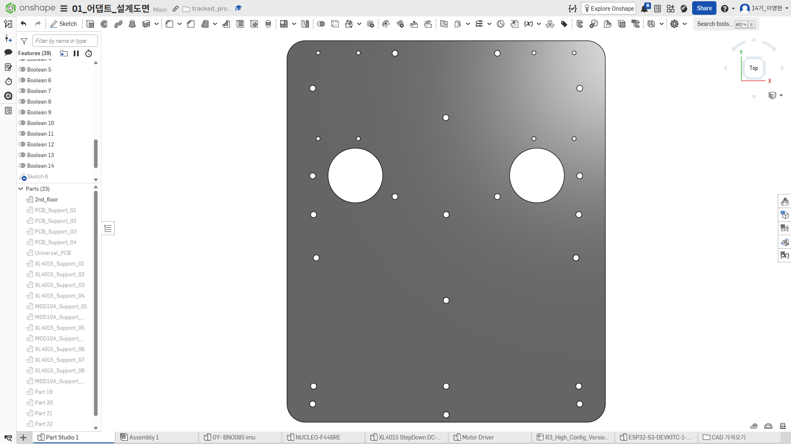
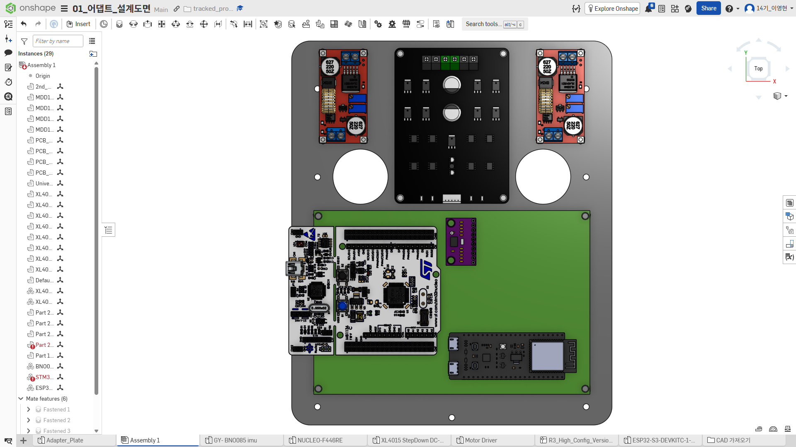
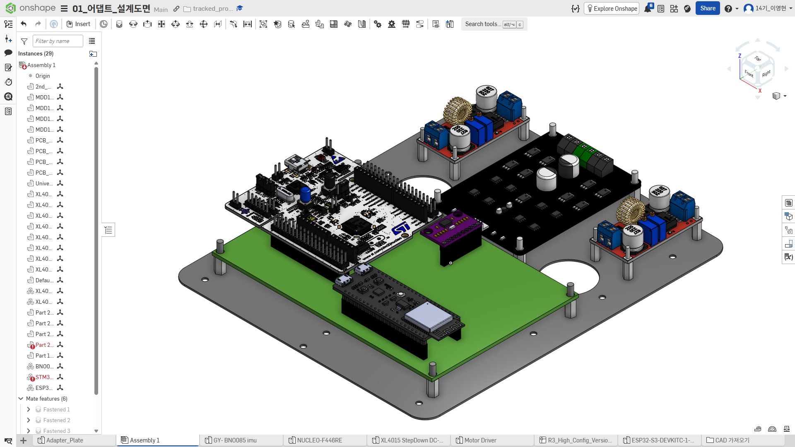

# Adapter Plate and Electronics Layout

## 목적

이 문서는 궤도 셰시의 기존 홀 패턴 위에 장착할 어댑터 플레이트와 전장 모듈의 배치 기준을
기록한다. CAD 화면을 보존하는 데 그치지 않고, 배치 이유와 주문 전에 확인할 항목을 함께 남긴다.

## Status

`REV A FILE PREPARED / ORDER BLOCKED`

- 초기 홀 패턴과 전장 모듈 배치 작성 및 화면 캡처 완료
- Onshape Draft Version 생성 완료: 화면 표기 `dapter-layout_draft01_2026-07-23`
- Rev A DWG, DXF, Onshape PDF, 멀티메이커 작업 SVG와 주문 PDF 출력 완료
- A4 1:1 출력 대조 `USER-CONFIRMED PASS`
- 주문 PDF 벡터 및 원본 대비 배율 검증 `PASS`
- 제작 후보 재질은 아크릴 3T로 변경
- 멀티메이커 서버 업로드 오류로 주문 `NOT SUBMITTED`
- 제작품 실물 fit check `NOT TESTED`

## Design Inputs

| 항목 | 값 | 상태 |
| --- | --- | --- |
| 기준 셰시 도면 | [`source/chassis/R3_High_Config_Version_Tracked_Vehicle_Hole_Pattern_Drawing.dwg`](source/chassis/R3_High_Config_Version_Tracked_Vehicle_Hole_Pattern_Drawing.dwg) | 원본 보존 / CAD 입력에 사용 |
| 어댑터 플레이트 외곽 | 174 x 208.93379 mm | Rev A 반영 |
| 프로젝트 반올림 표기 | 174 x 209 mm | 정보용 |
| 재질 | 아크릴 | 제작 후보 결정 |
| 판 두께 | 3 mm | 제작 후보 결정 |
| 소형 체결 홀 | nominal diameter 3.3 mm | Rev A 반영 |
| 만능기판 외곽 | 150 x 100 mm | Draft 반영 |
| 만능기판 홀 배열 | 55 x 37 | 사용자 실물 확인값 |
| CAD/플레이트 기준 차량 전방 방향 | 미확정 | `OPEN` |
| 도면 좌표 원점 | 미확정 | `OPEN` |

이 문서의 좌·우·상·하 위치 표현은 차량 전방이나 제조 좌표계가 아니라 현재 Onshape Top View 화면을
기준으로 한다.

## Mounted Components

| ID | 부품 | 위치 | 방향 | 고정 방식 |
| --- | --- | --- | --- | --- |
| PS1 | XL4015 #1 | 좌측 상단 | 입출력 단자가 플레이트 상하 방향 | 스페이서 체결 후보 |
| MD1 | MDD10A | 상단 중앙 | 전력 단자가 플레이트 상단 방향 | 스페이서 체결 후보 |
| PS2 | XL4015 #2 | 우측 상단 | 입출력 단자가 플레이트 상하 방향 | 스페이서 체결 후보 |
| MCU1 | NUCLEO-F446RE | 만능기판 좌측 | ST-LINK USB가 왼쪽 방향 | 만능기판 위 체결 |
| MCU2 | ESP32-S3 DevKitC-1 | 만능기판 우측 하단 | USB가 왼쪽 방향 | 핀헤더 체결 후보 |
| IMU1 | GY-BNO085 | 차량 중심에 가까운 위치 | 최종 센서축 표기 필요 | 스페이서 체결 후보 |

## Placement Decisions

- 전력부인 MDD10A와 XL4015 두 개는 플레이트 상단에 분리 배치한다.
- MDD10A는 좌우 구동계 배선을 분기하기 쉬운 상단 중앙에 둔다.
- NUCLEO-F446RE, ESP32-S3, GY-BNO085는 150 x 100 mm 만능기판 위에 배치한다.
- ESP32-S3는 USB 커넥터 접근 방향을 고려해 현재 가로 방향을 유지한다.
- GY-BNO085는 차량의 회전 중심에 최대한 가까워지도록 현재 위치를 유지한다.
- NUCLEO-F446RE는 ST-LINK USB 접근을 위해 만능기판 왼쪽에 배치한다.
- 만능기판은 네 모서리 지지점에 더해 두 가로변 중앙과 기판 중앙의 세 지지점을 추가한다.

## Mounting Hole Status

Draft 01에서 작성한 홀 형상을 Rev A 2D 제조 파일로 출력했다. 정확한 중심 좌표와 형상은 release 폴더의
DWG/DXF를 기준으로 하고, 아래 표는 각 홀 그룹의 용도와 남은 실물 검증을 설명한다.

| Hole group | 용도 | 현재 상태 |
| --- | --- | --- |
| Chassis pattern | 기존 궤도 셰시와 어댑터 플레이트 체결 | A4 1:1 대조 `USER-CONFIRMED PASS`; 제작품 확인 필요 |
| Universal PCB support | 만능기판 네 모서리와 추가 세 지지점 | Rev A 반영; 실제 스페이서와 모듈 간섭 확인 필요 |
| XL4015 support | XL4015 두 개의 절연 스페이서 체결 | Rev A 반영; 실물 체결 확인 필요 |
| MDD10A support | MDD10A 절연 스페이서 체결 | Rev A 반영; 실물 체결 확인 필요 |
| Small mounting holes | M3 체결 여유 홀 후보 | nominal diameter 3.3 mm; 업체 kerf·공차 확인 필요 |
| Large openings | 기존 셰시 형상과 접근 공간 유지 | Rev A 반영; 제작품 간섭 확인 필요 |

정확한 `X`, `Y`와 형상은 Rev A DWG/DXF에서 관리한다. 업체의 kerf 보정, 허용 공차와 실제 체결 부품은
견적 회신 및 제작품 fit check에서 확정한다.

## Clearance Review

| 항목 | Draft 확인 내용 | 남은 검증 |
| --- | --- | --- |
| ESP32 USB | 현재 가로 배치에서 케이블 연결 방향 확보 | 실물 케이블 헤드와 굽힘 반경 확인 |
| NUCLEO USB | 플레이트 왼쪽에서 ST-LINK USB 접근 가능 | 셰시 외벽과 케이블 간섭 확인 |
| 단자대 | XL4015와 MDD10A 단자 나사 상부 노출 | 드라이버 진입 공간 실물 확인 |
| 방열 | 전력 모듈 주위 공간 분리 | 방열판 높이와 덮개 간격 확정 |
| 납땜면 절연 | 만능기판과 플레이트 사이 스페이서 모델링 | 스페이서 높이와 납땜 돌출량 실측 |
| 중앙 지지 | 만능기판 추가 지지점 반영 | 나사 머리와 모듈 간섭 확인 |
| ESP32 안테나 | 오른쪽 방향으로 배치 | 만능기판 구리 패드, 하부 셰시 금속과 배선 영향 검토 |
| IMU 배선 | 차량 중앙에 가까운 위치 확보 | 고전류선 우회와 최종 센서축 확인 |

## CAD Source

| 항목 | 값 |
| --- | --- |
| CAD 서비스 | Onshape |
| 문서명 | `01_어댑트_설계도면` |
| 편집 Workspace | `Main` |
| 캡처에서 확인된 Draft Version | `dapter-layout_draft01_2026-07-23` |
| 의도한 이름 | `adapter-layout_draft01_2026-07-23` |
| Part Studio | `Adapter_Plate` |
| Assembly | `Assembly 1` |
| Rev A release files | [`releases/revA/README.md`](releases/revA/README.md) |

사용자는 2026-07-23 초기 홀 패턴과 전장 어셈블리를 Draft Version으로 생성했다. 별도로 확인한 Version
history 화면의 이름에는 첫 글자 `a`가 빠져 있으므로 Onshape에서 실제 이름을 다시 확인하고 가능하면
의도한 이름으로 바로잡는다. 저장소에는 Onshape의 비공개 문서 URL을 기록하지 않고 문서명과 화면에서
확인한 Version 이름으로 대응시킨다.

### CAD Model Validation

Top View와 Isometric View의 Assembly 트리에 `Assembly 1` 및 일부 참조 인스턴스의 빨간 오류 표시가
보인다. 이 상태는 완전한 3D 전장 Assembly rebuild를 입증하지 않지만, 사용자 지시에 따라 이번 Rev A
2D 발주 범위에서는 제외했다. Rev A 주문 파일은 `Adapter_Plate`의 2D 경로를 별도로 출력해 A4 실물
대조와 원본/최종 PDF 벡터 비교를 통과했으므로 참조 모듈 오류를 2D 플레이트 release blocker로 사용하지
않았다.

저장된 세 이미지는 Version 읽기 전용 화면이 아니라 Version 생성 직전 `Main` workspace에서 캡처했다.
따라서 배치 상태의 시각적 증거로 사용하되, 불변 Version 자체의 증거가 필요하면 Version history 또는
해당 Version의 읽기 전용 화면을 추가로 저장한다.

## Evidence

### Adapter plate hole pattern

174 x 208.93379 mm 어댑터 플레이트의 전체 외곽, 소형 체결 홀, 대형 관통구 배치를 Top View로 보존했다.

### Electronics layout top view

XL4015 두 개, MDD10A, 만능기판, NUCLEO-F446RE, ESP32-S3, GY-BNO085의 상대 위치와 방향을 기록했다.

### Electronics layout isometric view

플레이트, 만능기판, 각 모듈과 스페이서의 적층 관계를 Isometric View로 기록했다.

## Open Items

- CAD/플레이트 기준 차량 전방 방향과 도면 좌표 원점
- 아크릴 색상과 캐스팅/압출 방식
- 업체 kerf, 최소 홀 가공과 허용 공차
- 나사, 너트와 절연 스페이서 규격
- ESP32 안테나 아래 셰시 금속과 구리 패드 영향
- 전원선, 모터선, UART, IMU 배선 경로
- 최종 조립 높이와 덮개 또는 주변 구조물 간섭
- 멀티메이커 대체 파일 접수와 주문 번호

3D Assembly 참조 인스턴스의 빨간 표시는 사용자 지시에 따라 이번 Rev A 2D 발주 범위에서 제외했다.
향후 3D 배치 설계를 다시 사용할 때만 별도로 확인한다.

## Order Release Result

| Gate | Result |
| --- | --- |
| Rev A 2D 외곽과 홀 형상 출력 | `PASS` |
| A4 1:1 셰시 대조 | `USER-CONFIRMED PASS` |
| DWG/DXF/Onshape PDF 보존 | `PASS` |
| 멀티메이커 주문 PDF 벡터·배율 검증 | `PASS` |
| 아크릴 3T 선택 | `DECIDED` |
| 업체 kerf·공차·세부 재질 확인 | `OPEN` |
| 업체 파일 업로드 | `BLOCKED` |
| 주문 접수 | `NOT SUBMITTED` |
| 제작품 실물 fit | `NOT TESTED` |

상세 절차와 수치는 [`02_Adapter_Plate_RevA_Manufacturing_Preflight_ko.md`](02_Adapter_Plate_RevA_Manufacturing_Preflight_ko.md)를 기준으로 한다.

## Revision History

| Rev | 날짜 | 상태 | 변경 내용 |
| --- | --- | --- | --- |
| Draft 01 | 2026-07-23 | `DRAFT / CAD CHECK REQUIRED` | 209 x 174 mm 플레이트, 홀 패턴, 전장 모듈 배치와 스페이서 구성 기록; Assembly 오류 표시 미해소 |
| Rev A | 2026-07-24 | `ORDER FILE PASS / ORDER BLOCKED` | 아크릴 3T, 외곽 174 x 208.93379 mm, 소형 홀 3.3 mm, 1:1 출력 및 주문 PDF 검증 완료; 업체 서버 오류로 미접수 |
