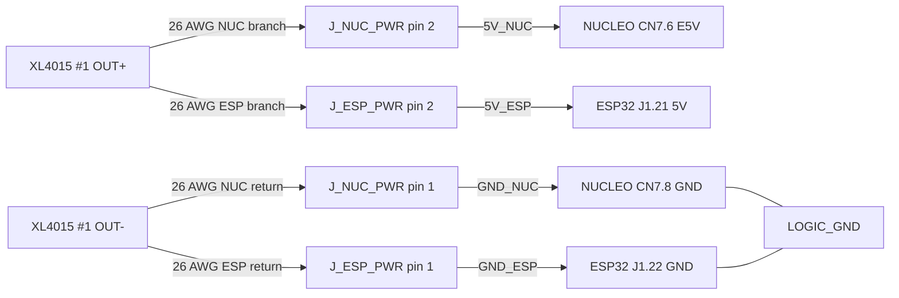

# XL4015 #1 Dual-Board Power Distribution Plan

- 작성일: 2026-09-08
- 상태: `DUAL-2P SOURCE HARNESS + NUCLEO/ESP32 POWERED FUNCTION OPERATOR-REPORTED PASS / LOAD-RELEASE EVIDENCE OPEN`
- 대상: RevC 만능기판의 NUCLEO-F446RE와 ESP32-S3-DevKitC-1 standalone 5 V 공급
- 제외: XL4015 #2 `AUX_5V`, motor-current path, 최종 fuse/connector/wire release

## 1. 목적

XL4015 #1의 5 V 출력을 NUCLEO `E5V`와 ESP32 `5V`에 공급하면서 다음 기존 전원 계약을
동시에 보존한다.

- Standalone mode: XL4015 #1이 두 board를 공급하고 모든 USB는 분리한다.
- Development mode: 두 board를 각각 USB로 공급하며 UART TX/RX/GND만 공유하고 5 V rail은
  서로 연결하지 않는다. 무전원 전환 중 NUCLEO는 `JP5=PWR-U5V`, `JP1=open`으로 복귀시킨다.
- NUCLEO external-power mode는 `JP5=PWR-E5V`, `JP1=open`이다.
- XL4015 #1 OUT+와 XL4015 #2 `AUX_5V`는 합치지 않는다. Logic GND는 지정된 common GND를 쓴다.
- 전원 source 전환은 OFF, cable 분리, rail 0 V 확인 뒤에만 수행한다.

NUCLEO E5V의 공식 입력 범위는 `4.75~5.25 V`, 최대 입력 전류는 `500 mA`다. ESP32-S3
DevKitC-1은 USB, 5V/GND header, 3V3/GND header의 전원 방식을 상호 배타적으로 사용한다.

- ST: [UM1724 Rev 17, NUCLEO-64 external E5V](https://www.st.com/resource/en/user_manual/um1724-stm32-nucleo64-boards-mb1136-stmicroelectronics.pdf)
- Espressif: [ESP32-S3-DevKitC-1 v1.1 user guide](https://docs.espressif.com/projects/esp-dev-kits/en/latest/esp32s3/esp32-s3-devkitc-1/user_guide_v1.1.html)

## 2. 현재 확인된 endpoint

아래 좌표는 모두 **component-side hole identity**다. Solder-side mirrored PDF에서는 화면상 좌우가
바뀌어도 `C` 번호를 다시 계산해 바꾸지 않는다.

| Load | 공식 board pin | VeroRoute 후보 hole | 근거와 상태 |
| --- | --- | --- | --- |
| NUCLEO 5 V input | CN7 pin 6 `E5V` | `C8,R28` | CN7 even row mapping과 UM1724 대조; solder 전 실물 continuity 확인 필요 |
| NUCLEO return | CN7 pin 8 `GND` | `C9,R28` | 같은 mapping; solder 전 확인 필요 |
| ESP32 5 V input | J1 pin 21 `5V` | `C32,R26` | 공식 J1 표와 2026-08-14 실물 방향 대조; solder 전 continuity 확인 필요 |
| ESP32 return | J1 pin 22 `GND` | `C31,R26` | 같은 대조; solder 전 확인 필요 |
| 기존 검증 Logic GND reference | NUCLEO CN10 pin 20 `GND` | `C15,R4` | 기존 5-Net independent review PASS |

현재 corrected RevC PDF에서 위 네 power hole에는 새 colored Net/Wire가 없다. 즉 #1 logic-power
distribution은 아직 digital layout에도 추가되지 않았다. 2026-08-14 사진은 socket 위치 확인에는
사용할 수 있지만 이후 solder-side 점유 상태를 증명하지 않는다.

### 2.1 2026-09-08 first layout review

사용자가 저장한 첫 전원배선 WIP와 component-side PDF를 독립 대조한 결과는 `FAIL`이다.

- VRT: `Tracked_Mobile_Robot_Perfboard_RevC_Estop_XL4015_1_DualBoardPower_WIP.vrt`
  - 128,830 bytes
  - SHA-256 `3428D13A39A892F38A5A42C8D30DB2FF152879C12BDC7CAF972CD6CA235A3E79`
- PDF: `exports/Tracked_Mobile_Robot_Perfboard_RevC_Estop_XL4015_1_DualBoardPower_WIP.pdf`
  - 155,186 bytes
  - SHA-256 `287CA1E281C336F6C1778B940645D2F36CD0CFCDFFE554357C36DFED7FAC82D8`
  - VeroRoute/Qt 생성 시각은 VRT 저장 16초 뒤이며, 보이는 배치와 VRT decode가 일치한다.

| Net | 첫 WIP 실제 종점 | 판정 및 수정 종점 |
| --- | --- | --- |
| `5V_NUC` | `C8,R28` | PASS; 유지 |
| `GND_NUC` | `C9,R28` | PASS; 유지 |
| `5V_ESP` | `C32,R35` | **FAIL**; `C32,R26`으로 이동 |
| `GND_ESP` | `C31,R35` | Adjacent lower-header GND지만 계획 pair가 아님; `C31,R26`으로 이동 |

ESP32 실물의 USB-left orientation과 Espressif 공식 header table을 대조하면 `R35` 왼쪽 끝 두
hole은 J3의 두 GND end pin이다. 따라서 첫 WIP는 `5V_ESP`를 실제 GND인 `C32,R35`에 연결한다.
Module을 꽂고 이 상태에 전원을 인가하면 XL4015 #1의 5 V와 GND가 short될 수 있다. 이 WIP는
납땜·전원 인가에 사용하지 않는다. `H_ESP_UP_R26`의 `C31/R26=GND`, `C32/R26=5V` pair로
두 ESP wire를 함께 이동한 새 revision을 다시 검토한다.

위 FAIL hash는 같은 파일명이 03:48에 가리키던 첫 저장본의 역사 기록이다. 사용자는 이후 같은
WIP 파일을 덮어써 수정했다.

### 2.2 2026-09-08 04:14 corrected working-file review

- VRT: 130,113 bytes, SHA-256
  `2DD86CD6F431BEF995D5B8DDC50A2F74E2674FBE34FFF16563E45DB95DF7A410`
- Component-side PDF: 155,443 bytes, SHA-256
  `F3EFFC5753120E816B1D2279753AC70C47109C8E137A25CB4AE5B612C7644364`
- VRT 저장: 04:14:14, PDF 생성: 04:14:29
- `5V_NUC=C8,R28`, `GND_NUC=C9,R28`: PASS
- `5V_ESP=C32,R26`, `GND_ESP=C31,R26`: 이전 R35 오연결 수정, PASS
- `H_ESP_LOW_R35`의 앞 두 hole: 새 전원 Net에서 분리됨
- `5V_NUC`, `5V_ESP`, `AUX_5V`: 서로 다른 node 유지
- 새 solder-side mirrored PDF: 아직 없음

전원 endpoint와 Net 분리의 digital-routing subset은 PASS다. 전체 VRT grid/wire graph 재검사에서도
각 새 5 V Net은 단일 연결 성분이고 dangling endpoint, 비대칭 track bit, 서로 다른 Net을 잇는
edge가 각각 0개였다. GND는 두 새 connector와 board GND를 포함한 하나의 연결 성분이다.

사용자는 좌하단의 `C1,R31/R32`와 `C1,R34/R35` 2-pin 부품 두 개가 의도한 구조라고 확인했다.
각 board를 따로 시험할 수 있도록 board에는 branch별 2P를 두며, XL4015 #1 OUT+/OUT-에서 바로
두 cable pair로 분기해 각 2P로 연결한다. Inline 4P connector는 없다. 첫 review의 board-mounted
continuous 1x4 요구와 이후 inline 4P라고 해석한 내용은 모두 철회한다.

### 2.3 2026-09-08 physical solder checkpoint

- 사용자는 corrected WIP를 기준으로 새 XL4015 #1 board-power path의 납땜 완료를 보고했다.
- 이 보고는 조립 완료 사실만 기록한다. 새 solder-side 사진/export, DMM continuity/isolation 값과
  powered 결과는 아직 없으므로 physical PASS 또는 electrical release로 판정하지 않는다.
- 두 source-side 2P cable의 pin polarity와 XL4015 terminal termination 완료 여부도 이 짧은
  완료 보고만으로 확정하지 않는다.
- 다음 단계는 모든 source, USB, XL4015, NUCLEO와 ESP32 module을 분리하고 잔류전압 0 V를 확인한
  뒤 Gate 6의 branch continuity와 rail isolation을 검사하는 것이다. 그 전에는 전원을 인가하지 않는다.
- 이후 사용자는 세 확인 지점이 모두 `0 V`였고 도통 mode의 절연 검증도 완료했다고 보고했다.
  이를 `ZERO-VOLT + CONTINUITY-MODE ISOLATION GROSS-SHORT SCREEN OPERATOR-REPORTED PASS`로 기록한다. 개별 절연 pair의 Ω/OL 값과
  사진은 제공되지 않았으며 네 branch와 common GND의 end-to-end continuity는 아직 별도 보고 전이다.
- 이 절연 결과의 `5V_NUC <-> 5V_ESP = open` 판정은 두 source 2P가 기판에서 빠진 passive-board
  상태에만 적용한다. 두 2P가 모두 XL4015 #1 분기선에 연결되면 두 +5 V는 source에서 도통되는
  것이 정상이다.

## 3. 권장 topology

기판에서는 두 +5 V branch를 분리하고 XL4015 #1 OUT+/OUT-에서 두 26 AWG cable pair로 바로
분기한다. 각 cable 끝의 2P plug가 해당 board landing에 개별 연결되는 구조다. Inline 4P나
single master disconnect는 없다.

### Dual 2P source-harness contract

| Board connector | Pin 1 | Pin 2 | Board endpoint |
| --- | --- | --- | --- |
| `J_NUC_PWR` | XL4015 #1 OUT- → `C1,R31 GND_NUC` | XL4015 #1 OUT+ → `C1,R32 5V_NUC` | `C9,R28=GND`, `C8,R28=E5V` |
| `J_ESP_PWR` | XL4015 #1 OUT- → `C1,R34 GND_ESP` | XL4015 #1 OUT+ → `C1,R35 5V_ESP` | `C31,R26=GND`, `C32,R26=5V` |

두 2P가 모두 연결되면 `5V_NUC`와 `5V_ESP`는 XL4015 #1 OUT+에서, 두 GND는 OUT-와 board
Logic GND에서 함께 연결된다. 이는 standalone mode의 정상 상태다. NUCLEO 단독 시험은 ESP 2P를,
ESP32 단독 시험은 NUC 2P를 빼서 만든다.

Development dual-USB mode에서는 **두 2P를 모두 기판에서 제거**해야 한다. #1 input switch OFF만으로는
OUT+에 연결된 두 board rail 사이를 끊지 못한다. 두 2P 가운데 하나라도 연결된 상태를 dual-USB
전환 완료로 취급하지 않는다.

## 4. 배치 후보

- `J_NUC_PWR`: component side `C1,R31/R32`, vertical 1x2; pin 1=GND, pin 2=+5 V
- `J_ESP_PWR`: component side `C1,R34/R35`, vertical 1x2; pin 1=GND, pin 2=+5 V
- `R33` gap은 두 branch connector를 구분하고 개별 탈착하기 위한 의도된 간격이다.
- 이전 `C25..C28,R34` 또는 board-mounted continuous 1x4는 철회된 배치 후보다.
- 두 source cable pair는 각각 `26 AWG`를 사용한다. Exact 2P connector family, mating-face 방향,
  pitch, contact rating과 wire exit는 아직 확인 전이다.
- 두 2P는 keyed/shrouded가 권장되며 `NUC`/`ESP`, pin 1 GND/pin 2 +5 V와
  `USB MODE: REMOVE BOTH 2P` label을 남긴다.

두 2P 좌표와 board route는 current corrected WIP에 고정됐고 사용자가 해당 path의 납땜 완료를
보고했다. Exact connector body, wire exit, strain relief, module 탈착 clearance와 solder-side
사진 evidence는 아직 남아 있다. ESP32 antenna 쪽 `C44..C55`에는 새 power wire bundle을 추가하지 않는다.

## 5. Routing 원칙

- `5V_NUC`와 `5V_ESP`는 connector부터 각 board endpoint까지 별도 피복선으로 보낸다.
- NUCLEO를 거쳐 ESP32를 공급하는 daisy-chain은 사용하지 않는다.
- 두 return도 각 board에서 connector/common Logic GND로 돌아오게 하고 motor return current를
  이 경로에 통과시키지 않는다.
- 네 harness conductor는 각각 `26 AWG`를 사용한다. XL4015 #1 OUT terminal의 직접 분기부터
  각 2P까지 `5V_NUC`, `5V_ESP`, `GND_NUC`, `GND_ESP` 네 물리 도체로 보내 두 board의
  합산 전류가 흐르는 단일 26 AWG 공통 trunk를 만들지 않는다.
- XL4015 screw terminal에 두 도체를 종단하는 방식은 terminal의 허용 wire 범위와 실제 clamp
  retention을 확인해 dual-wire ferrule 또는 별도 insulated distribution joint로 확정한다.
  두 개의 느슨한 bare/tinned end를 검증 없이 한 screw 아래에 고정하지 않는다.
- 각 branch의 편도 길이, wire 재질/연선 여부와 insulation marking을 기록한다. 26 AWG 채택은
  실제 동시 startup/steady current, endpoint voltage drop와 wire/terminal 온도 Gate 통과를 조건으로 한다.
- #2 `J3.1/AUX_5V`와 새 5 V branch 사이에는 direct continuity가 없어야 한다.
- 교차하는 기존 Wire/track에는 새 solder junction을 만들지 않는다.
- Exact wire path는 current solder-side 정면사진과 connector dry-fit 뒤 VeroRoute에서 고정한다.
- `TP_5V_NUC`, `TP_5V_ESP`, 접근 가능한 Logic GND 측정점을 connector 또는 endpoint에 남긴다.

## 6. 아직 고정하지 않는 항목

- Connector exact part number, pitch, contact current, locking/keying과 strain relief
- 26 AWG wire의 exact material, strand/insulation rating, branch length와 XL4015-side termination
- `F_LOGIC_OUT` fuse/PTC 값: upstream 10 A motor-branch fuse를 5 V 배선 보호 근거로 사용하지 않으며,
  실제 current와 connector/wire rating 뒤 선정
- 추가 bulk/ceramic capacitor: footprint reserve 후보이며 startup drop/noise 실측 전 필수로 고정하지 않음
- 최종 hole-by-hole underside route

기존 XL4015 #1의 약 1 A/1.8 A electronic-load 기록과 이전 임시 board 연결 PASS는 converter와
그 당시 배선의 근거다. 이번 26 AWG connector harness의 전류, 전압강하 또는 접점 온도를 대신
입증하지 않는다.

## 7. 설계·조립 Gate

1. 두 2P의 mating-face/wire-side 사진, pin-1/key 방향, pitch, body, wire exit, contact rating과
   26 AWG 수용 여부를 기록한다.
2. Current component/solder-side 사진으로 `C1,R31/R32`, `C1,R34/R35`와 Wire corridor의
   비점유를 확인한다.
3. Module을 꽂은 무전원 상태에서 네 power endpoint를 official board pin과 continuity로 확인한다.
4. Corrected VRT에 두 2P connector와 세 Net(`5V_NUC`, `5V_ESP`, `LOGIC_GND`)을 추가하고
   component/solder-side export 및 independent hole review를 끝낸다. 두 2P source harness의
   polarity map은 별도 표로 고정한다.
5. 모든 source와 module을 분리하고 rail 0 V에서 조립한다.
6. NUCLEO와 ESP32 module 및 두 source 2P를 기판에서 분리한 passive-board 상태에서
   `5V_NUC <-> 5V_ESP`, 각 5 V ↔ GND, 각 5 V ↔ `AUX_5V`가 open/no-beep인지 확인한다.
   각 branch와 endpoint, 모든 Logic GND는 low-ohm continuity여야 한다. Module이 꽂힌 상태에서
   측정되는 내부 보호회로 경로를 곧바로 board-side rail tie로 판정하지 않는다.
7. XL4015 #1 input과 두 board를 모두 분리한 상태에서 각 2P의 pin 1→OUT-, pin 2→OUT+
   continuity와 +/− gross-short absence를 확인한다. 같은 polarity끼리는 source split 때문에
   두 2P 사이에 continuity가 정상이다.
8. Board와 분리한 XL4015 #1을 켜 각 2P 끝의 output polarity/약 5.00 V를 확인한 뒤 OFF/0 V로 내린다.
9. USB 없이 NUCLEO 단독, ESP32 단독, 두 board 동시 순서로 endpoint 5 V/3V3, startup,
   steady/peak current, branch voltage drop, wire/connector 온도, reset와 power-off 0 V를 기록한다.
   단독 시험은 상대 2P와 상대 module을 분리하고
   상대 UART TX/RX도 분리한다. 둘 중 한 branch만 공급하는 별도 keyed test plug를 사용할 경우에는
   그 배선과 pin을 먼저 기록한다.
10. Development mode 전환은 전체 전원 OFF, USB 분리와 rail 0 V 확인 → 두 2P 모두 기판에서 제거 →
   NUCLEO `JP5=PWR-U5V`, `JP1=open` 복귀 순서로 수행한다. Module을 제거한 passive carrier에서
   두 5 V branch가 서로 open임을 확인한 뒤 module을 다시 꽂고 각 USB를 연결한다.
11. 이 power-distribution Gate가 통과한 뒤 XL4015 #2를 별도 `AUX_5V`에 연결하고 conditioned
    PC7 LOW/HIGH/open 시험으로 돌아간다.

### 7.1 첫 post-solder 무전원 검사표

검사 상태는 NUCLEO/ESP32 module 제거, 모든 USB·LiPo·bench source 제거, XL4015 #1/#2와
MDD10A B+/motor 분리, 두 source 2P 모두 기판에서 제거다. 먼저 DC V mode로 두 새 5 V rail과 `AUX_5V`의 GND 기준
잔류전압이 모두 약 0 V인지 확인한 뒤 저항/도통 mode로 전환하고 probe-short baseline을 기록한다.

| Probe A | Probe B | Expected |
| --- | --- | --- |
| `J_NUC_PWR.1 C1,R31` | NUCLEO GND `C9,R28` | probe-short baseline에 가까운 low Ω / beep |
| `J_NUC_PWR.2 C1,R32` | NUCLEO E5V `C8,R28` | probe-short baseline에 가까운 low Ω / beep |
| `J_ESP_PWR.1 C1,R34` | ESP32 GND `C31,R26` | probe-short baseline에 가까운 low Ω / beep |
| `J_ESP_PWR.2 C1,R35` | ESP32 5V `C32,R26` | probe-short baseline에 가까운 low Ω / beep |
| `C1,R31` | `C1,R34` | low Ω / beep; common Logic GND의 정상 결과 |
| `C1,R31` | 기존 Logic GND `C15,R4` | low Ω / beep |
| `C1,R32` | `C1,R35` | `OL` / no beep |
| `C1,R32` | `C1,R31` | `OL` / no beep |
| `C1,R35` | `C1,R34` | `OL` / no beep |
| `C1,R32` | `J3.1 AUX_5V C52,R1` | `OL` / no beep |
| `C1,R35` | `J3.1 AUX_5V C52,R1` | `OL` / no beep |

좌표는 component-side hole identity이므로 solder side에서 재더라도 열 번호를 반전해 부르지 않는다.
두 source 2P가 빠진 상태에서도 `C1,R31↔C1,R34`는 board common GND를 거쳐 도통되는 것이
정상이다. `AUX_5V↔GND` 자체는 R13/U1 경로가 있으므로 이
검사에서 open 조건으로 사용하지 않는다. 절연 항목이 beep/low Ω이거나 도통 항목이 open이면
전원을 인가하지 않고 해당 joint와 인접 hole을 먼저 수정한다.

사용자는 잔류전압과 절연 subset에 이어 위 표의 첫 여섯 continuity 항목도 모두 통과했다고
보고했다. 따라서 기판에 납땜한 새 두 branch의 post-solder unpowered Gate는
`OPERATOR-REPORTED PASS`다. 개별 continuity Ω 값과 사진은 제공되지 않았다. 이 판정은 dual-2P
source-harness polarity/termination과 powered validation을 포함하지 않는다.

### 7.2 Source harness and powered result

- 각 2P pin 1→XL4015 #1 OUT-, pin 2→OUT+ continuity/polarity와 +/− gross-short 부재는
  operator-reported PASS다.
- Board 연결 전 #1 OUT와 각 board 2P/endpoint에서 `5.02 V`를 확인했다.
- USB-free NUCLEO-only: OUT/E5V `4.97/4.97 V`, STM32 3V3 `3.30 V`, ESP rail `0 V`.
- USB-free ESP32-only: OUT/ESP 5V `4.97/4.97 V`, ESP 3V3 `3.27 V`, NUC rail `0 V`.
- USB-free combined: OUT `4.95 V`, NUC E5V `4.94 V`, STM32 3V3 `3.30 V`,
  ESP 5V `4.95 V`, ESP 3V3 `3.27 V`.
- Power 제거 뒤 안내한 모든 rail `0 V`를 확인했다.

기능·전압 subset은 통과했다. Startup/steady current, branch voltage drop, connector/wire 온도,
reset/brownout raw log와 사진은 기록되지 않아 26 AWG·connector의 최종 release는 계속 OPEN이다.
상세 결과는 [report 25](../docs/verification/25_XL4015_Logic_Power_and_Physical_EStop_Conditioned_Sense_Test_Report_2026-09-08_ko.md)를 따른다.

## 8. PASS 경계

- 두 2P가 개별 board 시험을 허용하고, 둘을 모두 제거했을 때 dual-USB rail separation을 보장한다.
- NUCLEO E5V는 모든 tested state에서 `4.75~5.25 V`였고 두 board 단독·동시 기능 시험이 통과했다.
- 새 connector/wire의 voltage drop, current와 온도 evidence는 아직 OPEN이다.
- #1 positive branch, #2 `AUX_5V`, motor power가 의도하지 않게 연결되지 않는다.
- 이 PASS는 logic-power distribution만 승인하며 Physical E-stop, motor rail과 motor-load PASS를
  대신하지 않는다.
