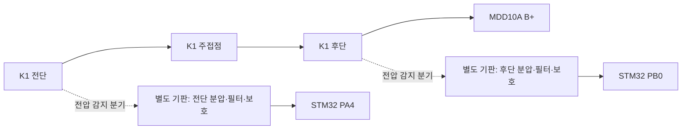

# PA4·PB0 전압 측정 회로의 공간 검토

검토일: 2026-09-30. 상태: **배치 가능성 분석·후속 구성 제안**. 회로 값·실장 위치 확정이나 납땜 지시가 아니다.

이후 사용자가 제안한 150×100 mm 기판 추가 적층은 [2층 확장 검토](13_Two_Deck_Perfboard_Expansion_Feasibility_2026-09-30_ko.md)에서 비교한다.
아래 40×50 mm는 ADC 전용 기판의 초기 공간 예산이며, 이미 구매·제작 방식으로 확정된 것은 아니다.

## 판단

현재 기판에 빈 홀은 있지만, **기존 배선을 유지하면서 두 채널의 분압·필터·보호회로와 커넥터를 한곳에 넣을 여유는 확인되지 않았다.**
STM32 아래에 낮은 부품을 분산 배치할 가능성은 있으므로 물리적으로 불가능하다고 단정하지 않는다.
다만 유지보수와 아날로그 배선을 고려하면 **STM32 가까이에 별도 소형 측정 기판을 고정하는 방식**을 우선 추천한다.
기존 만능기판 전체를 다시 제작할 필요는 없다.

## 확인한 자료와 한계

- 현재 [ENC Conditioning VRT](VeroRoute/Tracked_Mobile_Robot_Perfboard_RevC_Estop_Logic_Power_UART_Debug_ENC_Conditioning_WIP.vrt): 182,515 bytes,
  SHA-256 `09c1546d04eeaf581bc55ea9717965a56fd6dac742b565f9796924bdf8fbef78`.
- [동일 이름 PDF](VeroRoute/exports/Tracked_Mobile_Robot_Perfboard_RevC_Estop_Logic_Power_UART_Debug_ENC_Conditioning_WIP.pdf): 172,045 bytes,
  SHA-256 `a1270433c9a32a66658fc0240427429ebc1f634962021ceea11499acb58d06ad`.
- 두 파일은 [report 28](../docs/verification/28_Encoder_Conditioning_Assembly_and_Electrical_Check_Report_2026-09-23_ko.md)의 최종 식별값과 일치한다.
  PDF 전체·확대 화면과 VRT의 관련 헤더·저항·커넥터 레코드를 확인했다. 이번 검토에서 전체 Net 검사를 새로 실행한 것은 아니다.
- 부품 몸체는 [기존 배치 모델](../assets/photos/perfboard/image.png)과 [사진 기반 점유 지도](06_Perfboard_Photo_Derived_Occupancy_and_Pulldown_Dry_Placement_ko.md)를 함께 봤다.
  이 자료는 최근 납땜 후 실물 사진이 아니므로 현재 점퍼의 실제 높이·방향과 하부 여유는 미확인이다.
- 좌표는 component side의 C=열/R=행, 55×37홀, 2.54 mm pitch다. PDF의 표시 좌표와 report 28을 기준으로 삼았다.
  VRT 내부 저장 좌표에는 표시 영역 원점 차이가 있어 그대로 실물 홀 번호로 사용하지 않았다.

## 현재 영역별 분석

| 영역 | 확인된 점유·제약 | 추가 실장 판단 |
| --- | --- | --- |
| 좌하단 C11~22/R31~37 및 주변 | R1~R8, 엔코더 신호·GND 점퍼, R34/R35 전원 배선, 하단 JDBG | 저항 8개를 추가하기 전의 빈 공간으로 취급할 수 없다. 두 ADC 채널의 우선 후보에서 제외 |
| 우하단 C31~52/R26~35 안쪽 | PDF는 넓게 비어 보이지만 ESP32 보드 몸체가 덮음 | 현재 시험 때문에 ESP를 기판 밖에 뺀 상태도 영구 여유 공간으로 계산하지 않음 |
| 우상단 C35~55/R1~17 | CTRL·IMU·JENC·JESTOP 커넥터, R9~R13, 다수의 수평·수직 배선 | 구멍이 산재하지만 커넥터 몸체·케이블 출구를 포함한 두 채널 연속 공간은 확보하지 못함 |
| 중앙 C29~44/R18~24 | U1·R14·K2·D2와 제어 배선 | 기존 제어회로 재배치가 필요해 우선 후보에서 제외 |
| 우측 C45~54/R18~22 부근 | 일부 빈 홀이 있으나 R18·R20·R22 배선과 세로 배선으로 분할 | 전체 보호회로보다 작은 부품 일부만 들어갈 가능성. 커넥터·출력 배선까지 포함하면 불리 |
| STM32 아래의 빈 구간 | 예: C8~13/R9~13은 PDF상 빈 후보. 6×5홀, 홀 중심 간 약12.7×10.2 mm이며 NUCLEO 몸체 아래 | 낮은 부품 일부의 가능성만 남김. 보드 밑면·리드·기존 점퍼 높이와 탈착성을 실물로 확인해야 함 |

과거 점유 지도의 “우상단이 가장 큰 빈 영역”은 부품 추가 전의 판단이다. 현재 CTRL/IMU/JENC와 제어 배선을 덮어놓고 재사용할 수 없다.
Flying Wire의 대각선은 연결 관계 표기이므로 실제 점퍼가 그 직선대로 놓였다고 가정하지 않았다.

## 회로에 필요한 공간

[기존 회로 구조](../01_System_Architecture/25_Physical_EStop_RevB_Circuit_Architecture_ko.md)의 CD-ESTOP-005를 따르면,
채널당 상단 분압 저항 2개·하단 저항 1개·입력 직렬 저항 1개·필터 커패시터 1개를 계획하고 있다.
따라서 두 채널은 **저항 8개·커패시터 2개에 보호소자·커넥터·측정점 공간을 더해서** 검토해야 한다.
보호소자의 개수와 패키지는 미정이며, 단순 분압 저항 4개만 놓아보고 “자리 충분”으로 판단하지 않는다.

| 구성 | 장점 | 필요한 조건·한계 |
| --- | --- | --- |
| 기존 만능기판에 분산 실장 | 별도 기판 고정물이 필요 없음 | STM32 하부 높이 확인, 기존 점퍼와 간섭 해소, 긴 아날로그 경로·수리 접근성 검토 필요 |
| 별도 측정 기판 — 추천 | 두 채널을 묶어 조립·검사·교체 가능, 기존 납땜 수정 최소화 | STM32 근처 고정 공간·케이블 출구 필요. 기판만 분리한다고 잡음 문제가 자동 해결되지는 않음 |
| 향후 통합 PCB | 기능별 배치·접지·커넥터를 다시 설계 가능 | 현재 기능 검증 뒤 검토할 후속 작업. 이번 확장의 선행 조건은 아님 |

## 추천 구성

별도 기판은 **약40×50 mm를 초기 배치 검토 크기**로 잡는다. 보유 부품의 실제 크기·보호회로·고정홀을 대입하기 전의 공간 예산이며 최소 크기나 구매 규격 확정은 아니다.
기존 기판 밑이나 ESP 안테나 위에 겹쳐 놓기보다, 섀시에서 STM32의 A2/A3 접근부에 가까운 위치를 먼저 검토한다.
현재 자료로 섀시의 고정 좌표까지 확정할 수는 없다.

모터 주전류는 기존 K1→MDD 경로로 흐르고 측정 기판에는 감지 분기만 들어간다. 두 입력은 각각 독립된 분압 경로를 사용한다.
그림에서 생략한 GND는 STM32의 공통 기준에 연결하되 측정 귀환선에 모터·릴레이 코일의 부하 전류가 흐르는 경로를 만들지 않는다.
감지 분기선의 보호 방식·커넥터 극성·입력과 출력의 구분은 회로 설계 때 함께 정한다.

연결부는 다음 구성을 후보로 삼는다.

- 입력: K1 전단 감지 / K1 후단 감지 / 공통 GND. 배터리 전압 영역이다.
- 출력: 전단 ADC / GND / 후단 ADC / GND의 4핀 후보. 두 GND는 같은 기준이며 신호별 귀환 배선을 붙이기 위한 구성이다.
  이후 [층간 연결 초안](13_Two_Deck_Perfboard_Expansion_Feasibility_2026-09-30_ko.md#인출-접점-대조와-우선-배선안)에서는 공통 GND 한 가닥의 3핀 최소안을 함께 검토했다. 4핀안을 폐기하거나 3핀을 구매·배선 규격으로 확정한 것은 아니며 실제 길이·경로를 정한 뒤 선택한다.
- STM32까지의 아날로그 배선은 짧게 하고 PWM·모터 동력선과 묶어 길게 평행 배치하지 않는다.
  MCU 쪽 추가 RC가 필요한지도 배선 길이·ADC 샘플링 조건과 함께 검토한다.

이는 ST의 아날로그/디지털 배치 분리와 짧은 부품 리드 권고를 현재 배치에 적용한 제안이다.
[ST AN2834 Rev10, §4.2.13~4.2.14](https://www.st.com/resource/en/application_note/an2834-how-to-optimize-the-adc-accuracy-in-the-stm32-mcus-stmicroelectronics.pdf).

## STM32 연결 접근성

| 신호 | STM32 보드 접점 | 현재 VeroRoute 헤더·홀 | 저장 레코드 |
| --- | --- | --- | --- |
| PA4 | CN8 A2 / CN7 pin32 | H_NUC_LOW_R28 Pin16, C21/R28 | Net0, ADC 배선 미배정 |
| PB0 | CN8 A3 / CN7 pin34 | H_NUC_LOW_R28 Pin17, C22/R28 | Net0, ADC 배선 미배정 |

보드 접점은 [UM1724 Rev17 표19·표29](https://www.st.com/resource/en/user_manual/um1724-stm32-nucleo64-boards-mb1136-stmicroelectronics.pdf),
홀 대응은 [기존 CN7 좌표 대조](09_Perfboard_KiCad_to_VeroRoute_Independent_Review_2026-08-15_ko.md)와 현재 PDF/VRT를 함께 확인했다.
VRT의 Pin14/15=Net21/22도 기존 PA0/PA1 엔코더 기록과 일치한다. 핀이 비어 있다는 것은 주변 점퍼까지 간섭이 없다는 뜻은 아니다.

만능기판에 새 커넥터를 억지로 넣지 않고 **별도 기판의 출력 케이블을 NUCLEO 상면 A2/A3·GND에 연결하는 방법**도 있다.
이는 초기 검증의 대안이며 최종 케이블은 진동·당김에 대한 고정과 극성 구분을 포함한다.
이후 공간이 확인되면 위 헤더 위치에서 영구 하네스를 인출할 수 있다. 배터리 전압을 PA4/PB0에 직접 연결하지 않는다.

## 이후 진행 순서

1. 기존 기판을 유지하고 별도 측정 기판을 쓸지 정한다. 기존 기판 내부를 우선한다면 STM32 하부 실제 높이와 점퍼 배치를 먼저 확인한다.
2. 전단·후단 두 채널을 함께 배치할 공간과 고정홀·입출력 커넥터를 잡고, PA4만 먼저 구현하더라도 PB0 자리를 남긴다.
3. 최대 입력·과도전압, ADC 샘플 시간, RC 응답, MCU 무전원 시 역급전 조건으로 부품 값·보호회로를 확정한다.
   값·보호회로가 미정인 동안은 공간 예약이며 납땜 완료 도면으로 취급하지 않는다.
4. 새 도면에서 회로/배치 검토 → 사용자 조립 → STM32 연결 전 분압 확인 → 사용자 ADC 코드·빌드 → DMM 대조 순서로 검증한다.
5. 첫 주행 전 저전압 경고·정지에 PA4를 사용할지는 그 단계의 입력 경로 결정에 포함한다. PB0와 이중 전압 자동 진단의 기존 post-MVP 분류는 이 공간 검토만으로 변경하지 않는다.

이번에는 VRT/PDF·실물 배선·펌웨어를 변경하지 않았다. 빈 홀의 존재와 실제 조립 가능성, 전기적 동작 검증을 구분한다.
