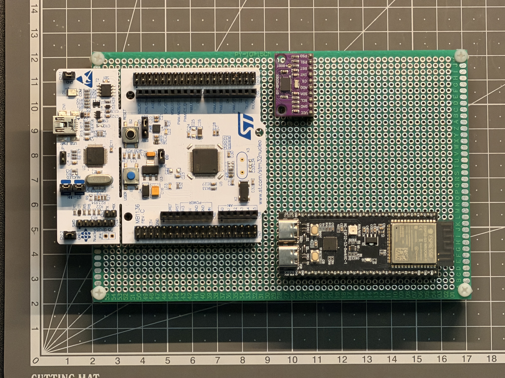
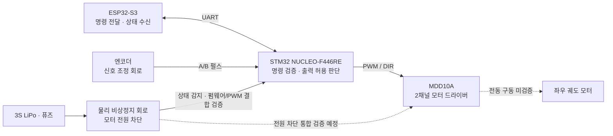

# Tracked Mobile Robot

STM32와 ESP32-S3를 기반으로 **궤도형 모바일 로봇의 하위 구동 플랫폼**을 개발하는 프로젝트다.
UART 명령 처리, PWM/DIR 출력, 엔코더 피드백과 물리 비상정지 회로를 단계적으로 구현·검증한다.
목표는 저속 주행과 정지 동작을 검증하고, 이후 ROS 2 기반 상위 시스템으로 확장하는 것이다.

- **담당:** 이영현 (`pr0ved99`) — 요구사항·인터페이스 설계, STM32/ESP32 펌웨어 구현,
  전장·기구 배치, 배선·납땜, 보드 빌드·플래시와 실측 검증.
- **작업 방식:** 설계·코드 검토와 로그 해석에 Codex를 활용하며, Python 검증 코드와 문서 정리에 지원을 받는다.
- **현재 단계:** 영구 배선을 통한 엔코더 손회전·좌우 대응 확인 후, 첫 단일 모터 시험을 위한 수동 명령 코드를 작성 중이다. 실모터 구동과 주행 검증은 남아 있다.

**바로 보기:** [STM32 펌웨어](03_Firmware/stm32_uart_mvp/Core/Src/) ·
[ESP32 UART 브리지](03_Firmware/esp32_uart_bridge/main/hello_world_main.c) ·
[Python 검증 코드](03_Firmware/tests/) · [대표 계측 보고서](docs/verification/10_STM32_Active_DISARM_Shutdown_Latency_Test_Report_2026-08-04_ko.md)

## 1. 프로젝트 목표와 범위

첫 MVP는 UART 명령으로 전진·후진·제자리 회전하는 저속 궤도형 플랫폼이다.
명령 유실과 비상정지 상황에서 출력을 차단하고, 엔코더 기반 속도·거리 추정 결과를 실제 움직임과 비교한다.

| 첫 MVP에 포함 | 완료 판단 기준 |
| --- | --- |
| 좌우 구동과 엔코더 | 두 모터 제어, 방향·속도 추정, 전동 구동 중 신호 검증 |
| 명령 처리와 정지 | timeout 뒤 출력·저장 명령 초기화, 명시적인 재허가와 새 명령으로만 복구 |
| 전원과 물리 비상정지 | 모터 에너지 차단, 해제만으로 자동 재시작하지 않는 동작 검증 |
| 기구 통합과 주행 | 제작 플레이트 장착, 저속 주행, 1 m 직진의 실제·엔코더 거리 오차 기록 |

완료 여부는 [MVP 요구사항·검증 매트릭스](docs/verification/05_Final_MVP_Requirements_and_Verification_Matrix_ko.md)에서 추적한다.

## 2. 하드웨어와 시스템 구조

*2026-08-14 모듈 배치 확인 단계. 당시 NUCLEO·BNO085·ESP32-S3의 위치를 보여준다.
9월의 비상정지·측정 헤더 배선 개정 전 사진이며, IMU 동작 검증을 의미하지 않는다.*

아래는 목표 시스템의 핵심 연결 관계다. 점선은 전동 구동·통합 검증이 남은 경로다.

### 핵심 설계 판단

| 판단 | 이유와 구현 방향 |
| --- | --- |
| **최종 출력 허용 판단은 STM32가 담당** | 외부 명령이 들어와도 명령 유효성, 제어 상태, timeout과 비상정지 조건을 STM32에서 확인한 뒤 출력한다. ESP32는 명령 전달과 상태 수신을 맡는다. |
| **명령 유실 뒤 이전 주행 명령을 자동 복원하지 않음** | 통신 복구만으로 예기치 않게 다시 움직이지 않도록 출력과 저장 명령을 0으로 만들고 `DISARMED`로 전환한다. 새 `ARM`과 유효한 `CMD`를 모두 받아야 출력할 수 있다. |
| **물리 전원 차단과 펌웨어 상태 감지를 함께 사용** | MCU 소프트웨어와 독립된 모터 에너지 차단 경로를 두고, STM32도 비상정지 상태를 감지·유지해 재허가 조건을 검사한다. 두 경로를 결합한 전체 검증은 진행 중이다. |

세부 계약: [UART 인터페이스](01_System_Architecture/09_STM32_ESP32_UART_Interface_Contract_ko.md) ·
[상태 머신](01_System_Architecture/16_Control_Loop_and_State_Machine_ko.md) ·
[물리 비상정지 설계](01_System_Architecture/21_Physical_EStop_Architecture_ko.md)

## 3. 대표 구현과 검증 성과

각 결과는 아래에 명시한 시험 조건의 결과다. 코드 검사, 로직 핀 계측, 실제 모터 정지를 구분한다.

### 3.1 DISARM 명령에 따른 PWM 출력 차단

- **검증 문제:** 상태 로그만으로 알기 어려운 실제 PWM 차단 시점을 확인한다.
- **방법:** 유효한 `DISARM` 프레임 수신 완료와 두 PWM의 마지막 active edge를 같은 4 MHz 로직 캡처에서 비교했다.
- **결과:** 두 PWM 출력이 비활성화되기까지 **23.50 μs**를 측정했다.
- **범위:** STM32 MCU 로직 핀 계측 결과다. 실제 모터 정지 시간은 측정하지 않았으며,
  당시 전원·모터 분리 상태의 증거 보완은 보고서에 남아 있다.

[시험 조건·파형·원본 캡처](docs/verification/10_STM32_Active_DISARM_Shutdown_Latency_Test_Report_2026-08-04_ko.md)

### 3.2 영구 배선을 통한 PWM/DIR 전달

- **검증 문제:** 만능기판의 pull-down과 하네스를 거쳐도 제어 신호가 드라이버 입력에 전달되는지 확인한다.
- **방법:** 모터를 분리하고 MDD10A 입력에서 두 채널의 PWM과 방향 전환 구간을 계측했다.
- **결과:** PWM **19.049 / 19.058 kHz**, 약 **10% 듀티**, DIR 전환 전후 약 **2 ms의 PWM 0 구간**을 확인했다.
  시험 설정 복구 후 5초 동안 모든 제어 신호가 LOW인 상태도 확인했다.
- **범위:** MDD10A 로직 입력까지의 결과다. 전력 출력과 실제 회전 방향·정지는 후속 검증 대상이다.

[시험 보고서와 원본 자료](docs/verification/17_Final_Perfboard_Active_DIR_PWM_and_Safe_Restore_Test_Report_2026-08-18_ko.md)

### 3.3 명령 유실 후 정지와 명시적 복구

- **검증 문제:** 명령이 끊긴 뒤 과거 명령이나 `ARM`만으로 출력이 되살아나는 것을 막는다.
- **방법:** 모터·LiPo 분리 조건에서 `timeout_ms=500`인 명령을 사용하고 UART와 PWM/DIR을 같은 캡처로 비교했다.
- **결과:** timeout 뒤 출력·저장 명령 0과 `DISARMED` 전환, `CMD` 단독 거부,
  `ARM`만으로 이전 출력이 복원되지 않음, **새 `ARM` + 새 `CMD`에 의한 복구**를 확인했다.
- **범위:** 보드의 UART·제어 신호·상태 복구 검증이며, 실제 모터나 물리 비상정지 시험은 포함하지 않는다.

[500 ms timeout·복구 시험](docs/verification/21_REQ_SAFE_004_500ms_Command_Timeout_and_Recovery_Target_Runtime_Test_Report_2026-08-28_ko.md)

### 3.4 수동 회전 기반 엔코더 환산 검증

- **검증 문제:** 모터 출력축 회전량과 펌웨어의 카운트·속도 환산을 연결한다.
- **방법:** 두 모터의 출력축을 방향별 50회전시킨 관찰 기록과 별도의 수동 회전 로그를 사용했다.
- **결과:** 출력축 기준 **1,560 counts/rev**로 보정했다.
  별도 로그의 **610개 채널 샘플**에서 카운트/초(CPS) → 0.001 rpm 단위(mRPM) 환산 불일치는 0건이었다.
- **범위:** 수동 회전 기반 기능 검증이다. 전동 구동 중 노이즈, 외부 회전계 비교와 실제 주행 거리 검증은 남아 있다.

[50회전 관찰 기록·환산 검증·로그](assets/logs/encoder/2026-07-30_encoder_output_shaft_calibration_and_millirpm_verification.md)

## 4. 현재 검증 범위와 남은 작업

**문서 정리 기준: 2026-09-27.** 아래 상태는 기록된 검증 범위이며 현재 보드의 전원·배선 상태를 대신하지 않는다.

| 분야 | 확인된 범위 | 남은 핵심 검증 |
| --- | --- | --- |
| 통신·펌웨어 | UART 명령 처리·timeout 복구·비상정지 latch/reset·PWM 차단 및 안전 이미지 복구 | 남은 통합 시험과 실제 구동 조건의 검증 |
| 구동·피드백 | MCU/드라이버 입력 PWM·DIR, 영구 배선의 실제 엔코더 손회전·좌우 대응·전진 부호 | 실모터 무부하 구동·전동 방향·노이즈 |
| 물리 비상정지 | 감지–펌웨어–PWM 결합 및 모터 분리 전력단의 하위 시험 | rail-off 수용 기준과 전체 T005A, 실제 모터 정지 |
| 측정 배선 | UART·CTRL·ENC·IMU 배선, 엔코더 입력 조정부 검사, 양쪽 +5.05V와 실제 A/B LOW0V/HIGH 약2.86V | IMU 전원·모드·센서 동작 |
| 기구·주행 | 어댑터 플레이트 설계와 제작품 수령 기록 | 실물 장착, 배터리 ADC·저전압 동작, 저속 주행과 1 m 거리 비교 |

다음 순서는 **M1 수동 시험 코드 완성·콘솔 입력 확인 → 전력단·고정 조건 확인과 단일 모터 시험 →
양쪽 구동계·기구 통합과 주행 검증**이다. ESP 소스는 현재 사용자 입력 중인 미완성 체크포인트이며 새 빌드·플래시 결과는 없다.

재개 지점과 파일별 검토 범위는 [현재 작업 현황](docs/handoff/CURRENT_SESSION_CONTEXT.md),
일자별 결과는 [진행 기록](docs/progress/README.md)에서 관리한다.

## 5. 코드와 문서 안내

### 구현 코드

| 살펴볼 내용 | 진입점 |
| --- | --- |
| STM32 초기화·주기 처리 | [main.c](03_Firmware/stm32_uart_mvp/Core/Src/main.c) · [CubeMX 설정](03_Firmware/stm32_uart_mvp/stm32_uart_mvp.ioc) |
| 명령 검증·상태 전이·timeout | [UART 프로토콜](03_Firmware/stm32_uart_mvp/Core/Src/uart_mvp_protocol.c) |
| 좌우 명령 변환·출력·엔코더 | [명령 변환](03_Firmware/stm32_uart_mvp/Core/Src/drive_command_mapper.c) · [PWM/DIR](03_Firmware/stm32_uart_mvp/Core/Src/motor_output.c) · [엔코더](03_Firmware/stm32_uart_mvp/Core/Src/encoder_speed.c) |
| ESP32 UART 브리지 | [프로젝트 안내](03_Firmware/esp32_uart_bridge/README.md) · [구현 코드](03_Firmware/esp32_uart_bridge/main/hello_world_main.c) |
| Python 검증 | [검증 코드](03_Firmware/tests/) · [실행 방법](03_Firmware/tests/README.md) |

Python 검사는 소스 계약과 독립 참조 모델을 검사한다. 보드 빌드·실행이나 전기적 계측을 대신하지 않는다.
시험용 설정과 빌드·실행 전제는 [현재 현황](docs/handoff/CURRENT_SESSION_CONTEXT.md)과 해당 런북을 따른다.

### 설계·검증·학습 자료

| 읽는 목적 | 문서 |
| --- | --- |
| 전체 구조와 설계 결정 | [시스템 인터페이스 맵](01_System_Architecture/11_System_Block_Diagram_and_Interface_Map_ko.md) · [설계 결정 기록](01_System_Architecture/19_Architecture_Decision_Record_ko.md) |
| 전기·기구 설계 확인 | [VeroRoute](09_Electrical_Design/VeroRoute/README.md) · [KiCad](09_Electrical_Design/KiCAD/Tracked_Mobile_Robot_Wiring_RevB/README.md) · [기구 설계](08_Mechanical_Design/README.md) |
| 요구사항과 근거 추적 | [검증 문서](docs/verification/README.md) · [하드웨어 검증 절차](02_Hardware_Validation/README.md) |
| PC 시험 도구와 초기 UART MVP | [PC Serial 도구](04_PC_Serial_Control/README.md) · [Web Serial 대시보드](04_PC_Serial_Control/web_serial_dashboard/README.md) |
| 학습 과정과 전체 자료 탐색 | [임베디드 학습 노트](07_Embedded_Learning_Notes/README.md) · [분야별 전체 문서 색인](docs/README.md) |

PC–STM32 직접 연결 대시보드는 초기 UART MVP의 시험 도구다.
현재 MVP의 외부 명령 경로는 ESP32 → STM32이며, STM32 USART2는 벤치 진단용으로 구분한다.

## 6. MVP 이후 확장 계획

| 확장 | 목적 |
| --- | --- |
| IMU | 센서 통신·자세 데이터 검증과 엔코더 정보 결합. 현재 헤더 배치·GND 검토와 구분해 진행 |
| CAN | UART로 확인한 명령·상태 계약을 CAN 인터페이스로 확장 |
| FreeRTOS | 검증된 bare-metal 동작을 태스크·주기·큐 구조로 옮기고 동작 유지 확인 |
| 선택적 LL 전환 | 계측으로 필요성이 확인된 타이밍 경로의 구현과 성능 비교 |
| ROS 2 · LiDAR · SLAM/Nav2 | 하위 구동 플랫폼과 상위 명령·상태 연결 후 자율주행으로 확장 |

단계별 범위와 완료 기준은 [프로젝트 마스터 플랜](docs/plans/00_Project_Master_Plan_To_Final_MVP_ko.md)을 따른다.
