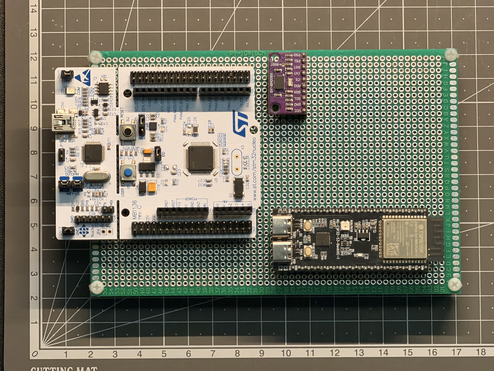
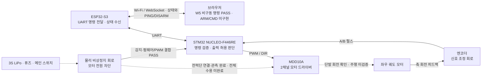

# Tracked Mobile Robot

STM32와 ESP32-S3를 기반으로 **궤도형 모바일 로봇의 하위 구동 플랫폼**을 개발하는 프로젝트다.
UART 명령 처리, PWM/DIR 출력, 엔코더 피드백과 물리 비상정지 회로를 단계적으로 구현·검증한다.
목표는 저속 주행과 정지 동작을 검증하고, 이후 ROS 2 기반 상위 시스템으로 확장하는 것이다.

- **담당:** 이영현 (`pr0ved99`) — 요구사항·인터페이스 설계, STM32/ESP32 펌웨어 구현,
  전장·기구 배치, 배선·납땜, 보드 빌드·플래시와 실측 검증.
- **작업 방식:** 설계·코드 검토와 로그 해석에 Codex를 활용하며, Python 검증 코드와 문서 정리에 지원을 받는다.
- **현재 단계 · 2026-10-11:** W4 상태 전달과 W5 **비구동 PING/DISARM**의 요청/응답·입력 거부·timeout/복구·버튼·재접속을 확인했다. [W5 근거](docs/verification/34_W5_PING_DISARM_WebSocket_and_Response_Matching_2026-10-10_ko.md).
  ARM/CMD parser·ticket·owner 독립 모듈의 실제 PC 검사 **15/12/9 PASS**, owner 포함 ESP 전체 빌드 성공은 사용자 확인이다. 다음은 상태·시간 제한·ACK/TEL·취소/정지 흐름이다. [최신 기록](docs/progress/2026-10-11_progress.md).
  A 전진·DISARM·S0와 A/B 각각10%·3초 구동은 [별도 모터 시험](docs/verification/32_Single_Motor_Run_DISARM_S0_and_Encoder_Evidence_2026-09-30_ko.md)이다.
  ARM/CMD 모듈은 아직 main·큐·UART·브라우저에 연결하지 않았다. 새 모듈의 플래시/보드 실행, 배터리 ADC·전류·열·전체 안전 수용·차량 주행은 남아 있다.

**바로 보기:** [STM32 펌웨어](03_Firmware/stm32_uart_mvp/Core/Src/) ·
[ESP32 UART 브리지](03_Firmware/esp32_uart_bridge/main/uart_bridge_main.c) · [Wi-Fi 상태 전달](03_Firmware/esp32_wifi_link/main/wifi_link_main.c) ·
[Python 검증 코드](03_Firmware/tests/) · [대표 계측 보고서](docs/verification/10_STM32_Active_DISARM_Shutdown_Latency_Test_Report_2026-08-04_ko.md) ·
[완료 범위와 근거](docs/verification/05_Final_MVP_Requirements_and_Verification_Matrix_ko.md) · [전체 실행 계획](docs/plans/00_Project_Master_Plan_To_Final_MVP_ko.md)

## 1. 프로젝트 목표와 범위

첫 MVP는 UART 명령으로 전진·후진·제자리 회전하는 저속 궤도형 플랫폼이다.
명령 유실과 비상정지 상황에서 출력을 차단하고, 엔코더 기반 속도·거리 추정 결과를 실제 움직임과 비교한다.

| 첫 MVP에 포함 | 완료 판단 기준 |
| --- | --- |
| 좌우 구동과 엔코더 | 두 모터 제어, 방향·속도 추정, 전동 구동 중 신호 검증 |
| 명령 처리와 정지 | timeout 뒤 출력·저장 명령 초기화, 명시적인 재허가와 새 명령으로만 복구 |
| 전원과 물리 비상정지 | 모터 에너지 차단, 해제만으로 자동 재시작하지 않는 동작, 첫 주행 전 저전압 경고·정지 기준 검증 |
| 기구 통합과 주행 | 제작 플레이트 장착, 저속 주행, 1 m 직진의 실제·엔코더 거리 오차 기록 |

완료 여부는 [MVP 요구사항·검증 매트릭스](docs/verification/05_Final_MVP_Requirements_and_Verification_Matrix_ko.md)에서 추적한다.

## 2. 하드웨어와 시스템 구조

*2026-08-14 모듈 배치 확인 단계. 당시 NUCLEO·BNO085·ESP32-S3의 위치를 보여준다.
9월의 비상정지·측정 헤더 배선 개정 전 사진이며, IMU 동작 검증을 의미하지 않는다.*

아래는 시스템의 핵심 연결 관계다. 실선은 명령·감지·피드백, 점선은 전력·모터 구동 경로다.
연결 여부와 검증 완료 여부를 구분하기 위해, 남은 검증 범위를 각 경로에 표시했다.

```mermaid
flowchart LR
    ESP["ESP32-S3<br/>UART 명령 전달 · 상태 수신"] <-->|UART| STM["STM32 NUCLEO-F446RE<br/>명령 검증 · 출력 허용 판단"]
    ESP <-->|Wi-Fi / WebSocket · 상태와 PING/DISARM| WEB["브라우저<br/>W5 비구동 명령 PASS · ARM/CMD 미구현"]
    STM -->|PWM / DIR| DRIVER["MDD10A<br/>2채널 모터 드라이버"]
    DRIVER -.->|단발 회전 확인 · 주행 미검증| MOTOR["좌우 궤도 모터"]
    MOTOR -->|축 회전 피드백| ENC["엔코더<br/>신호 조정 회로"]
    ENC -->|A/B 펄스| STM
    BAT["3S LiPo · 퓨즈 · 메인 스위치"] -.-> STOP["물리 비상정지 회로<br/>모터 전원 차단"]
    STOP -.->|전력단 연결·관측 완료 · 전체 수용 미완료| DRIVER
    STOP -->|감지·펌웨어/PWM 결합 PASS| STM
```

### 핵심 설계 판단

| 판단 | 이유와 구현 방향 |
| --- | --- |
| **최종 출력 허용 판단은 STM32가 담당** | 외부 명령이 들어와도 명령 유효성, 제어 상태, timeout과 비상정지 조건을 STM32에서 확인한 뒤 출력한다. ESP32는 명령 전달과 상태 수신을 맡는다. |
| **명령 유실 뒤 이전 주행 명령을 자동 복원하지 않음** | 통신 복구만으로 예기치 않게 다시 움직이지 않도록 출력과 저장 명령을 0으로 만들고 `DISARMED`로 전환한다. 새 `ARM`과 유효한 `CMD`를 모두 받아야 출력할 수 있다. |
| **물리 전원 차단과 펌웨어 상태 감지를 함께 사용** | MCU 소프트웨어와 독립된 모터 에너지 차단 경로를 두고, STM32도 비상정지 상태를 감지·유지해 재허가 조건을 검사한다. 두 경로를 결합한 전체 검증은 진행 중이다. |

세부 계약: [UART 인터페이스](01_System_Architecture/09_STM32_ESP32_UART_Interface_Contract_ko.md) ·
[상태 머신](01_System_Architecture/16_Control_Loop_and_State_Machine_ko.md) ·
[물리 비상정지 설계](01_System_Architecture/21_Physical_EStop_Architecture_ko.md)

## 3. 대표 구현과 검증 성과

각 결과는 아래에 명시한 시험 조건의 결과다. 코드 검사, 로직 핀 계측, 실제 모터 정지를 구분한다.

| 대표 결과 | 확인한 내용 | 시험 범위·근거 |
| --- | --- | --- |
| 실제 UART↔무선 상태·비구동 명령 | **W4 상태 전달·W5 PING/DISARM PASS**: 요청자별 결과·입력 거부·timeout/복구·재접속 후 자동 재전송 없음 | [두 보드 USB·LiPo 미연결](docs/verification/34_W5_PING_DISARM_WebSocket_and_Response_Matching_2026-10-10_ko.md). 현재 STM TEL/WS100ms·stale500ms. PC JS57·C21은 별도 검사. 무선 구동 명령 미구현 |
| DISARM → PWM 차단 | **23.50 μs** | [STM32 로직 핀 계측](docs/verification/10_STM32_Active_DISARM_Shutdown_Latency_Test_Report_2026-08-04_ko.md). 실제 모터 정지 시간이 아님 |
| 영구 배선의 PWM/DIR | **19.049 / 19.058 kHz**, 약 **10%**, 방향 전환 전후 약 **2 ms PWM 0** | [모터 분리 MDD10A 입력](docs/verification/17_Final_Perfboard_Active_DIR_PWM_and_Safe_Restore_Test_Report_2026-08-18_ko.md) |
| 명령 유실과 복구 | **500 ms timeout** 후 출력·저장 명령 0, 새 ARM+CMD에서만 복구 | [모터·LiPo 분리 UART/제어 신호](docs/verification/21_REQ_SAFE_004_500ms_Command_Timeout_and_Recovery_Target_Runtime_Test_Report_2026-08-28_ko.md) |
| 엔코더 환산 | **1,560 counts/rev**, 610개 채널 샘플의 mRPM 환산 불일치 **0건** | [손회전 보정·계산 검증](assets/logs/encoder/2026-07-30_encoder_output_shaft_calibration_and_millirpm_verification.md). 절대 속도·주행 거리 검증은 별도 |
| 실제 모터 방향 보정 | B/M2 **±10%·300 ms** 단발 명령에서 실제 양방향 회전·CPS 부호·정지 확인 | [섀시 분리 단일 모터](docs/verification/31_Single_Motor_Pulse_Cross_Test_and_Right_DIR_Correction_2026-09-29_ko.md). A 실제 전진도9/30 확인. 전체 안전 수용·주행은 남음 |

각 결과의 검증 문제·방법·관측 한계 펼치기

### 3.1 DISARM 명령에 따른 PWM 출력 차단

- **검증 문제:** 상태 로그만으로 알기 어려운 실제 PWM 차단 시점을 확인한다.
- **방법:** 유효한 `DISARM` 프레임 수신 완료와 두 PWM의 마지막 active edge를 같은 4 MHz 로직 캡처에서 비교했다.
- **결과:** 두 PWM 출력이 비활성화되기까지 **23.50 μs**를 측정했다.
- **범위:** STM32 MCU 로직 핀 계측 결과다. 실제 모터 정지 시간은 측정하지 않았으며,
  당시 전원·모터 분리 상태의 증거 보완은 보고서에 남아 있다.

[시험 조건·파형·원본 캡처](docs/verification/10_STM32_Active_DISARM_Shutdown_Latency_Test_Report_2026-08-04_ko.md)

### 3.2 영구 배선을 통한 PWM/DIR 전달

- **검증 문제:** 만능기판의 pull-down과 하네스를 거쳐도 제어 신호가 드라이버 입력에 전달되는지 확인한다.
- **방법:** 모터를 분리하고 MDD10A 입력에서 두 채널의 PWM과 방향 전환 구간을 계측했다.
- **결과:** PWM **19.049 / 19.058 kHz**, 약 **10% 듀티**, DIR 전환 전후 약 **2 ms의 PWM 0 구간**을 확인했다.
  시험 설정 복구 후 5초 동안 모든 제어 신호가 LOW인 상태도 확인했다.
- **범위:** 이 시험은 MDD10A 로직 입력까지의 결과다. 이후 실제 회전·방향 관측은 아래 3.5에서 구분해 기록한다.

[시험 보고서와 원본 자료](docs/verification/17_Final_Perfboard_Active_DIR_PWM_and_Safe_Restore_Test_Report_2026-08-18_ko.md)

### 3.3 명령 유실 후 정지와 명시적 복구

- **검증 문제:** 명령이 끊긴 뒤 과거 명령이나 `ARM`만으로 출력이 되살아나는 것을 막는다.
- **방법:** 모터·LiPo 분리 조건에서 `timeout_ms=500`인 명령을 사용하고 UART와 PWM/DIR을 같은 캡처로 비교했다.
- **결과:** timeout 뒤 출력·저장 명령 0과 `DISARMED` 전환, `CMD` 단독 거부,
  `ARM`만으로 이전 출력이 복원되지 않음, **새 `ARM` + 새 `CMD`에 의한 복구**를 확인했다.
- **범위:** 보드의 UART·제어 신호·상태 복구 검증이며, 실제 모터나 물리 비상정지 시험은 포함하지 않는다.

[500 ms timeout·복구 시험](docs/verification/21_REQ_SAFE_004_500ms_Command_Timeout_and_Recovery_Target_Runtime_Test_Report_2026-08-28_ko.md)

### 3.4 수동 회전 기반 엔코더 환산 검증

- **검증 문제:** 모터 출력축 회전량과 펌웨어의 카운트·속도 환산을 연결한다.
- **방법:** 두 모터의 출력축을 방향별 50회전시킨 관찰 기록과 별도의 수동 회전 로그를 사용했다.
- **결과:** 출력축 기준 **1,560 counts/rev**로 보정했다.
  별도 로그의 **610개 채널 샘플**에서 카운트/초(CPS) → 0.001 rpm 단위(mRPM) 환산 불일치는 0건이었다.
- **범위:** 수동 회전 기반 기능 검증이다. 전동 구동 중 노이즈, 외부 회전계 비교와 실제 주행 거리 검증은 남아 있다.

[50회전 관찰 기록·환산 검증·로그](assets/logs/encoder/2026-07-30_encoder_output_shaft_calibration_and_millirpm_verification.md)

### 3.5 실제 단일 모터 구동과 방향 보정

- **검증 문제:** 명령 부호와 실제 모터 방향·엔코더 피드백이 일치하는지 확인한다.
- **방법·결과:** 보정 전 B/M2의 양수 명령에서 실제 역회전과 음수 CPS가 함께 관측됐다.
  두 모터를 교차 연결해 회전을 확인한 뒤, 손회전으로 확인한 엔코더 부호를 유지하고 오른쪽 DIR을 HIGH=전진/LOW=후진으로 보정했다.
  B/M2는 정방향·역방향 각각 **10%·300 ms 단발 명령**에서 회전·CPS 부호·timeout 후 0 복귀를 로그와 육안으로 확인했다.
- **범위:** 섀시 분리 단일 모터 시험이다. A/M1 양수 실제 전진은9/30 추가 확인했으며 부하·주행 검증은 남아 있다.

[시험 결과·관측 한계·원본 로그](docs/verification/31_Single_Motor_Pulse_Cross_Test_and_Right_DIR_Correction_2026-09-29_ko.md)

## 4. 현재 검증 범위와 남은 작업

**상태 대조: 2026-10-11.** 날짜별 시험의 관측 결과를 전체 전력단·비상정지·주행 완료로 확대하지 않는다.
요구사항별 판정은 [검증 매트릭스](docs/verification/05_Final_MVP_Requirements_and_Verification_Matrix_ko.md)를 따른다.

| 분야 | 확인된 범위 | 남은 핵심 검증 |
| --- | --- | --- |
| 통신·펌웨어 | UART·timeout·latch/reset·PWM 차단, W4/W5 비구동 왕복과 복구. ARM/CMD 기초 모듈 PC15/12/9 PASS·ESP 빌드 성공 사용자 확인 | ARM/CMD 상태/기한·큐/UART/브라우저 연결과 AC-H/B/S, 전체 bridge release·리셋 err 원인. 별도 UART bridge hook1U 복구는 후속 |
| 보드 전원 | XL4015 #1의 STM·ESP 개별/동시 공급, #2 감지·엔코더 전원 | 최종 배선의 정격·전류·전압 강하·발열, 모터 부하 조건 |
| 구동·피드백 | A 전진/DISARM·S0 관측, B 방향 보정, A/B 각각10%·3초 구동과원시1432/1384 ticks·CPS 일치 | 전류·열·반복 기동·부하 조건·주행 |
| 물리 비상정지 | 감지–펌웨어–PWM 경로 PASS(T004), 전력단 일부 관측과 A 구동 중 S0/PWM/CPS 정지 관측 | 전체 T005A·T-MOTOR-003 PARTIAL, 정식 T-ESTOP-007 BLOCKED. rail-off·단자/배선 release·기계 정지 시간/거리 수용 |
| 측정·센서 배선 | UART·CTRL·ENC·IMU 헤더 배선, 엔코더 조정부·양쪽 +5.05 V, 실제 A/B LOW 0 V/HIGH 약 2.86 V | 엔코더 파형·출력형식·구동 노이즈. IMU 전원·모드·센서 동작은 후속 범위 |
| 기구·주행 | 어댑터 플레이트 설계·제작품 수령 기록 | 실물 장착·절연·접근성, 첫 주행 전 배터리 ADC·저전압 경고/정지, 저속 주행·1 m 거리 비교 |

추가 근거: [보드 전원](docs/verification/25_XL4015_Logic_Power_and_Physical_EStop_Conditioned_Sense_Test_Report_2026-09-08_ko.md) ·
[T004 감지·PWM](docs/verification/26_T_ESTOP_004_Conditioned_PWM_Latch_Reset_and_Safe_Restore_Test_Report_2026-09-22_ko.md) ·
[T005A 전력단 관측](docs/verification/27_T_ESTOP_005A_Motor_Disconnected_Rail_and_Safe_Restore_Report_2026-09-23_ko.md) ·
[실제 엔코더·전력단](docs/verification/30_Actual_Encoder_and_Power_Bench_Closeout_2026-09-27_ko.md).

A/M1 실제 전진 확인은 완료했다. 당장 이어갈 소프트웨어 작업은 ARM/CMD 상태·시간 제한·ACK/TEL·취소/정지 흐름이며 이후 zero-only 경로와 장비 조건별 검증을 진행한다.
실제 구동 확대는 계측 방법·전력단·물리 비상정지·단일 모터의 남은 조건을 충족한 뒤 기구 통합, 저속 주행과 1 m 시험으로 이어간다. 수행한 단발 구동은 전체 T005A의 선행 조건 충족을 뜻하지 않는다.

작업 순서·완료 조건은 [전체 실행 계획](docs/plans/00_Project_Master_Plan_To_Final_MVP_ko.md),
현재 전원·배선·시험 이미지와 재개 절차는 [현재 작업 현황](docs/handoff/CURRENT_SESSION_CONTEXT.md),
일자별 결과는 [진행 기록](docs/progress/README.md)에서 관리한다.
## 5. 코드와 문서 안내

### 구현 코드

| 살펴볼 내용 | 진입점 |
| --- | --- |
| STM32 초기화·주기 처리 | [main.c](03_Firmware/stm32_uart_mvp/Core/Src/main.c) · [CubeMX 설정](03_Firmware/stm32_uart_mvp/stm32_uart_mvp.ioc) |
| 명령 검증·상태 전이·timeout | [UART 프로토콜](03_Firmware/stm32_uart_mvp/Core/Src/uart_mvp_protocol.c) |
| 좌우 명령 변환·출력·엔코더 | [명령 변환](03_Firmware/stm32_uart_mvp/Core/Src/drive_command_mapper.c) · [PWM/DIR](03_Firmware/stm32_uart_mvp/Core/Src/motor_output.c) · [엔코더](03_Firmware/stm32_uart_mvp/Core/Src/encoder_speed.c) |
| ESP32 UART 브리지 | [프로젝트 안내](03_Firmware/esp32_uart_bridge/README.md) · [구현 코드](03_Firmware/esp32_uart_bridge/main/uart_bridge_main.c) |
| 현재 ESP Wi-Fi 앱 | [프로젝트 안내](03_Firmware/esp32_wifi_link/README.md) · [구현 코드](03_Firmware/esp32_wifi_link/main/wifi_link_main.c) |
| ARM/CMD 독립 기초 모듈 | [역할·구현 상태](03_Firmware/README.md#armcmd-모듈과-실행-경로) · [초기 계약](docs/plans/2026-10-10_WiFi_ARM_CMD_Control_Contract_ko.md) |
| PC 검사 | [검증 코드](03_Firmware/tests/) · [종류·선택·실행 방법](03_Firmware/tests/README.md#검사-종류와-선택) |

PC 검사는 정적 소스/참조 모델, 실제 C 함수·모듈 실행, PAGE JavaScript 모의 실행으로 구분한다. 보드 빌드·실행이나 전기적 계측을 대신하지 않는다.
현재 검사 범위와 별도 UART bridge의 과거 hook 기록은 [검사 안내](03_Firmware/tests/README.md#검사-종류와-선택)를 확인한다.
시험용 설정과 빌드·실행 전제는 [현재 현황](docs/handoff/CURRENT_SESSION_CONTEXT.md)과 해당 런북을 따른다.

### 빌드·검사 시작점

- **STM32:** STM32CubeIDE에서 [stm32_uart_mvp 프로젝트](03_Firmware/stm32_uart_mvp/)를 가져와 빌드한다. `.project`와 `.ioc`를 포함한다.
- **ESP32 현재 Wi-Fi 앱:** ESP-IDF 환경에서 [esp32_wifi_link 빌드 안내](03_Firmware/esp32_wifi_link/README.md#빌드검사)를 따른다. 별도 [UART bridge 빌드 안내](03_Firmware/esp32_uart_bridge/README.md#build)와 프로젝트 폴더를 혼동하지 않는다. 포트 번호는 연결한 PC에서 확인한다.
- **호스트 검사:** 보드 연결 없이 [검사 종류와 선택](03_Firmware/tests/README.md#검사-종류와-선택)을 먼저 읽고 해당 Python/C 또는 Node.js 검사를 실행한다. 빌드·계측 결과와 구분한다.
- **시험 기록:** [증거 보존 절차](docs/verification/EVIDENCE_CAPTURE_GUIDE_ko.md)에 따라 원본 로그·화면·빌드/플래시 식별값과 관측 범위를 연결한다.

펌웨어 앱별 역할·빌드 폴더·마지막 실행과 새 모듈 준비 상태는 [펌웨어 목차](03_Firmware/README.md)를 따른다.
별도 UART bridge 진입 파일은 `uart_bridge_main.c`로 이름을 바꿨다. 이름 변경 후 해당 앱의 보드 빌드는 아직 확인하지 않았으며 Wi-Fi 앱 빌드 성공과 구분한다.

### 설계·검증·학습 자료

| 읽는 목적 | 문서 |
| --- | --- |
| 전체 구조와 설계 결정 | [시스템 인터페이스 맵](01_System_Architecture/11_System_Block_Diagram_and_Interface_Map_ko.md) · [설계 결정 기록](01_System_Architecture/19_Architecture_Decision_Record_ko.md) |
| 전기·기구 설계 확인 | [VeroRoute](09_Electrical_Design/VeroRoute/README.md) · [KiCad](09_Electrical_Design/KiCAD/Tracked_Mobile_Robot_Wiring_RevB/README.md) · [기구 설계](08_Mechanical_Design/README.md) |
| 요구사항과 근거 추적 | [검증 문서](docs/verification/README.md) · [하드웨어 검증 절차](02_Hardware_Validation/README.md) |
| PC 시험 도구와 초기 UART MVP | [PC Serial 도구](04_PC_Serial_Control/README.md) · [Web Serial 대시보드](04_PC_Serial_Control/web_serial_dashboard/README.md) |
| 학습 과정과 전체 자료 탐색 | [임베디드 학습 노트](07_Embedded_Learning_Notes/README.md) · [분야별 전체 문서 색인](docs/README.md) |

PC–STM32 직접 연결 대시보드는 초기 UART MVP의 시험 도구다.
현재 MVP의 외부 명령 경로는 ESP32 → STM32이며, STM32 USART2는 벤치 진단용으로 구분한다.

## 6. MVP 이후 확장 계획

| 확장 | 목적 |
| --- | --- |
| IMU | 센서 통신·자세 데이터 검증과 엔코더 정보 결합. 현재 헤더 배치·GND 검토와 구분해 진행 |
| CAN | UART로 확인한 명령·상태 계약을 CAN 인터페이스로 확장 |
| STM32 FreeRTOS | 검증된 STM32 bare-metal 동작을 태스크·주기·큐 구조로 옮기고 동작 유지 확인. ESP-IDF의 기존 FreeRTOS 환경과 구분 |
| 선택적 LL 전환 | 계측으로 필요성이 확인된 타이밍 경로의 구현과 성능 비교 |
| ROS 2 · LiDAR · SLAM/Nav2 | 하위 구동 플랫폼과 상위 명령·상태 연결 후 자율주행으로 확장 |

단계별 범위와 완료 기준은 [프로젝트 마스터 플랜](docs/plans/00_Project_Master_Plan_To_Final_MVP_ko.md)을 따른다.
