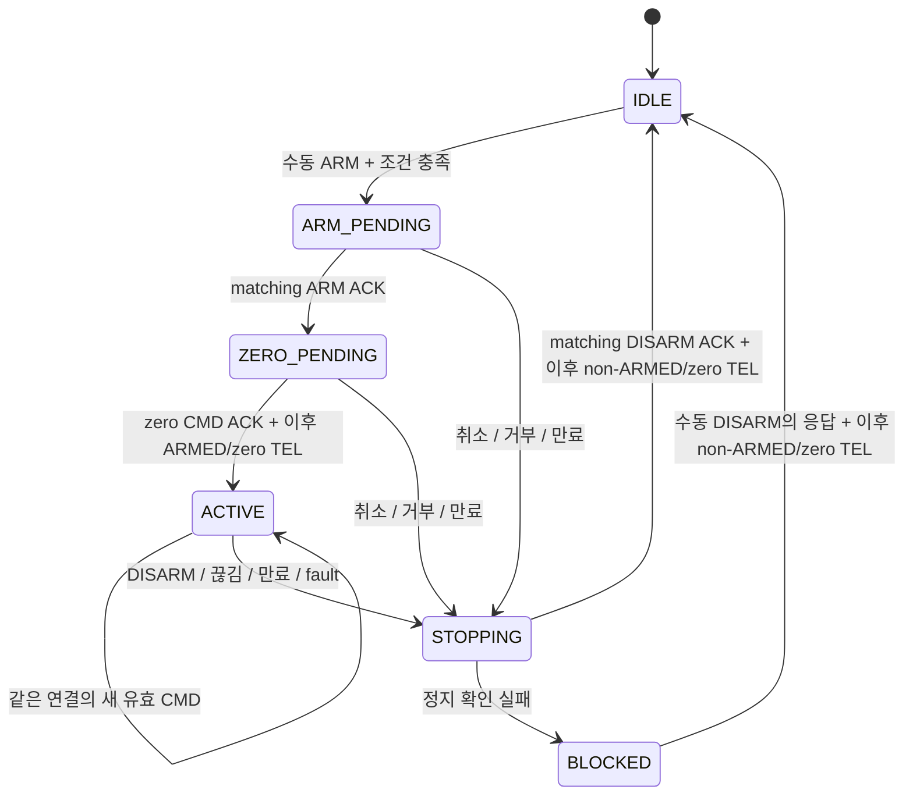

# Wi-Fi ARM/CMD 제어 계약과 비구동 검증 계획

작성일: **2026-10-10**. 갱신: **2026-10-11**. 상태: **초기 설계안 / parser·ticket·owner 실제PC15/12/9 PASS·ESP 전체 빌드 성공 사용자 확인 / 제어 실행 경로 미연결**.

W5의 PING/DISARM 다음에 구현할 규칙이다. 현재 ESP 앱에 ARM/CMD가 추가된 것으로 해석하지 않는다.
UART의 정본은 [인터페이스 계약09](../../01_System_Architecture/09_STM32_ESP32_UART_Interface_Contract_ko.md),
완료한 비구동 범위는 [W5 보고서34](../verification/34_W5_PING_DISARM_WebSocket_and_Response_Matching_2026-10-10_ko.md)다.
아래 시간값은 첫 구현·측정의 기준이며 무선 지연이나 실제 정지 시간을 보장하는 수치가 아니다.
후속 [parser 입력 블록](2026-10-10_WiFi_ARM_CMD_Parser_Code_Guide_ko.md)은 실제 PC15 PASS·ESP 빌드 성공 사용자 확인이다.
[ticket 입력 블록](2026-10-10_WiFi_ARM_CMD_Ticket_Code_Guide_ko.md)은 사용자 수정본 실제PC12 PASS다.
10/11 ticket 포함 ESP 전체 빌드 성공은 사용자 확인이며 제어 실행 경로는 아직 연결하지 않았다.
[owner 입력 블록](2026-10-11_WiFi_ARM_CMD_Owner_Code_Guide_ko.md)은 소유권 기록·새 control ID·대조/취소의 실제PC9 PASS다.
10/11 owner 포함 ESP 전체 빌드 성공은 사용자 확인이다. FSM/기한·큐/UART 연결은 미완료다.

## 1. 목표와 오늘의 범위

**한 브라우저 연결에만 제어를 허가하고, 그 연결에서 유효시간 안에 새 CMD를 보내는 동안만 허가를 유지한다.**
끊김·만료·fault 뒤에는 새 ARM부터 다시 시작한다. 연결만 복구됐다는 이유로 움직이지 않는다.

- 오늘: 실제 코드와 설계를 대조하고, 소유권·만료·정지 순서·입력 형식·시험 기준을 작성한다.
- 첫 구현: ESP/브라우저의 제어 상태와 **zero-only 모드**. ARM과 `CMD(0,0)`까지만 허용한다.
- 이후: 정상 비상정지 입력 조건의 비구동 ARM/timeout/PWM 관측. 그 뒤 별도 Gate에서 nonzero를 허용한다.
- 이번 설계는 인증·암호화, STM UART 자체의 재전송 공격 차단, 실제 주행·배터리·전류/열 수용을 완료하지 않는다.

## 2. 소스에서 확인한 현재 동작

기준 커밋: `d9bf801049cf136e863cf2e0847a6c33f4db53e8`.
ESP main C SHA256: `dfe9a97e77453378a4f5a0cc64b3dfa642244c93ec6d6259cb4742bba8d5d2b4`.
설계 작업에서 펌웨어를 수정하거나 두 보드 빌드·플래시를 실행하지 않았다.

| 확인한 구현 | 설계에 주는 제약 |
| --- | --- |
| W5는 PING/DISARM만 허용. 연결당 요청 간격500ms, 응답500ms | STM 기본300ms timeout에 W5 제한을 그대로 적용할 수 없음 |
| W5 owner는 요청 완료 때 해제 | 제어 연결의 지속적인 소유권과 UART 한 요청의 소유권을 분리해야 함 |
| W5 연결 해제는 대기 요청을 정리하고 UART DISARM은 보내지 않음 | ARM/CMD 도입 시 연결 해제에 제어 취소·정지 경로 추가 필요 |
| STM ARM은 출력/저장 명령0, ARMED, 첫 CMD 대기300ms | 사람이 ARM 뒤 오래 기다려도 되도록 브라우저가 새 zero CMD를 보내야 함 |
| 반복 ARM도 명령0·타이머를 다시 설정 | ARM을 heartbeat나 자동 retry로 쓰지 않음 |
| 수락된 CMD만 watchdog 갱신. PING/TEL은 갱신하지 않음 | 연결 표시·PING 성공으로 제어 입력 생존을 대신하지 않음 |
| timeout은 RX byte 처리 전에 출력/저장 명령0·DISARMED 전환 | CMD만 다시 보내서는 복구 안 됨. 새 ARM 필요 |
| PC7 HIGH 또는 latch가 있으면 ARM/CMD 거부 | FAULT 상태에서 진단은 가능해도 구동 허가는 불가 |
| PC7은 GPIO_PULLUP | sense 회로 없는 낱개 보드는 ESTOP_ACTIVE가 예상됨. ARM 성공을 기대하거나 입력을 우회하지 않음 |
| mapper는 최대100permille(10%)의 PWM 요청으로 변환 | `vx_mmps`는 현재 폐루프 실측 속도가 아님. 속도 정확도 PASS로 쓰지 않음 |
| STM은 seq 단조 증가·세션/epoch·RX queue purge를 검사하지 않음 | ESP에서 폐기한 미송신 요청과 이미 UART에 보낸 데이터를 구분해야 함 |

근거 소스: [ESP main](../../03_Firmware/esp32_wifi_link/main/wifi_link_main.c),
[STM protocol](../../03_Firmware/stm32_uart_mvp/Core/Src/uart_mvp_protocol.c),
[STM parser](../../03_Firmware/stm32_uart_mvp/Core/Src/uart_frame_parser.c),
[mapper](../../03_Firmware/stm32_uart_mvp/Core/Src/drive_command_mapper.c),
[PC7 설정](../../03_Firmware/stm32_uart_mvp/Core/Src/gpio.c).

## 3. 역할과 식별 번호

| 항목 | 책임·수명 |
| --- | --- |
| 브라우저 | 명시적 ARM 클릭, 현재 조작값, 새 CMD 작성, focus/visibility/연결 유실 때 조작값0·허가 폐기 |
| ESP | 연결별 입력 검사, 한 제어 연결 선택, 명령 만료/취소, UART 중계와 응답 대응 |
| STM | 비상정지 latch, ARM/CMD 최종 수락, PWM/DIR, accepted-CMD timeout 정지 |
| `boot_id` | 현재 ESP 부팅. 이전 ESP 부팅의 요청 거부 |
| `ws_session_id` | ESP가 해당 WebSocket에 부여. 클라이언트 문자열로 다른 연결을 지정할 수 없음 |
| `request_id` | 같은 연결에서 접수한 요청 번호. 양수u32, 기존보다 큰 값만 접수 |
| `control_id` | 한 번 ARM을 시도하는 제어 세대. 재허가 때 새 값; 연결 ID와 구분 |
| `ticket` | ESP가 특정 연결·제어 세대에 발급한 짧게 유효한 일회용 입력 번호 |
| UART `seq` | ESP UART 담당이 발급하는 응답 대응 번호. 브라우저가 직접 지정하지 않음 |

제어 owner는 CMD ACK 뒤에도 유지된다. UART pending은 한 프레임의 응답을 기다리는 상태다.
ticket/control ID는 ESP 부팅 안에서 재사용하지 않는다. 내부64bit counter가 u32를 소진하면 제어를 잠그고,
0이나 작은 번호로 돌아가지 않는다. W5의 UART seq 할당도 그대로 한 담당에서 관리한다.

ticket은 인증 비밀이 아니다. 브라우저와 ESP의 시계를 맞추지 않고 **늦게 도착한 입력을 거부하는 수단**이다.
단순히 ESP 접수 시각만 기록하면 TCP에 오래 대기한 명령도 새 입력처럼 보일 수 있어 추가한다.

## 4. 첫 구현의 시간값과 범위

| 항목 | 초기값 | 적용 위치·의미 |
| --- | --- | --- |
| CMD 목표 주기 | 100ms / 10Hz | 브라우저가 새 ticket으로 현재 입력을 작성. 최종20Hz 후보와 구분 |
| CMD 최소 접수 간격 | 50ms | 20Hz보다 빠른 스트림 제한. W5의500ms를 공통으로 사용하지 않음 |
| ticket 유효시간 | 발급부터150ms 미만 | ESP 단조 시각으로 접수 시와 UART 송신 직전에 확인 |
| CMD 큐 대기 | 접수부터50ms 미만 | ticket 마감과 큐 마감 중 빠른 시각 전에만 송신 |
| ARM/CMD 응답 기한 | UART 송신부터150ms 미만 | matching ACK 또는 ERR. 기한 이후 ACK는 허가/결과를 복원하지 않음 |
| 첫 zero CMD | ARM UART 송신부터250ms 미만 | ARM ACK 뒤 브라우저가 즉시 생성. 사람이 별도 CMD 버튼을 누르기를 기다리지 않음 |
| 후속 CMD 입력 유실 | 마지막 새 CMD UART 송신부터200ms | 제어 취소·priority DISARM. ACK/PING/TEL로 연장하지 않음 |
| 제어용 TEL age | 250ms 미만 | ARM 가능 여부와 제어 유지 판단. 기존 표시 stale500ms와 별도 |
| STM `timeout_ms` | 300ms 고정 | ESP가 UART CMD에 넣음. 첫 UI에서 사용자가 늘리지 못함 |
| 제어 watchdog 점검 목표 | 20ms 이내 간격 | UART 루프에서 점검. HTTP 송신/결과 표시가 이를 기다리게 만들지 않음 |

이 값들은 정상 통신을 전제로 한 시작점이다. ACK/WS 지연 때문에 기준을 못 맞추면 허가를 취소하고 원인을 측정한다.
동작을 유지하려고 timeout부터 늘리지 않는다. `now >= deadline`이면 만료다.

**브라우저가 끊어진 시각부터 무조건300ms 안에 정지한다는 주장은 하지 않는다.**
유효한 ticket의 요청이 뒤늦게 UART에 전달될 수 있고, STM watchdog은 마지막 accepted CMD를 기준으로 한다.
실제 정지 지연에는 남은 ticket 시간·UART 전송·STM 처리/블로킹 TX 지연도 포함된다.
실측에서는 입력 중단, 마지막 UART CMD, PWM 종료를 각각 기록한다. 기계 정지 시간은 별도다.

## 5. 상태와 정상 흐름



1. **IDLE:** 다른 탭은 TEL을 볼 수 있지만 controller는 없다. ARM 조건은 startup READY,
   제어용 fresh TEL, STM DISARMED, 좌우 PWM0, UART pending 없음이다. READY만으로 허가하지 않는다.
2. ESP는 IDLE 연결에 ARM용 ticket을 보낸다. 유효 ticket이 없거나 만료됐다면 새로 발급하되,
   아직 유효한 ticket을 중간에 교체하지 않는다. 버튼을 누르지 않으면 ARM/CMD를 보내지 않는다.
3. 수동 ARM을 접수하면 해당 연결과 새 control ID를 예약하고 ARM_PENDING으로 간다.
   **다른 연결의 ARM은 거부**한다. matching `ACK,type=ARM` 전에는 CMD를 보내지 않는다.
4. ARM ACK 뒤 ZERO_PENDING: owner에게 control ID와 첫 CMD ticket을 알린다.
   브라우저는 즉시 새 `CMD(0,0)`를 보낸다. 첫 CMD250ms 기한이 지나면 취소한다.
5. 첫 zero CMD ACK 후의 새 TEL에서 ARMED·vx/w0·좌우PWM0·유효한 command age를 확인한다.
   TEL의 last_seq는 해당 최신 ACKed zero CMD와 대응해야 한다. 확인 전에는 zero만 허용한다.
   zero ACK마다 다음 ticket을 받아 새 zero CMD를 보내므로 TEL 확인 대기 자체가 watchdog을 연장하지 않는다.
   첫 zero 송신 뒤에는 ZERO_PENDING에서도 후속CMD200ms·TEL250ms 감시를 적용한다.
   ARM 이전의 DISARMED TEL을 ARM 완료 증거로 쓰거나, 그것만으로 ARM 대기를 실패 처리하지 않는다.
6. ACTIVE에서도 한 연결이 소유권을 유지한다. 사람이 조작하지 않을 때는 새 `CMD(0,0)`를100ms마다 작성한다.
   이 반복은 **현재 살아 있는 브라우저**가 수행한다. ESP는 저장한 nonzero 값을 주기적으로 재송신하지 않는다.
7. 후속 nonzero 단계에서는 누르고 있는 조작과 페이지 활성 상태를 매번 읽어 새 CMD를 만든다.
   버튼 놓기는 새 zero CMD, blur/hidden/pointercancel/연결 유실은 허가 취소·DISARM 요청이다.
   페이지 비활성 후 돌아와도 ARM 클릭 없이 재개하지 않는다.

초기 `WIFI_CONTROL_ZERO_ONLY=1U` 검사에서는 nonzero 요청을 ESP 송신 직전에도 거부한다.
UI 숨김만으로 nonzero를 막았다고 판정하지 않는다. 후속 Gate 전에는 이 제한을 해제하지 않는다.

## 6. 입력 형식과 ticket 처리

새 WebSocket TEXT 형식의 설계안이다. 순서 고정, ASCII, 추가 필드/공백/개행/중간NUL 거부, 최대128byte를 유지한다.
아래 B/R/T/C는 설명용 기호이고 실제로는 십진수다.

```text
ARM,boot_id=B,request_id=R,ticket=T
CMD,boot_id=B,request_id=R,control_id=C,ticket=T,vx_mmps=V,w_mradps=W
```

- ARM ticket은 연결과 `purpose=ARM`, CMD ticket은 연결·control ID와 `purpose=CMD`에 묶인다.
- V 범위 `-100..100`, W 범위 `-500..500`. zero-only 단계에서는 모두0이어야 한다.
- 기존 PING/DISARM의 입력 형식은 유지한다. UART에는 웹의 식별 필드를 그대로 붙이지 않는다.
- 최대 십진수u32와 양수/음수 최장값을 반영하면 ARM62byte, CMD111byte다.
- ticket 결과는 대상 연결에만 보낸다. 새 `control_ticket` 메시지에는 `boot_id`, `ws_session_id`,
  `control_id`(ARM용은null), `purpose`, `ticket`, `valid_for_ms`를 담는다.
  `valid_for_ms`는 발급 기준150ms이며 HTTP 전송/수신 지연으로 유효시간이 다시 시작되지 않는다.
- 새 `control_state` 메시지는 `boot_id`, `ws_session_id`, `control_id`, `phase`, `controller`,
  `zero_only`, `reason`을 담는다. 다른 연결에는 `controller=false/control_id=null`로 알린다.
  owner의 ZERO_PENDING/ACTIVE 전이를 먼저 알리고 해당 단계의 ticket을 그 뒤에 보낸다.
- 기존 `command_notice/result`는 ARM/CMD까지 확장하되, ARM의 결과OK는 ARM ACK 확인이다.
  브라우저는 `control_state=ACTIVE` 이전에 nonzero를 보내지 않는다. 모든 제어 메시지는
  현재 boot/연결/control ID와 대조하고 이전 세대 결과·ticket을 버린다.

ticket 처리 순서:

1. 같은 연결/ESP boot/허가 세대/목적/기한/입력 범위를 검사한다.
2. 큐에 접수할 수 있을 때 ticket을 한 번 소비한다. 만료된 ticket은 사용하지 않는다.
3. UART 담당은 꺼낸 값의 연결 생존·세대·stop flag·두 기한을 다시 확인한다.
4. ACK 뒤 다음 CMD ticket을 한 개만 발급한다. CMD pending 중에는 다음 CMD를 쌓지 않는다.
5. 응답 유실/만료 시 새 ticket이나 retry로 같은 동작을 복구하지 않고 STOPPING으로 간다.

현재 UART parser에 맞는 실제 STM 입력은 그대로 유지한다.

```text
ARM,seq=N\n
CMD,seq=N,vx_mmps=0,w_mradps=0,timeout_ms=300\n
DISARM,seq=N\n
```

nonzero 후속 단계도 같은 필드 순서를 쓴다. seq는 매 송신마다 새 값을 쓴다.

## 7. 취소·정지와 태스크 경계

정지 순서는 **ticket/제어 세대 무효화 → 미송신 ARM/CMD 폐기 → UART DISARM → ACK와 새 TEL 확인**이다.
HTTP나 브라우저에 결과가 표시될 때까지 정지를 늦추지 않는다.

- DISARM은 current boot의 정상 형식/요청 번호라면 다른 탭에서도 가능하다.
  ARM/CMD 소유권·CMD interval·일반 BUSY를 이유로 정지 요청을 막지 않는다.
- UART pending/진단 요청을 취소하고 DISARM을 우선 송신한다. stop flag 한 개로 합쳐 큐가 늘지 않게 한다.
  이미 정지 처리 중인 추가 DISARM은 `REJECTED/ALREADY_STOPPING`으로 알리고 새 완료 결과를 기다리게 하지 않는다.
- stop ACK 기한은150ms. ACK 이후 새 TEL의 non-ARMED·vx/w0·PWM0·last_seq=stop seq를 확인해야 IDLE로 간다.
  FAULT/zero는 출력 정지 확인이 될 수 있어도 ARM 허가는 되지 않는다. TEL 기다림은 제어용age와300ms 확인 기한으로 제한한다.
- DISARM ACK 유실, TX/RX 오류, zero 확인 실패는 BLOCKED. 진단과 수동 DISARM은 가능하되 ARM은 잠근다.
  자동 DISARM retry·자동 ESTOP_RESET·자동 ARM은 하지 않는다.
- 연결 해제 callback/네트워크 이벤트는 mutex 안에서 ticket·허가를 무효화하고 stop flag를 설정한다.
  callback은 UART에 직접 쓰거나 STM 응답을 기다리지 않는다.
- UART 담당만 실제 송신·seq·pending을 관리한다. 큐에는 값 복사, 소유권/마감 재검사는 송신 직전,
  네트워크 API 호출은 HTTP 담당에서 수행한다. 네트워크 송신/긴 UART TX 동안 mutex를 잡지 않는다.
- active control 중 일반 PING은 `CONTROL_ACTIVE`로 거부해500ms 진단 대기가 CMD를 가로막지 않게 한다.
  PING/TEL/WebSocket PONG은 제어 lease를 연장하지 않는다.
- 제어 state/ticket/result 큐가 가득 차거나 owner에게 필수 메시지를 전달하지 못하면 제어를 취소한다.
  결과 표시 성공이 정지의 전제는 아니며, 작은 bounded 큐를 늘려 오래된 명령을 쌓지 않는다.

| 사건 | 제어 처리·재개 조건 |
| --- | --- |
| owner WS 종료 / Wi-Fi 종료 / 브라우저 hidden | 허가 취소·DISARM. 새 연결·수동 ARM 필요 |
| CMD ticket/queue/ACK 만료, source gap200ms | 허가 취소·DISARM. 늦은 ACK로 ACTIVE 복원 금지 |
| owner의 잘못된 ARM/CMD, nonzero in zero-only | 거부·허가 취소·DISARM. 다른 연결의 무효 요청은 owner를 바꾸지 않음 |
| 제어 TEL age250ms, STM FAULT, ACTIVE의 non-ARMED/잘못된 command age, STM ERR | 허가 취소·DISARM. 원인 해결·정지 확인·수동 ARM 필요 |
| ESP 재부팅 | 메모리 owner/ticket 없음, startup DISARM/PING 후 IDLE. 이전 browser boot/control 요청 거부 |
| STM 재기동 의심 | 허가 취소. STM t_ms가 정상 u32 진행/wrap과 맞지 않거나 ARMED가 사라지면 자동 복구 금지 |
| 재접속 | 입력값0·요청/허가/ticket 대기 초기화. ARM/CMD 자동 송신0 |

STM에는 boot ID가 없어 ESP `boot_id`로 STM 재부팅을 증명하지 않는다.
STM t_ms는 unsigned delta와 ESP 경과시간을 대조해 wrap을 정상 진행으로 처리하고,
모호한 관측은 제어 취소로 처리한다. reconnect/PING으로 이전 허가를 되살리지 않는다.

**이미 UART에 보낸 프레임은 취소로 회수할 수 없다.** 단일 pending과 송신 직전 검사로 새 미송신 명령을 막고,
DISARM을 이전 프레임 뒤에 송신한다. 실제 TX 지연과 STM RX backlog는 별도 측정한다.
ESP ticket은 STM UART에서 replay된 ARM+CMD를 차단하지 않는다. 직접 UART 재주입까지 요구하면
STM의 session/seq freshness 계약을 별도로 확장해야 한다. 이번 ESP 설계의 PASS로 대체하지 않는다.

## 8. 검증 Gate와 정확한 PASS 기준

아래는 **새 계획 ID**다. parser 자체의 실제 PC15 PASS는 AC-H01 범위이며 ESP 빌드 성공은 사용자 확인이다.
ticket 수정본 실제12 PASS는 AC-H02/H03의 ticket 자체 검사이며 실제 UART 송신/큐/owner 검사는 아직 없다.
owner 실제9 PASS는 AC-H02의 식별 기록 부분이며 전체 UART TX0·취소 경합을 증명하지 않는다.
나머지 제어 연결·보드 Gate는 미실행이며 기존 W5의 PASS 번호/증거를 재사용하지 않는다.

### AC-H: 노트북 검사 — 펌웨어 작성 후

| ID | 검사 | PASS 기준 |
| --- | --- | --- |
| AC-H01 | 실제 parser의 ARM/CMD 형식·u32/signed 경계 | 유효 형식만 파싱. 추가 필드·범위 초과·128byte 초과 거부 |
| AC-H02 | owner/boot/control ID/ticket | 다른 연결·목적·세대·재사용 ticket의 UART ARM/CMD 송신0 |
| AC-H03 | 시간 경계·큐 만료 | 기한 바로 전 허용/기한 도달 거부. 시계를 mock으로 전진해 UART TX 여부 검사 |
| AC-H04 | ARM→zero→제어 전이 | ARM ACK 전 CMD0, zero ACK/TEL 확인 전 nonzero0. ARM 첫 CMD 만료 시 취소 |
| AC-H05 | 끊김/stop과 큐 경합 | revoke 뒤 대기 ARM/CMD TX0, DISARM 우선. 늦은 ACK로 소유권 복구0 |
| AC-H06 | 브라우저 조작·만료/재접속 | hidden/close 뒤 새 CMD0, 복구 후 자동 ARM/CMD0. 새 수동 ARM만 재개 |
| AC-H07 | zero-only와 진단 구분 | nonzero UART TX0, PING/WS PONG/TEL로 control lease 연장0 |
| AC-H08 | STM uptime wrap/재기동·ERR | 정상 wrap 유지, 비정상 진행/FAULT/ERR에서 제어 취소. last_seq만으로 허가하지 않음 |

실제 입력한 함수와 PAGE를 검사한다. 임의의 독립 모형 PASS를 구현 PASS로 바꾸지 않는다.
host fixture의 STM ACK/TEL 모의는 STM 보드/PWM/전기적 검증이 아니다.

### AC-B: USB 두 보드 — PC7 FAULT를 유지하는 조건

재개 때 전원·UART 실제 연결을 먼저 확인하고, LiPo·모터 driver/동력 경로를 연결하지 않는다.
PC7을 임의 GND jumper로 우회해 ARM을 성공시키지 않는다.

| ID | 검사 | PASS 기준 |
| --- | --- | --- |
| AC-B01 | 새 앱 startup/zero-only 상태 | 제어 ID/ticket 없음 또는 ARM 가능 조건 불충족, 자동 ARM/CMD TX0 |
| AC-B02 | FAULT 상태 ARM 입력 | ESP가 현재 FAULT를 이유로 거부, UART ARM/CMD0, 기존 TEL/PWM0 유지 |
| AC-B03 | CMD without control / wrong boot·ticket | 거부 notice, UART CMD0. 기존 상태 전달 계속 |
| AC-B04 | 두 연결·종료/재접속 | 한 연결의 정보로 다른 연결 제어 불가. 재접속3초 자동 ARM/CMD0 |
| AC-B05 | 수동 priority DISARM | 정상 DISARM 응답. FAULT 유지 가능, PWM0. 접수와 STM 응답 구분 |

이 Gate는 제어 허가 **거부 경로**다. ARM 성공·active source loss·실제 PWM 정지를 PASS로 올리지 않는다.
변경 없는 W5 입력 검사를 다시24개 수행하지 않고 새 변경에 해당하는 항목만 검증한다.

### AC-S: 정상 비상정지 입력 조건의 비구동 실측 — 별도 재개

기존 검증된 conditioned sense 회로와 실제 안전 상태가 필요하다. 모터 동력은 분리한 상태에서 진행한다.
현재 보유한 낱개 보드만으로 이 조건이 마련됐다고 추정하지 않는다.

| ID | 검사 | PASS 기준 |
| --- | --- | --- |
| AC-S01 | 수동 ARM·zero CMD·ACK/TEL | matching ARM/zero ACK, ACTIVE/ARMED·vx/w0·PWM0. 실제 PWM 출력도 관측 |
| AC-S02 | active owner와 두 탭 | 다른 탭 ARM/CMD TX0. 다른 탭 DISARM은 정지·허가 취소 |
| AC-S03 | CMD 중단 / WS 종료 / hidden | stop 요청·허가 취소, non-ARMED/zero와 PWM0 확인. UART 마지막CMD/PWM 종료시간 기록 |
| AC-S04 | ACK 유실/지연·만료 ticket | TIMEOUT/거부 후 허가 복구0, 대기 CMD 송신0. 모의와 실제 주입 구분 |
| AC-S05 | ESP reset / STM reset | 재기동 뒤 nonzero 자동복원0, 수동 ARM 전 CMD0. boot/uptime/입력파형을 각각 기록 |
| AC-S06 | STM CMD_TIMEOUT 복구 | DISARMED 뒤 CMD만으로 ARMED 복구0. 새 수동 ARM·zero 확인 필요 |
| AC-S07 | 물리 sense fault / latch | fault 출력0, 입력 복구만으로 자동 ARM/CMD0. ESTOP_RESET 절차는 별도 기존 계약 |
| AC-S08 | stop ACK/TEL 실패 | BLOCKED, 수동 정상 DISARM 확인 전 ARM TX0. 늦은 ACK가 잠금을 풀지 않음 |

AC-S가 끝나도 실제 nonzero PWM·기계 정지·주행이 증명된 것은 아니다.
zero 입력의 출력0만으로 nonzero 중 timeout 정지를 입증할 수 없으므로,
후속 모터/LiPo 분리 PWM 주입 Gate와 제한 구동 Gate에서 각각 확인한다.

## 9. 구현 순서와 다음 작업

1. **ESP 데이터/검사:** persistent controller, control ID/ticket/deadline, strict ARM/CMD parser,
   zero-only 검사와 실제 함수 PC fixture. W5 진단 parser/요청 큐와 분리한 제어 입력으로 작성한다.
   이 단계에서는 새 parser를 송신 경로에 연결하지 않고 UART ARM/CMD 송신도 하지 않는다.
   [첫 parser 입력 블록](2026-10-10_WiFi_ARM_CMD_Parser_Code_Guide_ko.md)을 준비했다.
   parser 실제 PC15 PASS·ESP 빌드 성공 사용자 확인이다. 다음 [ticket 입력 블록](2026-10-10_WiFi_ARM_CMD_Ticket_Code_Guide_ko.md)은
   사용자 수정본 실제PC12 PASS·10/11 ticket 포함 ESP 전체 빌드 성공 사용자 확인이다. persistent controller·control ID 발급·접수/UART 기한 검사는 후속 연결 블록이다.
   [owner 입력 블록](2026-10-11_WiFi_ARM_CMD_Owner_Code_Guide_ko.md)은 연결 예약·control ID 비재사용·대조/취소의 실제PC9 PASS다.
   owner 포함 ESP 전체 빌드 성공은 사용자 확인이다. 다음은 phase/기한·ACK/TEL·취소/정지 흐름이며 이후 큐/UART를 연결한다. owner 예약만으로 ARM을 송신하지 않는다.
2. **UART 상태/취소:** ARM→zero ACK, source/TEL watchdog, 세대 재검사, priority DISARM,
   요청자별 control notice/result. AC-H 경계·취소 검사를 통과시킨다.
3. **브라우저:** ARM/zero-only 표시, 새 ticket마다 현재 입력 작성, hidden/해제/재접속 취소,
   READY·TEL·제어 허가 상태를 따로 표시한다. 실제 PAGE 검사 후 사용자가 빌드·플래시한다.
4. **보드:** 실제 장비 조건에 따라 AC-B 또는 AC-S를 한 측정 묶음씩 수행한다.
   그 결과와 전력단/안전 선행 조건으로 후속 nonzero 범위를 정한다.

코드는 사용자가 입력한다. 단계마다 정확한 교체 범위와 완전한 연결 블록을 제공하고,
저장본을 다시 확인한다. 사용자 두 보드 빌드·플래시·계측, Codex host 검사 원칙을 유지한다.
새 펌웨어·보드 증거 전까지 ARM/CMD 상태는 미구현/미검증이다. Git commit/push는 별도 요청 때만 한다.
