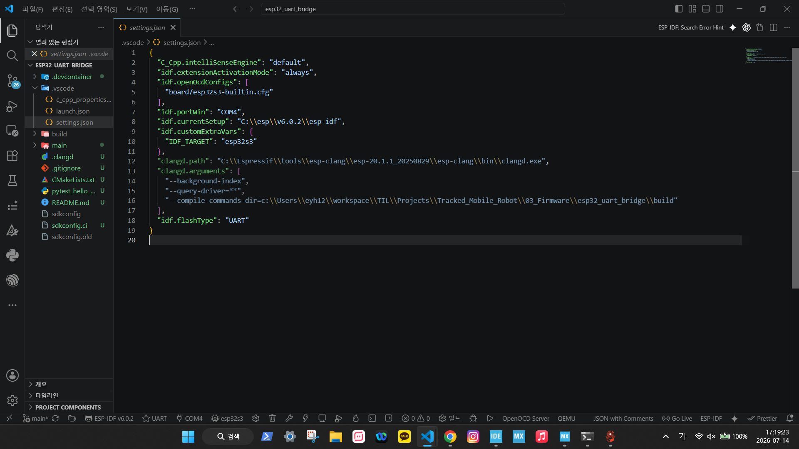
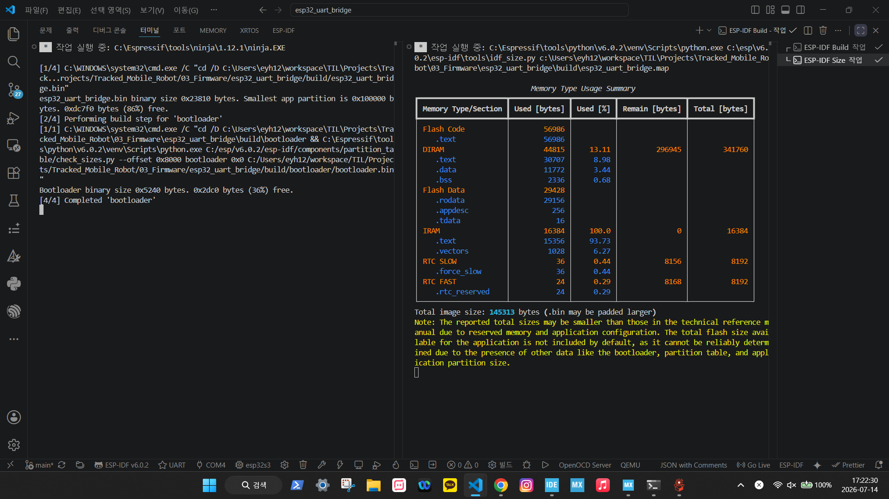
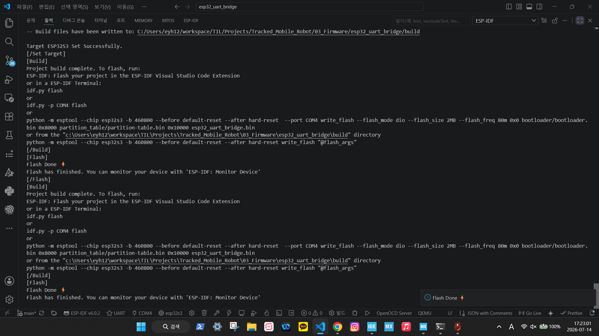
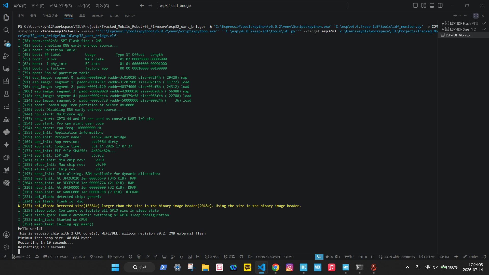

# 2026-07-14 Progress

## Summary

- ESP-IDF v6.0.2 개발 환경을 VS Code ESP-IDF extension과 연동했다.
- ESP32-S3 `esp32_uart_bridge` 프로젝트를 `hello_world` template 기반으로 생성했다.
- ESP32-S3 serial port가 `COM4`임을 확인했다.
- `esp32s3` target으로 build, flash, monitor를 완료했다.
- STM32 ST-LINK VCP `COM3`와 ESP32-S3 `COM4`를 구분했다.
- 컨텍스트 포화에 대비해 최신 handoff 문서와 새 세션 시작 프롬프트를 추가했다.
- ESP32 UART1을 `GPIO17 TX`, `GPIO18 RX`, `115200 8N1`로 설정하고 loopback 송수신을 확인했다.
- STM32 USART1 `PA9/PA10`과 ESP32 UART1을 연결해 `TEL`, `PING`, `PONG` 왕복 통신을 확인했다.
- ESP32 UART 수신 파서가 `TEL`과 `PONG` frame을 구분하고 각각 `tel_count`, `pong_count`로 추적하는 것을 확인했다.

## Today Work Log

오늘 작업은 ESP32-S3를 STM32 UART MVP의 외부 command source / relay node로 세우는 첫 통합 검증이었다.

1. ESP-IDF 환경 구성
   - EIM으로 ESP-IDF v6.0.2를 설치했다.
   - VS Code ESP-IDF extension에 `IDF_PATH`, Python venv, toolchain이 잡힌 것을 확인했다.
   - ESP32-S3 보드가 `COM4`로 잡히고, STM32 ST-LINK VCP는 `COM3`으로 유지됨을 구분했다.

2. ESP32-S3 프로젝트 생성 및 bring-up
   - `03_Firmware/esp32_uart_bridge` 프로젝트를 생성했다.
   - target은 `esp32s3`, OpenOCD 설정은 `board/esp32s3-builtin.cfg`로 두었다.
   - `hello_world` 기본 firmware를 build, flash, monitor까지 수행했다.

3. ESP32 UART1 bridge 코드 작성
   - `main/hello_world_main.c`를 UART bridge 실습 코드로 변경했다.
   - `UART_NUM_1`, `GPIO17 TX`, `GPIO18 RX`, `115200 8N1` 설정을 추가했다.
   - `PING,seq=...\n` frame을 1초 주기로 송신하도록 구현했다.
   - 수신 byte를 line buffer에 모아 `\n` 기준으로 한 줄씩 출력하도록 구현했다.
   - `main/CMakeLists.txt`에 `esp_driver_uart`, `esp_driver_gpio` component 의존성을 추가했다.

4. ESP32 단독 UART 검증
   - ESP32 `GPIO17 TX`와 `GPIO18 RX`를 loopback으로 연결했다.
   - `TX UART1: PING,seq=...` 이후 `RX UART1: PING,seq=...`가 들어오는 것을 확인했다.
   - 이 단계로 ESP32 pin 선택, UART baudrate, line parser가 STM32 없이도 정상임을 확인했다.

5. STM32 USART1 연결 검증
   - STM32CubeMX에서 `USART1`을 활성화해 `PA9 TX`, `PA10 RX`, `115200 8N1`로 설정했다.
   - STM32 firmware의 `uart_mvp_init(&huart1)` 경로를 사용하도록 확인했다.
   - ESP32 `GPIO17 TX -> STM32 PA10 RX`, ESP32 `GPIO18 RX <- STM32 PA9 TX`, GND 공통으로 연결했다.

6. 실패 증상과 원인 확인
   - 처음에는 ESP32 monitor에서 깨진 수신과 `RX line overflow`가 발생했다.
   - 원인은 STM32 보드가 변경된 USART1 firmware로 실행되지 않은 상태였던 것으로 판단했다.
   - STM32에 수정된 firmware를 실행한 뒤 동일 배선에서 정상 frame이 들어왔다.

7. ESP32-STM32 UART 왕복 성공
   - STM32가 `TEL,t_ms=...,state=DISARMED,...` telemetry를 ESP32로 주기 송신했다.
   - ESP32가 `PING,seq=...`를 송신하면 STM32가 `PONG,seq=...,t_ms=...`로 응답했다.
   - `TEL` frame의 `last_seq`가 최신 `PING` sequence로 갱신되는 것을 확인했다.
   - 이로써 ESP32 -> STM32 -> ESP32 UART 왕복 경로가 동작함을 확인했다.

8. ESP32 수신 frame 분류 파서 적용
   - 기존 `RX UART1: ...` raw line 출력에서 `TEL`, `PONG`, `ACK`, `ERR`, `UNKNOWN` 분기 구조로 변경했다.
   - `TEL` frame에서는 `t_ms`를 파싱하고 `tel_count`를 증가시켰다.
   - `PONG` frame에서는 `seq`를 파싱하고 `pong_count`를 증가시켰다.
   - monitor에서 `RX TEL: t_ms=... tel_count=...`와 `RX PONG: seq=... pong_count=...`가 동시에 관찰되어 frame type classification이 동작함을 확인했다.

9. Session closeout와 인수인계 갱신
   - `PROJECT_MEMORY.md`, project `README.md`, handoff 문서, 새 세션 prompt를 실제 완료 지점에 맞췄다.
   - verification matrix에서 loopback과 PING/PONG을 PASS, DISARMED telemetry relay를 PARTIAL PASS로 기록했다.
   - plain PowerShell의 ESP-IDF 환경 문제와 monitor의 `COM4` 점유 문제를 재현 주의사항으로 남겼다.
   - 다음 세션의 첫 code step을 `TEL` 세부 field 구조화로 고정했다.

## Evidence

ESP32 practice note:

- [`../../07_Embedded_Learning_Notes/03_ESP32_Board_Practice/002_ESP32_IDF_Environment_Bringup_ko.md`](../../07_Embedded_Learning_Notes/03_ESP32_Board_Practice/002_ESP32_IDF_Environment_Bringup_ko.md)

Generated ESP-IDF project:

- [`../../03_Firmware/esp32_uart_bridge`](../../03_Firmware/esp32_uart_bridge)

Handoff documents:

- [`../handoff/README.md`](../handoff/README.md)
- [`../handoff/NEXT_SESSION_START_PROMPT.md`](../handoff/NEXT_SESSION_START_PROMPT.md)
- [`../handoff/2026-07-14_esp32_stm32_uart_bridge_handoff.md`](../handoff/2026-07-14_esp32_stm32_uart_bridge_handoff.md)

Observed monitor log:

```text
This is esp32s3 chip with 2 CPU core(s), WiFi/BLE, silicon revision v0.2, 2MB external flash
Minimum free heap size: 401084 bytes
Restarting in 10 seconds...
```

Screenshot evidence:



Project settings evidence: ESP32-S3 target, `COM4`, and `board/esp32s3-builtin.cfg` were selected for the ESP32 bridge project.



Build evidence: ESP-IDF build completed and produced a valid firmware image with memory usage output.



Flash evidence: The firmware image was downloaded to the ESP32-S3 board through `COM4`.



Runtime evidence: The flashed firmware booted on the ESP32-S3 board and emitted `hello_world` logs through the serial monitor.


Bridge TX evidence: ESP32 UART1 started sending `PING,seq=...` frames through `GPIO17`.


Loopback evidence: ESP32 `GPIO17 TX` and `GPIO18 RX` were looped back and the transmitted `PING` frames were received by the ESP32 UART parser.


Troubleshooting evidence: Before running the updated STM32 USART1 firmware, ESP32 received broken bytes and `RX line overflow`, which helped isolate the issue to the STM32 runtime state rather than the ESP32 loopback path.


Integration evidence: ESP32 received STM32 `TEL` frames, sent `PING`, and received matching `PONG` replies over the ESP32 UART1 to STM32 USART1 link.


Parser evidence: ESP32 no longer logs every STM32 message only as a raw UART line. It classifies `TEL` and `PONG` frames and increments `tel_count` and `pong_count`, proving the first parser layer for the UART bridge is active.

## Confirmed Results

- ESP-IDF version: v6.0.2.
- Python version: 3.11.15.
- ESP32-S3 target: `esp32s3`.
- ESP32-S3 serial port: `COM4`.
- OpenOCD config: `board/esp32s3-builtin.cfg`.
- ESP32 bridge UART: `UART_NUM_1`, `GPIO17 TX`, `GPIO18 RX`, `115200 8N1`.
- STM32 bridge UART: `USART1`, `PA9 TX`, `PA10 RX`, `115200 8N1`.
- `hello_world` build: PASS.
- `hello_world` flash: PASS.
- `hello_world` monitor: PASS.
- ESP32 UART1 `GPIO17/GPIO18` loopback: PASS.
- ESP32 UART1 to STM32 USART1 `PING/PONG`: PASS.
- STM32 `TEL` telemetry relay into ESP32 monitor: PASS.
- ESP32 `TEL/PONG` frame classification and count tracking: PASS.
- Full ESP32 scripted bridge MVP: NOT YET PASS.

## Decisions

- ESP32-S3 UART bridge development will use the ESP-IDF project at `03_Firmware/esp32_uart_bridge`.
- ESP32-S3 serial work uses `COM4`.
- STM32 ST-LINK VCP remains `COM3`.
- ESP32 UART loopback is the baseline test before connecting STM32.
- STM32 firmware must be rebuilt/flashed/run after CubeMX UART changes before interpreting ESP32-side UART errors.
- ESP32 remains a command source / relay / logger. STM32 remains parser, safety gate, and final drivetrain authority.
- 새 Codex 세션은 `docs/handoff/NEXT_SESSION_START_PROMPT.md`를 붙여넣고 `docs/handoff/2026-07-14_esp32_stm32_uart_bridge_handoff.md`를 먼저 읽는 방식으로 이어간다.

## Blockers / Open Items

- ESP32 currently classifies `TEL`, `PONG`, `ACK`, and `ERR`, but `TEL` details such as `state`, `last_seq`, `vx_mmps`, `w_mradps`, and `err` are not fully stored as structured state yet.
- ESP32 command flow is still limited to periodic `PING`; scripted `ARM -> CMD -> DISARM` from ESP32 is not implemented yet.
- `T-BRIDGE-004`는 DISARMED telemetry relay까지만 확인했으므로 ARMED/CMD/timeout 항목이 남아 있다.
- ESP-IDF monitor가 `COM4`를 점유한 상태에서는 flash가 `port is busy`로 실패한다. Flash 전 `Ctrl+]`로 monitor를 종료한다.

## Next Actions

1. Parse more `TEL` fields into ESP32-side state: `state`, `last_seq`, `vx_mmps`, `w_mradps`, and `err`.
2. Add parse summary logging with `last_pong_seq`, `last_tel_ms`, and parse error count.
3. Add a simple ESP32 scripted command sequence after parser verification.
4. Update handoff and verification docs after structured parsing expands beyond `TEL/PONG` count tracking.

새 대화창에서는 [`../handoff/NEXT_SESSION_START_PROMPT.md`](../handoff/NEXT_SESSION_START_PROMPT.md)를 붙여넣고 [`../handoff/2026-07-14_esp32_stm32_uart_bridge_handoff.md`](../handoff/2026-07-14_esp32_stm32_uart_bridge_handoff.md)의 `Session Closeout Checkpoint`부터 읽는다.
