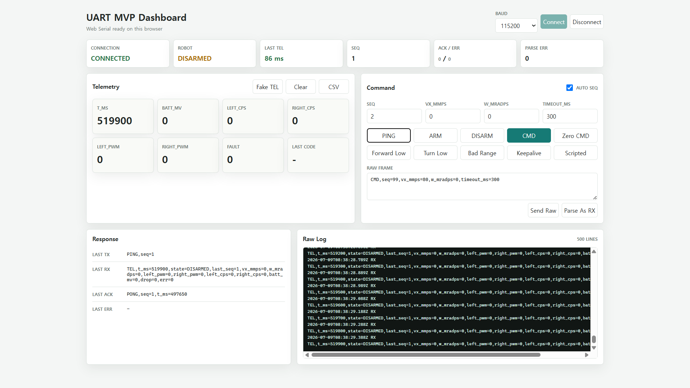
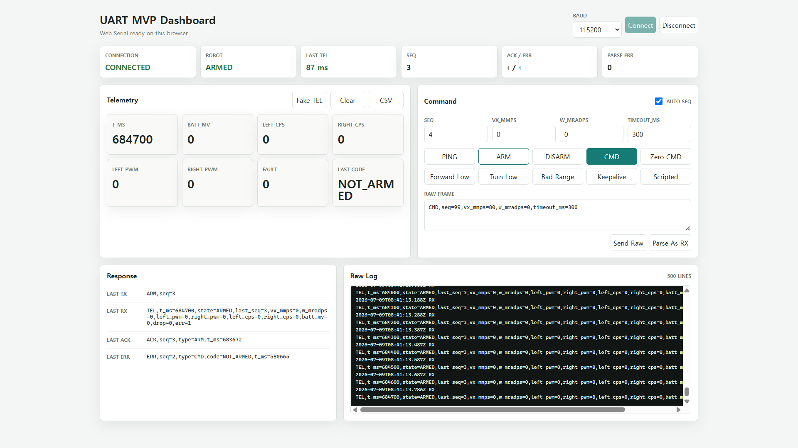

# UART MVP Verification Matrix

## 목적

이 문서는 UART MVP 요구사항과 실제 검증 증거를 연결한다.

검증 기준:

- PASS: 지정한 actual target 범위를 STM32 보드에서 확인했고 추적 가능한 증거 파일이 존재한다.
- PARTIAL: 일부 조건만 확인했거나 증거가 부족하다.
- PLANNED: 아직 검증하지 않았다.

## Evidence Set

| Evidence ID | File | Meaning |
| --- | --- | --- |
| EV-CSV-20260709 | [`../../04_PC_Serial_Control/logs/2026-07-09_uart_mvp_validation_session.csv`](../../04_PC_Serial_Control/logs/2026-07-09_uart_mvp_validation_session.csv) | 전체 UART TX/RX 세션 로그 |
| EV-IMG-01 | [`../../assets/screenshots/uart_mvp/2026-07-09_01_web_dashboard_connected_idle.png`](../../assets/screenshots/uart_mvp/2026-07-09_01_web_dashboard_connected_idle.png) | connected idle + periodic TEL |
| EV-IMG-02 | [`../../assets/screenshots/uart_mvp/2026-07-09_02_ping_pong_response.png`](../../assets/screenshots/uart_mvp/2026-07-09_02_ping_pong_response.png) | PING/PONG response |
| EV-IMG-03 | [`../../assets/screenshots/uart_mvp/2026-07-09_03_cmd_before_arm_not_armed_error.png`](../../assets/screenshots/uart_mvp/2026-07-09_03_cmd_before_arm_not_armed_error.png) | CMD before ARM rejected |
| EV-IMG-04 | [`../../assets/screenshots/uart_mvp/2026-07-09_04_arm_ack_state_armed.png`](../../assets/screenshots/uart_mvp/2026-07-09_04_arm_ack_state_armed.png) | ARM ACK and ARMED state |
| EV-IMG-05 | [`../../assets/screenshots/uart_mvp/2026-07-09_05_valid_cmd_ack_armed.png`](../../assets/screenshots/uart_mvp/2026-07-09_05_valid_cmd_ack_armed.png) | valid CMD ACK and velocity reflected |
| EV-IMG-06 | [`../../assets/screenshots/uart_mvp/2026-07-09_06_cmd_timeout_output_zero.png`](../../assets/screenshots/uart_mvp/2026-07-09_06_cmd_timeout_output_zero.png) | timeout output zero |
| EV-IMG-07 | [`../../assets/screenshots/uart_mvp/2026-07-09_07_bad_range_out_of_range_error.png`](../../assets/screenshots/uart_mvp/2026-07-09_07_bad_range_out_of_range_error.png) | velocity range rejection |
| EV-IMG-08 | [`../../assets/screenshots/uart_mvp/2026-07-09_08_disarm_ack_state_disarmed.png`](../../assets/screenshots/uart_mvp/2026-07-09_08_disarm_ack_state_disarmed.png) | DISARM ACK and DISARMED state |
| EV-P03-UART-20260828 | [`../../assets/logs/esp32_uart_bridge/2026-08-28_p03_timeout_disarmed_rearm_recovery_target_runtime_pass.txt`](../../assets/logs/esp32_uart_bridge/2026-08-28_p03_timeout_disarmed_rearm_recovery_target_runtime_pass.txt) | Current 300 ms timeout-to-DISARMED, CMD-only rejection, ARM-only expiry와 new ARM+CMD recovery |
| EV-P03-SR-20260828 | [`../../assets/captures/logic_analyzer/2026-08-28_p03_timeout_disarmed_rearm_recovery_target_runtime_pass.sr`](../../assets/captures/logic_analyzer/2026-08-28_p03_timeout_disarmed_rearm_recovery_target_runtime_pass.sr) | DIR LOW와 timeout/recovery PWM burst actual control-net capture |
| EV-P03-SAFE-20260828 | [UART](../../assets/logs/esp32_uart_bridge/2026-08-28_p03_safe_restore_all_hooks_zero_no_output_pass.txt), [SR](../../assets/captures/logic_analyzer/2026-08-28_p03_safe_restore_all_hooks_zero_no_output_pass.sr) | All-hooks-`0U` safe UART behavior와 D0~D3 10 s all-LOW |
| EV-REQ-SAFE-004-UART-20260828 | [`../../assets/logs/esp32_uart_bridge/2026-08-28_req_safe_004_500ms_operator_dual_reset_release_runtime_run03.txt`](../../assets/logs/esp32_uart_bridge/2026-08-28_req_safe_004_500ms_operator_dual_reset_release_runtime_run03.txt) | Canonical 500 ms same-run startup/timeout/rejection/expiry/recovery/final-DISARM sequence |
| EV-REQ-SAFE-004-SR-20260828 | [`../../assets/captures/logic_analyzer/2026-08-28_req_safe_004_500ms_operator_dual_reset_release_runtime_run03.sr`](../../assets/captures/logic_analyzer/2026-08-28_req_safe_004_500ms_operator_dual_reset_release_runtime_run03.sr) | D4/D5 UART와 D0~D3 output을 같은 10 s timeline에 보존한 canonical raw capture |
| EV-REQ-SAFE-004-PVS-20260828 | [`../../assets/captures/logic_analyzer/2026-08-28_req_safe_004_500ms_operator_dual_reset_release_runtime_run03.pvs`](../../assets/captures/logic_analyzer/2026-08-28_req_safe_004_500ms_operator_dual_reset_release_runtime_run03.pvs) | Canonical run03 channel/session 설정 |
| EV-REQ-SAFE-004-RESTORE-UART-20260828 | [`../../assets/logs/esp32_uart_bridge/2026-08-28_req_safe_004_post_run03_safe_restore_all_hooks_zero_run04.txt`](../../assets/logs/esp32_uart_bridge/2026-08-28_req_safe_004_post_run03_safe_restore_all_hooks_zero_run04.txt) | Script disabled, startup DISARM/PING/READY, ARM/CMD 0회와 약 14.3 s/144 TEL `DISARMED/zero` |
| EV-REQ-SAFE-004-RESTORE-SR-20260828 | [`../../assets/captures/logic_analyzer/2026-08-28_req_safe_004_post_run03_safe_restore_all_hooks_zero_run04.sr`](../../assets/captures/logic_analyzer/2026-08-28_req_safe_004_post_run03_safe_restore_all_hooks_zero_run04.sr) | Post-run safe D0~D3 2 MHz/20M/10 s HIGH sample/transition 0 |
| EV-REQ-SAFE-004-RESTORE-PVS-20260828 | [`../../assets/captures/logic_analyzer/2026-08-28_req_safe_004_post_run03_safe_restore_all_hooks_zero_run04.pvs`](../../assets/captures/logic_analyzer/2026-08-28_req_safe_004_post_run03_safe_restore_all_hooks_zero_run04.pvs) | Run04 channel/session 설정 |
| EV-P04A-UART-20260829 | [`../../assets/logs/esp32_uart_bridge/2026-08-29_p04a_applied_pwm_telemetry_runtime_run01.txt`](../../assets/logs/esp32_uart_bridge/2026-08-29_p04a_applied_pwm_telemetry_runtime_run01.txt) | Accepted forward CMD의 signed permille `50/50`, ARM-only/timeout/DISARM `0/0`과 fresh recovery를 보존한 P-04A runtime |
| EV-P04A-RESTORE-UART-20260829 | [`../../assets/logs/esp32_uart_bridge/2026-08-29_p04a_post_test_safe_restore_all_hooks_zero_run02.txt`](../../assets/logs/esp32_uart_bridge/2026-08-29_p04a_post_test_safe_restore_all_hooks_zero_run02.txt) | Script disabled, ARM/CMD 0회, 50개 TEL 모두 `DISARMED,left_pwm=0,right_pwm=0`인 safe restore |
| EV-ESTOP-DIRECT-PC7-20260824 | [`18_Physical_EStop_PC7_Direct_Runtime_and_Component_Incoming_Precheck_2026-08-24_ko.md`](18_Physical_EStop_PC7_Direct_Runtime_and_Component_Incoming_Precheck_2026-08-24_ko.md) | Old-schema direct-PC7 motor/LiPo/K1-disconnected runtime에서 active reset ERR, release 뒤 latch 유지와 explicit reset ACK/`DISARMED` 확인. Conditioned Physical E-stop 증거는 아님 |
| EV-P04B-RUN02-UART-20260829 | [`../../assets/logs/esp32_uart_bridge/2026-08-29_p04b_reason_command_age_clean_boot_runtime_run02.txt`](../../assets/logs/esp32_uart_bridge/2026-08-29_p04b_reason_command_age_clean_boot_runtime_run02.txt) | TEL 99개의 no-CMD sentinel, accepted-CMD age reset, `485 -> 585 ms` timeout bracket, `CMD_TIMEOUT`과 software-applied PWM `0/0` |
| EV-P04B-RUN03-UART-20260829 | [`../../assets/logs/esp32_uart_bridge/2026-08-29_p04b_estop_active_latched_runtime_run03.txt`](../../assets/logs/esp32_uart_bridge/2026-08-29_p04b_estop_active_latched_runtime_run03.txt) | TEL 11개의 `DISARMED/DISARM` 5 -> `FAULT/ESTOP_ACTIVE` 6 보조 증거. 이 파일에는 `ESTOP_LATCHED`가 없음 |
| EV-P04B-RUN04-UART-20260829 | [`../../assets/logs/esp32_uart_bridge/2026-08-29_p04b_estop_latched_runtime_run04.txt`](../../assets/logs/esp32_uart_bridge/2026-08-29_p04b_estop_latched_runtime_run04.txt) | TEL 55개의 baseline 6, `ESTOP_ACTIVE` 23, `ESTOP_LATCHED` 26과 PWM 55/55 `0/0`. Reset vector는 포함하지 않음 |
| EV-P04B-REPORT-20260829 | [`23_P04B_Stop_Reason_and_Command_Age_Telemetry_Runtime_Test_Report_2026-08-29_ko.md`](23_P04B_Stop_Reason_and_Command_Age_Telemetry_Runtime_Test_Report_2026-08-29_ko.md) | P-04B `PARTIAL`; historical reason/age `28/28`와 hook-0 isolated build, current reset-harness `29/29`와 ESP isolated build PASS. Active reset `ERR`, release 뒤 reset `ACK`/TEL/vector와 target flash/runtime restore는 `OPEN` |
| EV-P04B-HOOK0-BUILD-20260829 | [`../../assets/logs/firmware_build/2026-08-29_p04b_hook0_isolated_build_pass.md`](../../assets/logs/firmware_build/2026-08-29_p04b_hook0_isolated_build_pass.md) | All-hooks-`0U` isolated STM32/ESP32 build와 artifact hash PASS; target flash/runtime은 포함하지 않음 |
| EV-P04B-RESET-HARNESS-BUILD-20260830 | [`../../assets/logs/firmware_build/2026-08-30_p04b_reset_harness_default_off_esp32_isolated_build_pass.md`](../../assets/logs/firmware_build/2026-08-30_p04b_reset_harness_default_off_esp32_isolated_build_pass.md) | Default-`0U` reset closeout harness source/static `25 + 2 + 2 = 29/29`과 ESP32 isolated build PASS; target flash/runtime과 reset vector 결과는 포함하지 않음 |

## Visual Evidence

### EV-IMG-01: connected idle + periodic TEL


### EV-IMG-02: PING/PONG response



### EV-IMG-03: CMD before ARM rejected


### EV-IMG-04: ARM ACK and ARMED state



### EV-IMG-05: valid CMD ACK and velocity reflected


### EV-IMG-06: timeout output zero


### EV-IMG-07: bad range rejected


### EV-IMG-08: DISARM ACK and DISARMED state


## Matrix

| Requirement | Test Method | Evidence | Result | Notes |
| --- | --- | --- | --- | --- |
| REQ-UART-001 | Web dashboard connect 후 periodic `TEL` 확인 | EV-IMG-01, EV-CSV-20260709 | PASS | `CONNECTED`, `TEL,state=DISARMED` 반복 수신 |
| REQ-UART-002 | `PING,seq=1` 전송 후 `PONG,seq=1` 확인 | EV-IMG-02, EV-CSV-20260709 | PASS | CSV에 TX `PING,seq=1`, RX `PONG,seq=1` 존재 |
| REQ-UART-003 | `ARM`, valid `CMD`, `DISARM`과 healthy-input `ESTOP_RESET` ACK 확인 | EV-IMG-04, EV-IMG-05, EV-IMG-08, EV-CSV-20260709, EV-ESTOP-DIRECT-PC7-20260824 | PASS — defined UART response scope | `ACK,type=ARM/CMD/DISARM`과 old-schema direct-PC7 healthy reset `ACK,type=ESTOP_RESET` 확인. P-04B 새-schema same-run vector는 `REQ-UART-006` closeout으로 별도 추적 |
| REQ-UART-004 | invalid command와 active-input `ESTOP_RESET` ERR 확인 | EV-IMG-03, EV-IMG-07, EV-CSV-20260709, EV-ESTOP-DIRECT-PC7-20260824 | PASS — defined UART response scope | `NOT_ARMED`, `OUT_OF_RANGE`, `TIMEOUT_OUT_OF_RANGE` 및 old-schema direct-PC7 `ESTOP_ACTIVE` 확인. P-04B 새-schema same-run vector는 `REQ-UART-006` closeout으로 별도 추적 |
| REQ-UART-005 | P-04A controlled forward/timeout/recovery sequence와 hook-0 restore에서 `left_pwm/right_pwm` 확인 | EV-P04A-UART-20260829, EV-P04A-RESTORE-UART-20260829 | PASS — UART/software-cached applied-output scope | Active 7 TEL은 `50/50`, ARM-only 5 + DISARMED 37 TEL은 `0/0`; restore의 50개 TEL도 모두 `DISARMED/0/0`. Reverse/asymmetric sign, same-run physical PWM와 actual motor는 미검증 |
| REQ-UART-006 | TEL의 `reason/command_age_ms`로 no-CMD, accepted CMD, timeout과 direct-PC7 active/latch software state를 STM32 -> ESP32 strict parser/log에서 식별 | EV-P04B-RUN02-UART-20260829, EV-P04B-RUN03-UART-20260829, EV-P04B-RUN04-UART-20260829, EV-P04B-REPORT-20260829, EV-P04B-HOOK0-BUILD-20260829, EV-P04B-RESET-HARNESS-BUILD-20260830 | PARTIAL — UART/software-state telemetry scope | Current canonical host/static `25 + 2 + 2 = 29/29`, all-hooks/default reset harness `0U`와 current ESP32 isolated build PASS; run02 reason/age/timeout과 run04 `ESTOP_ACTIVE -> ESTOP_LATCHED` subset PASS. 새 schema의 active reset `ERR`, release 뒤 reset `ACK` + `DISARMED/ESTOP_RESET/PWM 0/0` + `VECTOR DONE`, 변경 source의 target flash/runtime은 `OPEN`. PC7 전압, conditioned Physical E-stop, K1 rail-off, measured PWM/MDD10A output과 actual motor를 증명하지 않음 |
| REQ-SAFE-001 | DISARMED 상태에서 `CMD` 전송 | EV-IMG-03, EV-CSV-20260709 | PASS | `ERR,seq=2,type=CMD,code=NOT_ARMED` |
| REQ-SAFE-002 | `ARM,seq=3` 전송 | EV-IMG-04, EV-CSV-20260709 | PASS | `ACK,seq=3,type=ARM`, 이후 `TEL,state=ARMED` |
| REQ-SAFE-003 | ARMED 상태에서 `CMD,seq=20,vx_mmps=50,w_mradps=0,timeout_ms=500` 전송 | EV-IMG-05, EV-CSV-20260709 | PASS | `ACK,seq=20,type=CMD`, 이후 `TEL,last_seq=20,vx_mmps=50` |
| REQ-SAFE-004 | valid `CMD(timeout_ms=500)` 후 추가 command 없이 timeout 대기 | EV-REQ-SAFE-004-UART-20260828, EV-REQ-SAFE-004-SR-20260828, EV-REQ-SAFE-004-PVS-20260828, EV-REQ-SAFE-004-RESTORE-UART/SR/PVS-20260828 | PASS — motor/LiPo-disconnected UART + MCU control-net scope | Same-run seq `1123029003~1123029013`에서 `vx=50` -> 500 ms timeout `DISARMED/zero`, timeout response 없음, CMD-only `NOT_ARMED`, ARM-only old-command 미복원/default 300 ms expiry, new ARM+CMD recovery와 final safe tail을 확인. Run04 safe board restore도 PASS. Reset line 동시성, exact BIN linkage와 actual MDD10A/motor는 별도 범위 |
| REQ-SAFE-005 | `CMD`에 `vx_mmps=9999` 전송 | EV-IMG-07, EV-CSV-20260709 | PASS | `ERR,seq=25,type=CMD,code=OUT_OF_RANGE` |
| REQ-SAFE-006 | `CMD`에 `timeout_ms=3000` 전송 | EV-CSV-20260709 | PASS | `ERR,code=TIMEOUT_OUT_OF_RANGE`; 스크린샷은 별도 저장하지 않음 |
| REQ-SAFE-007 | `DISARM,seq=26` 전송 | EV-IMG-08, EV-CSV-20260709 | PASS | `ACK,seq=26,type=DISARM`, 이후 `TEL,state=DISARMED` |

## CSV Evidence Highlights

검증 세션 CSV에서 확인한 주요 이벤트:

```text
TX PING,seq=1
RX PONG,seq=1,t_ms=497650

TX CMD,seq=2,vx_mmps=0,w_mradps=0,timeout_ms=300
RX ERR,seq=2,type=CMD,code=NOT_ARMED

TX ARM,seq=3
RX ACK,seq=3,type=ARM

TX CMD,seq=20,vx_mmps=50,w_mradps=0,timeout_ms=500
RX ACK,seq=20,type=CMD
RX TEL,...last_seq=20,vx_mmps=50...
RX TEL,...last_seq=20,vx_mmps=0...

TX CMD,seq=25,vx_mmps=9999,w_mradps=0,timeout_ms=300
RX ERR,seq=25,type=CMD,code=OUT_OF_RANGE

TX DISARM,seq=26
RX ACK,seq=26,type=DISARM
RX TEL,...state=DISARMED,last_seq=26,vx_mmps=0,w_mradps=0...
```

## Residual Risk

- `LAST CODE` display는 마지막 error code를 유지하므로 정상 ACK 화면에서도 이전 error가 남아 보일 수 있다. 이는 firmware behavior라기보다 dashboard display policy에 가깝다.
- CSV에는 periodic `TEL`이 많이 포함되어 파일 크기가 커진다. 이후에는 test session 단위로 log trimming 또는 summary export를 추가할 수 있다.
- Historical 2026-07-09 evidence는 command variable/telemetry 범위였다. 2026-08-28 P-03과
  `REQ-SAFE-004` run03은 motor/LiPo-disconnected `PB6/PB7/PC8/PC9` actual MCU control-net까지
  추가 확인했다. 이는 MDD10A power stage, actual motor stop, exact controlled BIN linkage,
  reset-line 동시성 또는 timeout 범위 전체의 timing certification이 아니다. 상세 경계는
  [report 20](20_P03_Command_Timeout_Disarmed_Rearm_Target_Runtime_Test_Report_2026-08-28_ko.md)과
  [report 21](21_REQ_SAFE_004_500ms_Command_Timeout_and_Recovery_Target_Runtime_Test_Report_2026-08-28_ko.md)을 따른다.
- 2026-08-29 P-04A는 software cache에서 STM TEL과 ESP parser/log까지 이어지는 applied-output
  경로를 추가했다. Positive symmetric `+50/+50`과 safe-zero vector는 PASS지만 measured duty
  feedback, reverse/asymmetric sign, exact flashed binary linkage와 actual motor를 증명하지 않는다.
  상세 경계는 [report 22](22_P04A_Applied_PWM_Telemetry_Target_Runtime_Test_Report_2026-08-29_ko.md)를 따른다.
- 2026-08-29 P-04B historical checkpoint `28/28`과 run02/03/04에서 no-CMD sentinel,
  successful CMD-only age reset, `CMD_TIMEOUT`, direct-PC7 `ESTOP_ACTIVE -> ESTOP_LATCHED`가
  STM TEL에서 ESP strict parser/log까지 보존됨을 확인했다. Run03은 active 보조
  증거일 뿐 latch sample은 run04에서만 확인했다. 새 schema의 active reset 거부,
  release 뒤 reset 성공과 all-hooks-`0U` target reflash/runtime restore는 여전히 `OPEN`이다. 2026-08-30
  default-`0U` reset closeout harness는 current canonical `29/29`과 ESP32 isolated build를 통과했지만
  위 runtime 결과를 대신하지 않는다. 이는 UART/software
  telemetry subset이며 Physical E-stop conditioned path, K1 motor-energy cut, measured PWM,
  MDD10A output 또는 actual motor stop 증거가 아니다. 상세 경계는
  [report 23](23_P04B_Stop_Reason_and_Command_Age_Telemetry_Runtime_Test_Report_2026-08-29_ko.md)를 따른다.
