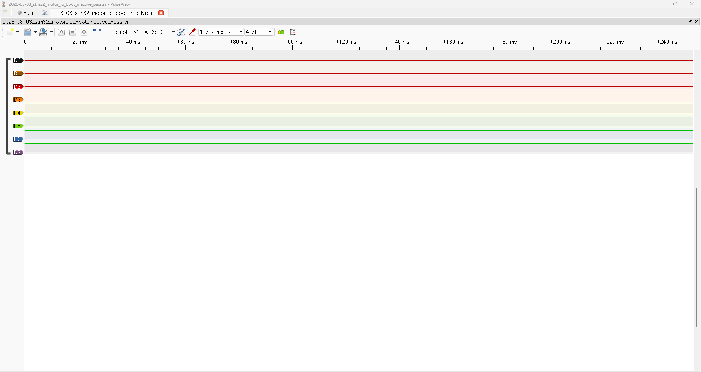
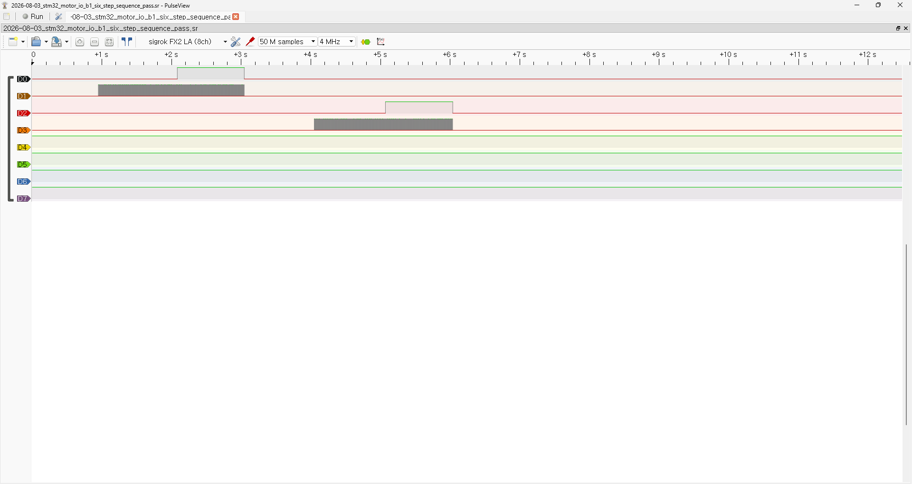

# STM32 Motor Output Waveform and Direction Timing Test Report - 2026-08-03

> 2026-08-04 후속 active DISARM MCU-pin timing은
> [`10_STM32_Active_DISARM_Shutdown_Latency_Test_Report_2026-08-04_ko.md`](10_STM32_Active_DISARM_Shutdown_Latency_Test_Report_2026-08-04_ko.md)에 기록했다. 이 문서는 8/3 waveform/direction 실행 기록으로 보존한다.

## Summary

2026-08-03에 NUCLEO-F446RE의 MDD10A 제어용 GPIO/PWM 네 신호를 로직 분석기로 계측했다. 모터와 MDD10A 전력단은 분리한 상태에서 MCU 측 3.3 V 신호만 관찰했다.

결론:

```text
STM32 motor-output waveform/direction timing subtests PASS
Overall motor safety gate PARTIAL
```

검증된 사항:

- 캡처된 초기 0.25초 구간에서 `DIR1`, `PWM1`, `DIR2`, `PWM2`가 모두 LOW였으며 의도하지 않은 pulse가 관찰되지 않았다.
- PWM1과 PWM2의 반복 주파수는 각각 약 20.1005 kHz였다.
- 10% 시험 명령에서 두 PWM의 high time은 5.000 µs, 계산 duty는 약 10.05%였다.
- 두 채널 모두 방향 전환 전·후 PWM 비활성 구간이 1.0 ms 이상이었다.
- 임시 B1 출력 시험 hook과 fault-injection hook은 source에서 다시 `0U`로 복구되었고, 복구된 STM32 source의 Debug build는 `0 errors / 0 warnings`로 성공했다.
- 복구된 safe STM32 image를 보드에 다시 flash/run한 뒤 B1을 눌러도 `DIR1`, `PWM1`, `DIR2`, `PWM2`에 출력이 생기지 않는 hook-off regression을 확인했다.

이 2026-08-03 실행에 포함되지 않은 사항:

- 외부 reset marker와 함께 reset 순간부터 기록한 최종 hook-off boot capture
- UART `DISARM`, command timeout, software fault 발생 시점부터 실제 PWM edge가 멈출 때까지의 latency. Active DISARM은 2026-08-04 후속 report에서 scoped PASS
- MDD10A 전력단에 전원을 인가한 상태의 출력과 실제 모터 정지
- Physical E-stop

## Test Environment

| Item | Value |
| --- | --- |
| Date | 2026-08-03 |
| MCU board | NUCLEO-F446RE / STM32F446RE |
| Firmware project | `03_Firmware/stm32_uart_mvp` |
| Logic analyzer | sigrok FX2 LA, 8 channels |
| Capture software | PulseView / sigrok `0.6.0-git-883c2ac` |
| Sample rate | 4 MHz, nominal 0.25 µs/sample |
| Initial inactive capture | 1 M samples, 0.25 s |
| Six-step capture | 50 M samples, 12.5 s |
| PWM timer | TIM4, 84 MHz timer clock, PSC=0, ARR=4199 |
| Expected PWM | 20 kHz |
| Test duty cap | 100 permille = 10% |
| Motor / MDD10A power | Disconnected / not energized |
| STM32 power | USB only |

Test procedure:

- [Motor Output Waveform And Shutdown Latency Test](../../02_Hardware_Validation/09_Motor_Output_Waveform_and_Shutdown_Latency_Test.md)

## Actual Channel Map

저장된 PulseView session의 채널 이름은 `D0`~`D7`이다. 판정에는 아래의 실제 배선표를 사용한다.

| Analyzer channel | STM32 pin / signal | Function |
| --- | --- | --- |
| `D0` | `PC8 / DIR1` | MDD10A channel 1 direction |
| `D1` | `PB6 / TIM4_CH1 / PWM1` | MDD10A channel 1 PWM |
| `D2` | `PC9 / DIR2` | MDD10A channel 2 direction |
| `D3` | `PB7 / TIM4_CH2 / PWM2` | MDD10A channel 2 PWM |
| `D4`~`D7` | Not connected | Unused in this capture |
| Analyzer `GND` | STM32 GND | Digital reference |

## Acceptance Criteria

| Measurement | Acceptance |
| --- | --- |
| Active PWM frequency | 19.8~20.2 kHz |
| Duty at 100 permille request | 9.5~10.5% |
| Pre-DIR PWM inactive interval | 1.0 ms 이상 |
| Post-DIR PWM inactive interval | 1.0 ms 이상 |
| Initial inactive capture | D0~D3에서 active pulse 또는 unexpected transition 없음 |

## Test Procedure

1. 모터와 MDD10A 전력단을 분리하고 STM32만 USB로 전원 공급했다.
2. 로직 분석기의 `D0`~`D3`와 GND를 Actual Channel Map대로 연결했다.
3. 4 MHz로 초기 inactive 구간을 캡처했다.
4. 임시 B1 six-step bench hook을 사용해 두 채널의 10% PWM과 방향 전환을 순차 실행했다.
5. PulseView cursor로 각 PWM의 high time과 rising-to-rising period를 측정했다.
6. 마지막 PWM pulse와 DIR edge, DIR edge와 첫 PWM pulse 사이의 비활성 구간을 각각 측정했다.
7. raw capture(`.sr`), PulseView session(`.pvs`), 판정 화면(`.png`)을 저장했다.
8. 임시 출력 시험 macro와 fault-injection macro를 `0U`로 복구하고 STM32 Debug build를 수행했다.

## Measurements

| Item | Measured value | Acceptance | Result |
| --- | ---: | ---: | --- |
| PWM1 high time | 5.000000 µs | Duty calculation input | PASS |
| PWM1 period | 49.750000 µs | 49.505~50.505 µs equivalent | PASS |
| PWM1 frequency | 20.100502513 kHz | 19.8~20.2 kHz | PASS |
| PWM1 calculated duty | 10.05% | 9.5~10.5% | PASS |
| PWM2 high time | 5.000000 µs | Duty calculation input | PASS |
| PWM2 period | 49.750000 µs | 49.505~50.505 µs equivalent | PASS |
| PWM2 frequency | 20.100502512 kHz | 19.8~20.2 kHz | PASS |
| PWM2 calculated duty | 10.05% | 9.5~10.5% | PASS |
| PWM1 pre-DIR inactive | 1994.000000 µs | ≥ 1000 µs | PASS |
| PWM1 post-DIR inactive | 2038.750000 µs | ≥ 1000 µs | PASS |
| PWM2 pre-DIR inactive | 1547.250000 µs | ≥ 1000 µs | PASS |
| PWM2 post-DIR inactive | 약 2040.00 µs edge-to-edge | ≥ 1000 µs | PASS |

Duty는 `5.000 µs / 49.750 µs × 100 = 약 10.05%`로 계산했다. High-time 화면에 표시된 약 200 kHz는 `1 / 5 µs`이며 PWM 반복 주파수가 아니다. PWM 주파수 판정은 rising-to-rising period 49.75 µs만 사용했다.

4 MHz에서는 한 sample이 0.25 µs이므로 cursor 수치의 마지막 자릿수까지 독립적인 물리 정확도를 보장하는 것은 아니다. 위 수치는 PulseView 화면 표시값을 보존한 것이며 판정 범위와는 충분한 여유가 있다.

PWM2 post-DIR PNG의 선택 구간은 DIR edge보다 약 `18.3 µs` 앞에서 시작해 `2058.320205 µs`로 표시된다. 실제 DIR edge부터 첫 PWM edge까지는 raw capture에서 약 `2040.00 µs`이며, 판정에는 이 edge-to-edge 값을 사용했다.

## Evidence

### EV-01: Initial inactive capture

Raw/session:

- [SR](../../assets/captures/logic_analyzer/2026-08-03_stm32_motor_io_boot_inactive_pass.sr)
- [PVS](../../assets/captures/logic_analyzer/2026-08-03_stm32_motor_io_boot_inactive_pass.pvs)



Observation:

- 캡처된 0.25초 구간에서 D0~D3 transition이 관찰되지 않았다.
- 외부 reset marker가 없으므로 이 증거를 reset 순간 전체나 장시간 boot sequence의 독립 입증으로 확대하지 않는다.

### EV-02: B1 six-step overview

Raw/session:

- [SR](../../assets/captures/logic_analyzer/2026-08-03_stm32_motor_io_b1_six_step_sequence_pass.sr)
- [PVS](../../assets/captures/logic_analyzer/2026-08-03_stm32_motor_io_b1_six_step_sequence_pass.pvs)



Observation:

- PWM1/DIR1과 PWM2/DIR2가 순차적으로 시험되며 마지막에는 네 출력이 inactive로 돌아간다.
- 이 sequence는 임시 bench hook 동작이며 production control interface가 아니다.

### EV-03: PWM frequency and duty

| Channel | High-time evidence | Period evidence |
| --- | --- | --- |
| PWM1 / D1 | [5.000 µs](../../assets/screenshots/logic_analyzer/2026-08-03_stm32_motor_io_pwm1_high_time_5us_pass.png) | [49.750 µs / 20.1005 kHz](../../assets/screenshots/logic_analyzer/2026-08-03_stm32_motor_io_pwm1_period_20khz_pass.png) |
| PWM2 / D3 | [5.000 µs](../../assets/screenshots/logic_analyzer/2026-08-03_stm32_motor_io_pwm2_high_time_5us_pass.png) | [49.750 µs / 20.1005 kHz](../../assets/screenshots/logic_analyzer/2026-08-03_stm32_motor_io_pwm2_period_20khz_pass.png) |

### EV-04: Direction-change inactive intervals

| Channel | Pre-DIR evidence | Post-DIR evidence |
| --- | --- | --- |
| PWM1 / D1 | [1994.000 µs](../../assets/screenshots/logic_analyzer/2026-08-03_stm32_motor_io_pwm1_pre_dir_zero_ge1ms_pass.png) | [2038.750 µs](../../assets/screenshots/logic_analyzer/2026-08-03_stm32_motor_io_pwm1_post_dir_zero_ge1ms_pass.png) |
| PWM2 / D3 | [1547.250 µs](../../assets/screenshots/logic_analyzer/2026-08-03_stm32_motor_io_pwm2_pre_dir_zero_ge1ms_pass.png) | [약 2040.00 µs edge-to-edge; 화면 선택 2058.320205 µs](../../assets/screenshots/logic_analyzer/2026-08-03_stm32_motor_io_pwm2_post_dir_zero_ge1ms_pass.png) |

Evidence indexes:

- [Raw capture and session index](../../assets/captures/logic_analyzer/README.md)
- [Screenshot index](../../assets/screenshots/logic_analyzer/README.md)

## 2026-08-03 Source Restore Status

이 시험 종료 당시 source 안전값:

- STM32 [`main.c`](../../03_Firmware/stm32_uart_mvp/Core/Src/main.c): `MOTOR_OUTPUT_PIN_TEST_ENABLED 0U`
- STM32 [`main.c`](../../03_Firmware/stm32_uart_mvp/Core/Src/main.c): `MOTOR_FAULT_INJECTION_TEST_ENABLED 0U`
- ESP32 [`hello_world_main.c`](../../03_Firmware/esp32_uart_bridge/main/hello_world_main.c): `BRIDGE_SCRIPTED_TEST_ENABLED 0U`

복구된 STM32 source의 Debug build는 `0 errors / 0 warnings`로 성공했다. 이어서 safe image를 STM32 보드에 물리적으로 flash/run했고, B1을 눌러도 네 motor-control signal에 출력이 생기지 않는 것을 로직 분석기로 확인했다.

따라서 source restore와 safe-image physical no-output regression은 `PASS`다. 다만 당시 캡처에는 외부 reset marker가 없었으므로 reset edge부터의 전체 boot 구간을 독립적으로 입증하는 최종 capture는 `PENDING`으로 구분한다.

2026-08-04 active-DISARM 시험 때 ESP scripted hook과 STM32 UART output hook은 다시
`1U`가 됐다. 이후 current source는 ESP `0U/1000 ms`, STM output hook `0U`로 복구됐고
contract `15/15`와 isolated clean dual build도 PASS했다. Restored safe images의 board
reflash/run과 ARM/CMD 0 evidence는 pending이다.

## Result

| Area | Result | Notes |
| --- | --- | --- |
| Initial inactive sampled interval | PASS — scoped | 캡처된 0.25초 구간에 한정 |
| PWM1 frequency / duty | PASS | 20.1005 kHz / 약 10.05% |
| PWM2 frequency / duty | PASS | 20.1005 kHz / 약 10.05% |
| PWM1 direction settle | PASS | 1.994 ms / 2.03875 ms |
| PWM2 direction settle | PASS | 1.54725 ms / 약 2.040 ms edge-to-edge |
| Temporary hook source restore | PASS | STM32/ESP32 source macro `0U`; STM32 restored-source build 성공 |
| Post-restore STM32 flash/run and B1 no-output regression | PASS | Safe image 실기 flash/run 후 로직 분석기에서 네 signal 무출력 확인 |
| External-reset-marker final boot capture | PENDING | reset edge 기준 전체 boot 구간의 독립 증거가 없음 |
| DISARM shutdown latency | PASS — scoped in 2026-08-04 follow-up | UART RX end to PWM last edge 23.50 us MCU-pin first baseline; 이 8/3 보고서 실행에는 포함되지 않음 |
| Command-timeout shutdown latency | NOT TESTED | 마지막 valid CMD와 PWM 동시 캡처 필요 |
| Software-fault output-zero / latch function | PASS — historical functional DMM/LED scope | [2026-07-30 operator record](../../assets/logs/motor_output/2026-07-30_fault_injection_output_zero_latch_verification.md); 정확한 latency 증거 아님 |
| Software-fault event-to-PWM latency | NOT TESTED | fault marker와 PWM 동시 캡처 필요 |
| Physical E-stop | NOT TESTED | 별도 hardware energy-cut 검증 대상 |
| Powered MDD10A active edge-latency revalidation | NOT TESTED IN THIS REPORT | 과거 powered/no-motor LED·timeout·DISARM·fault 기능시험은 PASS; 이번에는 MCU pin timing만 측정 |
| Actual motor stop | NOT TESTED | 실제 모터 미연결 |

## Scope Limits

- 이번 결과는 STM32 측 3.3 V digital pin의 timing만 검증한다.
- MDD10A 전력단의 전압·전류·출력 switching과 실제 모터의 회전 또는 정지를 검증하지 않았다.
- 이 8/3 실행에서는 UART frame 수신부터 PWM 차단까지의 end-to-end latency를 측정하지 않았다. 8/4 후속 capture에서 active DISARM MCU-pin first baseline 23.50 us를 별도 측정했다.
- encoder noise나 motor EMI 조건을 포함하지 않았다.
- Physical E-stop 요구사항은 [Physical E-stop Requirements and Verification Plan](06_Physical_EStop_Requirements_and_Verification_Plan_ko.md)에서 별도로 검증해야 한다.
- 임시 B1 six-step hook은 측정용 bench 기능이며 정상 운용 기능으로 간주하지 않는다.

## Remaining Tests / Next Actions

1. 2026-08-04 active DISARM capture와 23.50 us first baseline을 회귀 기준으로 보존한다.
2. 완료된 hook `0U`, contract `15/15`와 isolated clean dual-build checkpoint를 보존하고 safe images를 양쪽 board에 재flash/run한다.
3. Command timeout의 마지막 valid CMD와 PWM 종료 edge를 동시에 캡처한다.
4. Software fault injection event, PWM 종료, fault latch 유지 상태를 함께 캡처한다.
5. 위 latency 측정을 마친 뒤 다시 safe restore하고 external reset marker와 D0~D3를 함께 기록한다.
6. MCU-side 안전 시험과 final safe-image 회귀 뒤 MDD10A powered/no-motor active edge-latency를 재검증한다.
7. Physical E-stop은 별도 회로와 acceptance criteria로 검증하고, 그 뒤 lifted/no-load actual-motor 시험으로 진행한다.
