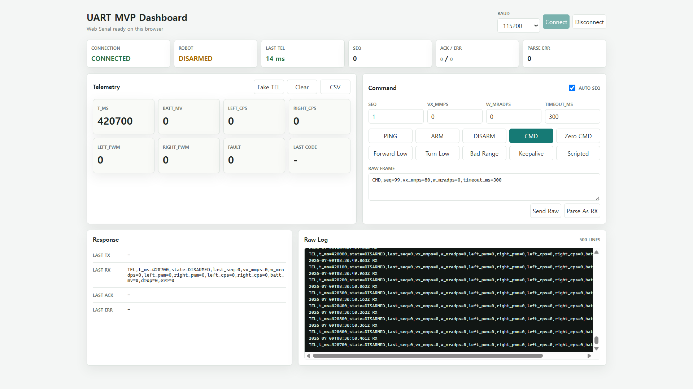
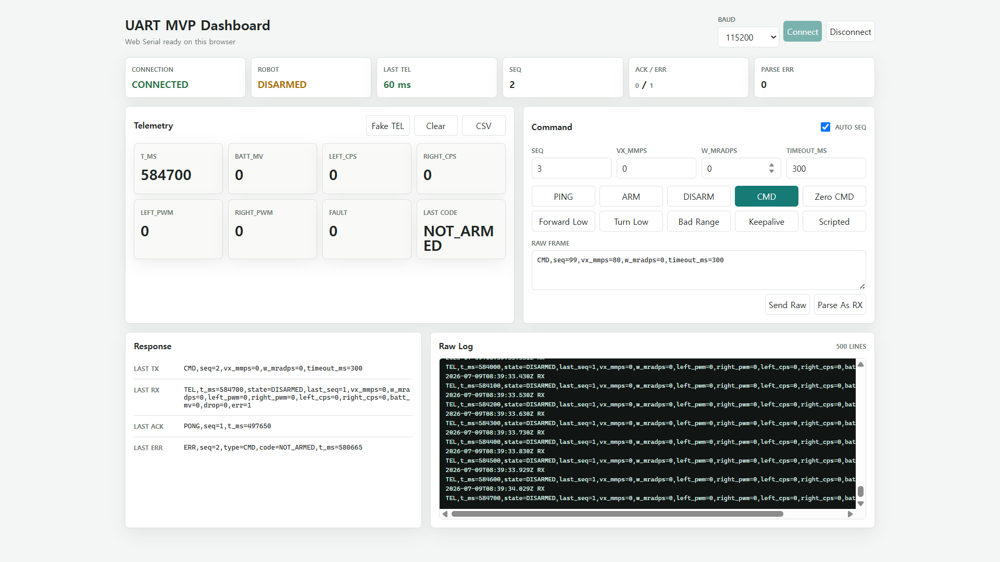
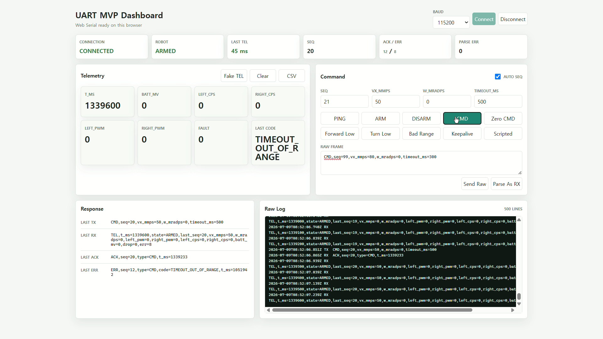
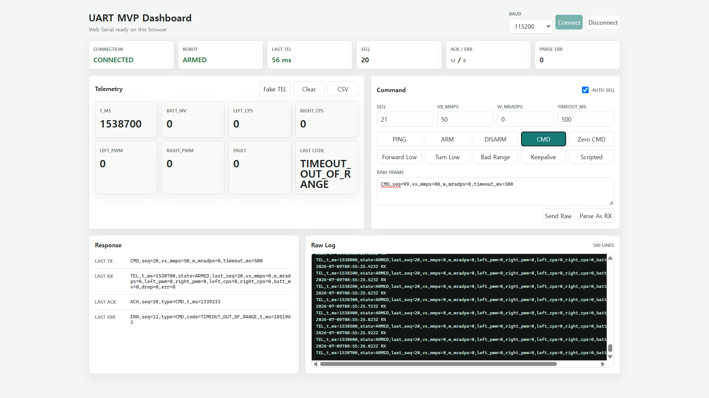

# Verification Documentation

이 폴더는 Tracked Mobile Robot 프로젝트의 요구사항, 검증 항목, 테스트 증거를 연결해 두는 곳이다.

목표는 개인 프로젝트 규모에 맞는 경량 V-model을 적용하는 것이다. 즉, 큰 조직의 절차 문서를 흉내 내는 것이 아니라 다음 흐름을 작게라도 남긴다.

```text
Engineering Basis
-> 요구사항
-> 구현 대상
-> 검증 방법
-> 실제 증거
-> 결과와 다음 조치
```

계획·설계·구현·검증에 사용한 Basis ID, 적용 수준과 인증 주장 경계는 [`../portfolio/03_Engineering_Basis_and_Standards_Traceability_ko.md`](../portfolio/03_Engineering_Basis_and_Standards_Traceability_ko.md)를 정본으로 사용한다.

## Current Verification Scope

현재 검증 완료 범위는 PC-first UART MVP, ESP32 board-only UART bridge MVP와
motor-disconnected MDD10A/dual-encoder 하위 시험까지 확장됐다.

```text
PC Web Serial Dashboard
<-> ST-LINK Virtual COM Port
<-> STM32 USART2
<-> UART MVP parser / safety state machine

ESP32 USB Monitor
<-> ESP32-S3 UART1 GPIO17/GPIO18
<-> STM32 USART1 PA10/PA9
<-> PING/PONG/ARM/CMD/DISARM/ACK/ERR/TEL
```

ESP32 bridge는 2026-07-20 release baseline에서 loopback, `PING/PONG`, structured `TEL` parsing, scripted `CMD before ARM -> ARM -> valid CMD -> invalid CMD -> DISARM`, timeout-zero를 모두 PASS했다. 2026-08-03~12에는 response-gated Gate A/B와 `T-BRIDGE-007/008` required runtime을 닫았다. Motor-output safety 시험 뒤 all-hooks-`0U`, contract `15/15`와 final safe runtime의 exact startup, READY 뒤 15.4 s/TEL 155 safe, ARM/CMD/error 0을 다시 확인했다. Gate C required runtime scope는 PASS지만 exact runtime-to-artifact linkage, external cold-start marker와 log-embedded physical setup provenance가 없어 current strict-parser release 전체 판정은 `PARTIAL`이다.

2026-08-18 현재 검증된 추가 범위:

- MDD10A powered/no-motor routing, direction, timeout/DISARM와 software fault shutdown
- STM32 pin-only PWM frequency/duty, direction-change pre/post zero와 active DISARM 23.50 us first baseline
- Command-timeout shutdown scoped baseline과 software-fault next-pulse suppression/no-reactivation latch
- External reset 첫 FAIL에서 도출한 DIR/PWM별 `10 kΩ` pull-down과 5 s/20 M samples all-LOW 재시험 PASS
- Dual encoder conditioned input, TIM3/TIM5 count, CPS/mRPM와 vehicle-frame sign
- Fused/switched LiPo input과 XL4015 bench load
- Permanent perfboard 5-Net, nominal 19 kHz/10% active 6-step와 final hook-`0U` 5초 all-LOW

아직 최종 검증에 포함하지 않은 것:

- 실제 DC motor 구동
- Physical E-stop과 motor-connected stop
- MDD10A power-stage shutdown timing과 actual motor response
- Powered-motor encoder noise와 wheel-speed/odometry
- ROS 2 bridge

따라서 이 검증의 의미는 "로봇 전체가 움직였다"가 아니라, "STM32 하위 제어기가 command/telemetry protocol과 safety gate를 실제 보드에서 수행했다"이다.

## Documents

| Document | Purpose |
| --- | --- |
| [`01_UART_MVP_Requirements_ko.md`](01_UART_MVP_Requirements_ko.md) | UART MVP 요구사항과 acceptance criteria |
| [`02_UART_MVP_Verification_Matrix_ko.md`](02_UART_MVP_Verification_Matrix_ko.md) | 요구사항, 테스트 방법, 증거 파일, 결과 연결 |
| [`03_UART_MVP_Test_Report_2026-07-09_ko.md`](03_UART_MVP_Test_Report_2026-07-09_ko.md) | 2026-07-09 실제 STM32 + Web Serial 검증 리포트 |
| [`04_ESP32_STM32_UART_Bridge_Verification_Plan_ko.md`](04_ESP32_STM32_UART_Bridge_Verification_Plan_ko.md) | ESP32를 command source / telemetry relay로 붙이는 보드 단독 검증 계획 |
| [`05_Final_MVP_Requirements_and_Verification_Matrix_ko.md`](05_Final_MVP_Requirements_and_Verification_Matrix_ko.md) | 전원·기구·모터·엔코더·주행까지 확장한 최종 MVP 요구사항과 V-model 추적 매트릭스 |
| [`06_Physical_EStop_Requirements_and_Verification_Plan_ko.md`](06_Physical_EStop_Requirements_and_Verification_Plan_ko.md) | MCU와 독립적인 motor-energy 차단, fail-safe sense, latch/reset과 단계별 E-stop 검증 계획 |
| [`07_STM32_Motor_Output_Waveform_and_Direction_Timing_Test_Report_2026-08-03_ko.md`](07_STM32_Motor_Output_Waveform_and_Direction_Timing_Test_Report_2026-08-03_ko.md) | Logic analyzer로 확인한 boot inactive sampled interval, 양 채널 PWM frequency/duty와 direction settle 결과·한계 |
| [`08_ESP32_STM32_UART_Strict_Parser_Normal_Sequence_Test_Report_2026-08-03_ko.md`](08_ESP32_STM32_UART_Strict_Parser_Normal_Sequence_Test_Report_2026-08-03_ko.md) | Current strict parser의 controlled normal sequence PASS 결과와 startup/malformed 잔여 release gate |
| [`09_ESP32_STM32_UART_Response_Gated_Startup_Test_Report_2026-08-03_ko.md`](09_ESP32_STM32_UART_Response_Gated_Startup_Test_Report_2026-08-03_ko.md) | Gate A exact startup, Gate B bounded loss/stale response/reset recovery 결과와 evidence 한계 |
| [`10_STM32_Active_DISARM_Shutdown_Latency_Test_Report_2026-08-04_ko.md`](10_STM32_Active_DISARM_Shutdown_Latency_Test_Report_2026-08-04_ko.md) | DISARM UART RX frame end부터 PB6/PB7 last-active-edge까지 23.50 us MCU-pin baseline |
| [`11_ESP32_Duplicate_Required_Seq_ACK_Recovery_Test_Report_2026-08-06_ko.md`](11_ESP32_Duplicate_Required_Seq_ACK_Recovery_Test_Report_2026-08-06_ko.md) | T-BRIDGE-008A duplicate required `seq` ACK rejection, same-seq retry, exact-response recovery와 safe restore evidence |
| [`12_ESP32_Trailing_Comma_ACK_Recovery_Test_Report_2026-08-07_ko.md`](12_ESP32_Trailing_Comma_ACK_Recovery_Test_Report_2026-08-07_ko.md) | T-BRIDGE-008A trailing-comma ACK rejection/recovery, safe restore, full-build 0/0와 artifact hash reproduction evidence |
| [`13_ESP32_Required_Seq_Uint32_Overflow_ACK_Recovery_Test_Report_2026-08-07_ko.md`](13_ESP32_Required_Seq_Uint32_Overflow_ACK_Recovery_Test_Report_2026-08-07_ko.md) | T-BRIDGE-008A required-`seq` uint32-overflow ACK rejection/recovery와 current safe restore evidence |
| [`14_ESP32_Partial_Frame_Name_ACK_Recovery_Test_Report_2026-08-11_ko.md`](14_ESP32_Partial_Frame_Name_ACK_Recovery_Test_Report_2026-08-11_ko.md) | T-BRIDGE-008A partial-frame-name ACK rejection, 500 ms same-seq retry, exact-response recovery와 safe full-build/flash/runtime closeout evidence |
| [`15_UART_Gate_C_Invalid_Control_And_STM32_Command_Recovery_Test_Report_2026-08-12_ko.md`](15_UART_Gate_C_Invalid_Control_And_STM32_Command_Recovery_Test_Report_2026-08-12_ko.md) | T-BRIDGE-008A embedded-CR/control-byte/overlong response, T-BRIDGE-008B malformed-command 8-vector와 final all-hooks-`0U` safe runtime report |
| [`16_STM32_Timeout_Fault_And_Reset_Boot_Safety_Test_Report_2026-08-12_ko.md`](16_STM32_Timeout_Fault_And_Reset_Boot_Safety_Test_Report_2026-08-12_ko.md) | Command-timeout/fault shutdown, reset first FAIL, external `10 kΩ` pull-down 개선 PASS와 final safe restore report |
| [`17_Final_Perfboard_Active_DIR_PWM_and_Safe_Restore_Test_Report_2026-08-18_ko.md`](17_Final_Perfboard_Active_DIR_PWM_and_Safe_Restore_Test_Report_2026-08-18_ko.md) | Permanent perfboard를 통과한 nominal 19 kHz/10% 양 채널 6-step, DIR 전후 zero margin과 hook-0 5초 all-LOW report |

## Evidence Files

주요 증거 파일:

| Evidence | Path |
| --- | --- |
| Web Serial screenshots | [`../../assets/screenshots/uart_mvp`](../../assets/screenshots/uart_mvp) |
| UART validation CSV | [`../../04_PC_Serial_Control/logs/2026-07-09_uart_mvp_validation_session.csv`](../../04_PC_Serial_Control/logs/2026-07-09_uart_mvp_validation_session.csv) |
| ESP32-STM32 UART bridge screenshots | [`../../assets/screenshots/esp32_uart_bridge`](../../assets/screenshots/esp32_uart_bridge) |
| ESP32-STM32 UART bridge raw logs | [`../../assets/logs/esp32_uart_bridge`](../../assets/logs/esp32_uart_bridge) |
| Firmware build/flash evidence | [`../../assets/logs/firmware_build`](../../assets/logs/firmware_build) |
| Encoder calibration, CPS/mRPM and vehicle-sign evidence | [`../../assets/logs/encoder`](../../assets/logs/encoder) |
| Motor-output fault evidence | [`../../assets/logs/motor_output`](../../assets/logs/motor_output) |
| Logic-analyzer raw/session captures | [`../../assets/captures/logic_analyzer`](../../assets/captures/logic_analyzer) |
| Logic-analyzer measurement screenshots | [`../../assets/screenshots/logic_analyzer`](../../assets/screenshots/logic_analyzer) |

## Result Summary

2026-08-07 기준 추가 하드웨어/firmware subtest:

- A=right/TIM5, B=left/TIM3 encoder-side vehicle mapping과 forward-positive production CPS subtest PASS
- 방향별 50회전 `1560 counts/output rev`, CPS-to-mRPM self-test와 dynamic calculation PASS
- Motor-disconnected software fault injection 뒤 MDD10A all-off, `PB6/PB7/PC8/PC9=0 V`와 reset 전 latch PASS
- Button output/fault test macro를 모두 `0U`로 복구한 뒤 B1 no-output regression PASS
- D0=DIR1, D1=PWM1, D2=DIR2, D3=PWM2 실제 mapping에서 양 PWM 20.1005 kHz, high 5.00 us, 약 10.05% PASS
- Direction-change PWM-zero interval은 CH1 pre/post 1.994/2.03875 ms, CH2 pre/post 1.54725/~2.040 ms로 모두 최소 1 ms PASS
- Current strict parser의 controlled normal sequence는 startup `PING/PONG`, `NOT_ARMED`, ARM/CMD ACK, timeout-zero, `OUT_OF_RANGE`, final DISARMED까지 PASS
- Response-gated `DISARM/ACK -> PING/PONG` Gate A actual runtime behavior PASS
- DISARM ACK/PONG 누락의 최대 3회 bounded failure, stale ACK/PONG seq rejection과 controlled reset recovery PASS
- T-BRIDGE-007 required UART runtime behavior PASS: matching seq `type=ARM` ACK를 무시하고
  500 ms 뒤 같은 DISARM seq를 재시도해 exact ACK/PONG에서만 READY
- Gate C ESP response parser required runtime vectors PASS: 기존 4개 vector와 embedded CR, control byte `0x01`, overlong line을 거부하고 same-seq retry 뒤 exact response에서만 recovery
- T-BRIDGE-008B PASS: STM32 malformed/unknown command 8개 fail-closed 거부, TEL 200/200 safe와 final matching PING/PONG recovery
- READY 이후 controlled normal sequence와 active DISARM PASS
- Current safe source는 모든 controlled hook `0U`; contract `15/15`, protocol source 재컴파일과 ELF relink `0 errors / 0 warnings`, controlled string 부재와 session-observed safe reflash verify PASS
- Post-motor-output-safety final safe board behavior PASS: retry/test/parser error 0, READY 후 15.4 s, post-READY TEL 155/155 DISARMED/zero/error 0, ARM/CMD 0
- UART log와 ELF의 exact linkage 및 physical no-power setup provenance는 pending
- Active DISARM UART-to-PWM MCU-pin baseline 23.50 us PASS; timeout scoped baseline, fault next-pulse suppression/latch와 reset-marker `10 kΩ` pull-down 재시험도 PASS. MDD10A power stage, physical E-stop과 motor-connected stop은 계속 `PARTIAL/NOT TESTED`
- 2026-08-18 final perfboard MDD10A-input에서 CH1/CH2 `19.049/19.058 kHz`, 약 10% duty, DIR 전후 약 2 ms PWM-zero와 inactive-channel LOW를 PASS했다. Hook 복구 뒤 final 5초 capture도 D0~D3 all-LOW였으며 actual motor는 계속 분리했다.
- MDD10A powered channel 1/2와 실제 좌우 motor 대응은 아직 `PARTIAL`

2026-07-20 기준 ESP32-STM32 board-only UART bridge MVP는 다음 항목을 실제 보드에서 확인했다.

- `CMD before ARM` -> `ERR,code=NOT_ARMED`
- `ARM` -> `ACK,type=ARM`, `TEL,state=ARMED`
- valid `CMD` -> `ACK,type=CMD`, `TEL,vx_mmps=50`
- command timeout 이후 `vx_mmps=0`, `w_mradps=0`
- invalid range command -> `ERR,code=OUT_OF_RANGE`, 이전 `last_seq` 유지
- `DISARM` -> `ACK,type=DISARM`, `TEL,state=DISARMED`
- evidence: [`screenshot`](../../assets/screenshots/esp32_uart_bridge/2026-07-20_esp32_stm32_scripted_safety_sequence_pass.png), [`raw log`](../../assets/logs/esp32_uart_bridge/2026-07-20_scripted_safety_sequence_pass.txt)

2026-08-03 fixed-delay와 response-gated Gate A/B, 2026-08-04 wrong-ACK, 2026-08-06~11 네 개 008A vector의 상세 이력은 report 08~14에 보존했다. 2026-08-12 [embedded-CR](../../assets/logs/esp32_uart_bridge/2026-08-12_response_gated_startup_embedded_cr_ack_rejection_recovery_pass.txt), [control-byte](../../assets/logs/esp32_uart_bridge/2026-08-12_response_gated_startup_control_byte_0x01_ack_rejection_recovery_pass.txt), [overlong-line](../../assets/logs/esp32_uart_bridge/2026-08-12_response_gated_startup_overlong_line_rx_overflow_rejection_recovery_pass.txt) response도 gate를 열지 않고 same-seq retry 뒤 exact ACK/PONG에서만 READY가 됐다. [008B log](../../assets/logs/esp32_uart_bridge/2026-08-12_t_bridge_008b_stm32_malformed_command_rejection_recovery_pass.txt)는 STM32가 malformed/unknown command 8개를 거부하고 `DISARMED/zero`를 유지한 뒤 `PING,seq=9009`에 matching PONG으로 복구함을 보여준다. [Post-motor-output-safety safe log](../../assets/logs/esp32_uart_bridge/2026-08-12_post_motor_output_safety_safe_uart_runtime_regression_pass.txt)는 all-hooks-`0U` source의 exact startup, retry/test/parser error/ARM/CMD 0과 READY 뒤 15.4 s/TEL 155 safe를 보존한다. Raw UART 로그가 physical power state나 flashed binary identity를 내장하지 않아 exact runtime-to-artifact linkage는 pending이다. RX desync는 오염 frame을 LF까지 버리고 다음 line boundary에서 복구하지만 즉시 motor stop을 실행하지 않으며, 현재 최대 500 ms command timeout이 fallback이다.

2026-07-09 기준 PC-first UART MVP는 다음 항목을 실제 보드에서 확인했다.

- Web Serial dashboard와 ST-LINK VCP 연결
- periodic `TEL` 수신
- `PING` -> `PONG`
- `CMD` before `ARM` -> `ERR,code=NOT_ARMED`
- `ARM` -> `ACK,type=ARM`, `TEL,state=ARMED`
- valid `CMD` -> `ACK,type=CMD`
- command timeout 이후 `vx_mmps=0`, `w_mradps=0`
- invalid command range -> `ERR,code=OUT_OF_RANGE`
- invalid timeout range -> `ERR,code=TIMEOUT_OUT_OF_RANGE`
- `DISARM` -> `ACK,type=DISARM`, `TEL,state=DISARMED`

## Visual Summary

아래 이미지는 2026-07-09 검증 세션의 핵심 장면이다. 전체 8개 스크린샷은 [`03_UART_MVP_Test_Report_2026-07-09_ko.md`](03_UART_MVP_Test_Report_2026-07-09_ko.md)에 순서대로 포함되어 있다.

### 1. Connected idle



### 2. CMD before ARM rejected



### 3. Valid CMD accepted



### 4. Timeout output zero



## Next Verification Areas

다음 단계 검증 순서:

1. 완료된 Gate A/B, T-BRIDGE-007, T-BRIDGE-008A/008B와 final safe evidence를 보존
2. Reset-safe DIR/PWM `10 kΩ` pull-down을 RevB schematic/permanent wiring에 반영
3. Board power/back-power policy와 rail-off 검증
4. Physical E-stop architecture/component review 뒤 입력·latch·reset 구현 및 motor-disconnected 검증
5. Fabricated plate fit 검증
6. 첫 motor lifted/no-load low-duty 및 powered encoder noise 시험
7. Left/right drivetrain과 wheel travel/odometry 검증
8. Final fault/stop acceptance와 traceability audit
