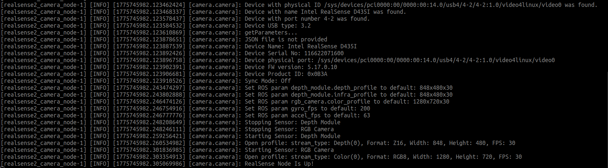
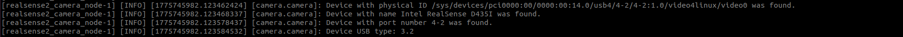
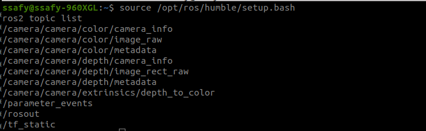
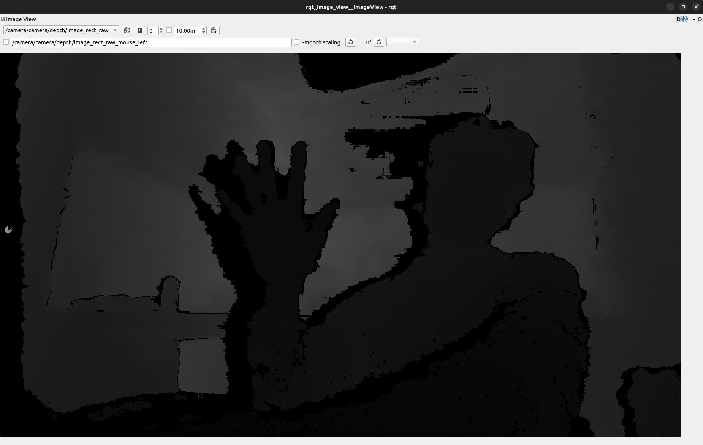

# 2026-04-09 Task 59 D435i Depth Check Evidence

## 결론

`S14P31C205-59`는 아래 순서로 검증했다.

1. `realsense2_camera` launch 실행
2. D435i 장치 인식 및 USB 연결 타입 확인
3. depth 토픽 생성 확인
4. depth 시각화 확인

현재 저장된 증빙 기준으로는 다음이 확인됐다.

- 장치명: `Intel RealSense D435I`
- depth 토픽: `/camera/camera/depth/image_rect_raw`
- color 토픽: `/camera/camera/color/image_raw`
- 저장된 캡처 기준 USB 타입: `3.2`

이미지 저장 위치:

- `/home/ssafy/my_ws/git_hub/Robotics/VSLAM/assets/2026-04-09_task59_d435i_depth_check`

## 검증 순서

### 1. RealSense launch 실행

사용한 명령어:

```bash
source /opt/ros/humble/setup.bash
ros2 launch realsense2_camera rs_launch.py enable_color:=true enable_depth:=true
```

확인 포인트:

- `RealSense Node Is Up!`
- depth/color 스트림이 열리는지 확인

결과 캡처:

- [01_launch_success.png](./01_launch_success.png)



### 2. 장치 인식 및 USB 타입 확인

사용한 명령어:

```bash
source /opt/ros/humble/setup.bash
ros2 launch realsense2_camera rs_launch.py enable_color:=true enable_depth:=true
```

같은 launch 로그에서 아래 줄을 확인했다.

확인 포인트:

- `Device with name Intel RealSense D435I was found.`
- `Device USB type: 3.2`

결과 캡처:

- [02_device_info_and_usb_type.png](./02_device_info_and_usb_type.png)



참고:

- 초기 확인 과정에서는 `USB type 2.1`이 한 번 관찰되었으므로 포트/케이블 상태는 계속 점검한다.

### 3. ROS2 토픽 생성 확인

사용한 명령어:

```bash
source /opt/ros/humble/setup.bash
ros2 topic list
```

확인 포인트:

- `/camera/camera/depth/image_rect_raw`
- `/camera/camera/depth/camera_info`
- `/camera/camera/color/image_raw`

결과 캡처:

- [03_ros2_topic_list.png](./03_ros2_topic_list.png)



### 4. Depth 시각화 확인

사용한 명령어:

```bash
source /opt/ros/humble/setup.bash
ros2 run rqt_image_view rqt_image_view
```

선택한 토픽:

```text
/camera/camera/depth/image_rect_raw
```

확인 포인트:

- `rqt_image_view`가 열리는지 확인
- depth 토픽이 선택되는지 확인
- 실제 depth 영상이 화면에 표시되는지 확인

결과 캡처:

- [04_depth_view.png](./04_depth_view.png)



## 정리 메모

- 현재 시각화한 depth 화면은 raw depth라서 거의 흑백처럼 보일 수 있다.
- 이건 이상이 아니라 원본 거리값 영상의 정상적인 표현이다.
- 사람이 보기 쉽게 하려면 나중에 컬러맵 시각화 토픽을 따로 만들면 된다.

## Optional: 컬러맵 Depth 시각화

컬러맵은 거리값을 사람이 보기 쉽게 색으로 바꿔주는 방식이다.

- `raw depth`: 알고리즘 입력용 원본 거리 영상
- `colormap depth`: 사람이 보기 좋은 시각화용 컬러 영상

추가한 스크립트:

- [`depth_colormap_publisher.py`](/home/ssafy/my_ws/git_hub/Robotics/VSLAM/06_Debugging/depth_colormap_publisher.py)

실행 명령:

```bash
source /opt/ros/humble/setup.bash
python3 /home/ssafy/my_ws/git_hub/Robotics/VSLAM/06_Debugging/depth_colormap_publisher.py
```

생성되는 토픽:

```text
/camera/camera/depth/image_colormap
```

컬러맵 토픽 확인:

```bash
source /opt/ros/humble/setup.bash
ros2 topic list | grep image_colormap
```

컬러맵 화면 열기:

```bash
source /opt/ros/humble/setup.bash
ros2 run rqt_image_view rqt_image_view
```

`rqt_image_view`에서 아래 토픽을 선택하면 된다.

```text
/camera/camera/depth/image_colormap
```

주의:

- 컬러맵 토픽은 보기용이다.
- 실제 거리 계산, 장애물 회피, VSLAM 입력에는 계속 raw depth를 사용해야 한다.

## Optional: 저해상도 연속성 확인 모드

연속성은 프레임이 끊기지 않고 계속 들어오는지를 뜻한다.

`depth/image_rect_raw`가 무겁게 느껴지면 해상도와 FPS를 먼저 낮춰서 확인하는 것이 가장 실용적이다.

추가한 스크립트:

- [`run_d435i_depth_low_bandwidth.sh`](/home/ssafy/my_ws/git_hub/Robotics/VSLAM/06_Debugging/run_d435i_depth_low_bandwidth.sh)

기본 실행:

```bash
bash /home/ssafy/my_ws/git_hub/Robotics/VSLAM/06_Debugging/run_d435i_depth_low_bandwidth.sh
```

기본 프로파일:

```text
424x240x15
```

더 낮춰서 테스트:

```bash
bash /home/ssafy/my_ws/git_hub/Robotics/VSLAM/06_Debugging/run_d435i_depth_low_bandwidth.sh 424x240x6
```

추천 확인 순서:

1. 기존 `realsense-viewer`, `rs_launch.py`, `rqt_image_view`를 모두 종료한다.
2. 저해상도 depth-only 모드로 카메라를 실행한다.
3. 새 터미널에서 컬러맵 퍼블리셔를 실행한다.
4. `rqt_image_view`에서 `/camera/camera/depth/image_colormap`을 연다.

컬러맵 퍼블리셔 실행:

```bash
python3 /home/ssafy/my_ws/git_hub/Robotics/VSLAM/06_Debugging/depth_colormap_publisher.py
```

시각화 실행:

```bash
ros2 run rqt_image_view rqt_image_view
```

토픽 선택:

```text
/camera/camera/depth/image_colormap
```
