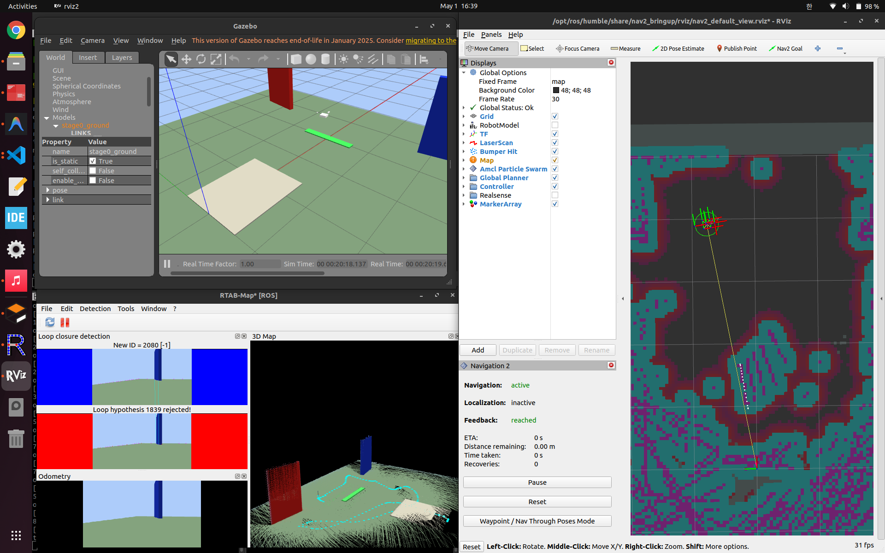
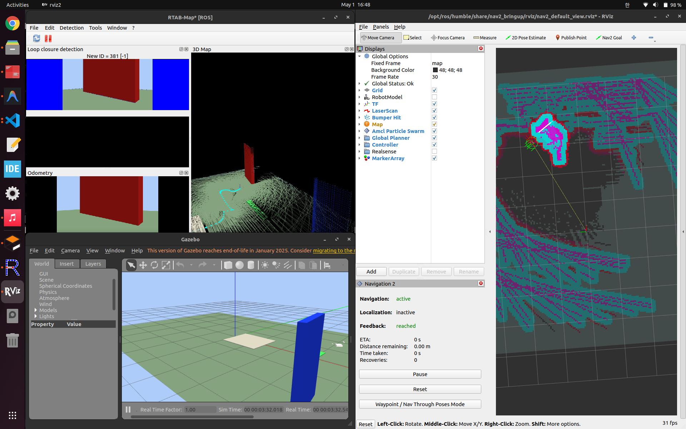

# 2026-05-01 Mari Nav2 Stage Troubleshooting

## 요약

이 폴더는 Mari Nav2 단계별 자율주행 테스트 중 발생한 트러블슈팅 캡처를 정리한 것이다.

핵심 문제는 아무것도 없는 평지 구간이 장애물처럼 잘못 인식되면서 Nav2/RViz map이 지저분하게 따지는 현상이었다. 실제 장애물이 없는 평지인데도 map/costmap에 장애물 영역이 과하게 생겼고, 이 때문에 자율주행 경로 판단에도 영향을 줄 수 있었다.

설정을 조정한 뒤에는 `04` 이미지처럼 평지는 더 이상 장애물처럼 잡히지 않고, 실제 물체가 있는 위치 근처에만 장애물 흔적이 남는 상태로 개선됐다.

## 캡처 설명

| 파일 | 의미 |
| --- | --- |
| `01_nav2_costmap_false_wall_before_scan_filter.png` | 아무것도 없는 평지 구간이 벽이나 장애물 같은 흔적으로 잘못 찍힌 초기 상태 |
| `02_nav2_costmap_dense_rtabmap_static_map_issue.png` | 평지 오인식 때문에 map/costmap이 전체적으로 지저분하고 빽빽하게 생성된 상태 |
| `03_nav2_goal_outside_small_global_costmap.png` | 평지가 장애물 공간처럼 처리되면서 map이 얼마나 지저분하게 따지는지 보여주는 트러블슈팅 캡처. 흰색은 현재 센서가 직접 본 거리 반환값이고, 보라/핑크는 장애물로 마킹된 map/costmap 영역이며, 빨강/진한 빨강은 그 장애물 주변의 접근 비용 경계다. |
| `04_nav2_scan_only_costmap_obstacle_detection_ok.png` | 해결 후 상태. 평지 오인식이 줄고 실제 물체 근처에만 장애물 trace가 남는다. |

### 01. 평지 오인식 초기 상태

### 02. 지저분하게 생성된 Costmap

### 03. 색상 해석과 오인식 상태

### 04. 해결 후 상태

## 트러블슈팅 내용

- 핵심 증상은 평지를 장애물로 오인하는 것이다.
- `scan_frame`은 `camera_color_optical_frame`이 아니라 `camera_link`를 사용해야 한다.
- 이유는 Nav2의 LaserScan이 x축 전방, y축 좌우인 2D 평면으로 해석되기 때문이다.
- `scan_height=8`, `range_min=0.30`으로 조정해 바닥면이나 차체 근접 포인트가 장애물로 들어오는 문제를 줄였다.
- 초기 Nav2 훈련 profile에서는 `/rtabmap/map`을 static global map으로 바로 넣지 않고, scan-only rolling costmap을 사용한다.
- 이유는 static map 경로를 너무 일찍 연결하면 평지 오인식이 costmap 전체를 지저분하게 만들 수 있기 때문이다.
- 현재 상태는 `04_nav2_scan_only_costmap_obstacle_detection_ok.png`처럼 평지 오인식 문제가 개선된 상태다.
