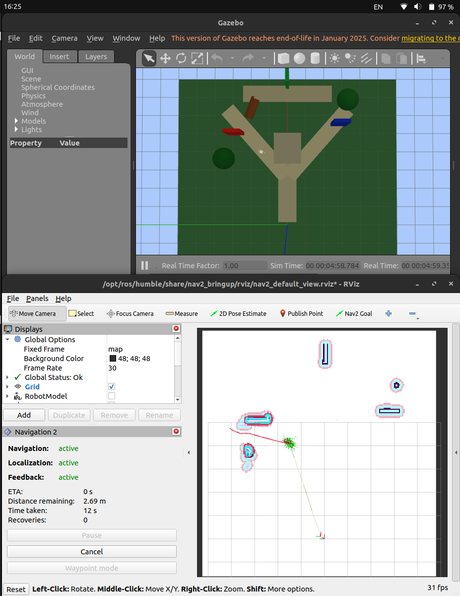
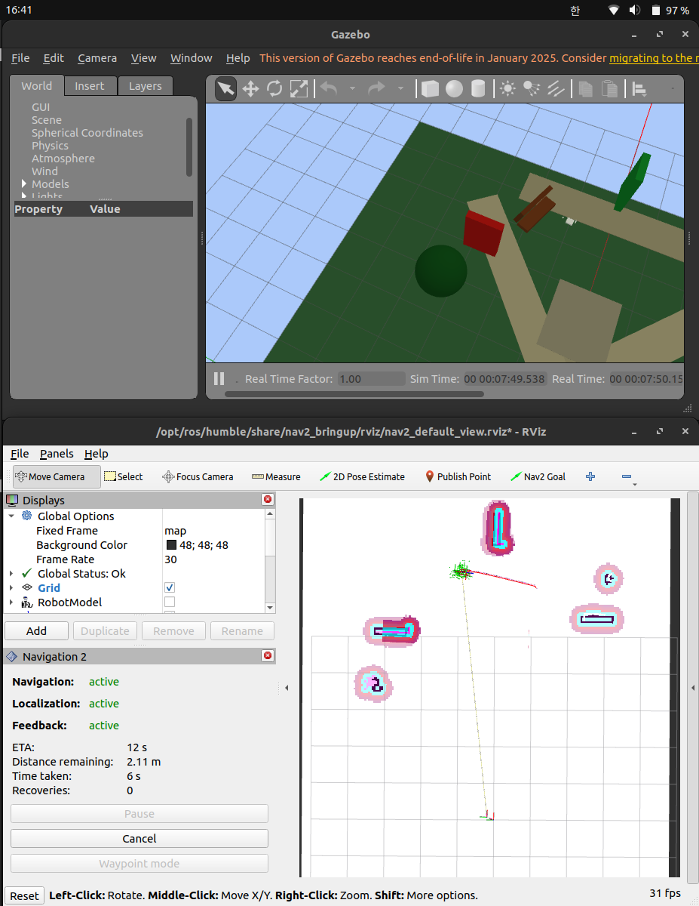

# 2026-05-02 Mari Nav2 Safe-Clearance Compare

## 요약

이 폴더는 Stage 3 저장 맵 기반 Nav2 주행에서 safe-clearance profile 적용 전후 costmap 변화를 비교하기 위한 캡처를 정리한 것이다.

safe-clearance profile은 저장된 `/map` 자체를 바꾸는 설정이 아니라, Nav2가 장애물 주변을 더 넓은 위험 영역으로 보고 경로를 더 여유 있게 잡도록 하는 설정이다.

## 실험 결론

- 속도 상향 후 Mari의 자율주행 속도는 체감상 만족스러운 수준으로 개선됐다.
- safe-clearance profile 적용 후 costmap의 적색 위험 영역이 기존보다 넓어졌다.
- 적색 영역이 넓어진 것은 Nav2가 장애물 주변을 더 보수적으로 해석한다는 의미이므로, 장애물과 너무 가깝게 붙는 주행을 줄이는 데 유리하다.
- 현재 관찰 결과 기준으로는 `속도 체감`과 `장애물 주변 안전 여유`가 모두 개선된 상태로 본다.
- 단, 좁은 통로나 장애물이 촘촘한 구간에서는 너무 보수적인 costmap 때문에 경로가 막히는지 추가 확인이 필요하다.

## 캡처 설명

| 파일 | 의미 |
| --- | --- |
| `01_baseline_costmap_before_safe_clearance.png` | 기존 saved-map Nav2 profile 기준 costmap과 경로 계획 상태 |
| `02_safe_clearance_costmap_after_profile.png` | safe-clearance profile 적용 후 costmap과 경로 계획 상태 |

### 01. Safe-Clearance 적용 전

### 02. Safe-Clearance 적용 후

## 비교 포인트

- 장애물 주변 inflation 영역이 더 넓어졌는지 확인한다.
- `/plan` 경로가 장애물에서 더 떨어져 생성되는지 확인한다.
- 장애물 옆 stuck 현상이 줄어드는지 확인한다.
- 너무 보수적으로 바뀌어 좁은 통로가 막힌 것처럼 판단되는지도 함께 확인한다.
