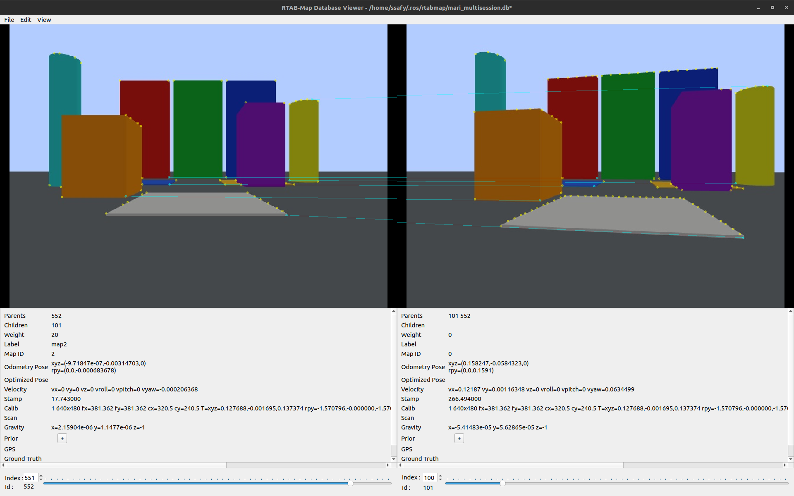

# 2026-05-06 RTAB-Map Multi-Session DB Reuse

## Summary

Mari Gazebo simulation에서 RTAB-Map DB를 새로 생성한 뒤, 같은 DB를 다시 열어 기존 세션 데이터가 유지되는지 확인했다.

## Result

- Robot: Mari
- Environment: Gazebo simulation
- Input: simulated D435i RGB-D topics, `/odom`
- DB path: `~/.ros/rtabmap/mari_multisession.db`
- First run: `delete_db_on_start:=true`
- Reuse run: `delete_db_on_start:=false`
- Backup DB: `~/.ros/rtabmap/mari_multisession_first_20260506_220704.db`
- Final DB size: about `119M`

## Evidence

## Notes

- This confirms same-DB reuse.
- Independent DB merge between different robots or runs is a separate next step.
- YOLO trash detections should be stored as separate map-frame annotations, not directly inside the RTAB-Map DB.
