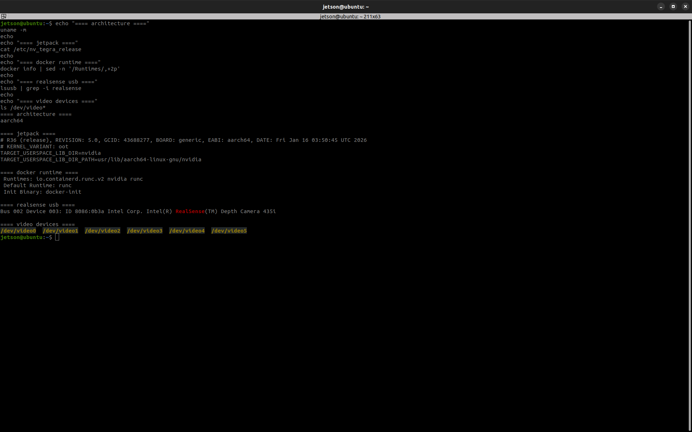
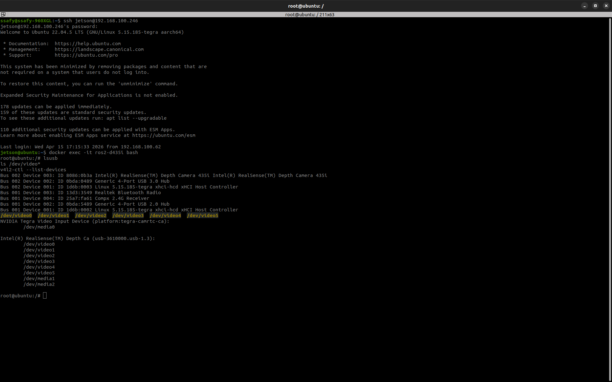
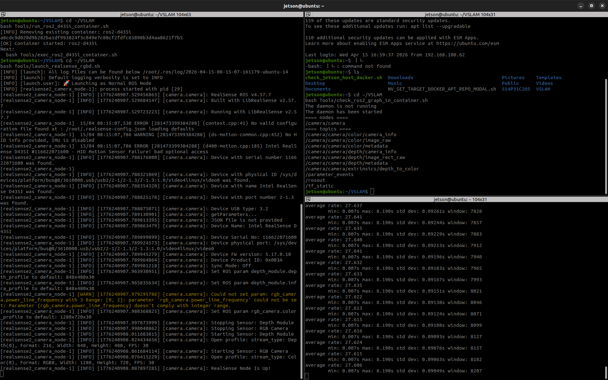

# 2026-04-15 작업 일지

## 결론

- Jetson 개발 환경은 **JetPack 6.1 + Ubuntu 22.04 + Docker + ROS 2 Humble + D435i + 이후 RTAB-Map** 조합으로 시작하는 것이 가장 안전하다고 판단했다.
- 핵심은 한 번에 VSLAM까지 붙이지 않고, **호스트 확인 -> Docker -> ROS 2 -> D435i -> RTAB-Map** 순서로 단계별 검증하는 것이다.
- 지금 단계에서 가장 중요한 리스크는 `버전 호환성`, `장치 접근 권한`, `시간 동기화`, `TF 좌표계`다.
- 실제 Jetson 실기기 점검 결과, **Docker 권한 문제는 해결됐고 D435i의 호스트 인식, Docker 컨테이너 전달, ROS 2 Humble 컨테이너 내부 토픽 확인까지 완료했다.**
- 현재 기준으로는 **Jetson + Docker + ROS 2 Humble + D435i color/depth 경로는 동작 확인이 끝났고**, 다음 단계는 `토픽 주기 확인 -> RTAB-Map 연결`이다.
- 다만 `D435i IMU(HID)` 쪽은 경고가 남아 있으므로, **IMU를 쓰는 단계는 color/depth 경로를 먼저 안정화한 뒤 별도로 검증해야 한다.**

## 오늘 작업 한 줄 요약

- Jetson + Docker + ROS 2 + D435i + 이후 RTAB-Map 구성을 공식 자료 기준으로 다시 정리했다.
- Jetson 실기기에서 호스트 점검, Docker runtime 설정, D435i 호스트 인식, 컨테이너 전달, ROS 2 토픽 확인까지 진행했다.
- 왜 이 작업을 먼저 했는가?
  - Jetson 환경은 버전 충돌과 장치 접근 문제가 많아서, 구현 전에 기준 조합과 작업 순서를 먼저 고정하는 것이 필요했기 때문이다.

## 실기기 접속 정보

- Jetson SSH 사용자명: `jetson`
- Jetson IP 주소: `192.168.100.246`
- SSH 접속 명령:

```bash
ssh jetson@192.168.100.246
```

- 참고:
  - 위 IP는 현재 로컬 네트워크 기준 값이다.
  - 공유기 DHCP 설정에 따라 나중에 바뀔 수 있으니, 접속이 안 되면 IP를 다시 확인해야 한다.

## 시간순 기록

### 09:30

- Jetson Docker 환경 관련 기존 블로그 글을 읽고, 글이 실제로 무엇을 설명하는지 정리했다.
- 핵심은 `Jetson Nano에서 Docker 기반 AI 개발 환경을 만들고, 컨테이너 안에서 PyTorch와 OpenCV로 USB 카메라 입력을 확인하는 작업`이라는 점을 파악했다.
- 다만 이 자료는 `Jetson + Docker + 웹캠` 입문 자료이고, 현재 목표인 `ROS 2 + D435i + RTAB-Map`까지 바로 포함하는 자료는 아니라는 점을 구분했다.

### 10:10

- 최신 기준 자료를 찾을 때는 `Perplexity` 같은 검색형 AI로 넓게 찾고, 최종 판단은 NVIDIA / ROS / Intel RealSense 공식 문서로 검증하는 방식이 가장 안전하다고 정리했다.
- 즉, `자료 수집`은 검색형 AI, `실행 계획 정리`는 ChatGPT/Codex, `최종 기준`은 공식 문서로 나누는 것이 적절하다고 판단했다.

### 11:00

- 공식 자료 기반으로 권장 조합을 정리했다.
- 현재 기준 권장 축은 아래와 같다.
  - `JetPack 6.1`
  - `Ubuntu 22.04`
  - `Docker + NVIDIA Container Toolkit`
  - `ROS 2 Humble`
  - `Intel RealSense D435i`
  - 이후 `RTAB-Map`

### 11:40

- 작업 순서를 단계별로 고정했다.
- 권장 순서는 아래와 같다.
  1. Jetson 호스트 상태 확인
  2. Docker 런타임 준비
  3. 컨테이너 안에 ROS 2 Humble 구성
  4. D435i 단독 검증
  5. RTAB-Map 연결

### 14:20

- Jetson에 SSH로 접속한 뒤 호스트 점검 스크립트를 실행했다.
- 확인 결과는 아래와 같았다.
  - `uname -m`: `aarch64`
  - `nv_tegra_release`: `R36.5.0`
  - `Ubuntu`: `22.04.5`
  - `docker --version`, `docker compose version`, `systemctl is-active docker`: 정상
  - `nvidia-container-toolkit` 패키지 설치: 확인됨
  - `docker info`: 권한 문제로 실패
  - `lsusb`: D435i 장치가 보이지 않음
  - `/dev/video*`: 생성되지 않음
- `rs-enumerate-devices`: `No device detected`
- 즉, Jetson 호스트 운영체제 축은 괜찮지만, **Docker 사용자 권한**과 **D435i 물리 인식**이 아직 해결되지 않은 상태임을 확인했다.

### 15:00

- `jetson` 사용자를 `docker` 그룹에 추가하고, Docker runtime 설정을 다시 확인했다.
- 수행한 핵심 명령은 아래와 같았다.

```bash
sudo usermod -aG docker jetson
newgrp docker
sudo nvidia-ctk runtime configure --runtime=docker
sudo systemctl restart docker
docker info | sed -n '/Runtimes/,+5p'
```

- 확인 결과는 아래와 같았다.
  - `docker info`가 더 이상 권한 오류 없이 동작함
  - `Runtimes`에 `nvidia`가 표시됨
  - `Default Runtime`은 `runc`지만, `nvidia` runtime이 등록된 상태라 이후 `--runtime nvidia`로 실행 가능함
- 즉, **Docker 권한 문제와 NVIDIA runtime 등록 문제는 해결됐다고 판단했다.**

### 15:30

- D435i를 다시 연결한 뒤 호스트 장치 인식 상태를 재확인했다.
- 확인 결과는 아래와 같았다.
  - `lsusb`에 `8086:0b3a Intel RealSense D435i` 표시
  - `/dev/video0 ~ /dev/video5` 생성
  - `rs-enumerate-devices`에서 장치 정보, 펌웨어 버전, 지원 스트림 프로파일 확인 가능
  - `Usb Type Descriptor: 3.2`
- 다만 아래 경고가 함께 확인됐다.
  - `HID Motion Sensor Failure! bad optional access`
- 해석은 다음과 같다.
  - **color/depth 카메라 경로는 인식에 성공**
  - **IMU(HID) 경로는 아직 불안정 가능성이 있음**

### 15:40

- 커널 로그(`dmesg`)도 함께 확인했다.
- 초기에 아래와 같은 USB 연결 오류가 한 번 발생했다.
  - `Device not responding to setup address`
  - `error -71`
- 하지만 곧바로 아래처럼 다시 정상 인식되었다.
  - `new SuperSpeed USB device`
  - `Found UVC 1.50 device Intel RealSense D435i`
  - `uvcvideo` 드라이버 등록
- 즉, **USB 연결 순간 한 번 불안정했지만 최종적으로는 Jetson에서 D435i를 정상 인식한 상태**라고 판단했다.

### 16:00

- Ubuntu 22.04 기본 컨테이너에서 먼저 D435i 장치가 전달되는지 확인했다.
- 아래 조건으로 컨테이너를 실행했다.

```bash
docker run --rm -it --network host --privileged --runtime nvidia -v /dev:/dev ubuntu:22.04 bash
```

- 컨테이너 안에서 `usbutils`, `v4l-utils`를 설치한 뒤 아래를 확인했다.
  - `lsusb`에 D435i 표시
  - `/dev/video0 ~ /dev/video5` 표시
  - `v4l2-ctl --list-devices`에 RealSense 장치 표시
- 즉, **Jetson 호스트에서 인식된 D435i가 일반 Docker 컨테이너 안으로 정상 전달되는 것**을 확인했다.

### 16:20

- `arm64v8/ros:humble-ros-base-jammy` 컨테이너를 실행해 ROS 2 Humble 기반 환경에서도 같은 확인을 반복했다.
- 확인 결과는 아래와 같았다.
  - `lsusb`에 D435i 표시
  - `/dev/video0 ~ /dev/video5` 표시
  - `v4l2-ctl --list-devices`에 RealSense 장치 표시
- 즉, **ROS 2 Humble 컨테이너 기준으로도 D435i 장치 전달이 정상**임을 확인했다.

### 16:40

- ROS 2 Humble 컨테이너 안에서 `realsense2_camera` 패키지를 설치하고 노드를 실행했다.
- 초기 실행은 IMU를 끄고 color/depth만 확인하는 방향으로 진행했다.

```bash
source /opt/ros/humble/setup.bash
ros2 launch realsense2_camera rs_launch.py enable_color:=true enable_depth:=true enable_gyro:=false enable_accel:=false
```

- 로그상 아래가 확인됐다.
  - `RealSense ROS v4.57.7`
  - 장치 발견
  - `RealSense Node Is Up!`
- 하지만 다른 쉘에서 `ros2 topic list`를 실행했을 때 처음에는 아무 토픽도 보이지 않았다.
- 이 시점에는 **카메라 노드 실행 자체보다 ROS 2 discovery 또는 daemon 상태를 의심해야 하는 상황**이라고 판단했다.

### 16:50

- 토픽 확인용 쉘에서 ROS 2 daemon을 재시작한 뒤 다시 확인했다.

```bash
source /opt/ros/humble/setup.bash
ros2 daemon stop
ros2 daemon start
sleep 2
ros2 node list
ros2 topic list
```

- 확인 결과는 아래와 같았다.
  - `ros2 node list`: `/camera/camera`
  - `ros2 topic list`:
    - `/camera/camera/color/camera_info`
    - `/camera/camera/color/image_raw`
    - `/camera/camera/color/metadata`
    - `/camera/camera/depth/camera_info`
    - `/camera/camera/depth/image_rect_raw`
    - `/camera/camera/depth/metadata`
    - `/camera/camera/extrinsics/depth_to_color`
    - `/parameter_events`
    - `/rosout`
    - `/tf_static`
- 즉, **문제는 카메라 노드가 아니라 ROS 2 CLI daemon 상태였고, 재시작 후 정상 토픽 확인까지 끝났다.**

### 17:00

- color와 depth 토픽의 실제 publish 주기도 확인했다.
- `ros2 topic hz /camera/camera/color/image_raw` 기준 평균 주기는 약 `27~28 Hz` 수준이었다.
- 목표 `30 Hz`보다 약간 낮지만, 현재 단계에서는 **Jetson + Docker + ROS 2 컨테이너 안에서 RGB-D 스트림이 실사용 가능한 수준으로 올라오는지**를 확인하는 데는 충분하다고 판단했다.

### 17:10

- Jetson이 재부팅돼도 같은 환경을 다시 손으로 만들지 않도록, 개인 저장소에 재현용 Docker 자산을 추가했다.
- 추가한 핵심 파일은 아래와 같다.
  - `docker/jetson_ros2_d435i/Dockerfile`
  - `docker/jetson_ros2_d435i/README.md`
  - `Tools/run_ros2_d435i_container.sh`
  - `Tools/exec_ros2_d435i_container.sh`
  - `Tools/launch_realsense_rgbd.sh`
  - `Tools/check_ros2_graph_in_container.sh`
- 의도는 아래와 같다.
  - 재부팅 후 `apt install` 반복 제거
  - `ROS 2 Humble + realsense2_camera` 환경을 이미지로 고정
  - Jetson에서 실행 명령을 스크립트 수준으로 단순화
- 즉, 다음부터는 수동 bring-up보다 **이미지 빌드 -> 컨테이너 실행 -> 노드 실행** 순서로 바로 복구하는 방식으로 진행하기로 정리했다.

## 오늘 증빙 이미지

- [2026-04-15 Jetson Docker ROS 2 D435i Check](/home/ssafy/my_ws/git_hub/Robotics/VSLAM/assets/2026-04-15_jetson_docker_ros2_d435i_check/README.md)
  - [01_jetson_host_docker_and_d435i_check.png](/home/ssafy/my_ws/git_hub/Robotics/VSLAM/assets/2026-04-15_jetson_docker_ros2_d435i_check/01_jetson_host_docker_and_d435i_check.png)
  - [02_d435i_device_visibility_in_ros2_container.png](/home/ssafy/my_ws/git_hub/Robotics/VSLAM/assets/2026-04-15_jetson_docker_ros2_d435i_check/02_d435i_device_visibility_in_ros2_container.png)
  - [03_ros2_d435i_launch_topics_and_hz_in_container.png](/home/ssafy/my_ws/git_hub/Robotics/VSLAM/assets/2026-04-15_jetson_docker_ros2_d435i_check/03_ros2_d435i_launch_topics_and_hz_in_container.png)

### 01. Jetson 호스트 점검 결과

- 의미:
  - Jetson 호스트에서 `aarch64`, `R36.5.0`, `nvidia` runtime, D435i USB 인식, `/dev/video*` 생성을 확인한 화면이다.



### 02. ROS 2 컨테이너 안 D435i 장치 전달 확인

- 의미:
  - `ros2-d435i` 컨테이너 안에서 `lsusb`, `/dev/video*`, `v4l2-ctl --list-devices`가 모두 정상인 화면이다.



### 03. ROS 2 launch, 토픽, 주기 확인

- 의미:
  - `realsense2_camera` launch 성공, `/camera/camera` 노드 확인, color/depth 토픽 확인, `ros2 topic hz` 결과를 한 화면에 모은 증빙이다.



## 오늘 관찰한 핵심 현상

- Jetson 관련 자료는 오래된 블로그, Jetson Nano 전용 글, Ubuntu 20.04 기준 글이 많이 섞여 있어 그대로 따르면 버전 충돌 위험이 크다.
- `JetPack 5.x`와 `JetPack 6.x`, `Ubuntu 20.04`와 `Ubuntu 22.04`, `librealsense`와 `realsense-ros` 버전을 섞으면 문제가 생길 가능성이 높다.
- 따라서 지금은 “기능 구현”보다 “권장 조합 고정”이 먼저다.
- 실제 Jetson 점검에서는 Docker가 설치돼 있어도 현재 사용자에게 Docker 소켓 권한이 없으면 런타임 확인이 막힌다는 점을 확인했고, `docker` 그룹 추가 후 해결 가능함을 확인했다.
- D435i는 호스트에서 `lsusb`, `/dev/video*`, `rs-enumerate-devices`가 모두 정상이어야 다음 단계로 넘어갈 수 있다는 점을 다시 확인했다.
- D435i는 USB 연결 순간 `error -71` 같은 통신 오류가 잠깐 생길 수 있지만, 이후 `SuperSpeed USB device`, `Found UVC 1.50 device`로 정상 인식되면 color/depth 경로는 계속 진행할 수 있다.
- Docker 컨테이너 안에서 `/dev/video*`, `lsusb`, `v4l2-ctl --list-devices`가 보이면 장치 전달은 성공으로 봐도 된다.
- `realsense2_camera` 로그에 `RealSense Node Is Up!`가 떠도 `ros2 topic list`가 바로 비어 있을 수 있고, 이 경우는 ROS 2 daemon 상태를 먼저 의심해야 한다.

## 원인 가설

- 지금까지 Jetson 자료를 찾을 때 기준 버전이 명확하지 않아서, Docker / ROS / D435i 가이드가 서로 다른 환경을 전제하고 있었을 가능성이 높다.
- 이 상태에서 설치를 시작하면, 나중에 문제가 생겼을 때 코드 문제인지 환경 문제인지 분리하기 어려울 것이라고 판단했다.
- 초기 실기기 기준으로는 아래 두 가지가 가장 큰 원인 후보라고 판단했다.
  1. `jetson` 사용자가 `docker` 그룹에 없어 Docker 데몬 접근 권한이 부족함
  2. D435i가 USB 포트, 케이블, 허브, 전원, 연결 상태 문제로 Jetson에서 아예 인식되지 않음
- 이후 추가 점검을 통해 아래처럼 원인을 좁혔다.
  1. Docker 쪽 문제는 실제로 `docker` 그룹 권한과 runtime 미확인 문제였고, `docker` 그룹 추가와 `nvidia-ctk runtime configure` 후 해결됨
  2. D435i는 연결 순간 USB 통신이 한 번 불안정했지만 최종적으로는 정상 인식됨
  3. `ros2 topic list`가 비어 있던 문제는 카메라 노드 자체가 아니라 ROS 2 daemon 상태 문제였음

## 확인 방법

- NVIDIA JetPack 문서, NVIDIA Container Toolkit 문서, ROS 2 Humble 설치 문서, Intel librealsense Jetson 설치 문서, realsense-ros 저장소를 기준으로 권장 조합을 다시 교차 확인했다.
- 단순 블로그 요약이 아니라, 아래를 함께 보면서 정리했다.
  - JetPack와 Ubuntu 축
  - ROS 2 배포판 지원 범위
  - RealSense Jetson 설치 문서
  - `librealsense`와 `realsense-ros` 호환 위험
- 실제 Jetson에서는 아래 점검을 수행했다.
  - `docker --version`
  - `docker compose version`
  - `systemctl is-active docker`
  - `groups`
  - `docker info`
  - `dpkg -l | grep -E 'nvidia-container|nvidia-ctk|nvidia-docker'`
  - `lsusb`
  - `ls /dev/video*`
  - `rs-enumerate-devices`
- 이후 아래 추가 점검도 수행했다.
  - `sudo usermod -aG docker jetson`
  - `sudo nvidia-ctk runtime configure --runtime=docker`
  - `docker info | sed -n '/Runtimes/,+5p'`
  - `sudo dmesg -w`
  - `docker run --rm -it --network host --privileged --runtime nvidia -v /dev:/dev ubuntu:22.04 bash`
  - `docker run --rm -it --network host --privileged --runtime nvidia -v /dev:/dev arm64v8/ros:humble-ros-base-jammy bash`
  - 컨테이너 안 `lsusb`, `v4l2-ctl --list-devices`
  - `ros2 launch realsense2_camera rs_launch.py ...`
  - `ros2 daemon stop/start`
  - `ros2 node list`
  - `ros2 topic list`

## 해결 방법

- 현재 프로젝트의 Jetson 개발 기준 조합을 아래처럼 정리했다.
  - `JetPack 6.1`
  - `Ubuntu 22.04`
  - `Docker`
  - `ROS 2 Humble`
  - `D435i`
  - 이후 `RTAB-Map`
- 구현 순서도 `호스트 -> Docker -> ROS 2 -> D435i -> RTAB-Map`으로 고정했다.
- 앞으로는 이 기준에서 벗어나는 자료는 참고만 하고, 실제 환경 구성 기준으로는 쓰지 않기로 했다.
- 실기기 기준으로는 아래 순서로 문제를 해결했다.
  1. `jetson` 사용자를 `docker` 그룹에 추가
  2. `docker info`에서 `Runtimes` 확인
  3. `sudo nvidia-ctk runtime configure --runtime=docker` 후 Docker 재시작
  4. D435i를 다시 연결하고 `lsusb`, `/dev/video*`, `rs-enumerate-devices`, `dmesg -w` 재확인
  5. 일반 Ubuntu 컨테이너에서 장치 전달 확인
  6. ROS 2 Humble 컨테이너에서 장치 전달 확인
  7. `realsense2_camera` 실행 후 ROS 2 daemon 재시작으로 토픽 확인

## 오늘 배운 것

- Jetson에서는 “최신 버전”보다 “서로 맞는 버전 조합”이 더 중요하다.
- D435i는 먼저 `realsense-viewer` 또는 장치 인식부터 확인하고, 그다음 `realsense2_camera`와 ROS 토픽으로 올라가는 순서가 안전하다.
- RTAB-Map 단계에서 많이 깨지는 부분은 보통 `TF`, `시간 동기화`, `IMU 프레임`, `camera_link` 설정이다.
- 따라서 카메라가 보인다고 바로 SLAM으로 가지 말고, 토픽과 프레임부터 먼저 검증해야 한다.
- `docker`가 설치되어 있고 서비스가 `active`여도, 사용자 권한이 안 맞으면 런타임 확인이 막힐 수 있다.
- D435i가 `lsusb`에도 안 잡히는 상태는 ROS 2 문제가 아니라 호스트 물리 연결 단계 문제다.
- D435i가 `lsusb`, `/dev/video*`, `rs-enumerate-devices`에서 모두 잡히면 color/depth 경로는 다음 단계로 넘길 수 있다.
- 컨테이너 안에서 `lsusb`가 안 되는 것은 장치 실패가 아니라 `usbutils` 패키지가 없어서일 수 있다.
- `realsense2_camera` 로그에 노드가 정상적으로 떠 있어도, `ros2 topic list`가 바로 안 보이면 ROS 2 daemon을 재시작해 보는 것이 좋다.
- IMU(HID) 경고가 남아 있어도 color/depth 토픽 확인 단계는 진행할 수 있다.

## 참고한 공식 자료

- NVIDIA JetPack 6.1 릴리스 노트  
  - https://docs.nvidia.com/jetson/archives/jetpack-archived/jetpack-61/release-notes/index.html
- NVIDIA Container Toolkit 설치 가이드  
  - https://docs.nvidia.com/datacenter/cloud-native/container-toolkit/latest/install-guide.html
- ROS 2 Humble Ubuntu 설치 문서  
  - https://docs.ros.org/en/humble/Installation/Ubuntu-Install-Debs.html
- ROS 2 Humble 설치 개요  
  - https://docs.ros.org/en/humble/Installation.html
- Intel librealsense Jetson 설치 문서  
  - https://github.com/IntelRealSense/librealsense/blob/master/doc/installation_jetson.md
- Intel realsense-ros 저장소  
  - https://github.com/realsenseai/realsense-ros

## 오늘 만든/수정한 파일

- [2026-04-15 일지](/home/ssafy/my_ws/git_hub/Robotics/VSLAM/daily/2026-04-15/README.md)
- [Jetson Docker 호스트 점검 체크리스트](/home/ssafy/my_ws/git_hub/Robotics/VSLAM/docs/learning/03-02_Jetson_Docker_Host_Checklist.md)
- [Jetson 호스트 점검 스크립트](/home/ssafy/my_ws/git_hub/Robotics/VSLAM/Tools/check_jetson_host_docker.sh)
- [Jetson ROS 2 D435i Dockerfile](/home/ssafy/my_ws/git_hub/Robotics/VSLAM/docker/jetson_ros2_d435i/Dockerfile)
- [Jetson ROS 2 D435i Docker README](/home/ssafy/my_ws/git_hub/Robotics/VSLAM/docker/jetson_ros2_d435i/README.md)
- [컨테이너 실행 스크립트](/home/ssafy/my_ws/git_hub/Robotics/VSLAM/Tools/run_ros2_d435i_container.sh)
- [컨테이너 진입 스크립트](/home/ssafy/my_ws/git_hub/Robotics/VSLAM/Tools/exec_ros2_d435i_container.sh)
- [RealSense RGB-D launch 스크립트](/home/ssafy/my_ws/git_hub/Robotics/VSLAM/Tools/launch_realsense_rgbd.sh)
- [ROS 2 그래프 확인 스크립트](/home/ssafy/my_ws/git_hub/Robotics/VSLAM/Tools/check_ros2_graph_in_container.sh)
- [2026-04-15 Jetson Docker ROS 2 D435i 증빙 README](/home/ssafy/my_ws/git_hub/Robotics/VSLAM/assets/2026-04-15_jetson_docker_ros2_d435i_check/README.md)
- [01 Jetson host docker and D435i check](/home/ssafy/my_ws/git_hub/Robotics/VSLAM/assets/2026-04-15_jetson_docker_ros2_d435i_check/01_jetson_host_docker_and_d435i_check.png)
- [02 D435i device visibility in ROS 2 container](/home/ssafy/my_ws/git_hub/Robotics/VSLAM/assets/2026-04-15_jetson_docker_ros2_d435i_check/02_d435i_device_visibility_in_ros2_container.png)
- [03 ROS 2 D435i launch topics and hz in container](/home/ssafy/my_ws/git_hub/Robotics/VSLAM/assets/2026-04-15_jetson_docker_ros2_d435i_check/03_ros2_d435i_launch_topics_and_hz_in_container.png)

## 남은 문제

- Jetson 호스트와 Docker, ROS 2 Humble, D435i color/depth 경로는 확인됐지만, D435i IMU(HID) 경고는 아직 남아 있다.
- USB 연결 순간 `error -71` 같은 통신 오류가 한 번 발생했기 때문에, 나중에 프레임 드랍이나 재연결 이슈가 생기면 케이블, 허브, 포트를 먼저 다시 봐야 한다.
- `librealsense`와 `realsense-ros` 적용 버전은 현재 실기기에서 동작 중인 조합 기준으로 별도 고정 문서가 필요하다.
- RTAB-Map 연결, 토픽 주기 검증, TF 확인은 아직 하지 않았다.

## 다음 액션

1. `ros2 topic hz /camera/camera/color/image_raw`와 `ros2 topic hz /camera/camera/depth/image_rect_raw`로 실제 주기를 확인한다.
2. Jetson에 개인 저장소를 clone하거나 `docker/jetson_ros2_d435i`와 `Tools/` 스크립트를 복사한 뒤, 재현용 이미지 빌드 절차를 한 번 검증한다.
3. 같은 컨테이너 환경에서 RTAB-Map 연결 가능 여부를 확인한다.
4. IMU는 `enable_gyro:=true`, `enable_accel:=true`를 나중에 따로 켜서 별도 검증한다.

## 한 줄 회고

- 오늘은 권장 조합을 정리하는 수준을 넘어서, 실제 Jetson에서 Docker 권한 문제를 해결하고 D435i를 ROS 2 Humble 컨테이너 안에서 실제 토픽으로 띄우는 데까지 도달한 날이었다.
