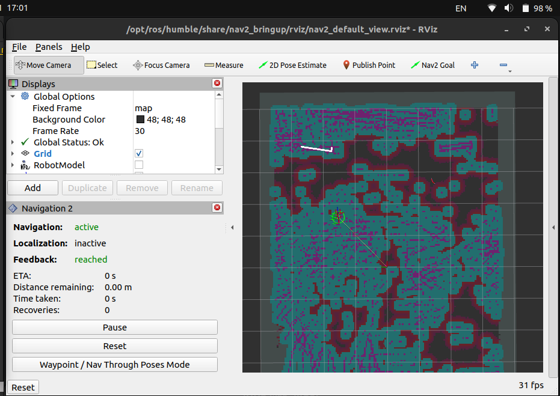
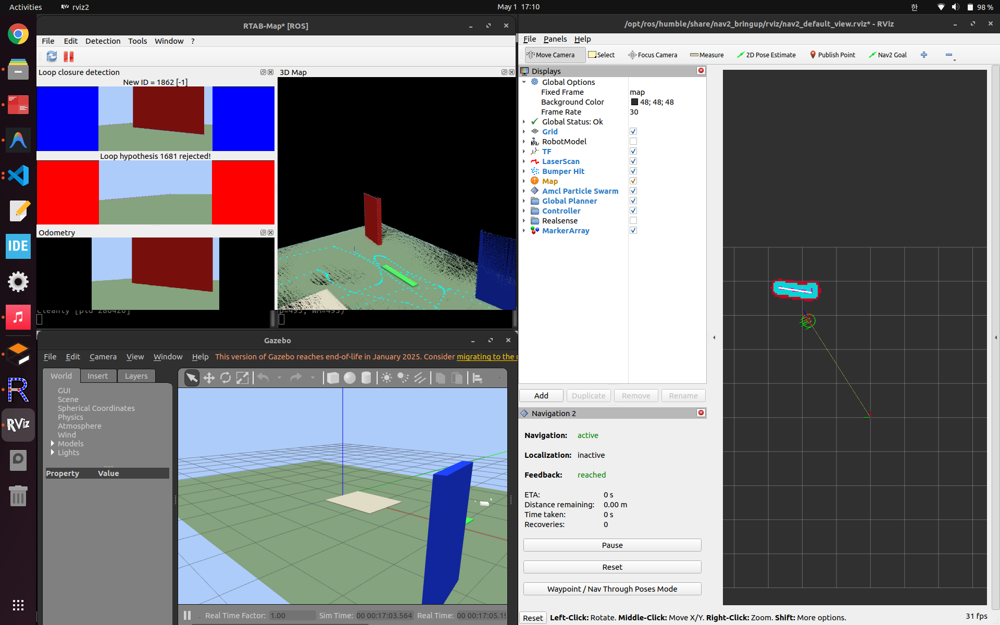

# 현재 진행상황 및 문제점 정리

## 결론

- 현재 프로젝트의 활성 작업선은 `Mari Gazebo + RTAB-Map + Nav2` 기반 자율주행 검증이다.
- 센서 bring-up, RTAB-Map baseline, encoder/IMU local odom 구조 검증은 1차로 지나왔고, 지금은 저장된 맵을 기반으로 Nav2가 실제 경로와 속도 명령을 안정적으로 만드는지 확인하는 단계다.
- Stage 2 장애물 world에서는 평지 오인식 문제를 줄인 clean saved map을 만들었고, `map_server + AMCL + Nav2`에서 `/plan`과 `/cmd_vel`이 발행되는 것을 확인했다.
- Stage 2 saved map에서 실제 목표 지점까지 만족스럽게 도착하는 것을 확인했다.
- Stage 3 small loop world에서도 저장 맵 기반 Nav2 검증을 진행했고, safe-clearance profile 적용 전후 costmap 비교 자료를 남겼다.
- 속도 상향 후 Mari의 이동 속도는 체감상 만족스러운 수준이었고, safe-clearance 적용 후 costmap 적색 위험 영역이 넓어져 더 안전한 주행 가능성을 확인했다.
- Stage 3는 장애물 간격이 넓어 반복 회피 테스트에 제한이 있어, 촘촘한 장애물 기반 `mari_nav2_stage4_repeat_course.world`를 추가했다.
- 현재 남은 핵심 검증은 Stage 4 반복주행 코스에서 safe-clearance profile이 좁은 통로나 장애물 밀집 구간에서도 경로를 과하게 막지 않는지 반복 goal로 확인하는 것이다.
- 실제 encoder/BNO08x 하드웨어가 아직 연결되지 않았기 때문에, 현재 자율주행 검증은 Gazebo `/odom` 기준 baseline과 fake encoder/IMU 구조 검증을 분리해서 해석한다.
- 기존 PC 기준 `D435i depth`, `IMU`, RTAB-Map baseline, Jetson/Docker bring-up 기록은 과거 진행 이력으로 유지한다.
- 실제 하드웨어 전환 전까지는 simulation-first로 Gazebo world, saved map, Nav2 profile, sensor topic 계약을 먼저 고정한다.
- `Jetson` 작업은 `SSH` 접속으로 시작했지만, 지금은 `모니터 + 키보드 + 마우스`를 직접 연결한 상태에서 현장형 bring-up을 진행 중이다.
- `Jetson` native 기준으로는 `D435i color/depth`와 `RTAB-Map` baseline이 실제로 다시 기동하는 데 성공했다.
- `Jetson`의 `Docker CE`, `Compose`, `NVIDIA Container Toolkit`은 이미 설치돼 있고 `nvidia` runtime도 등록돼 있다.
- 현재는 `jetson` 사용자의 `docker` 그룹 권한까지 열린 상태고, `jetson-vslam:humble` 개발 이미지 1차 build도 완료했다.
- 다만 현재 `Jetson`에서는 `D435i` 내장 IMU가 `HID Motion Sensor Failure`로 비활성화되어 있어, 운영 기준은 우선 `IMU OFF`다.
- `rtabmap_viz`는 GUI display가 있는 직접 연결 세션에서 실제로 확인됐고, non-GUI shell에서는 `xcb` 오류가 날 수 있다.
- 외부 `GY-BNO08x`는 `Jetson`의 `i2c-1 / 0x4B`에서 실제 인식됐고, host `venv` 기준으로 `accel / gyro / mag / quaternion` raw 값 확인까지 완료했다.
- 현재는 `BNO08x`를 host에서 `/imu/data`로 publish하고, Docker 컨테이너 안에서는 그 topic을 실제로 읽을 수 있는 상태까지 확인했다.
- Docker 안에서도 `D435i color/depth` bring-up이 다시 재현됐으므로, 당분간 실전 경로는 `host BNO08x publisher + Docker RTAB-Map`으로 잡는 편이 맞다.
- 다만 `2026-04-19` 기준으로 가장 먼저 확보한 Docker 기준선은 `IMU OFF image-only RTAB-Map baseline`이다.
- 실제 재시험에서 Docker 안 `rgbd_odometry`, `rtabmap`은 정상 기동했고 `quality`도 빠르게 회복됐다.
- `2026-04-20` 후반 재검증에서는 Docker 내부 `rtabmap_viz`의 핵심 blocker가 `video/render` 그룹 누락과 image-only IMU remap 버그였음을 확인했고, 이를 수정한 뒤 parameter/service binding까지 정상 재확인했다.
- 현재 Jetson에서 가장 실용적인 운영 기준은 여전히 `Docker backend + host rtabmap_viz frontend` 구조지만, 내부 GUI도 다시 시도 가능한 상태로 정리됐다.
- 같은 날짜 기준으로 `Docker` 구조도 `camera / rtabmap / dev-shell` 서비스 분리, `dev/runtime image` 분리, `tmpfs` DB/log, preset 파일, benchmark 자동 수집 구조까지 1차 정리했다.
- `2026-04-20` 후반에는 Docker benchmark가 끝날 때 결과 폴더별 `90_summary.env`, `91_summary.md`와 root `docker_benchmark_index.csv`, benchmark `README` 인덱스까지 자동 갱신되게 정리했다.
- `2026-04-20` preset benchmark 비교 결과, 현재 `Jetson Docker` 기본 baseline은 `light`가 가장 적합하고, `compare`는 후보 비교용, `medium`은 현재 실시간 baseline으로는 무거운 편으로 정리했다.
- 따라서 다음 `BNO08x IMU ON` 비교도 `light` baseline을 유지한 채 `Docker backend + host rtabmap_viz` 구조에서 반복하는 것이 현재 기준선이다.
- 앞으로 `Jetson` 전용 진행 기록은 별도 폴더에서 분리 관리한다.
- 추가로 `Jetson + Docker + ROS 2 Humble + D435i` 경로에서는 color/depth 토픽과 depth 약 `30 Hz`까지 확인해, Jetson 실기기 bring-up도 1차 완료했다.
- 반면 `Jetson publish -> 노트북 RTAB-Map GUI` cross-machine 경로는 현재 학교 Wi-Fi에서 DDS discovery가 막혀 실패했고, 이는 네트워크 계층 이슈로 분리된 상태다.
- 발표용 3D 맵은 우선 **노트북에 D435i를 직접 연결한 RTAB-Map 경로**로 확보했고, 결과 DB는 `assets/2026-04-16_laptop_rtabmap_demo/rtabmap_demo_map.db`에 저장했다.
- `2026-04-25` 기준으로는 Mari 로봇의 `Onshape -> URDF/Xacro -> Gazebo` 준비 단계로 넘어갔다.
- Mari `base_link`, D435i `camera_link`, BNO08x `imu_link`, GPS `gps_link`, 궤도 중심거리, 실제/가상 구동축 후보값을 1차 측정해 `mari.urdf.xacro`와 준비 문서에 기록했다.
- `2026-04-26` 기준으로 Onshape URDF/GLTF export 결과와 새 Mari STEP/STL export 결과를 repository asset으로 보관했다.
- `mari.urdf.xacro`는 `xacro` 렌더링과 `check_urdf` 파싱을 통과했고, Gazebo에는 `mari` entity가 생성되는 단계까지 확인했다.
- 다만 Gazebo 화면에는 아직 Mari visual mesh가 보이지 않는다. 현재 blocker는 `URDF 파싱 실패`가 아니라 `Gazebo visual mesh 표시/로딩 문제`로 분리됐다.
- `2026-04-27` 기준으로 Gazebo blocker와 별개로 RViz2에서 Mari visual mesh, `base_link`, `camera_link`, `imu_link`, `gps_link`가 정상 표시되는 것을 확인했다.
- `map -> odom -> base_footprint -> base_link` 구조의 동적 TF 테스트와 `/odom` publish 스크립트를 추가해, RViz2에서 Mari가 움직이는 장면까지 확인했다.
- `2026-04-28` 기준으로는 Mari를 Gazebo에 띄워야 하는 이유를 별도 문서로 정리했고, Gazebo Classic용 반복 실행 baseline을 추가했다.
- `mari.urdf.xacro`에 `use_mesh_visual` 옵션을 추가해 full STL visual과 debug box visual을 전환할 수 있게 했다.
- `gazebo_mari.launch.py`와 `mari_empty.world`를 추가해 온라인 model database에 의존하지 않고 Gazebo server/client, `robot_state_publisher`, `spawn_entity.py`를 실행할 수 있게 했다.
- headless 검증에서는 `use_mesh_visual:=false`와 `use_mesh_visual:=true` 모두 `SpawnEntity: Successfully spawned entity [mari]`까지 확인했다.
- `gz model -m mari -i`로 Gazebo world 안에 `mari` entity와 debug box visual geometry가 들어간 것도 확인했다.
- GUI 확인에서 `use_mesh_visual:=false` debug box visual과 `use_mesh_visual:=true` full STL Mari visual이 Gazebo 화면에 정상 표시되는 것을 확인했다.
- 앞/뒤 좌우 총 4개 collision-only virtual track wheel로 Gazebo 접지점을 늘렸고, full STL 궤도 외형 아래에서 자세를 지지하게 했다.
- GUI 직접 조종에서 궤도형 skid-steer 회전이 접촉 마찰에 따라 끊기는 느낌이 있어, Gazebo 제어 plugin을 `libgazebo_ros_planar_move.so`로 전환했다.
- `planar_move` 기준으로 `/cmd_vel`, `/odom`, `odom -> base_footprint` 흐름을 다시 확인했다.
- 격리 full STL headless 검증에서 회전 명령 후 yaw가 `-0.002597 -> 0.978302 rad`로 변했고, roll/pitch는 대략 `1e-4 rad` 이하로 유지됐다.
- 따라서 기존 Gazebo visual mesh 표시 blocker는 해소됐고, 현재는 마찰 의존성이 낮은 `planar_move` 주행 baseline까지 들어간 상태다.
- `Tools/teleop_mari_keyboard.py`를 추가해 `/cmd_vel`을 직접 보내며 Mari를 키보드로 조종할 수 있게 했다. Gazebo 창은 시각 피드백용이고, 키 입력은 별도 teleop 터미널에서 받는다. Smoke test에서는 `w` 입력 후 `linear.x=0.12`, `x` 입력 후 zero stop publish를 확인했다.
- Gazebo 가상 IMU/RGB-D sensor plugin을 추가해 `/imu/data`, RGB image, depth image, camera_info topic 수신까지 1차 확인했다.
- `Tools/check_mari_gazebo_sensor_topics.py`를 추가해 Gazebo 센서 topic 수신 여부를 자동 확인할 수 있게 했다.
- RViz2 진행 기록을 재확인해 `base_footprint -> base_link`는 `0.0252 m` 기준선을 유지하는 것으로 되돌렸다.
- 링크가 떠 보이는 문제는 `base_link`를 낮추는 방식이 아니라 `chassis_mesh_z = -base_link_z - chassis_mesh_min_z` visual offset과 개별 sensor visual/joint 위치로 확인해야 한다.
- RViz2/Gazebo 공통으로 `camera_z`를 `0.122174 m`에서 `0.112174 m`로 낮춰 카메라 박스와 camera TF를 `10 mm` 내렸다.
- Gazebo 가상 RGB-D/odom topic을 RTAB-Map에 연결하는 Mari 전용 launch wrapper를 추가했다.
- RTAB-Map 입력 topic과 map output topic을 한 번에 확인하는 smoke check 스크립트를 추가했다.
- Gazebo + RTAB-Map GUI/topic smoke test 증빙 스크린샷 4개를 `assets/2026-04-28_mari_gazebo_rtabmap_smoke/` 아래에 보관했다.
- 새 RTAB-Map checker가 live Gazebo/RTAB-Map 상태에서 필수 topic을 `[OK]`로 확인했다.
- RTAB-Map graph optimization/loop closure 경고를 줄이기 위해 Mari Gazebo 기본 RTAB-Map profile을 `g2o + planar 3DoF + gravity constraint off + spatial proximity off`로 조정했다.
- 실제 encoder 단계로 넘어가기 위해 ROS graph에서 encoder/wheel/motor/joint/odom 후보 topic을 자동 탐색하는 `Tools/check_mari_encoder_topics.py`를 추가했다.
- `trashbot_localization` 패키지를 추가해 실제 motor encoder raw topic 계약인 `/motor/encoder_ticks -> /wheel/odometry` 변환 구조를 먼저 만들었다.
- Gazebo `/odom`을 mock `/wheel/odometry`로 바꾸는 경로도 유지하지만, 최종 전환 기준은 motor driver가 `/motor/encoder_ticks`를 publish하는 구조다.
- 다음 확인 대상은 이 안정화 profile을 live Gazebo에서 다시 주행 검증하고, 실제 motor driver가 `/motor/encoder_ticks`를 publish하도록 맞춘 뒤 `/wheel/odometry + /imu/data -> /odometry/local` 구조를 검증하는 것이다.
- `2026-04-30` 기준으로 단순 카메라 테스트 world보다 실제 공원 주행에 가까운 `mari_park_test.world`를 추가했다.
- `gazebo_mari_park_realsense_light.launch.py`를 추가해 잔디, 보행로, 나무, 벤치, 표지판, 낮은 벽, 돌이 있는 공원형 world를 RealSense-light 카메라 조건으로 바로 실행할 수 있게 했다.
- 공원형 world에서 Gazebo 위치 기반 `/odom`을 RTAB-Map 입력으로 사용했을 때 3D map이 풍부하게 생성되는 것을 화면으로 확인했다.
- 이 결과는 map 품질 확인용 `/odom` baseline이며, 실제 encoder + IMU 기반 odometry 검증 결과는 아니다.
- 증빙 폴더는 `assets/2026-04-30_mari_park_world_rtabmap_baseline/`로 잡고, 추천 캡처 파일명은 `01_mari_park_world_rtabmap_odom_baseline.png`로 정했다.
- `encoder_ticks_to_wheel_odom.py`에 좌우 거리 scale, tick jump reject, 최대 선속도/회전속도 제한, encoder gap 감지를 추가했다.
- `mock_motor_encoder_ticks.py`에 의도적인 tick jump 주입 옵션을 추가해 encoder adapter의 이상치 방어를 검증할 수 있게 했다.
- 기존 mock 직진/제자리 회전은 그대로 통과했고, `20000 tick` jump 주입 시 adapter가 해당 샘플을 reject하고 zero velocity를 publish하는 것을 확인했다.
- `2026-05-01` 기준으로 raw Gazebo IMU를 바로 EKF에 넣지 않고, BNO08x-like covariance를 입힌 `/imu/data_bno08x_like`를 쓰는 republisher를 추가했다.
- `ekf_local_encoder_imu_bno08x_like.yaml`을 추가해 `/wheel/odometry`는 위치/전진속도, `/imu/data_bno08x_like`는 yaw-rate만 담당하도록 역할을 분리했다.
- `mari_rtabmap_realsense_light_encoder_imu.launch.py`를 추가해 공원형 Gazebo world에서 encoder+IMU local odom 후보를 바로 RTAB-Map으로 비교할 수 있게 했다.
- 더 긴 주행과 현실적인 landmark 분포를 보기 위해 `mari_large_park_test.world`와 `gazebo_mari_large_park_realsense_light.launch.py`를 추가했다.
- 큰 공원 world 비교에서 화면상 `/odom`과 `/odometry/local` map은 유사했지만, `/odometry/local`의 `Loop/MapToBase_lin_std`가 `1.737 m`로 `/odom` baseline `0.068 m`보다 컸다.
- 원인은 yaw-rate-only EKF에서 yaw pose가 직접 관측되지 않아 yaw covariance가 커지는 구조로 보고, `ekf_local_encoder_imu_bno08x_yaw_tuned.yaml`을 추가했다.
- 자율주행 1차 목표는 Nav2를 붙여 RViz `2D Goal Pose` 입력이 `/cmd_vel`로 이어지고 Gazebo Mari가 실제로 움직이는지 확인하는 것이다.
- 첫 Nav2 smoke test는 안정적인 Gazebo `/odom`과 RTAB-Map `map->odom` TF를 기준으로 진행하고, RGB-D depth image는 `depthimage_to_laserscan`으로 `/scan`으로 바꿔 Nav2 obstacle layer에 넣는다. RTAB-Map `/rtabmap/map`은 초기 훈련에서는 시각화 대상으로 두고, Nav2 global costmap의 static map 입력으로는 아직 쓰지 않는다.
- 큰 공원 world는 데모/최종 통합 검증용으로 유지하고, Nav2 초기 디버깅은 Stage 0~3 훈련 world에서 진행하도록 분리했다.
- Stage 2 장애물 world에서는 저장 맵 기반 Nav2 검증까지 진입했다.
- `mari_nav2_map_builder.launch.py`와 `filter_nav2_saved_map.py`로 평지 노이즈가 적은 저장 맵을 만들었고, `map_server + AMCL + Nav2`가 해당 맵을 기준으로 실행되는 것을 확인했다.
- 저장 맵 기반 주행에서 `/scan`, global/local costmap, `/plan`, `/cmd_vel`이 모두 살아 있었고, RViz 기준 `Navigation`, `Localization`, `Feedback`이 active인 상태까지 확인했다.
- 같은 실행 조건에서 목표 지점까지 실제로 만족스럽게 도착하는 것을 사용자 주행으로 확인했다.
- 현재 다음 검증은 Stage 3 small loop world에서 safe-clearance profile을 기준으로 여러 goal을 반복 실행하고, 경로 생성/회피/recovery 빈도를 비교하는 것이다.

즉, 지금 단계는 `센서가 들어오는지 확인하는 수준`과 `맵이 만들어지는지 확인하는 수준`은 넘었고,
`저장된 맵을 기반으로 Nav2가 안정적으로 계획하고 주행하는지 검증하는 단계`로 들어간 상태다.

---

## 0. 2026-05-01 최신 업데이트

최근 상태를 짧게 정리하면 아래와 같다.

1. **BNO08x-like IMU covariance republisher 추가**
   - `trashbot_localization/scripts/imu_covariance_republisher.py`를 추가했다.
   - raw Gazebo `/imu/data`를 그대로 EKF에 넣지 않고, covariance를 보수적으로 다시 지정한 `/imu/data_bno08x_like`로 republish한다.
   - covariance는 "센서값을 얼마나 믿을지"를 EKF에 알려주는 값이다.
   - Gazebo IMU의 covariance가 너무 작으면 EKF가 yaw-rate를 과하게 믿을 수 있으므로, 실제 BNO08x 투입 전 1차 비교용 보수값을 둔다.

2. **Encoder + IMU local EKF 후보 추가**
   - `trashbot_localization/config/ekf_local_encoder_imu_bno08x_like.yaml`을 추가했다.
   - `/wheel/odometry`는 `x/y position`과 `forward velocity`를 담당한다.
   - `/imu/data_bno08x_like`는 `angular_velocity.z`, 즉 yaw-rate만 담당한다.
   - 목표는 encoder가 직진 이동량을 잡고, IMU가 회전 변화량을 보조하는 구조를 먼저 검증하는 것이다.

3. **RTAB-Map encoder+IMU 비교 launch 추가**
   - `trashbot_description/launch/mari_rtabmap_realsense_light_encoder_imu.launch.py`를 추가했다.
   - 내부적으로 공원형 RealSense-light RTAB-Map 조건을 유지하면서, EKF config만 encoder+IMU 후보로 바꾼다.
   - 이 launch는 아래 경로를 실행한다.

```text
Gazebo /odom
-> /motor/encoder_ticks
-> /wheel/odometry

Gazebo /imu/data
-> /imu/data_bno08x_like

/wheel/odometry + /imu/data_bno08x_like
-> /odometry/local
-> RTAB-Map
```

4. **검증 결과**
   - `python3 -m py_compile`로 새 republisher와 launch 파일 문법을 확인했다.
   - `imu_covariance_bno08x_like.yaml`, `ekf_local_encoder_imu_bno08x_like.yaml` YAML parse를 확인했다.
   - `colcon build --symlink-install --packages-select trashbot_localization trashbot_description`가 통과했다.
   - `ros2 launch trashbot_description mari_rtabmap_realsense_light_encoder_imu.launch.py --show-args`가 통과했다.
   - `/test/imu/raw -> /test/imu/bno08x_like` smoke test에서 `frame_id=imu_link`, orientation covariance `0.01`, angular velocity covariance `0.001`, linear acceleration covariance `0.01`이 적용되는 것을 확인했다.

5. **해석 기준**
   - 이 단계는 실제 BNO08x 하드웨어 입력이 아니라, Gazebo IMU에 BNO08x-like covariance를 입힌 시뮬레이션 후보이다.
   - 따라서 "실제 센서로 위치추정이 완성됐다"가 아니라, "실제 encoder/IMU 구조로 전환하기 전에 ROS2 topic/EKF/RTAB-Map 연결 형태를 고정했다"로 해석한다.
   - 다음 비교는 공원형 world에서 `/odom` baseline, encoder-only `/odometry/local`, encoder+IMU `/odometry/local`을 같은 checker report로 나란히 보는 것이다.

6. **큰 공원형 Gazebo world 추가**
   - `trashbot_description/worlds/mari_large_park_test.world`를 추가했다.
   - 기존 `mari_park_test.world`는 짧은 데모와 topic/RTAB-Map 확인용 baseline으로 유지한다.
   - 새 world는 더 넓은 ground plane, 긴 main walkway, 좌우 branch path, far cross path, 작은 plaza, 나무 군집, 벤치, 색상 표지판, 놀이터 블록, 화단, 돌, 경계 wall/fence를 포함한다.
   - `trashbot_description/launch/gazebo_mari_large_park_realsense_light.launch.py`를 추가해 같은 RealSense-light 저부하 카메라 조건으로 바로 실행할 수 있게 했다.
   - 검증은 XML parse, `gz sdf -k`, `python3 -m py_compile`, `colcon build --symlink-install --packages-select trashbot_description`, `ros2 launch ... --show-args`까지 통과했다.
   - `gui:=false` headless smoke에서도 큰 공원 world가 로드되고 `SpawnEntity: Successfully spawned entity [mari]`까지 확인했다.

7. **큰 공원 world `/odom` vs `/odometry/local` 비교 결과**
   - `/odom` baseline은 odom input `49.96 Hz`, `mapData poses=13`, `links=114`, cloud `5631` points, `Loop/MapToBase_lin_std=0.068 m`로 확인됐다.
   - encoder+IMU `/odometry/local`은 odom input `29.97 Hz`, `mapData poses=13`, `links=103`, cloud `5659` points로 화면상 map 품질은 유사했다.
   - 하지만 `Loop/MapToBase_lin_std=1.737 m`로 내부 불확실도는 훨씬 높았다.
   - `/odometry/local` pose covariance에서 yaw가 `2.48`까지 커졌기 때문에, RTAB-Map이 local odom을 덜 확실하게 보는 것으로 해석했다.

8. **Encoder+IMU yaw-tuned EKF 추가**
   - `trashbot_localization/config/ekf_local_encoder_imu_bno08x_yaw_tuned.yaml`을 추가했다.
   - 기존 yaw-rate-only profile은 보존하고, tuned profile은 `/wheel/odometry`의 `x/y/yaw pose`, `forward velocity`, `yaw-rate`와 `/imu/data_bno08x_like`의 `yaw orientation`, `yaw-rate`를 함께 fuse한다.
   - `trashbot_description/launch/mari_rtabmap_realsense_light_encoder_imu.launch.py` 기본 EKF config를 yaw-tuned profile로 바꿨다.
   - headless smoke에서 `/odometry/local` echo 기준 yaw pose covariance가 `0.00194`로 확인되어, 기존 report의 yaw covariance `2.48` 문제는 config 수준에서 완화됐다.
   - `assets/2026-05-01_mari_large_park_rtabmap/03_large_park_encoder_imu_local_odom_yaw_tuned_check.*` report를 저장했다.
   - 화면 증빙은 `assets/2026-05-01_mari_large_park_rtabmap/03_large_park_encoder_imu_local_odom_yaw_tuned_rtabmap.png`로 보관했다.
   - yaw-tuned run은 `/odometry/local` `29.95 Hz`, RGB/Depth `14.98 Hz`, RTAB-Map info `2.55 Hz`, `mapData poses=19 links=76`, cloud `7314` points로 확인됐다.
   - yaw pose covariance는 `2.48 -> 0.00175`로 크게 줄었고, `Loop/MapToBase_lin_std`는 `1.737 m -> 1.253 m`로 개선됐다.
   - 아직 `/odom` baseline의 `Loop/MapToBase_lin_std=0.068 m`보다는 크므로, 센서 기반 구조는 동작 검증 완료 상태이고 최종 기본값 확정 전 추가 튜닝이 필요하다.

9. **Nav2 1차 자율주행 smoke-test 구조 추가**
   - `trashbot_navigation` 패키지를 추가했다.
   - `trashbot_navigation/config/mari_nav2_rtabmap_params.yaml`은 `/odom`, `map`, `base_footprint`, `/scan` 기준으로 Nav2 controller/planner/costmap을 설정한다.
   - 초기 훈련 profile은 RTAB-Map static occupancy map을 global costmap에 직접 넣지 않고, scan-only rolling global/local costmap을 사용한다.
   - `trashbot_navigation/launch/mari_nav2_rtabmap.launch.py`는 `depthimage_to_laserscan`, Nav2 navigation stack, RViz를 함께 실행한다.
   - `Tools/check_mari_nav2_topics.py`를 추가해 `/scan`, `/rtabmap/map`, global/local costmap, `/cmd_vel` topic을 한 번에 확인할 수 있게 했다.
   - 1차 성공 기준은 RViz `2D Goal Pose` 입력 후 `/cmd_vel`이 발행되고 Gazebo에서 Mari가 움직이는 것이다.
   - `/odom` 기준 smoke test가 성공한 뒤 같은 구조에서 `/odometry/local`로 전환해 센서 기반 odom의 자율주행 품질을 비교한다.

10. **Nav2 단계별 훈련 world 추가**
   - `mari_nav2_stage0_empty.world`: 장애물 없는 기본 `/cmd_vel` smoke test용 world다.
   - `mari_nav2_stage1_straight_path.world`: 직선 목표 추종과 속도/가속도 튜닝용 world다.
   - `mari_nav2_stage2_obstacles.world`: depth-to-scan, costmap, 장애물 회피 확인용 world다.
   - `mari_nav2_stage3_small_loop.world`: 작은 loop형 공원에서 RTAB-Map + Nav2 통합을 확인하는 world다.
   - `mari_nav2_stage4_repeat_course.world`: 장애물이 촘촘한 반복주행/safe-clearance 검증용 world다.
   - 각 world는 `gazebo_mari_nav2_stage*.launch.py`로 바로 실행할 수 있다.
   - `mari_large_park_test.world`는 데모/최종 검증 world로 유지한다.
   - Stage 0~3 world는 XML parse와 `gz sdf -k`를 통과했다.
   - Stage 0 headless smoke에서 world load, Mari spawn, `/cmd_vel` subscribe, `/odom` advertise까지 확인했다.

11. **Nav2 평지 장애물 오인 1차 완화**
   - 아무것도 없는 평지 구간이 장애물처럼 인식되어 RViz/Nav2 map이 지저분하게 따지는 문제를 확인했다.
   - 원인 후보는 낮은 카메라에서 `depthimage_to_laserscan`이 너무 두꺼운 depth band를 LaserScan으로 압축하면서 바닥면 또는 차체 근접 포인트를 장애물로 넣는 것이다.
   - `mari_nav2_rtabmap.launch.py` 기본값을 `scan_height=24 -> 8`, `range_min=0.20 -> 0.30`으로 조정했다.
   - Nav2 local/global obstacle layer의 `raytrace_min_range`, `obstacle_min_range`도 `0.30 m`로 맞췄다.
   - `Tools/check_mari_nav2_topics.py`는 `/scan`의 `min_finite`, `lt0.30`, `lt0.45`를 출력해 가까운 자기 장애물성 포인트를 확인할 수 있게 했다.
   - 추가 확인 결과 `/scan` frame이 `camera_color_optical_frame`이면 LaserScan 2D 평면 해석과 맞지 않아 물체 위치가 costmap에 이상하게 투영될 수 있다.
   - `mari_nav2_rtabmap.launch.py` 기본 `scan_frame`을 `camera_color_optical_frame -> camera_link`로 바꿔 Nav2가 x-forward/y-left 평면의 LaserScan으로 해석하게 했다.
   - RViz에서 map이 지나치게 빽빽하게 보이는 문제는 해상도 부족이 아니라 평지 오인식과 early costmap 구성 문제가 섞인 것으로 판단했다.
   - 1차 Nav2 훈련 profile에서는 `global_costmap`의 `static_layer`를 제외하고, `rolling_window=true`, `track_unknown_space=false`, `plugins=[obstacle_layer, inflation_layer]`로 바꿨다.
   - `Tools/check_mari_nav2_topics.py`에서 `/rtabmap/map`은 기본 관측 대상이지만 필수 조건은 아니며, 필요할 때 `--require-rtabmap-map`으로 강제 확인한다.
   - 결과적으로 `assets/2026-05-01_mari_nav2_stage_troubleshooting/04_nav2_scan_only_costmap_obstacle_detection_ok.png`처럼 평지 오인식은 줄고 실제 물체 근처에만 장애물 trace가 남는 상태까지 개선했다.

   

   

12. **Nav2 장애물 우회 1차 튜닝**
   - RViz 기준 장애물 감지는 정상화됐지만, 장애물을 우회하지 못하는 상태를 확인했다.
   - 원인 후보는 차체 대비 과하게 큰 `robot_radius=0.18`, 좁은 global rolling costmap, 보수적인 inflation/controller 설정이다.
   - Mari 차체 크기 기준으로 `robot_radius=0.12`로 낮추고, local/global `inflation_radius=0.18`로 줄였다.
   - global rolling costmap은 `5 m x 5 m -> 16 m x 16 m`로 넓혀 stage world 안에서 먼 goal도 경로 생성 대상에 들어오게 했다.
   - planner는 Navfn `use_astar=true`로 바꿨고, controller yaw 탐색을 늘리기 위해 `max_vel_theta=0.70`, `vtheta_samples=24`, `sim_time=2.0`으로 조정했다.
   - `colcon build --symlink-install --packages-select trashbot_navigation` 통과.
   - 평지 오인식 트러블슈팅 캡처는 `assets/2026-05-01_mari_nav2_stage_troubleshooting/`에 정리했다.
   - 현재 상태는 장애물 감지까지는 개선됐고, 다음 작업은 우회 주행 반응성 개선이다.

13. **저장된 맵 기반 Nav2 profile 추가**
   - scan-only rolling global costmap은 가까운 goal과 장애물 회피 확인에는 적합하지만, 넓은 구역의 먼 goal에는 한계가 있다.
   - 이를 보완하기 위해 `mari_nav2_saved_map.launch.py`와 `mari_nav2_saved_map_params.yaml`을 추가했다.
   - 절차는 RTAB-Map `/rtabmap/map`을 `nav2_map_server map_saver_cli`로 YAML/PGM 파일로 저장한 뒤, RTAB-Map을 끄고 `map_server + AMCL + Nav2`로 주행하는 방식이다.
   - global costmap은 저장된 `/map`을 `static_layer`로 사용하고, live `/scan`은 `obstacle_layer`로 유지한다.
   - 저장된 맵 기반 주행에서는 RViz `2D Pose Estimate`로 초기 위치를 먼저 맞춘 뒤 `Nav2 Goal`을 찍어야 한다.
   - 이 단계의 첫 목표는 Stage 2 장애물 world에서 `stage2_obstacles_rtabmap.yaml/.pgm`을 저장하고, 저장 맵 위에서 장애물 회피 경로가 생성되는지 확인하는 것이다.

14. **Nav2 저장 맵 노이즈 대응 map-builder 추가**
   - 저장된 `/map`이 점 형태로 지저분하게 생성되는 현상을 확인했다.
   - 원인 후보는 전체 RGB-D depth cloud 기반 occupancy map에 바닥/원거리 depth noise가 장애물처럼 섞이는 것이다.
   - `mari_nav2_map_builder.launch.py`를 추가해 depth image를 얇은 `/scan`으로 변환하고, RTAB-Map occupancy grid는 `Grid/Sensor=0`으로 `/scan` 기준 생성하게 했다.
   - 기본값은 `scan_height=4`, `range_min=0.35`, `grid_range_max=3.0`, `Grid/3D=false`, `Grid/RayTracing=true`, `Grid/Scan2dUnknownSpaceFilled=true`다.
   - 지저분한 점이 계속 많으면 `scan_height:=2`, `range_min:=0.45`, `range_max:=2.50`, `grid_range_min:=0.45`, `grid_range_max:=2.50`, `linear_update:=0.15`, `angular_update:=0.15`로 더 보수적으로 다시 생성한다.
   - 저장 후에도 작은 검은 점이 남는 경우를 위해 `Tools/filter_nav2_saved_map.py`를 추가했다.
   - 이 스크립트는 PGM map에서 주변 occupied neighbor가 부족한 점과 작은 occupied connected component를 제거해 `*_filtered.yaml/.pgm`을 만든다.

15. **저장 맵 기반 Nav2 경로/제어 smoke test 통과**
   - Stage 2 장애물 world에서 보수적인 scan 기반 map-builder 설정으로 맵을 다시 생성했고, 평지 오인식이 크게 줄어든 clean map을 확인했다.
   - 생성된 맵은 `assets/2026-05-01_mari_nav2_saved_map_smoke/stage2_obstacles_rtabmap*.yaml/.pgm`에 보관했다.
   - `stage2_obstacles_rtabmap_filtered.yaml` 기준으로 `map_server + AMCL + Nav2`를 실행했다.
   - RViz에서 `2D Pose Estimate` 후 `Nav2 Goal`을 찍었을 때 `Navigation`, `Localization`, `Feedback`이 active 상태로 들어갔다.
   - `Tools/check_mari_nav2_topics.py --duration 8 --map-topic /map --expect-cmd-vel`에서 `/scan`, global costmap, local costmap, `/plan`, `/cmd_vel`이 확인됐다.
   - 확인값은 `/scan 15.0 Hz`, global costmap `0.7 Hz`, local costmap `2.7 Hz`, `/plan 1.0 Hz`, `/cmd_vel 137.8 Hz` 수준이었다.
   - `/plan`은 `frame_id=map` 기준 연속 pose를 publish했고, `/cmd_vel`은 예시로 `linear.x=0.111`, `angular.z=0.396`까지 확인됐다.
   - 이 결과는 "저장 맵 기반 Nav2가 경로를 만들고 Mari에 속도 명령을 내는 단계"가 연결됐다는 의미다.
   - 이후 사용자 실행에서 목표 지점까지 만족스럽게 도착하는 것을 확인했다.
   - Stage 2 saved-map Nav2는 1차 성공으로 보고, 다음 검증은 Stage 3 small loop saved-map 주행으로 올린다.

16. **다음 목표: Stage 3 small loop saved-map Nav2 검증**
   - Stage 3는 단순 직선/장애물 world보다 작은 loop형 공원에 가깝다.
   - 목표는 `mari_nav2_stage3_small_loop.world`에서 clean map을 만들고, `stage3_small_loop_rtabmap_filtered.yaml`을 기준으로 AMCL/Nav2가 목표까지 주행하는지 확인하는 것이다.
   - Stage 2에서 확인한 보수적 map-builder 설정(`scan_height=2`, `range_min=0.45`, `range_max=2.50`, `linear_update=0.15`, `angular_update=0.15`)을 우선 재사용한다.
   - 증빙 폴더는 `assets/2026-05-02_mari_nav2_stage3_saved_map_smoke/`로 둔다.
   - 성공 기준은 RViz `Navigation/Localization/Feedback active`, `/plan` 생성, `/cmd_vel` 발행, Gazebo Mari goal reach, recovery 최소화다.

17. **Stage 3 safe-clearance profile 및 속도 튜닝**
   - 저장 맵 기반 Nav2에서 기존 profile과 safe-clearance profile의 costmap 표시를 비교했다.
   - safe-clearance profile은 저장된 `/map`을 다시 만드는 설정이 아니라, Nav2 costmap에서 장애물 주변 위험 영역을 더 넓게 잡아 경로가 장애물에서 더 떨어지도록 유도하는 주행 profile이다.
   - `trashbot_navigation/config/mari_nav2_saved_map_safe_clearance_params.yaml`을 추가해 safe-clearance profile을 분리했다.
   - saved-map profile의 속도는 1차로 `max_vel_x=0.18 m/s`, `max_vel_theta=0.90 rad/s` 기준으로 올렸고, 사용자 주행 기준 이동 속도는 만족스럽게 확인됐다.
   - safe-clearance 적용 후 costmap의 적색 위험 영역이 넓어져 장애물 주변을 더 보수적으로 보는 것을 확인했다.
   - 비교 캡처와 설명은 `assets/2026-05-02_mari_nav2_safe_clearance_compare/`에 정리했다.
   - 다음 확인 대상은 좁은 통로 또는 장애물 밀집 구간에서 safe-clearance가 경로를 과하게 막지 않는지 여부다.

18. **Stage 4 반복주행 테스트 world 추가**
   - Stage 3 small loop world는 공원형 구조라 장애물 간격이 넓어, safe-clearance 반복 테스트에는 제한이 있었다.
   - `trashbot_description/worlds/mari_nav2_stage4_repeat_course.world`를 추가했다.
   - `trashbot_description/launch/gazebo_mari_nav2_stage4_repeat_course.launch.py`로 바로 실행할 수 있다.
   - 이 world는 S자 회피, 중앙 기둥, 양쪽 근접 장애물, 좁은 gate, 장애물 옆 goal 후보가 보이도록 구성했다.
   - 목표는 baseline profile과 safe-clearance profile을 같은 saved map에서 반복 비교하는 것이다.
   - `assets/2026-05-02_mari_nav2_stage4_repeat_course/README.md`에 맵 목적, 구성 요소, 권장 테스트 순서, 성공 기준을 정리했다.
   - 권장 검증 순서는 `가까운 goal -> S자 통과 goal -> 장애물 옆 goal -> 먼 goal -> 반대 방향 복귀 goal`이다.

19. **Stage 4 gate 통과 대응 safe-clearance 재조정**
   - Stage 4 반복주행 코스의 gate 통과 테스트에서 costmap 적색 영역이 너무 넓어 통로를 잘 인식하지 못하는 현상을 확인했다.
   - 원인은 safe-clearance profile의 `inflation_radius=0.28`, `cost_scaling_factor=3.0`, `BaseObstacle.scale=0.35`가 좁은 통로에서는 과하게 보수적으로 작동한 것으로 본다.
   - safe-clearance profile을 balanced 값으로 낮췄다. 현재 기준은 `inflation_radius=0.22`, `cost_scaling_factor=4.5`, `BaseObstacle.scale=0.18`이다.
   - 자율주행 속도도 `max_vel_x=0.40 m/s`, `max_vel_theta=1.60 rad/s`, `acc_lim_x=1.00`, `acc_lim_theta=2.40`으로 올렸다.
   - 다음 확인은 같은 원본 Stage 4 saved map에서 Nav2만 재시작한 뒤 gate 통과 goal을 다시 찍는 것이다.

20. **Stage 4 반복주행 영상 증빙 정리**
   - `assets/2026-05-02_mari_nav2_stage4_repeat_course/videos/` 아래에 튜닝 전후 주행 영상 8개를 정리했다.
   - 튜닝 전 영상은 `before_speed_clearance_tuning/`에 두고, 가까운 goal 성공, 기본 장애물 goal 양호, S자 계획 실패, gate 통과 실패를 구분했다.
   - 튜닝 후 영상은 `after_speed_clearance_tuning/`에 두고, 가까운 goal 수월, S자 통과 수월, 방향 정렬 지연, gate 통과 중 벽 충돌 실패를 구분했다.
   - 1차 판단은 가까운 goal과 S자 통과는 개선됐지만, 좁은 gate 통과는 아직 실패 사례가 남아 추가 튜닝이 필요하다는 것이다.

## 0-1. 2026-04-30 최신 업데이트

최근 상태를 짧게 정리하면 아래와 같다.

1. **공원형 Gazebo world 추가**
   - `trashbot_description/worlds/mari_park_test.world`를 추가했다.
   - 기존 `mari_camera_test.world`는 RGB-D topic과 RTAB-Map 입출력 확인에는 적합하지만, 실제 공원 주행 환경과는 너무 단순했다.
   - 새 world는 잔디 바닥, 보행로, 분기 path, 나무, 벤치, 표지판, 낮은 벽, 돌, 화단을 포함한다.
   - 목표는 RTAB-Map이 평면 하나만 보는 상황을 피하고, RGB-D point cloud에 높이와 색이 다른 landmark를 충분히 주는 것이다.

2. **공원 world 전용 launch 추가**
   - `trashbot_description/launch/gazebo_mari_park_realsense_light.launch.py`를 추가했다.
   - 기존 `gazebo_mari_realsense_light.launch.py`와 같은 저부하 RealSense-light 카메라 조건을 유지한다.
   - 기본값은 `use_mesh_visual=false`, `424x240`, `15 Hz`, `sim_camera_visualize=false`다.
   - world 기본값만 `mari_park_test.world`로 바꿔, 같은 RTAB-Map profile에서 환경 복잡도만 올려 비교할 수 있게 했다.

3. **공원형 RTAB-Map `/odom` baseline 확인**
   - 공원 world에서 Gazebo 위치 기반 `/odom`을 RTAB-Map odometry input으로 사용했을 때 3D map이 잘 생성되는 것을 화면으로 확인했다.
   - Gazebo 화면에는 공원형 object tree와 Mari가 보이고, RTAB-Map 화면에는 보행로/나무/벤치/표지판/낮은 벽이 point cloud로 누적됐다.
   - 이 결과는 Gazebo `/odom`이 안정적이기 때문에 잘 나온 baseline이다.
   - 따라서 "공원 world에서 RTAB-Map map 생성 가능" 증빙으로는 유효하지만, "실제 encoder + IMU odometry가 좋다"는 증빙으로 보지는 않는다.

4. **증빙 asset 경로 정리**
   - 공원 world baseline 증빙 폴더를 `assets/2026-04-30_mari_park_world_rtabmap_baseline/`로 만들었다.
   - 추천 캡처 파일명은 `01_mari_park_world_rtabmap_odom_baseline.png`다.
   - 해당 폴더 README에는 `/odom` baseline이라는 점과 다음 비교 대상이 `/odometry/local`이라는 점을 명시했다.

5. **문서 업데이트**
   - `docs/learning/05-02_Mari_Gazebo_Run_Guide.md`에 Park Test World 실행 절차를 추가했다.
   - `trashbot_description/README.md`에 공원 world 실행 명령과 목적을 추가했다.
   - `daily/2026-04-30/README.md`에 오늘 작업 일지를 추가했다.

6. **검증 결과**
   - `python3` XML parse로 `mari_park_test.world`가 정상 XML임을 확인했다.
   - `gz sdf -k trashbot_description/worlds/mari_park_test.world`가 `Check complete`로 통과했다.
   - `colcon build --symlink-install --packages-select trashbot_description`가 통과했다.
   - `ros2 launch trashbot_description gazebo_mari_park_realsense_light.launch.py --show-args`에서 새 launch 인자가 정상 노출되는 것을 확인했다.

7. **다음 비교**
   - 같은 공원 world에서 `/odometry/local` 입력 RTAB-Map run을 실행한다.
   - 비교 기준은 map 정렬, 회전량, `Loop/MapToBase_lin_std`, graph poses/links, cloud points다.
   - local odom 후보가 `/odom` baseline보다 나쁘면 fake encoder `track_width_m`, pose-delta tick 생성, EKF covariance 순서로 조정한다.

8. **Encoder adapter 1차 보정/방어 구조 추가**
   - `encoder_odom.yaml`과 `encoder_odom_gazebo.yaml`에 `left_distance_scale`, `right_distance_scale`, `reject_outlier_samples`, `max_tick_delta`, `max_linear_velocity_mps`, `max_angular_velocity_radps`, `max_encoder_gap_sec`를 추가했다.
   - `encoder_ticks_to_wheel_odom.py`는 큰 tick jump, 비현실적인 선속도/회전속도, 긴 encoder gap을 reject한다.
   - reject 시 현재 pose는 유지하고 zero velocity odom을 한 번 publish한 뒤, 누적 tick baseline을 재설정한다.
   - `mock_motor_encoder_ticks.py`와 `mari_encoder_odom_mock.launch.py`에 `tick_jump_after_sec`, `tick_jump_left`, `tick_jump_right` 옵션을 추가했다.
   - 기존 직진 mock은 `/wheel/odometry` `vx=0.102 m/s`, `wz=0.000`으로 통과했다.
   - 기존 제자리 회전 mock은 `/wheel/odometry` `vx=0.000`, `wz=0.516 rad/s`로 통과했다.
   - `tick_jump_left:=20000 tick_jump_right:=20000` 주입 시 adapter가 `encoder tick jump exceeded limit` warning을 내고 샘플을 reject하는 것을 확인했다.

## 0-2. 2026-04-29 최신 업데이트

최근 상태를 짧게 정리하면 아래와 같다.

1. **Mari 전용 RTAB-Map launch wrapper 추가**
   - `trashbot_description/launch/mari_rtabmap.launch.py`를 추가했다.
   - 기존에 길게 입력하던 범용 `rtabmap_launch/rtabmap.launch.py` 실행 인자를 Mari Gazebo 기본값으로 감쌌다.
   - 기본 입력 topic은 `/odom`, `/camera/camera/color/image_raw`, `/camera/camera/aligned_depth_to_color/image_raw`, `/camera/camera/color/camera_info`다.
   - 기본 frame은 `base_footprint`, simulation time은 `use_sim_time:=true`, sensor QoS는 `2(Best Effort)`, 기본 `DetectionRate`는 `5 Hz`다.
   - `2026-04-29`에 RTAB-Map graph optimization 경고 완화를 위해 기본 optimizer를 `Optimizer/Strategy=1(g2o)`로 고정했다.
   - 지상 로봇 baseline이므로 `Reg/Force3DoF=true`, `RGBD/ForceOdom3DoF=true`로 `x/y/yaw` 평면 이동만 쓰게 했다.
   - 현재 launch에서는 IMU/VIO gravity constraint를 쓰지 않으므로 `Optimizer/GravitySigma=0`으로 껐다.
   - 좁은 synthetic world에서 불필요한 근접 loop link를 줄이기 위해 `RGBD/ProximityBySpace=false`를 기본값으로 둔다.
   - 추가 실험을 위해 `optimizer_strategy`, `force_3dof`, `gravity_sigma`, `optimize_from_graph_end`, `optimize_max_error`, `proximity_by_space`, `rtabmap_args_extra` launch argument를 노출했다.
   - 이제 기본 실행은 아래처럼 짧아졌다.

```bash
ros2 launch trashbot_description mari_rtabmap.launch.py
```

2. **RTAB-Map topic smoke check 스크립트 추가**
   - `Tools/check_mari_rtabmap_topics.py`를 추가했다.
   - Gazebo 입력 topic과 RTAB-Map output topic을 같은 실행에서 확인한다.
   - 필수 확인 대상은 `/odom`, RGB image, depth image, camera info, `/rtabmap/info`, `/rtabmap/mapData`, `/rtabmap/cloud_map`이다.
   - 선택 확인 대상으로 `/rtabmap/mapGraph`, `/rtabmap/mapPath`, `/rtabmap/map`, `/tf`도 함께 출력한다.
   - `2026-04-29`에 `/odom` pose/twist covariance summary와 `/rtabmap/info`의 `ref_id`, `loop_closure_id`, `proximity_detection_id`, working memory 크기, local path, odom cache, selected stats 출력도 추가했다.
   - RTAB-Map raw stats를 확인할 때는 `--all-stats --max-stats 80` 옵션을 쓴다.

```bash
python3 Tools/check_mari_rtabmap_topics.py
```

3. **실제 encoder 후보 topic 탐색 스크립트 추가**
   - `Tools/check_mari_encoder_topics.py`를 추가했다.
   - 실제 Mari 또는 Jetson bring-up 환경에서 `encoder`, `wheel`, `motor`, `joint`, `odom`, `tick`, `count`, `rpm` 후보 topic을 찾아 type, count, rate, 마지막 값을 요약한다.
   - `/wheel/odometry`가 바로 있는지, `/joint_states` 기반 adapter가 필요한지, raw tick/count 변환이 필요한지 빠르게 판단하는 용도다.

```bash
python3 Tools/check_mari_encoder_topics.py
python3 Tools/check_mari_encoder_topics.py --all-topics --duration 3
```

4. **Localization 패키지와 motor encoder odom 구조 추가**
   - `trashbot_localization` 패키지를 추가했다.
   - 실제 motor driver의 기본 raw topic 계약을 `/motor/encoder_ticks`(`std_msgs/Int64MultiArray`, `[left_ticks, right_ticks]`, 누적 signed tick)로 고정했다.
   - `scripts/encoder_ticks_to_wheel_odom.py`로 `/motor/encoder_ticks`를 `/wheel/odometry`(`nav_msgs/Odometry`)로 변환할 수 있게 했다.
   - `scripts/mock_motor_encoder_ticks.py`와 `launch/mari_encoder_odom_mock.launch.py`를 추가해 하드웨어 없이 encoder raw topic 계약을 테스트할 수 있게 했다.
   - `launch/mari_encoder_odom.launch.py`를 추가해 실제 motor driver가 `/motor/encoder_ticks`를 publish할 때 adapter만 실행할 수 있게 했다.
   - `scripts/gazebo_odom_to_encoder_ticks.py`와 `launch/mari_gazebo_encoder_odom.launch.py`를 추가해 Gazebo `/odom`을 fake `/motor/encoder_ticks`로 바꾼 뒤 기존 encoder adapter를 통과시킬 수 있게 했다.
   - `config/encoder_odom.yaml`에 `ticks_per_revolution`, `effective_wheel_radius_m`, `track_width_m`, 좌우 tick 부호, covariance 기본값을 정리했다.
   - `scripts/gazebo_odom_to_wheel_odom.py`로 Gazebo `/odom`을 `/wheel/odometry`로 republish할 수 있게 했다.
   - `launch/mari_wheel_odom_mock.launch.py`를 추가해 bridge만 독립 실행할 수 있게 했다.
   - `launch/mari_ekf_local.launch.py`를 추가해 mock bridge와 `robot_localization` local EKF를 함께 띄울 수 있게 했다.
   - `config/ekf_local.yaml`, `config/ekf_global.yaml`, `config/navsat_transform.yaml`를 추가했다.
   - Gazebo에서는 `planar_move`가 이미 `odom -> base_footprint` TF를 publish하므로 `ekf_local.yaml`의 `publish_tf` 기본값은 `false`로 두었다.
   - MG513P30/13-line Hall encoder/1:30 gear ratio/x4 quadrature decoding을 초기 가설로 두고 `ticks_per_revolution=1560`을 적용했다.
   - 이 값은 topic pipeline 검증용이며, 실제 Mari에서는 구동축 1회전 tick과 1m 직진 실측으로 보정해야 한다.
   - 초기 가설 근거와 보정 절차는 `01_Calibration/mari_mg513_encoder_initial_hypothesis.md`에 정리했다.

```bash
ros2 launch trashbot_localization mari_encoder_odom_mock.launch.py
ros2 launch trashbot_localization mari_encoder_odom.launch.py
ros2 launch trashbot_localization mari_wheel_odom_mock.launch.py
ros2 launch trashbot_localization mari_ekf_local.launch.py start_ekf:=false
```

5. **RTAB-Map smoke test 증빙 asset 정리**
   - Gazebo + RTAB-Map terminal/log 증빙을 `assets/2026-04-28_mari_gazebo_rtabmap_smoke/01_gazebo_rtabmap_runtime_logs_and_teleop.png`로 보관했다.
   - Gazebo world와 RTAB-Map 3D map GUI 증빙을 `assets/2026-04-28_mari_gazebo_rtabmap_smoke/02_gazebo_world_and_rtabmap_3d_map_view.png`로 보관했다.
   - `Tools/check_mari_rtabmap_topics.py`의 필수 topic `[OK]` 증빙을 `03_mari_rtabmap_topic_check_ok.png`로 보관했다.
   - `DetectionRate=5` 기준 live map 증빙을 `04_mari_rtabmap_detectionrate5_live_map.png`로 보관했다.
   - 스크린샷 기준으로 RTAB-Map은 완전히 죽은 상태가 아니라 3D map output을 만들고 있었지만, `DetectionRate`, GUI 부하, loop closure/graph optimization 경고 때문에 실시간 매핑 품질은 추가 튜닝이 필요하다.

6. **문서와 실행 가이드 업데이트**
   - `README.md`의 Tools 목록에 `check_mari_gazebo_sensor_topics.py`, `check_mari_rtabmap_topics.py`, `check_mari_encoder_topics.py`를 추가했다.
   - `trashbot_description/README.md`에 Mari RTAB-Map 실행과 topic 확인 절차를 추가했다.
   - `docs/learning/05-02_Mari_Gazebo_Run_Guide.md`에 RTAB-Map 실행, topic 확인, 실제 encoder 후보 topic 탐색, `/motor/encoder_ticks -> /wheel/odometry` 변환 절차를 추가했다.
   - `docs/learning/05-02_Mari_Gazebo_Run_Guide.md`에 Gazebo `/odom`을 mock `/wheel/odometry`로 쓰는 localization 구조 확인 절차를 추가했다.
   - `docs/progress/PreArrival_Sensor_Fusion_Architecture.md`에 encoder 후보 topic 탐색, `/wheel/odometry` 판단 기준, `trashbot_localization` 패키지 기준을 추가했다.
   - `trashbot_localization/README.md`에 motor encoder raw topic 계약, encoder odom adapter, mock encoder publisher, local EKF, 실제 encoder 전환 절차를 정리했다.
   - `trashbot_description/package.xml`에 `rtabmap_launch` runtime dependency를 추가했다.

7. **검증 결과**
   - `python3 -m py_compile Tools/check_mari_rtabmap_topics.py trashbot_description/launch/mari_rtabmap.launch.py`가 통과했다.
   - `python3 -m py_compile Tools/check_mari_encoder_topics.py`가 통과했다.
   - `python3 -m py_compile trashbot_localization/scripts/encoder_ticks_to_wheel_odom.py trashbot_localization/scripts/mock_motor_encoder_ticks.py trashbot_localization/scripts/gazebo_odom_to_wheel_odom.py trashbot_localization/launch/mari_encoder_odom.launch.py trashbot_localization/launch/mari_encoder_odom_mock.launch.py trashbot_localization/launch/mari_ekf_local.launch.py trashbot_localization/launch/mari_wheel_odom_mock.launch.py`가 통과했다.
   - `python3 Tools/check_mari_encoder_topics.py --duration 0.2 --discovery-timeout 0.2`가 현재 ROS graph에서 후보가 없음을 정상 경고로 출력했다.
   - `colcon build --symlink-install --packages-select trashbot_description trashbot_localization`가 통과했다.
   - `ros2 launch trashbot_description mari_rtabmap.launch.py --show-args`에서 Mari 전용 기본 인자가 정상 노출되는 것을 확인했다.
   - `ros2 launch trashbot_localization mari_encoder_odom_mock.launch.py --show-args`와 `mari_encoder_odom.launch.py --show-args`에서 encoder launch 인자가 정상 노출되는 것을 확인했다.
   - `mari_encoder_odom_mock.launch.py` smoke test에서 `/motor/encoder_ticks`가 `[27732, 27732]` 형태의 `std_msgs/Int64MultiArray`로 publish되는 것을 확인했다.
   - 같은 smoke test에서 `/wheel/odometry`가 `frame=odom`, `child_frame_id=base_footprint`, `linear.x ~= 0.099 m/s`로 publish되는 것을 확인했다.
   - `2026-04-29` 사용자 실행 기준 직진 mock에서 `/motor/encoder_ticks`가 `30.0 Hz`, `data=[22227, 22227]`로 나오고 `/wheel/odometry`가 `30.0 Hz`, `x=1.867`, `vx=0.101`, `wz=0.000`으로 나오는 것을 확인했다.
   - `2026-04-29` 사용자 실행 기준 제자리 회전 mock에서 `/motor/encoder_ticks`가 `data=[-5041, 5041]`로 나오고 `/wheel/odometry`가 `x=0.000`, `y=0.000`, `vx=0.000`, `wz=0.519`로 나오는 것을 확인했다.
   - 따라서 mock 기준 `/motor/encoder_ticks -> /wheel/odometry` pipeline은 직진/회전 모두 통과한 상태다.
   - `mari_gazebo_encoder_odom.launch.py`를 `/test_odom -> /test_motor/encoder_ticks -> /test_wheel/odometry` 격리 topic으로 smoke test해 fake Gazebo odom도 encoder tick pipeline을 통과하는 것을 확인했다.
   - `ros2 launch trashbot_localization mari_wheel_odom_mock.launch.py --show-args`와 `mari_ekf_local.launch.py --show-args`에서 localization launch 인자가 정상 노출되는 것을 확인했다.
   - `ros2 launch trashbot_localization mari_ekf_local.launch.py start_ekf:=false`로 bridge-only 실행이 뜨는 것을 확인했다.
   - synthetic `/odom` 1회 publish 후 `/wheel/odometry`에서 `frame=odom`, `child_frame_id=base_footprint`, `x=1.23`, `y=0.45`, `linear.x=0.12`, `angular.z=0.34`가 그대로 republish되는 것을 확인했다.
   - 현재 PC에는 `robot_localization` 패키지가 설치되어 있지 않아 실제 EKF node 실행은 `ros-humble-robot-localization` 설치 후 검증해야 한다.
   - 새 launch 인자 `optimizer_strategy`, `force_3dof`, `gravity_sigma`, `optimize_from_graph_end`, `optimize_max_error`, `proximity_by_space`, `rtabmap_args_extra`도 `--show-args`에 노출되는 것을 확인했다.
- `rtabmap_viz:=false rviz:=false detection_rate:=3`로 짧게 실행했을 때 RTAB-Map이 `/odom`, RGB image, depth image, camera info를 구독하고 `RTAB-Map detection rate = 3.000000 Hz`로 설정되는 것을 확인했다.
- 같은 짧은 실행에서 `Optimizer/Strategy=1`, `Reg/Force3DoF=true`, `RGBD/ForceOdom3DoF=true`, `Optimizer/GravitySigma=0`, `RGBD/ProximityBySpace=false`가 RTAB-Map parameter로 적용되는 것을 확인했다.
- `rtabmap_args_extra:="--Kp/MaxFeatures 700"`도 RTAB-Map argument로 정상 전달되는 것을 확인했다.
- Gazebo GUI에서 teleop 입력으로 Mari가 실제로 움직이는 것도 다시 확인했다.
- Gazebo + RTAB-Map을 동시에 켠 상태에서 `Tools/check_mari_rtabmap_topics.py` 필수 항목이 `[OK]`로 통과하는 것을 확인했다.
- `trashbot_description/rviz/mari_sensor_debug.rviz`를 추가해 RobotModel, TF, `/odom`, `/wheel/odometry`, RGB image, depth image, depth point cloud를 한 RViz2 화면에서 볼 수 있게 했다.
- `gazebo_mari.launch.py`에 `joint_state_publisher`를 추가해 네 개의 `*_virtual_track_wheel_link` 접촉 프레임도 RViz2에서 기본 joint state를 받게 했다.
- RViz2 통합 시각화 증빙은 `assets/2026-04-29_mari_sensor_visualization/01_rviz_mari_rgbd_pointcloud_odom_visualization_ok.png`에 보관했다.
- `trashbot_description/launch/mari_rtabmap_local_odom.launch.py`를 추가해 Gazebo encoder bridge, local EKF, RTAB-Map을 함께 실행하고 RTAB-Map odom input을 `/odometry/local`로 바꿀 수 있게 했다.
- `Tools/check_mari_rtabmap_topics.py --odom-topic /odometry/local` 실행에서 `/odometry/local`, RGB-D input, `/rtabmap/info`, `/rtabmap/mapData`, `/rtabmap/cloud_map`, `/rtabmap/map`이 모두 `[OK]` 또는 관측 가능한 output으로 확인됐다.
- `/odometry/local` 입력 run에서 RTAB-Map graph는 `poses=89`, `links=466`, cloud map은 `27973` points까지 생성됐다.
- `Tools/check_mari_rtabmap_topics.py`에 `--label`, `--output-json`, `--output-md`를 추가해 `/odom` run과 `/odometry/local` run을 같은 report 형식으로 저장할 수 있게 했다.
- 비교 결과 저장 폴더는 `assets/2026-04-29_mari_rtabmap_odom_mode_compare/`로 잡았다.
- 실제 비교 결과, 후보 A(`/odom`)는 RTAB-Map info rate `2.22 Hz`, mapData `poses=14`, `links=159`, cloud `3899` points, `Loop/MapToBase_lin_std=0.059 m`로 확인됐다.
- 후보 B(`/odometry/local`)는 RTAB-Map info rate `2.12 Hz`, mapData `poses=15`, `links=80`, cloud `3826` points, `Loop/MapToBase_lin_std=1.450 m`로 확인됐다.
- 따라서 현재 Gazebo RTAB-Map 기본 매핑에는 후보 A(`/odom`)를 유지하고, 후보 B(`/odometry/local`)는 실차 encoder/IMU 구조 검증용 baseline으로 분리한다.
- 후보 B 개선을 위해 `gazebo_ros.yaml`로 Gazebo `/clock` publish rate를 `100 Hz`로 올리고, Gazebo mock encoder 전용 `encoder_odom_gazebo.yaml`을 추가했다.
- EKF에서는 Gazebo IMU의 zero orientation covariance를 피하기 위해 IMU yaw orientation은 쓰지 않고 angular velocity z만 쓰도록 `ekf_local.yaml`, `ekf_global.yaml`을 조정했다.
- RTAB-Map 실시간성 확인을 위해 Gazebo camera 해상도/FPS/visualization을 launch argument로 조절할 수 있게 했고, 저부하 실행 profile을 `05-02_Mari_Gazebo_Run_Guide.md`에 추가했다.
- 실제 D435i Jetson Docker `light` preset(`424x240x15`, `DetectionRate=2`, `queue=15`)과 동일한 Gazebo/RTAB-Map wrapper launch를 추가했고, 데모 가시성을 위해 RTAB-Map GUI는 기본으로 켠다.
- `mari_rtabmap_realsense_light_local_odom.launch.py`를 추가해 같은 smooth mapping 조건에서 RTAB-Map odom input만 `/odometry/local`로 바꿔 비교할 수 있게 했다.
- Gazebo IMU의 gyro covariance가 `4e-08` 수준으로 너무 작아 local EKF 회전 보정이 과해질 수 있어, Gazebo local-odom 비교 기본값은 `ekf_local_gazebo_encoder_only.yaml`로 조정했다.
- local odom이 Gazebo 회전을 덜 반영하는 문제를 줄이기 위해 `gazebo_odom_to_encoder_ticks.py`의 기본 fake encoder 생성 방식을 `/odom.twist` 적분에서 `/odom.pose` delta 기반으로 바꿨다.

현재 실용적인 해석은 다음과 같다.

- **RTAB-Map 실행 방식**: 긴 범용 launch 명령 대신 Mari 전용 launch로 고정
- **Smoke test 자동화**: Gazebo 입력 topic과 RTAB-Map output topic을 한 번에 확인하고 live `[OK]` 증빙 확보
- **RTAB-Map 안정화**: GTSAM underconstrained warning을 먼저 줄이기 위해 Mari Gazebo 기본값을 `g2o + 3DoF` 중심으로 조정
- **Encoder 준비**: `/motor/encoder_ticks -> /wheel/odometry` topic 계약과 변환 adapter 추가, mock 기준 직진/회전 변환 검증 완료
- **EKF 구조 준비**: `trashbot_localization` 패키지로 `/wheel/odometry`와 `/odometry/local` 구조를 미리 고정
- **Gazebo 조종**: teleop 입력으로 Gazebo GUI에서 Mari 이동 확인
- **RViz2 통합 시각화**: RobotModel, TF, Gazebo odom, fake wheel odom, RGB image, depth point cloud를 한 화면에서 확인
- **증빙 asset**: Gazebo + RTAB-Map GUI/topic smoke test 스크린샷 4개 보관 완료
- **증빙 asset**: RViz2 통합 센서 시각화 스크린샷 1개 보관 완료
- **RTAB-Map 비교 준비**: raw Gazebo `/odom` 입력 run과 EKF `/odometry/local` 입력 run을 같은 checker로 비교할 수 있게 launch 추가
- **RTAB-Map local odom smoke**: `/odometry/local -> RTAB-Map -> map output` 경로가 통과했으며 증빙 README는 `assets/2026-04-29_mari_rtabmap_local_odom_smoke/`에 보관
- **RTAB-Map 비교 report**: checker가 JSON/Markdown 저장을 지원하므로 raw/local odom run을 같은 양식으로 비교 가능
- **RTAB-Map odom 입력 판정**: 현재 Gazebo 매핑 기본값은 `/odom` 유지, `/odometry/local`은 실차 구조 대비용으로 유지
- **후보 B 1차 조정**: `/clock` rate, IMU yaw orientation 사용 여부, Gazebo mock encoder covariance를 조정
- **실시간 우선 모드**: STL visual, camera visualization, RGB-D 해상도, RTAB-Map GUI 부하를 줄이는 실행 profile 추가
- **RealSense light 동일 조건**: 실제 D435i baseline과 비교 가능한 `424x240x15 + DetectionRate 2 + queue 15` launch 추가
- **Local odom 비교 launch**: `/odom` baseline과 같은 카메라/RTAB-Map 세팅으로 `/odometry/local` 입력 후보를 실행 가능
- **회전 보정 완화**: Gazebo local-odom 후보는 기본적으로 encoder-only EKF를 사용하고, IMU fusion은 별도 옵션으로 비교
- **회전량 추종 개선**: fake encoder tick을 Gazebo pose delta 기반으로 생성해 `/wheel/odometry` yaw가 visible Gazebo 회전에 더 가깝게 따라가도록 조정
- **공원형 world baseline**: `mari_park_test.world`와 `/odom` 기반 RTAB-Map baseline으로 실제 공원형 데모에 가까운 map 확인 가능
- **증빙 asset**: 공원형 Gazebo + RTAB-Map baseline 증빙 폴더를 `assets/2026-04-30_mari_park_world_rtabmap_baseline/`로 준비
- **남은 확인**: 같은 공원형 world에서 `/odometry/local` 입력 후보를 실행해 `/odom` baseline과 map 정렬, 회전량, graph 품질을 비교
- **다음 단계**: 후보 B 재검증 후 GPS까지 포함한 global odometry smoke test로 확장한다.

---

## 0-2. 2026-04-28 최신 업데이트

최근 상태를 짧게 정리하면 아래와 같다.

1. **Gazebo 필요성 문서화**
   - `docs/progress/Why_Mari_Gazebo_Baseline_Is_Needed.md`를 추가했다.
   - Mari를 Gazebo에 띄우는 이유를 `/cmd_vel -> 로봇 이동 -> /odom -> TF -> 센서/Nav2/VSLAM` 흐름 검증 관점에서 정리했다.
2. **Gazebo visual 전환 옵션 추가**
   - `mari.urdf.xacro`에 `use_mesh_visual` xacro argument를 추가했다.
   - 기본값은 기존 RViz2 동작을 유지하기 위해 `true`다.
   - Gazebo launch에서는 기본값을 `false`로 넘겨 안정적인 debug box visual을 먼저 확인한다.
3. **Gazebo 실행 baseline 추가**
   - `trashbot_description/launch/gazebo_mari.launch.py`를 추가했다.
   - Gazebo server/client, `robot_state_publisher`, `spawn_entity.py`를 한 번에 실행한다.
   - `spawn_entity.py`에는 `-timeout 90`과 `-package_to_model`을 적용했다.
4. **로컬 world 추가**
   - `trashbot_description/worlds/mari_empty.world`를 추가했다.
   - `sun`과 `ground_plane`을 world 안에 직접 정의해 Gazebo 온라인 model database 의존도를 줄였다.
5. **검증 결과**
   - `xacro`와 `check_urdf`는 `use_mesh_visual:=false`, `use_mesh_visual:=true` 모두 통과했다.
   - `colcon build --symlink-install --packages-select trashbot_description`가 통과했다.
   - `gui:=false use_mesh_visual:=false`와 `gui:=false use_mesh_visual:=true` 모두 Gazebo headless spawn이 성공했다.
   - `gz model -m mari -i`에서 `mari` entity와 debug box visual geometry가 들어간 것을 확인했다.
6. **Gazebo GUI full STL visual 확인**
   - `ros2 launch trashbot_description gazebo_mari.launch.py`로 debug box visual 표시를 확인했다.
   - `ros2 launch trashbot_description gazebo_mari.launch.py use_mesh_visual:=true`로 full STL Mari visual 표시를 확인했다.
   - 증빙 이미지는 `assets/robot_model_exports/mari_gazebo/` 아래에 보관한다.
7. **Gazebo planar_move 주행 baseline 추가**
   - `left_front`, `right_front`, `left_rear`, `right_rear` 총 4개 collision-only virtual track wheel을 추가해 full STL 궤도 외형 아래의 접지 지지점을 늘렸다.
   - 처음에는 `libgazebo_ros_diff_drive.so`의 `num_wheel_pairs=2` 모드로 궤도형 skid-steer를 근사했지만, GUI 직접 조종에서 회전이 접촉 마찰에 따라 끊기는 느낌이 있었다.
   - 센서/topic 검증 목적을 우선해 제어 plugin을 `libgazebo_ros_planar_move.so`로 전환했다.
   - `planar_move` 기준으로 `/cmd_vel`, `/odom`, `odom -> base_footprint` TF publish를 확인했다.
   - 격리 full STL headless 검증에서 회전 명령 후 yaw가 `-0.002597 -> 0.978302 rad`로 변했고, roll/pitch는 대략 `1e-4 rad` 이하로 유지됐다.
   - 이 구조는 Gazebo 전용 제어 안정화이며, 실제 encoder/IMU/RGB-D topic 수신 검증과 직접 충돌하지 않는다.
8. **키보드 teleoperation 추가**
   - `Tools/teleop_mari_keyboard.py`를 추가했다.
   - `w/s/a/d`, 방향키, `q/e/z/c`로 `/cmd_vel`을 publish해 Gazebo GUI에서 Mari를 직접 조종할 수 있다.
   - 이동 키 입력이 끊기면 자동으로 zero velocity를 보내는 safety timeout을 넣었다.
   - 키 입력은 teleop 터미널이 포커스를 가지고 있어야 하며, Gazebo 창은 시각 피드백용으로 사용한다.
9. **Gazebo 가상 센서 topic baseline 추가**
   - `imu_link`에 `libgazebo_ros_imu_sensor.so` 기반 IMU sensor를 추가했다.
   - `camera_link`에 `libgazebo_ros_camera.so` 기반 RGB-D camera sensor를 추가했다.
   - `gps_link`에 `libgazebo_ros_gps_sensor.so` 기반 GPS sensor를 추가했다.
   - 기대 topic은 `/imu/data`, `/camera/camera/color/image_raw`, `/camera/camera/aligned_depth_to_color/image_raw`, `/camera/camera/color/camera_info`, `/camera/camera/aligned_depth_to_color/camera_info`다.
   - GPS 기대 topic은 `/gps/fix`이고, pointcloud 기대 topic은 `/camera/camera/depth/color/points`다.
   - `Tools/check_mari_gazebo_sensor_topics.py`를 추가해 topic 수신, type, frame_id, rate를 한 번에 확인할 수 있게 했다.
   - `2026-04-29`에 checker를 확장해 `/gps/fix`(`sensor_msgs/NavSatFix`)와 `/camera/camera/depth/color/points`(`sensor_msgs/PointCloud2`)도 함께 확인하게 했다.
   - 격리 full STL headless 검증에서 `/odom` 50.0 Hz, `/imu/data` 99.9 Hz, RGB image 약 9.2 Hz, depth image 약 6.8 Hz 수신을 확인했다.
   - IMU `frame_id`는 `imu_link`, RGB-D `frame_id`는 `camera_color_optical_frame`으로 확인했다.
   - `2026-04-29` headless `mari_camera_test.world` 검증에서 `/odom` 50.0 Hz, `/imu/data` 99.9 Hz, `/gps/fix` 5.0 Hz, RGB/depth image 약 13.8 Hz, camera_info 약 15.1 Hz, pointcloud 약 14.6 Hz를 `[OK]`로 확인했다.
   - Gazebo GPS plugin은 현재 `/gps/fix`의 `frame_id`를 `base_footprint`로 publish한다. 값 수신 검증은 통과했지만, GPS 안테나 lever arm까지 정확히 반영하려면 이후 `gps_link` frame 보정 또는 republish가 필요하다.
10. **`base_link`/visual mesh offset 기준 재확인**
   - RViz2 검증 기록 기준으로 `base_link_z=0.0252 m`는 STL chassis-center baseline이다.
   - `base_link_z=0.021 m`로 낮추는 시도는 링크 전체를 4.2 mm 낮출 뿐, 카메라 박스 visual 위치 문제의 직접 원인이 아니므로 되돌렸다.
   - `0.021 m` 값은 가상 궤도 접지 반지름 후보로 유지하지만, `base_footprint -> base_link` 높이에는 사용하지 않는다.
   - visual mesh 최저점은 `chassis_mesh_z = -base_link_z - chassis_mesh_min_z` 계산식으로 계속 `base_footprint` 기준 `z=0`에 맞춘다.
   - RViz2/Gazebo 공통으로 `camera_z=0.112174 m`를 적용해 camera frame과 카메라 박스를 `10 mm` 낮췄다.

현재 실용적인 해석은 다음과 같다.

- **Gazebo spawn**: headless 기준 반복 실행 baseline 확보
- **Gazebo visual**: debug box visual과 full STL visual 모두 GUI 표시 확인
- **Full STL visual**: 현재 실행 경로 기준 표시 blocker 해소
- **Gazebo 주행**: `planar_move` 기준 `/cmd_vel` 전진/회전과 `/odom` publish 확인
- **직접 조종**: `Tools/teleop_mari_keyboard.py`로 Gazebo GUI에서 수동 주행 가능
- **Gazebo 가상 센서**: `/odom`, `/imu/data`, `/gps/fix`, RGB image, depth image, camera_info, pointcloud 수신 확인
- **Frame 높이 기준**: `base_footprint -> base_link`는 RViz2 검증 기준 `0.0252 m` 유지, visual mesh는 `chassis_mesh_z` offset으로 지면 정렬
- **다음 단계**: Gazebo 가상 RGB-D/IMU topic을 RTAB-Map 또는 VSLAM smoke test에 연결한 뒤 실제 encoder/IMU/RGB-D topic 검증

---

## 0-2. 2026-04-27 최신 업데이트

최근 상태를 짧게 정리하면 아래와 같다.

1. **Mari RViz2 모델/TF 검증**
   - `mari.urdf.xacro`의 visual mesh yaw와 z offset을 보정해 RViz2에서 Mari 외형이 정상적으로 보이는 상태를 확인했다.
   - `base_footprint -> base_link -> chassis_link/camera_link/imu_link/gps_link` 구조가 끊기지 않는 것을 확인했다.
2. **TF tree 증빙 보관**
   - `tf2_tools view_frames` 결과를 `assets/robot_model_exports/mari_view/02_mari_tf_tree_view_frames.pdf`로 보관했다.
   - RViz2 mesh/TF alignment screenshot을 `01_mari_urdf_rviz_mesh_tf_alignment_check.png`로 보관했다.
3. **RViz2 동적 이동 테스트 추가**
   - `Tools/test_mari_moving_tf.py`를 추가해 `map -> odom -> base_footprint` 동적 TF와 `/odom` 토픽을 publish하도록 했다.
   - RViz2에서 `Fixed Frame=map`, `Target Frame=map` 설정으로 Mari가 원형 경로를 도는 것을 확인했다.
4. **D435i 장착 높이 보정**
   - 리얼센스 장착 높이가 `(80 - 65.44216) mm = 14.55784 mm` 높아진 것을 반영했다.
   - `mari.urdf.xacro`의 `camera_z`를 `0.107616 m`에서 `0.122174 m`로 갱신했다.
   - 이후 2026-04-28 기준 RViz2/Gazebo 장착 높이를 맞추기 위해 현재 적용값은 `0.112174 m`로 낮췄다.
5. **`/cmd_vel` 기반 odom 테스트 추가**
   - `Tools/test_mari_cmd_vel_odom.py`를 추가해 `/cmd_vel`을 받아 `/odom`과 `odom -> base_footprint` TF를 publish하도록 했다.
   - 이는 실제 엔코더 odom 전 단계의 RViz2 명령-이동 검증용이다.

현재 실용적인 해석은 다음과 같다.

- **URDF/Xacro 검증**: RViz2 기준 visual mesh와 sensor TF 확인 완료
- **TF 구조**: `map -> odom -> base_footprint -> base_link -> sensor frames` 구조의 시각 검증 가능
- **시뮬레이션 준비**: `/cmd_vel -> /odom` 테스트 노드는 추가됐고, 다음 단계는 virtual wheel link 추가
- **남은 blocker**: Gazebo Classic visual mesh 표시 문제는 별도로 남아 있음

---

## 0-3. 2026-04-26 업데이트

최근 상태를 짧게 정리하면 아래와 같다.

1. **Mari/Duri asset 명칭 정리**
   - `turtle_small`은 `Mari`, `turtle_big`은 `Duri` 기준으로 repository asset과 URDF 파일명을 정리했다.
   - Mari/Duri 캡처 이미지를 `mari_view`, `duri_view`로 분리했고, Mari는 `with_sensors`, `without_sensors`를 따로 보관했다.
2. **Onshape export 결과 보관**
   - Onshape에서 export한 Mari URDF/GLTF zip과 unpacked 결과를 `assets/robot_model_exports/onshape_urdf_exports`에 보관했다.
   - 새 Mari STEP/STL export 결과도 `assets/robot_model_exports`와 `trashbot_description/meshes`에 반영했다.
3. **Gazebo spawn 시도와 blocker 분리**
   - `trashbot_description` 빌드, `mari.urdf.xacro` 렌더링, `check_urdf` 파싱은 통과했다.
   - Gazebo model tree에 `mari`와 `base_footprint`가 표시되지만, 실제 visual mesh는 화면에 보이지 않는다.
   - 현재 blocker는 `mesh URI`, `mesh scale/origin`, `Gazebo Classic STL 처리`, `client view`를 순서대로 확인해야 하는 visual 표시 문제다.

현재 실용적인 해석은 다음과 같다.

- **로봇 모델링**: Mari frame/sensor 좌표와 visual asset 정리 완료
- **URDF/Xacro 검증**: Xacro 렌더링과 URDF 파싱은 통과
- **시뮬레이션 준비**: Gazebo entity spawn은 진행됐지만 visual mesh 표시 blocker 해결 필요
- **다음 작업**: `gzclient --verbose` 로그 확인, mesh bounds/scale 확인, 단순 visual baseline 비교, 이후 virtual wheel diff-drive 추가

---

## 0-4. 2026-04-25 업데이트

최근 상태를 짧게 정리하면 아래와 같다.

1. **Mari URDF/Xacro 준비**
   - Onshape에서 궤도/구동부 기준 `base_link_mc`를 만들고, ROS 기준 `+X 전방`, `+Y 왼쪽`, `+Z 위쪽` 방향을 정했다.
   - D435i, BNO08x, GPS의 `base_link` 기준 1차 상대 위치를 측정해 `mari.urdf.xacro` 변수로 기록했다.
2. **궤도/구동축 파라미터 정리**
   - 좌우 궤도 중심거리 `0.137553 m`, 가상 구동축 `y=±0.0687765 m`, 유효 궤도 반지름 후보 `0.021 m`를 기록했다.
   - 실제 구동축은 좌우 앞뒤 위치가 비대칭이므로 CAD 기준 기록으로 남기고, Gazebo/diff-drive에는 `x=0` 가상 바퀴를 쓰는 방향으로 정했다.
3. **저녁 이후 작업 계획**
   - Onshape에서 불필요한 `Revolute mate`를 제거하고 구동부 visual을 `Group`으로 고정한다.
   - Onshape URDF export를 시도한다.
   - Export 결과를 후처리해 Gazebo용 virtual wheel 기반 diff-drive 모델로 넘어간다.

현재 실용적인 해석은 다음과 같다.

- **로봇 모델링**: 센서 frame과 주행 파라미터 1차 측정 완료
- **시뮬레이션 준비**: Onshape URDF export와 Gazebo virtual wheel 구성이 다음 단계
- **남은 문제**: IMU 축 방향, GPS 안테나 중심, Xacro 렌더링/RViz2 검증, Gazebo 회전 부호 검증

---

## 0-5. 2026-04-16 기준 업데이트

최근 상태를 짧게 정리하면 아래와 같다.

1. **노트북 직결 경로**
   - `D435i + RTAB-Map`으로 발표용 3D 맵 생성과 `rtabmap.db` 저장까지 완료했다.
2. **Jetson Docker 경로**
   - `ROS 2 Humble + realsense2_camera` 환경 고정, color/depth 토픽 확인, `depth/image_rect_raw` 약 `30 Hz` 확인까지 끝냈다.
3. **Jetson -> 노트북 원격 GUI 경로**
   - 학교 Wi-Fi에서는 `ROS_DOMAIN_ID`, `ROS_DISCOVERY_SERVER`, `ROS_SUPER_CLIENT`를 맞춰도 discovery 실패였다.
   - 따라서 현재 병목은 카메라나 RTAB-Map이 아니라 **cross-machine ROS 2 네트워크**다.

현재 실용적인 해석은 다음과 같다.

- **발표 자료 확보**: 노트북 직결 경로로 우선 해결 가능
- **Jetson 실기기 검증**: Docker 기반 RGB-D 경로는 정상
- **남은 문제**: Jetson publish -> 외부 GUI subscribe 경로 재검증

---

## 1. 현재 프로젝트 위치

전체 로드맵 기준으로 보면 지금은 아래 위치다.

- `Stage 0`: 센서 입력 확인과 실행 환경 준비
  - Jetson/D435i/RTAB-Map baseline은 1차 완료, 추가 튜닝과 반복 검증 단계
- `Stage 1`: 로봇 모델링과 시뮬레이션
  - Onshape 기준 Mari `base_link`, 센서 frame, 궤도/구동축 파라미터 측정까지 시작

현재 Stage 0 안에서도 세부적으로는 이렇게 나뉜다.

1. D435i depth 입력 확인
2. D435i depth 시각화
3. D435i IMU 입력 확인
4. D435i 연속성/실시간성 문제 해결
5. D435i 단독 3D 맵핑 첫 시도

즉, 지금은 `센서 bring-up` 안에서도 거의 마지막 단계인 `실사용 수준 검증`에 가까워지고 있다.

---

## 2. 설치/적용 누락과 영향

이번 bring-up에서 실제로 막혔던 것은 아래 3가지였다.

### 2-1. `realsense2_camera` 미설치

- 쉬운 말:
  - D435i 데이터를 ROS2 토픽으로 바꿔주는 드라이버가 없었던 상태다.
- 왜 문제였나:
  - 이게 없으면 D435i를 연결해도 `/camera/...` 토픽이 생성되지 않는다.
  - 즉, `depth`, `color`, `IMU` 확인 자체를 시작할 수 없다.

### 2-2. `v4l-utils` 미설치

- 쉬운 말:
  - `v4l2-ctl` 같은 카메라 진단 도구가 들어 있는 패키지가 없었던 상태다.
- 왜 문제였나:
  - 공식 `setup_udev_rules.sh` 스크립트가 내부적으로 `v4l2-ctl`을 확인하는데, 이게 없어서 스크립트가 중간에 멈췄다.
  - 결과적으로 `udev rules` 설치가 진행되지 않았다.

### 2-3. `udev rules` 미적용

- 쉬운 말:
  - 리눅스가 RealSense USB/HID 장치에 어떤 권한으로 접근할지 정하는 규칙이 시스템에 없었던 상태다.
- 왜 문제였나:
  - `realsense-viewer`에서 `UDEV-Rules are missing!` 경고가 떴다.
  - IMU/HID 쪽에서 `Permission denied`, `scan_element` 접근 실패가 발생할 수 있었다.
  - 즉, IMU publish 불안정과 권한 문제의 직접 원인 후보였다.

정리하면:

- `realsense2_camera` 없음 -> ROS2 토픽 자체를 못 봄
- `v4l-utils` 없음 -> `udev rules` 설치 스크립트가 실패함
- `udev rules` 없음 -> IMU/HID 권한 문제가 생김

---

## 3. 현재까지 완료된 것

### 3-1. D435i 기본 입력 확인

완료된 것:

- `realsense2_camera` 설치
- D435i 장치 인식 확인
- color/depth 토픽 생성 확인
- depth 시각화 확인

확인된 대표 토픽:

- `/camera/camera/color/image_raw`
- `/camera/camera/color/camera_info`
- `/camera/camera/depth/image_rect_raw`
- `/camera/camera/aligned_depth_to_color/image_raw`

증빙:

- [`assets/2026-04-09_task59_d435i_depth_check/README.md`](/home/ssafy/my_ws/git_hub/Robotics/VSLAM/assets/2026-04-09_task59_d435i_depth_check/README.md)

### 3-2. D435i IMU 확인

완료된 것:

- `gyro`, `accel`, `imu` 토픽 확인
- 실제 값 수신 확인
- 주파수 안정성 확인
- 축 방향 1차 해석 확인

관찰값:

- `gyro`: 약 `199.8 Hz`
- `accel`: 약 `62.4 Hz`
- `/camera/camera/imu`: 약 `199.8 Hz`

해석:

- 이전 PC 기준에서는 IMU가 정상 동작했다
- 이전의 끊김은 센서 자체보다 실행 환경 충돌 영향이 컸음
- 다만 `2026-04-17` Jetson native bring-up에서는 `No HID info provided, IMU is disabled`와 `HID Motion Sensor Failure! bad optional access` 로그가 확인됐고 IMU topic이 뜨지 않았다
- 따라서 현재 운영 기준은 `Jetson baseline = IMU OFF`로 두고, IMU는 별도 진단 과제로 분리해 보는 편이 맞다

직접 관찰한 축 해석:

- 오른쪽 회전 -> `angular_velocity.y` 증가
- 위로 회전 -> `angular_velocity.x` 증가
- 렌즈 정면 축 기준 비틀기 -> `angular_velocity.z` 증가

관련 문서:

- [`docs/learning/02-04_D435i_IMU_Axis_Interpretation.md`](/home/ssafy/my_ws/git_hub/Robotics/VSLAM/docs/learning/02-04_D435i_IMU_Axis_Interpretation.md)

### 3-3. D435i 실시간성/연속성 문제 1차 해결

완료된 것:

- `udev rules` 적용
- 중복 실행 프로세스 정리
- `realsense-viewer`와 ROS2 동시 실행 금지 규칙 정리
- depth 저대역폭 실행 스크립트 추가

추가한 실행 스크립트:

- [`run_d435i_depth_low_bandwidth.sh`](/home/ssafy/my_ws/git_hub/Robotics/VSLAM/06_Debugging/run_d435i_depth_low_bandwidth.sh)

현재 안정적으로 쓰는 방식:

- `424x240x15` 또는 `424x240x6`
- `depth-only`
- 컬러맵 시각화 별도 실행

### 3-4. 시각화/디버깅 도구 정리

추가/수정한 코드:

- [`depth_colormap_publisher.py`](/home/ssafy/my_ws/git_hub/Robotics/VSLAM/06_Debugging/depth_colormap_publisher.py)
- [`depth_imu_local_mapper.py`](/home/ssafy/my_ws/git_hub/Robotics/VSLAM/06_Debugging/depth_imu_local_mapper.py)
- [`ros2_raw_rate_probe.py`](/home/ssafy/my_ws/git_hub/Robotics/VSLAM/06_Debugging/ros2_raw_rate_probe.py)

### 3-5. Jetson native baseline 확인

완료된 것:

- `Jetson`에서 `D435i` native bring-up 재현
- color/depth topic 확인
- `USB type 3.2` 확인
- `424x240x15 + DetectionRate 2 + IMU OFF` 조합으로 `RTAB-Map` baseline 1차 기동 확인

관찰값:

- `rgbd_odometry` 품질값은 시작 직후 `0`에서 올라온 뒤 대체로 `60~160`
- 안정 구간에서는 `120~150` 정도가 반복 관찰됨
- `rtabmap_viz`는 GUI display 없는 shell에서 `qt.qpa.xcb` 오류로 종료됨
- `Jetson` 로컬 그래픽 세션에서는 `rtabmap_viz`가 실제로 열리고 `3D Map`과 trajectory가 표시되는 스크린샷도 확보함
- `2026-04-18` benchmark 기준으로 `quality 0~299`, 평균 `174.2`, `delay 0.099~0.270s`, 평균 `0.150s`가 확인됐다
- color와 aligned depth는 둘 다 약 `15 Hz` 수준으로 유지됐다
- `Docker` 쪽은 `daemon.json`에 `nvidia` runtime이 등록돼 있었고, 현재는 `VSLAM` 개발용 `compose` 뼈대와 `jetson-vslam:humble` 이미지 build까지 완료한 상태다
- `2026-04-20` 기준으로는 `Docker` 안 `rtabmap_viz`가 아니라 host `rtabmap_viz`가 `Docker` topic을 직접 읽는 우회 구조가 실제로 더 잘 맞았다

해석:

- `Jetson`에서도 `D435i + RTAB-Map` baseline은 IMU 없이 1차 동작한다
- GUI 세션 조건까지 포함한 baseline 확인은 1차 완료됐다
- 이제 핵심은 "`되나`"보다 "`이 baseline이 반복 가능하고 실용적인가`"를 더 정량적으로 고정하는 쪽이다
- 현재 남은 핵심 이슈는 `Jetson`의 `D435i IMU HID` 문제, baseline 품질 비교, 그리고 native 기준선을 Docker 안에서도 다시 재현하는 것이다
- `Docker` baseline은 이제 "`backend가 도나`" 수준은 넘었고, 현재는 "`Docker backend + host GUI` 구조를 운영 기준으로 고정할지`"를 보는 단계다
- 다만 `2026-04-19` 기준으로는 `D435i` 내장 IMU를 계속 파는 것보다, 이미 host에서 살아 있는 외부 `BNO08x`를 `ROS 2 /imu/data`로 연결해 실제 비교 실험을 먼저 진행하는 편이 더 우선순위가 높다
- `2026-04-19` 기준으로 외부 `BNO08x`는 host `venv`에서 `ROS 2` publisher 스모크 테스트까지 통과했고, `/imu/data`, `/imu/mag` topic이 실제로 올라오는 단계까지 왔다
- 아직 정식 장착 전이므로, 다음 비교 실험은 `BNO08x`를 `D435i` 몸체에 임시로 단단히 고정하고 `camera_link -> imu_link` static TF를 둔 상태에서 진행하는 것이 현재 기준선이다

### 3-6. Jetson 외부 BNO08x IMU bring-up 확인

완료된 것:

- 외부 `GY-BNO08x`를 `Jetson` 40핀 헤더에 `I2C`로 연결
- `i2c-1 / 0x4B` 인식 확인
- host `venv`에서 `accel / gyro / mag / quaternion` raw 값 확인
- host 기준 `live plot`과 `aircraft viewer` 시각화 스크립트/가이드 정리
- 팀원 재현용 handoff 문서 정리

관찰값:

- `i2cdetect` 기준으로 `i2c-1`에서 `0x4B`가 확인됐다
- host `venv`에서 센서를 움직였을 때 `gyro`, `accel`, `quat` 변화가 실제로 확인됐다
- Linux/Jetson 특성상 `I2C frequency is not settable in python` 경고는 보였지만, raw 값 수신 자체는 성공했다
- Docker 안 첫 재시험에서는 `/dev/i2c-1`에 `Permission denied`가 발생했다
- 이에 따라 `compose.yaml`에 host `i2c` group(`gid 116`)을 추가해, 컨테이너 재시험 준비까지 마친 상태다

해석:

- 외부 `BNO08x`는 하드웨어/배선 관점에서 일단 살아 있다
- 현재 병목은 센서 자체보다 `Docker 장치 권한`과 이후 `ROS 2 sensor_msgs/Imu` publish 연결이다
- 즉, `Jetson`에서는 `D435i` 내장 IMU 대안 후보를 실제로 확보하기 시작한 단계로 볼 수 있다

---

## 4. 지금 새로 진행 중인 것

현재는 `D435i 단독 RGB-D 3D 맵핑`을 시도하고 있다.

사용 중인 방향:

- `RGB + aligned depth`
- `RTAB-Map`
- `camera_link` 기준 프레임 사용

관련 새 스크립트:

- [`run_d435i_rgbd_mapping_camera.sh`](/home/ssafy/my_ws/git_hub/Robotics/VSLAM/06_Debugging/run_d435i_rgbd_mapping_camera.sh)
- [`run_d435i_rtabmap_light.sh`](/home/ssafy/my_ws/git_hub/Robotics/VSLAM/06_Debugging/run_d435i_rtabmap_light.sh)

현재 목표:

- 실내에서 D435i만으로 3D 맵이 실제로 쌓이는지 확인
- 맵이 너무 느리거나 끊기지 않는지 확인

최근 실측 결과:

- `rgbd_odometry` 품질값이 대부분 `130~190` 수준으로 연속 출력됨
- 즉, 이전의 `no odometry is provided` 중심 문제는 1차로 벗어남
- 남은 주요 점검 항목은 `TF 시작 시점 경고`, `체감 부드러움`, `실내 경로 누적 안정성`

Jetson native 1차 결과:

- `424x240x15`, `DetectionRate=2`, `IMU OFF` 조합으로 `RTAB-Map` baseline 재현
- `D435i color/depth`는 정상, `USB type 3.2` 확인
- `Jetson` 로컬 GUI에서도 `rtabmap_viz`가 실제로 열리는 것까지 확인
- 관련 증빙: [`2026-04-18_jetson_rtabmap_viz_gui_baseline_424x240x15_detectionrate2_imuoff.png`](/home/jetson/yh_ws/TIL/Robotics/VSLAM/jetson/assets/screenshots/2026-04-18_jetson_rtabmap_viz_gui_baseline_424x240x15_detectionrate2_imuoff.png)
- 현재 남은 핵심 이슈는 `Jetson IMU HID failure`와 baseline 품질 비교다

---

## 5. 현재 문제점

### 문제 1. RTAB-Map 맵 갱신 속도가 느림

현재 가장 큰 문제다.

원인 후보:

1. `RTAB-Map` 기본 `DetectionRate=1Hz`
2. RGB-D 입력 자체가 무거움
3. GUI를 두 개 띄우면 더 느려짐
4. PC CPU 부하가 높음

실제 확인된 내용:

- launch 기본 상태에서 `RTAB-Map detection rate = 1.000000 Hz`
- 이후 경량 launch에서는 `3 Hz`로 올리는 방향 적용

### 문제 2. PC CPU 사용량이 높음

실제 확인:

- VS Code 프로세스가 CPU를 많이 사용 중
- `realsense2_camera_node` 자체보다 개발 도구 점유율이 더 큼

영향:

- `RTAB-Map`
- `rtabmap_viz`
- 이미지 구독

같은 GUI/영상 처리 노드에 부담이 갈 수 있음

### 문제 3. RGB 토픽도 생각보다 무거움

관찰:

- `ros2 topic hz /camera/camera/color/image_raw`가 기대보다 낮게 보였음

해석:

- color + depth + 정렬(aligned depth)까지 같이 쓰면 초반 실험치로는 무거울 수 있음

### 문제 4. 아직 "맵 완성 성공" 판정까지는 못 감

지금은:

- RTAB-Map이 실행됨
- odometry가 잡힘
- 3D 맵을 그릴 준비는 됨

하지만 아직 아래는 확정되지 않았다.

- 짧은 실내 구간에서 맵이 충분히 부드럽게 누적되는지
- loop 없이도 초기 구간이 안정적인지
- 현재 PC에서 실용적인 속도로 계속 쓸 수 있는지

즉, `실행 성공`과 `실사용 가능` 사이에서 아직 튜닝 중이다.

### 문제 5. 시작 시점 TF 경고

최근 로그에서 아래 경고를 1회 확인했다.

```text
Lookup would require extrapolation into the past
We received odometry message, but we cannot get the corresponding TF odom->camera_link ...
```

해석:

- `odom` TF와 센서 데이터 timestamp가 시작 시점에 완전히 맞지 않는 구간이 있었다.
- 현재는 오도메트리 전체 실패로 이어지지는 않았지만, 좌표계와 시간 동기화 관점에서 다음 점검 후보다.

### 문제 6. Jetson native 환경에서 D435i IMU가 비활성화됨

Jetson 실측 로그:

```text
No HID info provided, IMU is disabled
HID Motion Sensor Failure! bad optional access
```

영향:

- `/camera/camera/imu`, `gyro`, `accel` topic이 현재 기준선에서는 올라오지 않음
- `Jetson`에서 visual-inertial 조합은 아직 바로 진행할 수 없음

현재 판단:

- 기준선 운영은 우선 `IMU OFF`
- IMU는 별도 진단 과제로 분리
- 사용자 확인상 물리 연결은 이미 `SS USB` 케이블 직결 상태다
- `hidraw` 권한과 `udev` 규칙도 실제로 점검했고, `/dev/hidraw2`는 현재 `root:plugdev 660`까지 정리했다
- 하지만 `sudo`로 `realsense2_camera`를 올려도 동일하게 `No HID info provided, IMU is disabled`, `HID Motion Sensor Failure! bad optional access`가 재현됐고 `/camera/camera/imu`도 뜨지 않았다
- 따라서 지금은 단순 user permission 문제가 아니라 `Jetson`의 `HID/IIO/kernel path` 쪽이 더 핵심 원인 후보다
- 추가로 현재 Jetson 커널 config를 직접 확인한 결과 `# CONFIG_HID_SENSOR_HUB is not set`가 확인됐다
- `/lib/modules/$(uname -r)` 아래에도 `hid_sensor_hub`, `hid_sensor_accel_3d`, `hid_sensor_gyro_3d` 모듈이 보이지 않았다
- 반면 사용자가 확인한 바에 따르면 같은 `D435i` IMU는 노트북에서 `yaw / pitch / roll`까지 정상 동작했다
- 따라서 현재 판단은 `D435i` 센서 불량보다 `Jetson kernel/HID/IIO support 부재` 쪽이 훨씬 강하다
- 다음 1순위는 여전히 `IIO/HID sensor node`와 `USB control` 경로를 중심으로 재현하는 것이다

운영 판단:

- 이 이슈는 계속 기록하되, 현재 실험 우선순위는 외부 `BNO08x` 기준으로 `ROS 2 /imu/data`를 만들고 `RTAB-Map IMU OFF`와 비교하는 쪽으로 이동한다

### 문제 7. GUI display 없는 shell에서 `rtabmap_viz` 실행 실패

Jetson 실측 로그:

```text
qt.qpa.xcb: could not connect to display
Could not load the Qt platform plugin "xcb"
```

영향:

- `SSH`나 비GUI shell에서는 `rtabmap_viz`를 기준선 확인 도구로 바로 쓰기 어렵다
- GUI 검증은 직접 연결한 그래픽 세션에서 진행해야 한다

### 문제 8. 외부 `BNO08x`는 host 성공, Docker는 장치 권한 재시험 필요

현재 상태:

- host `venv`에서는 `i2c-1 / 0x4B` 기준 raw 값 확인에 성공
- Docker 첫 재시험에서는 `/dev/i2c-1` `Permission denied` 발생

영향:

- 외부 IMU를 바로 Docker/ROS 2 노드로 올리기 전에 컨테이너 장치 권한을 한 번 더 확인해야 한다
- 따라서 지금은 `host에서 센서 동작 확인`과 `Docker에서 운영 경로 확인`을 분리해서 보는 편이 맞다

현재 판단:

- `compose.yaml`에 host `i2c` group(`gid 116`)을 추가해 두었으므로, 다음 재시험에서 먼저 `/dev/i2c-1` 접근성만 다시 확인하면 된다
- 이 단계가 끝나면 다음은 `sensor_msgs/Imu` publisher 작성으로 넘어가는 흐름이 자연스럽다

### 문제 6. `flow` 프로필 이름과 실제 동작 불일치

최근 로그에서 아래를 확인했다.

```text
Vis/CorType=1 is not supported by OdometryF2M, using Features matching approach instead (type=0).
```

해석:

- 기존 `flow` 프로필 이름은 실제 동작을 정확히 설명하지 못했다.
- 그래서 현재는 기본 프로필을 `relaxed`로 바꾸고, `flow`는 backward-compatible alias로만 유지했다.

---

## 6. 현재 가장 유력한 원인 정리

지금까지의 로그와 관찰 기준으로 보면,
현재 느림의 우선순위는 아래처럼 본다.

1. `RTAB-Map detection rate` 기본값이 너무 낮음
2. `rviz + rtabmap_viz` 동시 사용 가능성
3. `640x480x15` RGB-D 조합이 현재 PC에는 무거움
4. VS Code 등 외부 CPU 부하
5. 시작 시점 TF 외삽 경고
6. 프로필 이름과 실제 오도메트리 backend 동작 불일치

즉, 지금은 센서 권한 문제보다 **처리량과 시각화 부하 최적화**가 핵심이다.

---

## 7. 현재 적용한 대응

### 7-1. 카메라 쪽 경량화

현재 기본 시도 방향:

- `RGB`: `640x480x6`
- `Depth`: `640x480x6`
- `align_depth`: 켬
- IMU: 끔

실행 스크립트:

- [`run_d435i_rgbd_mapping_camera.sh`](/home/ssafy/my_ws/git_hub/Robotics/VSLAM/06_Debugging/run_d435i_rgbd_mapping_camera.sh)

### 7-2. RTAB-Map 쪽 경량화

적용한 것:

- `rtabmap_viz`만 사용
- `rviz:=false`
- `qos_image:=2`
- `qos_camera_info:=2`
- `Rtabmap/DetectionRate = 3Hz`

실행 스크립트:

- [`run_d435i_rtabmap_light.sh`](/home/ssafy/my_ws/git_hub/Robotics/VSLAM/06_Debugging/run_d435i_rtabmap_light.sh)

현재 권장 프로필:

```bash
bash /home/ssafy/my_ws/git_hub/Robotics/VSLAM/06_Debugging/run_d435i_rtabmap_light.sh 3 relaxed
```

---

## 7. 현재 기준 추천 실행 절차

1. 기존 관련 프로세스 종료

```bash
pkill -f 'realsense2_camera|rs_launch.py|rtabmap|rtabmap_viz|rviz2|realsense-viewer|rqt_image_view'
```

2. RGB-D 카메라 경량 실행

```bash
bash /home/ssafy/my_ws/git_hub/Robotics/VSLAM/06_Debugging/run_d435i_rgbd_mapping_camera.sh
```

3. RTAB-Map 경량 실행

```bash
bash /home/ssafy/my_ws/git_hub/Robotics/VSLAM/06_Debugging/run_d435i_rtabmap_light.sh
```

또는 DetectionRate를 더 올려서 실험:

```bash
bash /home/ssafy/my_ws/git_hub/Robotics/VSLAM/06_Debugging/run_d435i_rtabmap_light.sh 5
```

---

## 8. 다음 액션

현재 가장 실용적인 다음 액션은 아래다.

1. `DetectionRate=3`과 `DetectionRate=5`를 비교해 `/rtabmap/mapData`, `/rtabmap/cloud_map` 갱신률과 GUI 체감 부드러움을 기록
2. RTAB-Map graph optimization/loop closure 경고가 반복되는지 확인하고, 필요하면 loop closure 튜닝과 world feature 배치를 분리해서 조정
3. 실제 Mari 또는 Jetson bring-up 환경에서 encoder raw 또는 motor driver output이 어떤 topic/format으로 나오는지 확인
4. encoder 값을 직접 쓰기보다 encoder 기반 `/odom`과 `odom -> base_footprint` TF를 만드는 경로를 설계
5. 실제 IMU, D435i RGB/depth image, camera info topic을 Gazebo baseline topic과 같은 이름/타입/frame 구조로 맞출 수 있는지 확인
6. BNO08x 보드 silk의 x/y/z 방향과 ROS `imu_link` 축 방향을 비교해 `imu_roll/pitch/yaw` 보정값 정리
7. GPS 안테나 중심과 현재 `gps_link_mc` 기준점이 맞는지 확인

관련 문서:

- [`docs/progress/AI_Assisted_Algorithm_Switching_Workflow.md`](/home/ssafy/my_ws/git_hub/Robotics/VSLAM/docs/progress/AI_Assisted_Algorithm_Switching_Workflow.md)

---

## 9. 지금 상태 한 줄 요약

지금은 `Jetson` native/Docker RTAB-Map baseline과 외부 `BNO08x` 확인을 바탕으로, **Mari 로봇의 URDF/Xacro 모델링을 Gazebo full STL visual, `planar_move` 주행, 가상 RGB-D/IMU topic baseline, Mari 전용 RTAB-Map launch와 topic smoke check까지 확장한 상태**에 있다.

---

## 10. Jetson 작업 전환 현황

현재는 `PC`에서 개념 정리와 1차 실험을 진행하던 단계에서 한 걸음 더 나아가,
**`Jetson`에서 직접 `VSLAM`을 돌리는 실행 환경 검증 단계**로 넘어가고 있다.

지금 작업 방식은 아래와 같다.

1. 먼저 `SSH`로 `Jetson`에 접속해 기본 환경과 저장소 접근을 정리한다.
2. 그 다음 `Jetson`에 `모니터`, `키보드`, `마우스`를 직접 연결해 GUI와 장치 상태를 현장에서 확인한다.
3. 이 상태에서 `D435i`, `RTAB-Map`, `realsense-viewer`, `RViz`, `rtabmap_viz`처럼 화면과 장치 상태를 함께 봐야 하는 작업을 진행한다.

이 전환이 중요한 이유는 아래와 같다.

- `Jetson` 실제 연산 성능 기준으로 `RTAB-Map`이 어느 정도까지 실용 속도로 도는지 확인해야 한다.
- `USB`, `udev`, `GUI`, `device busy`, `viewer` 같은 문제는 `Jetson` 현장에서 직접 보는 편이 훨씬 빠르다.
- 이후 `D435i + Jetson + 로봇 본체` 조합으로 넘어갈 때, 지금 정리한 실행 절차가 그대로 기반이 된다.

기록 원칙도 같이 정리한다.

- 전체 프로젝트 상태 요약은 계속 이 문서에서 관리한다.
- `Jetson` 현장 작업 기록은 [`jetson/README.md`](../../jetson/README.md)와 [`jetson/daily/2026-04-17/README.md`](../../jetson/daily/2026-04-17/README.md)부터 분리 관리한다.

즉, 지금 시점의 상태는
`D435i 실험이 개념 검증 단계에서 끝난 것이 아니라, Jetson 실기 환경으로 옮겨가며 실제 운영 가능성을 확인하기 시작한 상태`라고 정리할 수 있다.
